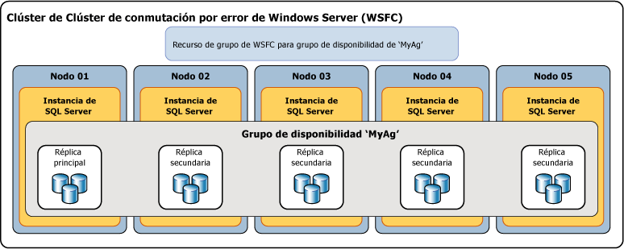

# ¿Qué es un grupo de disponibilidad AlwaysOn?
[!INCLUDE [SQL Server](../../../includes/applies-to-version/sqlserver.md)]

 En este tema se presentan los conceptos centrales de [!INCLUDE[ssHADR](../../../includes/sshadr-md.md)] para configurar y administrar uno o varios grupos de disponibilidad en [!INCLUDE[ssCurrent](../../../includes/sscurrent-md.md)]. Para obtener un resumen de las ventajas proporcionadas por los grupos de disponibilidad e información general de la terminología de [!INCLUDE[ssHADR](../../../includes/sshadr-md.md)], vea [Grupos de disponibilidad AlwaysOn &#40;SQL Server&#41;](../../../database-engine/availability-groups/windows/always-on-availability-groups-sql-server.md).  
  
 Un *grupo de disponibilidad* admite un entorno replicado de un conjunto discreto de bases de datos de usuario, conocido como *bases de datos de disponibilidad*. Un grupo de disponibilidad se puede crear para alta disponibilidad (HA) o para escalado de lectura. Un grupo de disponibilidad para alta disponibilidad es un grupo de bases de datos que realizan la conmutación por error conjuntamente. Un grupo de disponibilidad para escalado de lectura es un grupo de bases de datos que se copian en otras instancias de SQL Server para cargas de trabajo de solo lectura. Un grupo de disponibilidad admite un conjunto de bases de datos principales y entre uno y ocho conjuntos de las bases de datos secundarias correspondientes. Las bases de datos secundarias *no* son copias de seguridad. Continúe haciendo copias de seguridad de las bases de datos y de sus registros de transacciones periódicamente.  
  
> [!TIP]  
>  Puede crear cualquier tipo de copia de seguridad de una base de datos principal. También puede crear copias de seguridad de registros y copias de seguridad completas de solo copia de las bases de datos secundarias. Para más información, consulte [Secundarias activas: copia de seguridad en las réplicas secundarias &#40;grupos de disponibilidad Always On&#41;](../../../database-engine/availability-groups/windows/active-secondaries-backup-on-secondary-replicas-always-on-availability-groups.md).   

 Cada conjunto de base de datos de disponibilidad es hospedado por una *réplica de disponibilidad*. Existen dos tipos de réplicas de disponibilidad: una única *réplica principal*, que hospeda las bases de datos principales, y entre una y ocho *réplicas secundarias*, cada una de las cuales hospeda un conjunto de bases de datos secundarias y podría ser el destino de una posible conmutación por error del grupo de disponibilidad. Un grupo de disponibilidad realiza la conmutación por error en el nivel de réplica de disponibilidad. Una réplica de disponibilidad proporciona redundancia solo en el nivel de base de datos del conjunto de bases de datos de un grupo de disponibilidad. Las conmutaciones por error no se deben a problemas de bases de datos, como, por ejemplo, a que una base de datos pase a ser sospechosa debido a la pérdida de un archivo de datos o a los daños de un registro de transacciones.  
  
 La réplica principal hace que las bases de datos principales estén disponibles para las conexiones de lectura/escritura que tienen como origen los clientes. La réplica principal envía las entradas del registro de transacciones de cada base de datos principal a todas las bases de datos secundarias. Este proceso, conocido como *sincronización de datos*, tiene lugar en el nivel de la base de datos. Cada una de las réplicas secundarias almacena en memoria caché las entradas del registro de transacciones (*refuerza* el registro) y las aplica a la base de datos secundaria correspondiente. La sincronización de datos se produce entre la base de datos principal y cada una de las bases de datos secundarias conectadas, independientemente de las demás bases de datos. Por tanto, una base de datos secundaria puede suspenderse o sufrir un error sin afectar a otras bases de datos secundarias, y una base de datos principal puede suspenderse o sufrir un error sin afectar a otras bases de datos principales.  
  
 Opcionalmente, puede configurar una o varias réplicas secundarias para que admitan acceso de solo lectura a las bases de datos secundarias y puede configurar las réplicas secundarias para que permitan copias de seguridad de las bases de datos secundarias.  

 SQL Server 2017 incluye dos arquitecturas diferentes para los grupos de disponibilidad. Los *grupos de disponibilidad AlwaysOn* proporcionan alta disponibilidad, recuperación ante desastres y equilibrio del escalado de lectura. Estos grupos de disponibilidad requieren un administrador de clústeres. En Windows, los clústeres de conmutación por error proporcionan el administrador de clústeres. En Linux, puede usar Pacemaker. La otra arquitectura es un *grupo de disponibilidad de escalado de lectura*. Un grupo de disponibilidad de escalado de lectura proporciona réplicas para las cargas de trabajo de solo lectura, pero no alta disponibilidad. En un grupo de disponibilidad de escalado de lectura no hay ningún administrador de clústeres. 
 
 La implementación de [!INCLUDE[ssHADR](../../../includes/sshadr-md.md)] para alta disponibilidad en Windows requiere un clúster de conmutación por error de Windows Server (WSFC). Cada réplica de disponibilidad de un determinado grupo de disponibilidad debe residir en otro nodo del mismo WSFC. La única excepción es que mientras se migra a otro clúster de WSFC, un grupo de disponibilidad puede ocupar temporalmente dos clústeres. 

 >[!NOTE]
 >Para obtener más información sobre los grupos de disponibilidad en Linux, vea [Always On availability group for SQL Server on Linux ](../../../linux/sql-server-linux-availability-group-overview.md) (Grupos de disponibilidad AlwaysOn de SQL Server en Linux). 

 En una configuración de alta disponibilidad, se crea un rol de clúster por cada grupo de disponibilidad que cree. El clúster de WSFC supervisa este rol para evaluar el estado de la réplica principal. El quorum para [!INCLUDE[ssHADR](../../../includes/sshadr-md.md)] se basa en todos los nodos del clúster de WSFC independientemente de si un nodo de clúster determinado hospeda alguna réplica de disponibilidad. A diferencia de la creación de reflejo de la base de datos, no hay ningún rol testigo en [!INCLUDE[ssHADR](../../../includes/sshadr-md.md)].  
  
> [!NOTE]  
>  Para obtener información sobre la relación de componentes AlwaysOn de SQL Server con el clúster de WSFC, vea [Clústeres de conmutación por error de Windows Server &#40;WSFC&#41; con SQL Server](../../../sql-server/failover-clusters/windows/windows-server-failover-clustering-wsfc-with-sql-server.md).  
  
 En la ilustración siguiente se muestra un grupo de disponibilidad que contiene solo una réplica principal y cuatro réplicas secundarias. Se admiten hasta ocho réplicas secundarias, incluidas una réplica principal y dos réplicas secundarias de confirmación sincrónica.  
  
   
  
##  Bases de datos de disponibilidad  
 Para agregar una base de datos a un grupo de disponibilidad, la base de datos debe ser una base de datos de lectura/escritura en línea que exista en la instancia del servidor que hospeda la réplica principal. Al agregar una base de datos, se une al grupo de disponibilidad como base de datos principal, mientras permanece disponible para los clientes. No existe una base de datos secundaria correspondiente hasta que las copias de seguridad de la nueva base de datos principal se restauran a la instancia del servidor que hospeda la réplica secundaria (utilizando RESTORE WITH NORECOVERY). La nueva base de datos secundaria está en estado RESTORING hasta que se une al grupo de disponibilidad. Para obtener más información, vea [Iniciar el movimiento de datos en una base de datos secundaria AlwaysOn &#40;SQL Server&#41;](../../../database-engine/availability-groups/windows/start-data-movement-on-an-always-on-secondary-database-sql-server.md).  
  
 La unión coloca la base de datos secundaria en estado ONLINE e inicia la sincronización de datos con la base de datos principal correspondiente. La*sincronización de datos* es el proceso mediante el cual los cambios en una base de datos principal se reproducidos en una base de datos secundaria. La sincronización de datos implica que la base de datos principal envía entradas del registro de transacciones a la base de datos secundaria.  
  
> [!IMPORTANT]  
>  Una base de datos de disponibilidad a veces se denomina *réplica de base de datos* en los nombres de Objetos de administración de SQL Server (SMO), [!INCLUDE[tsql](../../../includes/tsql-md.md)]y PowerShell. Por ejemplo, el término "réplica de base de datos" se usa en los nombres de las vistas de administración dinámicas de AlwaysOn que devuelven información sobre las bases de datos de disponibilidad:  **sys.dm_hadr_database_replica_states** y **sys.dm_hadr_database_replica_cluster_states**. Sin embargo, en Libros en pantalla de SQL Server, el término "réplica" suele hacer referencia a las réplicas de disponibilidad. Por ejemplo, “replicación primaria” y “replicación secundaria” siempre hacen referencia a la disponibilidad de las réplicas.  
  
##  Réplicas de disponibilidad  
 Cada grupo de disponibilidad define un conjunto de dos o más asociados de conmutación por error conocidos como réplicas de disponibilidad. Las*réplicas de disponibilidad* son componentes del grupo de disponibilidad. Cada réplica de disponibilidad hospeda una copia de las bases de datos de disponibilidad en el grupo de disponibilidad. Para un grupo de disponibilidad determinado, las réplicas de disponibilidad deben hospedarse en instancias independientes de [!INCLUDE[ssNoVersion](../../../includes/ssnoversion-md.md)] que residan en nodos diferentes de un clúster de WSFC. Cada una de estas instancias del servidor debe estar habilitada para AlwaysOn.  
  
 Una instancia determinada solo puede hospedar una única réplica de disponibilidad por grupo de disponibilidad. Sin embargo, cada instancia puede utilizarse para varios grupos de disponibilidad. Una instancia determinada puede ser una instancia independiente o una instancia de clúster de conmutación por error (FCI) de [!INCLUDE[ssNoVersion](../../../includes/ssnoversion-md.md)] . Si necesita redundancia de nivel de servidor, utilice instancias de clúster de conmutación por error.  
  
 A cada réplica de disponibilidad se le asigna un rol, ya sea el *rol principal* o el *rol secundario*, que es heredado por las bases de datos de disponibilidad de esa réplica. El rol de una réplica dada determina si hospeda bases de datos de lectura/escritura o bases de datos de solo lectura. A una réplica, conocida como *réplica principal*, se le asigna el rol principal y hospeda bases de datos de lectura/escritura, que se denominan *bases de datos principales*. Como mínimo, a otra réplica denominada *réplica secundaria*se le asigna el rol secundario. Una réplica secundaria hospeda bases de datos de solo lectura, conocidas como bases de datos secundarias.  
  
> [!NOTE]  
>  Cuando el rol de una réplica de disponibilidad es indeterminado, como durante una conmutación por error, sus bases de datos están temporalmente en estado NOT SYNCHRONIZING. Su rol se establece en RESOLVING hasta que el rol de la réplica de disponibilidad se resuelve. Si una réplica de disponibilidad se resuelve en el rol principal, sus bases de datos se convierten en las bases de datos principales. Si una réplica de disponibilidad se resuelve en el rol secundario, sus bases de datos se convierten en bases de datos secundarias.  
  
##  Modos de disponibilidad

El modo de disponibilidad es una propiedad de cada réplica de disponibilidad. El modo de disponibilidad determina si la réplica principal espera la confirmación de transacciones en una base de datos hasta que una réplica secundaria haya escrito las entradas del registro de transacciones en el disco (protegido el registro). [!INCLUDE[ssHADR](../../../includes/sshadr-md.md)] admite dos modos de disponibilidad: *modo de confirmación asincrónica* y *modo de confirmación sincrónica*.  
  
-   **Asynchronous-commit mode**  
  
     Una réplica de disponibilidad que usa este modo de disponibilidad se conoce como *réplica de confirmación asincrónica*. En modo de confirmación asincrónica, la réplica principal confirma las transacciones sin esperar la confirmación de que una réplica secundaria de confirmación asincrónica ha protegido el registro. El modo de confirmación asincrónica minimiza la latencia de las transacciones en las bases de datos secundarias pero permite que se retrasen detrás de las bases de datos principales, haciendo posible alguna pérdida de datos.  
  
-   **Synchronous-commit mode**  
  
     Una réplica de disponibilidad que usa este modo de disponibilidad se denomina *réplica de confirmación sincrónica*. En modo de confirmación sincrónica, antes de la confirmación de transacciones, una réplica principal de confirmación sincrónica espera a que una réplica secundaria de confirmación sincrónica notifique que ha terminado de proteger el registro. El modo de confirmación sincrónica asegura que, una vez que una base de datos secundaria se sincroniza con la base de datos principal, las transacciones confirmadas queden totalmente protegidas. Esta protección se produce a costa de que aumente la latencia de las transacciones.  
  
 Para obtener más información, vea [Modos de disponibilidad &#40;grupos de disponibilidad AlwaysOn&#41;](../../../database-engine/availability-groups/windows/availability-modes-always-on-availability-groups.md).  
  
##  Tipos de conmutación por error  
 En el contexto de una sesión entre la réplica principal y una réplica secundaria, los roles principal y secundario son potencialmente intercambiables en un proceso denominado *conmutación por error*. Durante una conmutación por error, la réplica secundaria de destino realiza la transición al rol principal, pasando a ser la nueva réplica principal. La nueva réplica principal pone sus bases de datos en línea como bases de datos principales y las aplicaciones cliente pueden conectarse a ellas. Cuando la réplica principal anterior está disponible, realiza la transición al rol secundario, pasando a ser una réplica secundaria. Las bases de datos principales anteriores se convierten en bases de datos secundaria y se reanuda la sincronización de datos.  
  
 Existen tres formas de conmutación por error: automática, manual y forzada (con posible pérdida de datos). La forma o formas de conmutación por error admitidas por una réplica secundaria dependen de su modo de disponibilidad y, para el modo de confirmación sincrónica, del modo de conmutación por error de la réplica principal y la réplica secundaria de destino, del siguiente modo.  
  
-   El modo de confirmación sincrónica admite dos formas de conmutación por error: *conmutación por error manual planeada* y *conmutación por error automática*, si la réplica secundaria de destino está sincronizada actualmente con la réplica principal. La compatibilidad con estas formas de conmutación por error depende de la *propiedad del modo de conmutación por error* en los asociados de conmutación por error. Si el modo de conmutación por error se establece en "manual” en la réplica principal o la réplica secundaria, solo se admite la conmutación por error manual para esa réplica secundaria. Si el modo de conmutación por error se establece en “automático” en las réplicas principal y secundaria, se admiten la conmutación por error manual y automática en esa réplica secundaria.  
  
    -   **Conmutación por error manual planeada** (sin pérdida de datos)  
  
         Una conmutación por error manual se produce después de que un administrador de base de datos emite un comando de conmutación por error y produce la transición de una réplica secundaria sincronizada al rol principal (con protección de datos garantizada) y la transición de la réplica principal al rol secundario. Una conmutación por error manual requiere que la réplica principal y la réplica secundaria de destino se ejecuten en modo de confirmación sincrónica, y la réplica secundaria ya debe estar sincronizada.  
  
    -   **Conmutación automática por error** (sin pérdida de datos)  
  
         Una conmutación por error automática se produce en respuesta a un error que produce la transición de una réplica secundaria al rol principal (con protección de datos garantizada). Cuando la réplica principal anterior está disponible, efectúa la transición al rol secundario. La conmutación por error automática requiere que la réplica principal y la réplica secundaria de destino se ejecuten en modo de confirmación sincrónica con el modo de conmutación por error establecido en "Automático". Además, la réplica secundaria ya debe estar sincronizada, tener quórum de WSFC y cumplir las condiciones especificadas por la [directiva de conmutación por error flexible](../../../database-engine/availability-groups/windows/flexible-automatic-failover-policy-availability-group.md)del grupo de disponibilidad.  
  
        > [!IMPORTANT]  
        >  Las instancias de clúster de conmutación por error (FCI) de SQL Server no admiten la conmutación automática por error de grupos de disponibilidad, por lo tanto, todas las réplicas de disponibilidad hospedadas por un FCI solo se pueden configurar para la conmutación por error manual.  
  
    > [!NOTE]  
    >  Tenga en cuenta que si emite un comando de conmutación por error forzada en una réplica secundaria sincronizada, la réplica secundaria se comportará igual que en el caso de una conmutación por error manual planeada.  
  
-   En el modo de confirmación asincrónica, la única forma de conmutación por error es la conmutación por error manual forzada (con posible pérdida de datos), denominada normalmente *conmutación por error forzada*. La conmutación por error forzada se considera una forma de conmutación por error manual porque solo se puede iniciar manualmente. La conmutación por error forzada es una opción de recuperación ante desastres. Es la única forma de conmutación por error posible cuando la réplica secundaria de destino no está sincronizada con la réplica principal.  
  
 Para obtener más información, vea [Conmutación por error y modos de conmutación por error &#40;Grupos de disponibilidad AlwaysOn&#41;](../../../database-engine/availability-groups/windows/failover-and-failover-modes-always-on-availability-groups.md).  
  
##  Conexiones de cliente  
 Puede proporcionar conectividad de cliente a la réplica principal de un grupo de disponibilidad determinado mediante la creación de un agente de escucha del grupo de disponibilidad. Un *agente de escucha del grupo de disponibilidad* proporciona un conjunto de recursos que se adjunta a un grupo de disponibilidad determinado para dirigir las conexiones de cliente a la réplica de disponibilidad adecuada.  
  
 Un agente de escucha del grupo de disponibilidad está asociada a un nombre DNS único que actúa como un nombre de red virtual (VNN), una o más direcciones IP virtuales (VIP) y un número de puerto TCP. Para obtener más información, vea [Agentes de escucha de grupo de disponibilidad, conectividad de cliente y conmutación por error de una aplicación &#40;SQL Server&#41;](../../../database-engine/availability-groups/windows/listeners-client-connectivity-application-failover.md).  
  
> [!TIP]  
>  Si un grupo de disponibilidad posee solo dos réplicas de disponibilidad y no está configurado para permitir el acceso de lectura a la réplica secundaria, los clientes pueden conectarse a la réplica principal usando una [cadena de conexión de creación de reflejo de la base de datos](../../../database-engine/database-mirroring/connect-clients-to-a-database-mirroring-session-sql-server.md). Este enfoque puede ser útil temporalmente después de migrar una base de datos de creación de reflejo de la base de datos a [!INCLUDE[ssHADR](../../../includes/sshadr-md.md)]. Antes de agregar réplicas secundarias adicionales, deberá crear un agente de escucha del grupo de disponibilidad y actualizar sus aplicaciones para que se utilice el nombre de red del agente de escucha.  
  
##  Réplicas secundarias activas  
 [!INCLUDE[ssHADR](../../../includes/sshadr-md.md)] admite réplicas secundarias activas. Entre las funciones secundarias activas se incluye la compatibilidad con:  
  
-   **Realizar operaciones de copia de seguridad en las réplicas secundarias**  
  
     Las réplicas secundarias admiten la realización de copias de seguridad de registros y de [solo copia](../../../database-engine/availability-groups/windows/active-secondaries-backup-on-secondary-replicas-always-on-availability-groups.md) de toda una base de datos, un archivo o un grupo de archivos. Puede configurar el grupo de disponibilidad para que se especifique la preferencia por la que las copias de seguridad deben realizarse. Es importante entender que SQL Server no aplica la preferencia, por lo que las copias de seguridad ad hoc no resultan afectadas. La interpretación de esta preferencia depende de la lógica, si existe, del script con los trabajos de copia de seguridad ejecutado para cada una de las bases de datos de un grupo de disponibilidad dado. En el caso de una réplica de disponibilidad individual, puede especificar la prioridad para realizar copias de seguridad en esta réplica en relación con las otras réplicas del mismo grupo de disponibilidad. Para más información, consulte [Secundarias activas: copia de seguridad en las réplicas secundarias &#40;grupos de disponibilidad Always On&#41;](../../../database-engine/availability-groups/windows/active-secondaries-backup-on-secondary-replicas-always-on-availability-groups.md).  
  
-   **Acceso de solo lectura a una o varias réplicas secundarias (réplicas secundarias legibles)**  
  
     Cualquier réplica de disponibilidad secundaria se puede configurar para permitir el acceso de solo lectura a sus bases de datos locales, aunque algunas operaciones no sean totalmente compatibles. Esto impedirá los intentos de conexión de lectura y escritura a la réplica secundaria. También es posible evitar cargas de trabajo de solo lectura en la réplica _principal_ al permitir solo el acceso de lectura y escritura. Esto impedirá que se realicen conexiones de solo lectura a la réplica principal. Para más información, consulte [Secundarias activas: réplicas secundarias legibles &#40;grupos de disponibilidad AlwaysOn&#41;](../../../database-engine/availability-groups/windows/active-secondaries-readable-secondary-replicas-always-on-availability-groups.md).  
  
     Si un grupo de disponibilidad posee actualmente un agente de escucha de grupo de disponibilidad y una o varias réplicas secundarias legibles, [!INCLUDE[ssNoVersion](../../../includes/ssnoversion-md.md)] puede enrutar las solicitudes de conexión de intento de lectura a una de ellas (*enrutamiento de solo lectura*). Para obtener más información, vea [Agentes de escucha de grupo de disponibilidad, conectividad de cliente y conmutación por error de una aplicación &#40;SQL Server&#41;](../../../database-engine/availability-groups/windows/listeners-client-connectivity-application-failover.md).  
  
##  Tiempo de espera de la sesión  
 El tiempo de espera de la sesión es una propiedad de la réplica de disponibilidad que determina cuánto tiempo puede permanecer inactiva la conexión con otra réplica de disponibilidad antes de que se cierre la conexión. Las réplicas principales y secundarias hacen ping entre sí para indicar que siguen estando activas. Si se recibe un ping de otra réplica durante el tiempo de espera, significa que la conexión todavía está abierta y que las instancias del servidor se están comunicando. Al recibir un ping, una réplica de disponibilidad restablece el contador de tiempo de espera de la sesión de esa conexión.  
  
 El tiempo de espera de la sesión impide que una réplica espere indefinidamente a recibir un ping de la otra réplica. Si no se recibe ningún ping de otra réplica durante el tiempo de espera de la sesión, el tiempo de espera de la réplica se agota. La conexión se cierra y la réplica con el tiempo de espera agotado entra en el estado DISCONNECTED. Aunque una replicación desconectada esté configurada en modo de confirmación sincrónica, las transacciones no esperarán a que la réplica vuelva a conectarse y sincronizarse.  
  
 El tiempo de espera predeterminado de la sesión de cada réplica de disponibilidad es de 10 segundos. Este valor puede configurarlo el usuario, con un mínimo de 5 segundos. Normalmente, es recomendable mantener el período de espera en 10 segundos o más. Si establece el valor en menos de 10 segundos, existe la posibilidad de que un sistema sobrecargado declare un error falso.  
  
> [!NOTE]  
>  En el rol de resolución, el tiempo de espera de la sesión no se aplica, porque no se hace ping.  
  
##  Reparación de página automática  
 Cada réplica de disponibilidad intenta la recuperación automática de las páginas dañadas en una base de datos local resolviendo ciertos tipos de errores que impiden la lectura de una página de datos. Si una réplica secundaria no puede leer una página, la réplica solicita una nueva copia de la página de la réplica principal. Si la réplica principal no puede leer una página, la réplica propaga una solicitud de una nueva copia a todas las réplicas secundarias y obtiene la página de la primera que responda. Si la solicitud se realiza correctamente, la copia sustituirá a la página que no se puede leer, de forma que se resuelve el error en la mayoría de los casos.  
  
 Para más información, vea [Reparación de página automática &#40;grupos de disponibilidad: creación de reflejo de la base de datos&#41;](../../../sql-server/failover-clusters/automatic-page-repair-availability-groups-database-mirroring.md).  
  
##  Related tasks  
  
-   [Introducción a los grupos de disponibilidad AlwaysOn &#40;SQL Server&#41;](../../../database-engine/availability-groups/windows/getting-started-with-always-on-availability-groups-sql-server.md)  
  
##  Related content  
  
-   **Blogs:**  
  
     [Always On - HADRON Learning Series: Worker Pool Usage for HADRON Enabled Databases](https://docs.microsoft.com/archive/blogs/psssql/alwayson-hadron-learning-series-worker-pool-usage-for-hadron-enabled-databases) (Series de aprendizaje de Always ON - HADRON: uso del grupo de trabajo para las bases de datos compatibles con HADRON)  
  
     [Blogs del equipo de Always On de SQL Server: el blog oficial del equipo de Always On de SQL Server](https://blogs.msdn.microsoft.com/sqlalwayson/)  
  
     [Blogs de los ingenieros de SQL Server de CSS](https://docs.microsoft.com/archive/blogs/psssql/)  
  
-   **Vídeos:**  
  
     [Microsoft SQL Server Code-Named "Denali", Serie Always On, parte 1: Introducción a la solución de alta disponibilidad de próxima generación](https://channel9.msdn.com/Events/TechEd/NorthAmerica/2011/DBI302)  
  
     [Microsoft SQL Server Code-Named "Denali", Serie Always On, parte 2: Creación de una solución crítica de alta disponibilidad mediante Always On](https://channel9.msdn.com/Events/TechEd/NorthAmerica/2011/DBI404)  
  
-   **Notas del producto:**  
  
     [Guía de soluciones AlwaysOn de Microsoft SQL Server para lograr alta disponibilidad y recuperación ante desastres](https://go.microsoft.com/fwlink/?LinkId=227600)  
  
     [Notas del producto de Microsoft para SQL Server 2012](https://msdn.microsoft.com/library/hh403491.aspx)  
  
     [Notas del producto del equipo de asesoramiento al cliente de SQL Server](https://techcommunity.microsoft.com/t5/DataCAT/bg-p/DataCAT/)  
  
## Consulte también  
 [Modos de disponibilidad &#40;grupos de disponibilidad AlwaysOn&#41;](../../../database-engine/availability-groups/windows/availability-modes-always-on-availability-groups.md)   
 [Conmutación por error y modos de conmutación por error &#40;Grupos de disponibilidad AlwaysOn&#41;](../../../database-engine/availability-groups/windows/failover-and-failover-modes-always-on-availability-groups.md)   
 [Información general sobre instrucciones Transact-SQL para Grupos de disponibilidad AlwaysOn &#40;SQL Server&#41;](../../../database-engine/availability-groups/windows/transact-sql-statements-for-always-on-availability-groups.md)   
 [Información general de los cmdlets de PowerShell para grupos de disponibilidad AlwaysOn &#40;SQL Server&#41;](../../../database-engine/availability-groups/windows/overview-of-powershell-cmdlets-for-always-on-availability-groups-sql-server.md)   
 [Compatibilidad con alta disponibilidad para bases de datos de OLTP en memoria](../../../relational-databases/in-memory-oltp/high-availability-support-for-in-memory-oltp-databases.md)   
 [Requisitos previos, restricciones y recomendaciones para Grupos de disponibilidad AlwaysOn &#40;SQL Server&#41;](../../../database-engine/availability-groups/windows/prereqs-restrictions-recommendations-always-on-availability.md)   
 [Creación y configuración de grupos de disponibilidad &#40;SQL Server&#41;](../../../database-engine/availability-groups/windows/creation-and-configuration-of-availability-groups-sql-server.md)   
 [Secundarias activas: réplicas secundarias legibles &#40;grupos de disponibilidad Always On&#41;](../../../database-engine/availability-groups/windows/active-secondaries-readable-secondary-replicas-always-on-availability-groups.md)   
 [Secundarias activas: copia de seguridad en las réplicas secundarias &#40;grupos de disponibilidad Always On&#41;](../../../database-engine/availability-groups/windows/active-secondaries-backup-on-secondary-replicas-always-on-availability-groups.md)   
 [Agentes de escucha de grupo de disponibilidad, conectividad de cliente y conmutación por error de una aplicación &#40;SQL Server&#41;](../../../database-engine/availability-groups/windows/listeners-client-connectivity-application-failover.md)  
  
   
