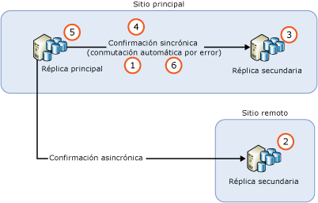
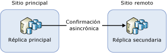
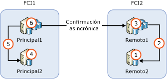

# <a name="upgrading-always-on-availability-group-replica-instances"></a>Actualización de instancias de la réplica del grupo de disponibilidad AlwaysOn
[!INCLUDE[appliesto-ss-xxxx-xxxx-xxx-md](../../../includes/appliesto-ss-xxxx-xxxx-xxx-md.md)]

Si actualiza una instancia de [!INCLUDE[ssNoVersion](../../../includes/ssnoversion-md.md)] que hospeda un grupo de disponibilidad Always On (AG) a una nueva versión de [!INCLUDE[ssCurrent](../../../includes/sscurrent-md.md)], a un Service Pack o una actualización acumulativa de [!INCLUDE[ssNoVersion](../../../includes/ssnoversion-md.md)], o bien si la instala en una nueva versión acumulativa o un nuevo Service Pack de Windows, podrá reducir el tiempo de inactividad de la réplica principal a solo una conmutación por error manual mediante una actualización gradual (o dos conmutaciones por error manuales en caso de efectuarla por recuperación en la base de datos principal original). Durante el proceso de actualización, no habrá una réplica secundaria disponible para la conmutación por error o para operaciones de solo lectura. Después de la actualización, puede pasar algún tiempo antes de que la réplica secundaria se ponga al día con el nodo de la réplica principal, según el volumen de actividad del nodo de la réplica principal, así que debe esperar un tráfico de red elevado. Además, debe tener en cuenta que, después de llevar a cabo la conmutación por error inicial en una réplica secundaria en la que se ejecuta una versión más reciente de SQL Server, las bases de datos de ese grupo de disponibilidad se ejecutarán en un proceso de actualización a la versión más reciente. Durante este proceso, no habrá disponible ninguna réplica legible para ninguna de estas bases de datos. El tiempo de inactividad después de la conmutación por error inicial dependerá del número de bases de datos que haya en el grupo de disponibilidad. Si tiene pensado efectuar la conmutación por recuperación en la base de datos principal original, este paso no se repetirá durante dicho proceso.
  
>[!NOTE]  
>En este artículo nos limitamos a explicar el proceso de actualización de SQL Server. No trataremos la actualización del sistema operativo que contiene el clúster de conmutación por error de Windows Server (WSFC). No se puede actualizar el sistema operativo Windows que hospeda el clúster de conmutación por error en sistemas operativos anteriores a Windows Server 2012 R2. Para actualizar un nodo de clúster que se ejecute en Windows Server 2012 R2, consulte [Cluster Operating System Rolling Upgrade](https://docs.microsoft.com/windows-server/failover-clustering/cluster-operating-system-rolling-upgrade)(Actualización gradual del sistema operativo de clústeres).  
  
## <a name="prerequisites"></a>Prerequisites  
Antes de empezar, revise la siguiente información importante:  
  
- [Actualizaciones de ediciones y versiones admitidas](../../../database-engine/install-windows/supported-version-and-edition-upgrades.md): compruebe que puede actualizar a SQL Server 2016 desde su versión del sistema operativo Windows y la versión de SQL Server. Por ejemplo, no puede actualizar directamente desde una instancia de SQL Server 2005 a [!INCLUDE[ssCurrent](../../../includes/sscurrent-md.md)].  
  
- [Elegir un método de actualización del motor de base de datos:](../../../database-engine/install-windows/choose-a-database-engine-upgrade-method.md) seleccione el método y los pasos de actualización adecuados en función de la revisión de versiones admitidas y actualizaciones de ediciones, y también teniendo en cuenta otros componentes instalados en el entorno con el fin de actualizar los componentes en el orden correcto.  
  
- [Planeación y prueba del plan de actualización del motor de base de datos](../../../database-engine/install-windows/plan-and-test-the-database-engine-upgrade-plan.md): revise las notas de la versión y los problemas conocidos de actualización, así como la lista de comprobación previa a la actualización, y desarrolle y pruebe el plan de actualización.  
  
- [Requisitos de hardware y software para instalar SQL Server](../../../sql-server/install/hardware-and-software-requirements-for-installing-sql-server.md):  revise los requisitos de software para instalar [!INCLUDE[ssCurrent](../../../includes/sscurrent-md.md)]. Si se requiere software adicional, puede instalarlo en cada nodo antes de comenzar el proceso de actualización para reducir los posibles tiempos de inactividad.  

- [Compruebe si se usa la replicación o captura de datos modificados para las bases de datos del grupo de disponibilidad](#special-steps-for-change-data-capture-or-replication): si alguna de las bases de datos en el grupo de disponibilidad se habilita para la captura de datos modificados (CDC), complete estas [instrucciones](#special-steps-for-change-data-capture-or-replication).

>[!NOTE]  
>No se admiten versiones mezcladas de instancias de SQL Server en el mismo grupo de disponibilidad fuera de una actualización gradual y no deben existir en dicho estado durante períodos de tiempo prolongados, ya que la actualización debe realizarse rápidamente. La otra opción para actualizar SQL Server 2016 y versiones posteriores es mediante el uso de un grupo de disponibilidad distribuido.

## <a name="rolling-upgrade-basics-for-always-on-ags"></a>Conceptos básicos sobre la actualización gradual de AG de Always On  
Tenga en cuenta las siguientes instrucciones al realizar actualizaciones de servidor con el fin de reducir el tiempo de inactividad y la pérdida de datos en los AG:  
  
- Antes de comenzar la actualización gradual, siga estos pasos:  
  
    - Realice una conmutación por error manual de prueba en al menos una de las instancias de las réplicas de confirmación sincrónica.  
  
    - Proteja los datos realizando una copia de seguridad de la base de datos completa en cada base de datos de disponibilidad  
  
    - Ejecute DBCC CHECKDB en cada base de datos de disponibilidad  
  
-   Actualice siempre primero las instancias de las réplicas secundarias remotas, después las de las locales y, a continuación, la de la réplica principal en último lugar.  
  
-   No se pueden realizar copias de seguridad en una base de datos que está en proceso de actualización.  Antes de actualizar las réplicas secundarias, configure la preferencia de copia de seguridad automatizada para ejecutar copias de seguridad solo en la réplica primaria.  Durante una actualización de versión, no habrá réplicas legibles o disponibles para copias de seguridad. Durante una actualización que no sea de versión, puede configurar copias de seguridad automatizadas para ejecutarse en réplicas secundarias antes de actualizar la principal.  
  
-   Durante una actualización de versión, no se pueden leer las réplicas secundarias legibles después de que se actualice una secundaria legible y antes de que la réplica principal conmute por error a una secundaria actualizada, o bien de que se actualice la principal.  
  
-   Para impedir las conmutaciones por error no intencionadas del AG durante el proceso de actualización, quite la conmutación por error de disponibilidad de las réplicas de confirmación sincrónica antes de comenzar.  
  
-   No actualice la instancia de la réplica principal antes de conmutar por error el AG en una instancia actualizada con una réplica secundaria en primer lugar. De lo contrario, las aplicaciones cliente pueden sufrir un tiempo de inactividad ampliado durante la actualización en la instancia de la réplica principal.  
  
-   Conmute por error el AG siempre a una instancia de una réplica secundaria de confirmación sincrónica. Si realiza la conmutación por error en una instancia de una réplica secundaria de confirmación asincrónica, las bases de datos serán vulnerables a la pérdida de datos. Asimismo, el movimiento de datos se suspenderá automáticamente hasta que lo reanude de forma manual.  
  
-   No actualice la instancia de la réplica principal antes de actualizar cualquier otra instancia de una réplica secundaria. Una réplica principal actualizada ya no puede entregar registrar a ninguna réplica secundaria cuya instancia de [!INCLUDE[ssCurrent](../../../includes/sscurrent-md.md)] aún no haya sido actualizada a la misma versión. Cuando el movimiento de datos a una réplica secundaria se suspenda, no puede producirse la conmutación por error automática para dicha réplica y las bases de datos de disponibilidad son vulnerables ante la pérdida de datos.  
  
-   Ante de conmutar por error un AG, compruebe que el estado de sincronización del destino de la conmutación sea SINCRONIZADO.  

  > [!WARNING]
  > Si se instala una nueva instancia o una nueva versión de SQL Server en un servidor que tiene instalada una versión anterior de SQL Server, puede **producirse por error una interrupción de los grupos de disponibilidad hospedados por la versión anterior de SQL Server**. La causa es que, durante la instalación de la instancia o versión de SQL Server, se actualiza el módulo de alta disponibilidad de SQL Server (RHS.EXE). Esto causa una interrupción temporal de los grupos de disponibilidad existentes en el rol principal del servidor. Por lo tanto, es muy recomendable que siga uno de estos procedimientos al instalar una versión más reciente de SQL Server en un sistema donde ya se hospeda una versión anterior de SQL Server con un grupo de disponibilidad:
  > - Instale la nueva versión de SQL Server durante una ventana de mantenimiento. 
  > - Conmute por error el grupo de disponibilidad en la réplica secundaria para que no sea el grupo principal durante la instalación de la nueva instancia de SQL Server. 
  
## <a name="rolling-upgrade-process"></a>Proceso de actualización gradual  
 En la práctica, el proceso exacto depende de factores como la topología de implementación de los AG y del modo de confirmación de cada réplica. Pero, en un escenario más sencillo, una actualización gradual es un proceso de varias fases que en su forma más sencilla implica los pasos siguientes:  
  
   
  
1.  Quitar la conmutación por error automática en todas las réplicas de confirmación sincrónica  
  
2.  Actualice todas las instancias de la réplica secundaria de confirmación asincrónica. 
  
3.  Actualice todas las instancias de la réplica secundaria de confirmación asincrónica remota. 

4.  Actualice todas las instancias de la réplica secundaria de confirmación asincrónica local. 
  
4.  Conmute por error manualmente el AG en una réplica secundaria de confirmación sincrónica local.  
  
5.  Actualice la instancia de réplica local que antes hospedaba la principal.  
  
6.  Configure los asociados de conmutación por error automática según convenga.
  
 Si es necesario, puede realizar una conmutación por error manual adicional para devolver al AG a su configuración original.  
 
   > [!NOTE]
   > - Al actualizar una réplica de confirmación sincrónica y desconectarla, no se retrasarán las transacciones en el servidor principal. Una vez que la réplica secundaria esté desconectada, las transacciones se confirmarán en el servidor principal sin tener que esperar a los registros para reforzar la seguridad en la réplica secundaria. 
   > - Si `REQUIRED_SYNCHRONIZED_SECONDARIES_TO_COMMIT` está establecido en `1` o `2`, la réplica principal puede no estar disponible para la lectura o escritura cuando un número correspondiente de réplicas secundarias de sincronización tampoco lo esté durante el proceso de actualización. 
  
## <a name="ag-with-one-remote-secondary-replica"></a>AG con una réplica secundaria remota  
 Si ha implementado un AG para la recuperación de desastres, puede que tenga que conmutar por error el AG en una réplica secundaria de confirmación asincrónica. Tal configuración se muestra en la ilustración siguiente:  
  
   
  
 En esta situación, debe conmutar por error el AG en la réplica secundaria de confirmación asincrónica durante la actualización gradual. Para impedir la pérdida de datos, cambie el modo de confirmación a sincrónica y espere a que la réplica secundaria se sincronice antes de realizar la conmutación por error en el AG. Por lo tanto, el proceso de actualización puede ser similar al siguiente:  
  
1.  Actualizar la instancia de réplica secundaria en el sitio remoto  
  
2.  Cambiar el modo de confirmación a confirmación sincrónica  
  
3.  Esperar hata que el estado de sincronización sea SINCRONIZADO  
  
4.  Conmutación por error del AG en la réplica secundaria del sitio remoto  
  
5.  Cambiar o actualizar la instancia de réplica local (sitio principal)  
  
6.  Conmutación por error del AG en el sitio principal  
  
7.  Cambiar el modo de confirmación a confirmación asincrónica  
  
 Dado que el modo de confirmación sincrónica no es una opción recomendada para la sincronización de datos en un sitio remoto, las aplicaciones de cliente pueden apreciar un aumento inmediato en la latencia de las bases de datos tras el cambio de configuración. Además, realizar una conmutación por error provoca que todos los mensajes de registro no reconocidos se descarten. El número de mensajes de registro descartados puede ser bastante importante debido a la alta latencia de red entre dos sitios, lo que ocasiona que los clientes experimenten un gran volumen de errores de transacciones. Puede minimizar el impacto en las aplicaciones cliente haciendo lo siguiente:  
  
-   Seleccionar cuidadosamente una ventana de mantenimiento durante el tráfico lento de cliente  
  
-   Mientras actualiza [!INCLUDE[ssCurrent](../../../includes/sscurrent-md.md)] en el sitio principal, cambiar el modo de disponibilidad de nuevo a la confirmación asincrónica y luego revertir al modo sincrónico cuando esté listo para conmutar por error al sitio principal de nuevo.  
  
## <a name="ag-with-failover-cluster-instance-nodes"></a>AG con nodos de instancia de clúster de conmutación por error  
 Si un AG contiene nodos de instancia de clúster de conmutación por error (FCI), debe actualizar los nodos inactivos antes de actualizar los nodos activos. En la ilustración siguiente se muestra un escenario de AG común con FCI para la confirmación asincrónica y una alta disponibilidad local entre los FCI para la recuperación de desastres remota y la secuencia de actualización.  
  
   
  
1.  Actualizar REMOTE2  
  
2.  Conmutar por error FCI2 a REMOTE2  
  
3.  Actualizar REMOTE1  
  
4.  Actualizar PRIMARY2  
  
5.  Conmutar por error FCI1 a PRIMARY2  
  
6.  Actualizar PRIMARY1  
  
## <a name="upgrade-or-update-sql-server-instances-with-multiple-ags"></a>Actualización de instancias de SQL Server con varios grupos de disponibilidad  
 Si ejecuta varios AG con réplicas principales en nodos de servidor independientes (una configuración activa/activa), la actualización implicará más pasos de conmutación por error para presentar una alta disponibilidad en el proceso. Suponga que ejecuta tres AG en tres nodos de servidor con todas las réplicas en modo de confirmación sincrónica, tal y como se muestra en la tabla siguiente:  
  
|AG|Nodo1|Nodo2|Nodo3|  
|------------------------|-----------|-----------|-----------|  
|AG1|Principal|||  
|AG2||Principal||  
|AG3|||Principal|  
  
 Puede ser apropiado en su situación realizar una actualización gradual con equilibrio de carga en la secuencia siguiente:  
  
1.  Conmutar por error AG2 a Nodo3 (para liberar Nodo2)  
  
2.  Actualizar Node2  
  
3.  Conmutar por error AG1 a Nodo2 (para liberar Nodo1)  
  
4.  Actualizar Node1  
  
5.  Conmutar por error AG2 y AG3 a Nodo1 (para liberar Nodo3)  
  
6.  Actualizar Node3  
  
7.  No se puede realizar la conmutación por error de AG3 a Nodo3  
  
 Esta secuencia de actualización tiene un tiempo de inactividad promedio de menos de dos conmutaciones por error por cada AG. La configuración resultante se muestra en la tabla siguiente.  
  
|AG|Nodo1|Nodo2|Nodo3|  
|------------------------|-----------|-----------|-----------|  
|AG1||Principal||  
|AG2|Principal|||  
|AG3|||Principal|  
  
 Según su implementación concreta, la ruta de actualización puede variar y el tiempo de inactividad que las aplicaciones cliente experimentan puede variar también.  
  
> [!NOTE]  
>  En muchos casos, una vez completada la actualización gradual, se realizará una conmutación por recuperación en la réplica principal original. 

## <a name="rolling-upgrade-of-a-distributed-availability-group"></a>Actualización gradual de un grupo de disponibilidad distribuido
Para realizar una actualización gradual de un grupo de disponibilidad distribuido, primero debe actualizar todas las réplicas secundarias. A continuación, realice una conmutación por error del reenviador y actualice la última instancia restante del grupo de disponibilidad secundario. Una vez que haya actualizado todas las réplicas, realice una conmutación por error de la principal global y actualice la última instancia restante del primer grupo de disponibilidad. A continuación se muestra un diagrama detallado con los pasos. 

 Según su implementación concreta, la ruta de actualización puede variar y el tiempo de inactividad que las aplicaciones cliente experimentan puede variar también.  
  
> [!NOTE]  
>  En muchos casos, una vez completada la actualización gradual, se realizará una conmutación por recuperación en las réplicas principales originales. 

### <a name="general-steps-to-upgrade-a-distributed-availability-group"></a>Pasos generales para actualizar un grupo de disponibilidad distribuido
1. Realice una copia de seguridad de todas las bases de datos, incluidas las del sistema y las relacionadas con el grupo de disponibilidad. 
2. Actualice y reinicie todas las réplicas secundarias del segundo grupo de disponibilidad el de nivel inferior. 
3. Actualice y reinicie todas las réplicas secundarias del primer grupo de disponibilidad, el de nivel superior. 
4. Realice una conmutación por error del reenviador principal a una réplica secundaria actualizada del grupo de disponibilidad secundario.
5. Espere a que se sincronicen los datos. Las bases de datos deberían mostrarse como sincronizadas en todas las réplicas de confirmación sincrónica, y la principal global debería sincronizarse con el reenviador.  
6. Actualice y reinicie la última instancia restante del grupo de disponibilidad secundario. 
7. Realice una conmutación por error de la instancia principal global en una instancia secundaria actualizada del primer grupo de disponibilidad.  
8. Actualice la última instancia restante del grupo de disponibilidad principal.
9. Reinicie el servidor que acaba de actualizar. 
10. (Opcional) Realice una conmutación por recuperación de ambos grupos de disponibilidad en sus réplicas principales.  

>[!IMPORTANT]
>- Compruebe la sincronización entre cada paso. Antes de continuar con el siguiente paso, confirme que las réplicas de confirmación sincrónica estén sincronizadas con el grupo de disponibilidad y que la principal global esté sincronizada con el reenviador del grupo de disponibilidad distribuido. 
>- **Recomendación:** Cada vez que compruebe la sincronización, actualice tanto el nodo de la base de datos como el nodo del grupo de disponibilidad distribuido en SQL Server Management Studio. Una vez que todo esté sincronizado, guarde una captura de pantalla de los estados de las réplicas. De este modo, podrá realizar el seguimiento del paso en el que está, proporcionar pruebas de que todo funcionaba correctamente antes de avanzar al siguiente paso y solucionar problemas, en caso de que haya algún error. 


### <a name="diagram-example-for-a-rolling-upgrade-of-a-distributed-availability-group"></a>Ejemplo de diagrama de una actualización gradual de un grupo de disponibilidad distribuido

| grupo de disponibilidad | Réplica principal | Réplica secundaria|
| :------ | :----------------------------- |  :------ |
| AG1 | NODO1\GDSQL | NODO2\GDSQL|
| AG2 | NODO3\GDSQL | NODO4\GDSQL|
| GDDistribuido| GD1 (global) | GD2 (reenviador) |
| &nbsp; | &nbsp; | &nbsp; |


Estos son los pasos para actualizar las instancias de este diagrama: 

1. Realice una copia de seguridad de todas las bases de datos, incluidas las del sistema y las relacionadas con el grupo de disponibilidad. 
2. Actualice el NODO4\GDSQL (instancia secundaria de GD2) y reinicie el servidor. 
3. Actualice el NODO2\GDSQL (instancia secundaria de GD1) y reinicie el servidor. 
4. Realice una conmutación por error del GD2 del NODO3\GDSQL al NODO4\GDSQL. 
5. Actualice el NODO3\GDSQL y reinicie el servidor. 
6. Realice una conmutación por error del GD1 del NODO1\GDSQL a NODO2\GDSQL. 
7. Actualice el NODO1\GDSQL y reinicie el servidor. 
8. (Opcional) Realice una conmutación por recuperación de las réplicas principales originales.
    1. Realice una conmutación por error del GD2 del NODO4\GDSQL al NODO3\GDSQL.  
    2. Realice una conmutación por error del GD1 de NODO2\GDSQL al NODO1\GDSQL. 

Si ya existía una tercera réplica en los grupos de disponibilidad, se debería actualizar antes del NODO3\GDSQL y el NODO1\GDSQL. 

>[!IMPORTANT]
>- Compruebe la sincronización entre cada paso. Antes de continuar con el siguiente paso, confirme que las réplicas de confirmación sincrónica estén sincronizadas con el grupo de disponibilidad y que la principal global esté sincronizada con el reenviador del grupo de disponibilidad distribuido. 
>- Recomendación: Cada vez que compruebe la sincronización, actualice tanto el nodo de la base de datos como el nodo del grupo de disponibilidad distribuido en SQL Server Management Studio. Una vez que todo esté sincronizado, realice una captura de pantalla y guárdela. De este modo, podrá realizar el seguimiento del paso en el que está, proporcionar pruebas de que todo funcionaba correctamente antes de avanzar al siguiente paso y solucionar problemas, en caso de que haya algún error. 


## <a name="special-steps-for-change-data-capture-or-replication"></a>Pasos especiales para la replicación o captura de datos modificados

Dependiendo de la actualización que se aplique, es posible que sea necesario realizar pasos adicionales para bases de datos de réplica de AG habilitados para replicar o capturar datos modificados. Consulte las notas de la versión de la actualización para determinar si necesita realizar los siguientes pasos o no:

1. Actualice todas las réplicas secundarias.

1. Tras actualizar todas las réplicas secundarias, conmute por error el AG en una instancia actualizada. 

1. Ejecute el siguiente comando de Transact-SQL en la instancia que hospeda la réplica principal:

   ```sql
   EXECUTE [master].[sys].[sp_vupgrade_replication];
   ```

   >[!NOTE]
   >La ejecución de este comando puede llevar varios minutos. 

1. Actualice la instancia que estaba originalmente en la réplica principal.

Para obtener información general, consulte [CDC functionality may break after upgrading to the latest CU](https://blogs.msdn.microsoft.com/sql_server_team/cdc-functionality-may-break-after-upgrading-to-the-latest-cu-for-sql-server-2012-2014-and-2016/) (Es posible que la funcionalidad CDC no funcione después de actualizar a la última CU).

  
## <a name="see-also"></a>Consulte también  
 [Actualización a SQL Server 2016 mediante el Asistente para instalación &#40;programa de instalación&#41;](../../../database-engine/install-windows/upgrade-sql-server-using-the-installation-wizard-setup.md)   

 [Instalar SQL Server 2016 desde el símbolo del sistema](../../../database-engine/install-windows/install-sql-server-2016-from-the-command-prompt.md)  
  
  
