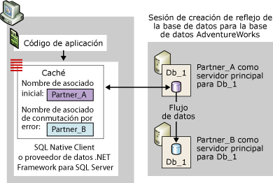
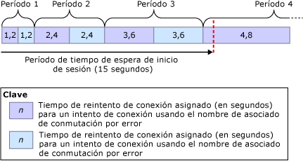
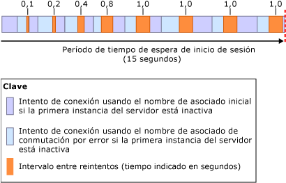

# <a name="connect-clients-to-a-database-mirroring-session-sql-server"></a>Conectar clientes a una sesión de creación de reflejo de la base de datos (SQL Server)
[!INCLUDE[appliesto-ss-xxxx-xxxx-xxx-md](../../includes/appliesto-ss-xxxx-xxxx-xxx-md.md)]
  Para conectarse a una sesión de creación de reflejo de la base de datos, un cliente puede usar SQL Native Client de [!INCLUDE[ssNoVersion](../../includes/ssnoversion-md.md)] o el proveedor de datos de .NET Framework para [!INCLUDE[ssNoVersion](../../includes/ssnoversion-md.md)]. Estos proveedores de acceso a datos son totalmente compatibles con la creación de reflejo de la base de datos cuando se configuran para una base de datos de [!INCLUDE[ssCurrent](../../includes/sscurrent-md.md)] . Para obtener información acerca de las consideraciones de programación para el uso de una base de datos reflejada, vea [Using Database Mirroring](../../relational-databases/native-client/features/using-database-mirroring.md). Además, la instancia del servidor principal actual debe estar disponible y el inicio de sesión del cliente se debe haber creado en la instancia del servidor. Para obtener más información, vea [Solucionar problemas de usuarios huérfanos &#40;SQL Server&#41;](../../sql-server/failover-clusters/troubleshoot-orphaned-users-sql-server.md). Las conexiones de cliente a una sesión de creación de reflejo de la base de datos no tienen relación con la instancia del servidor testigo, si existe alguno.  
  
  
##  <a name="InitialConnection"></a> Establecer la conexión inicial en una sesión de creación de reflejo de la base de datos  
 Para la conexión inicial en una base de datos reflejada, un cliente debe suministrar una cadena de conexión que como mínimo proporcione el nombre de una instancia del servidor. Este nombre de servidor requerido debería identificar la instancia del servidor principal actual y se conoce como el *nombre del asociado inicial*.  
  
 Opcionalmente, la cadena de conexión también puede proporcionar el nombre de otra instancia del servidor, que debería identificar la instancia del servidor reflejado actual, para usarla si el asociado inicial no está disponible durante el primer intento de conexión. Este nombre se conoce como el *nombre del asociado de conmutación por error*.  
  
 La cadena de conexión también debe proporcionar el nombre de una base de datos. Esto es necesario para que el proveedor de acceso a datos pueda intentar la conmutación por error.  
  
 Al recibir una cadena de conexión, el proveedor de acceso a datos almacena el nombre del asociado inicial y el nombre del asociado de conmutación por error, si se suministran, en una caché en la memoria volátil del cliente (para el código administrado, el ámbito de la caché es el dominio de la aplicación). Una vez almacenado en caché, el proveedor de acceso a datos nunca actualiza el nombre del asociado inicial. Cuando el cliente suministra el nombre del asociado de conmutación por error, el proveedor de acceso a datos también almacena este nombre temporalmente por si el proveedor no se puede conectar usando el nombre del asociado inicial.  
  
 Una sesión de creación de reflejo de la base de datos no protege frente a problemas de acceso al servidor que sean específicos de los clientes, como cuando un equipo cliente tiene un problema en la comunicación con la red. Un intento de conexión a una base de datos reflejada también puede generar un error por diversas razones que no tienen que ver con el proveedor de acceso a datos; por ejemplo, debido a que la instancia del servidor principal esté inactiva, como ocurre cuando la base de datos está realizando la conmutación por error, o bien debido a un error de red.  
  
 Cuando se intenta la conexión, el proveedor de acceso a datos comienza usando el nombre del asociado inicial. Si la instancia del servidor especificada está disponible y es la instancia del servidor principal actual, el intento de conexión suele tener éxito.  
  
> [!NOTE]  
>  Si la sesión de creación de reflejo se pone en pausa, el cliente suele conectarse al servidor principal y descargar el nombre del asociado. Sin embargo, la base de datos no está disponible para el cliente hasta que se reanude la creación de reflejo.  
  
 Si ese intento no funciona, el proveedor de acceso a datos prueba con el nombre del asociado de conmutación por error, si está disponible. Si otro nombre del asociado identifica correctamente el servidor principal actual, el proveedor de acceso a datos normalmente puede abrir la conexión inicial. Al llevar a cabo esta conexión, el proveedor de acceso a datos descarga el nombre de la instancia del servidor del servidor reflejado actual. Este nombre se almacena en la caché como nombre del asociado de conmutación por error y sobrescribe el nombre proporcionado por el cliente, si hay alguno. Después, el Proveedor de datos de .NET Framework de [!INCLUDE[ssNoVersion](../../includes/ssnoversion-md.md)] no actualiza el nombre del asociado de conmutación por error. Por el contrario, [!INCLUDE[ssNoVersion](../../includes/ssnoversion-md.md)] Native Client actualiza la caché siempre que una conexión posterior o el restablecimiento de la conexión devuelvan un nombre del asociado diferente.  
  
 En la siguiente ilustración se muestra una conexión del cliente con el asociado inicial, **Partner_A**, para una base de datos reflejada denominada **Db_1**. En la ilustración se muestra un caso en el que el nombre del asociado inicial proporcionado por el cliente identifica correctamente el servidor principal actual, **Partner_A**. El intento de conexión inicial se realiza correctamente y el proveedor de acceso a datos almacena el nombre del servidor reflejado ( **Partner_B**) como nombre del asociado de conmutación por error en la memoria caché local. Finalmente, el cliente se conecta a la copia principal de la base de datos **Db_1** .  
  
   
  
 El intento de conexión inicial puede no tener éxito, por ejemplo, debido a un error de red o una instancia del servidor inactiva. Puesto que el asociado inicial no está disponible, para que el proveedor de acceso a datos intente conectarse al asociado de conmutación por error, el cliente deberá haber proporcionado el nombre del asociado de conmutación por error en la cadena de conexión.  
  
 En ese caso, si el nombre del asociado de conmutación por error no está disponible, el intento de conexión original continúa hasta que la conexión de red agota el tiempo de espera o se devuelve un error (igual que en una base de datos no reflejada).  
  
 Cuando en la cadena de conexión se proporciona el nombre del asociado de conmutación por error, el comportamiento del proveedor de acceso a datos depende del protocolo de red y del sistema operativo del cliente, según se explica a continuación:  
  
-   Para TCP/IP, los intentos de conexión son regulados mediante un algoritmo de reintento de conexión que es específico de la creación de reflejo de la base de datos. El *algoritmo de reintento de conexión* determina el tiempo máximo (el *tiempo de reintento*) asignado para abrir una conexión en un intento de conexión dado.  
  
-   Para otros protocolos de red  
  
     Si se produce un error o si el asociado inicial no está disponible, el intento de conexión inicial espera hasta que los períodos de tiempo de espera de la conexión de red o del inicio de sesión expiran en el proveedor de acceso a datos. Generalmente, esta espera es del orden de 20 a 30 segundos. Después, si el proveedor de acceso a datos no ha agotado el tiempo de espera, intenta conectarse al asociado de conmutación por error. Si el período de tiempo de espera de conmutación por error expira antes de que la conexión tenga éxito o si el asociado de conmutación por error no está disponible, el intento de conexión no tiene éxito. Si el asociado de conmutación por error está disponible dentro del período de tiempo de espera de inicio de sesión y es ahora el servidor principal, el intento de conexión normalmente tiene éxito.  
  
  
### <a name="connection-strings-for-a-mirrored-database"></a>Cadenas de conexión para una base de datos reflejada  
 La cadena de conexión proporcionada por el cliente incluye información que el proveedor de acceso a datos usa para conectarse a la base de datos. En esta sección se explican las palabras clave que están relacionadas específicamente con la conexión a una base de datos reflejada mediante una conexión del controlador ODBC de [!INCLUDE[ssNoVersion](../../includes/ssnoversion-md.md)] Native Client.  
  
#### <a name="network-attribute"></a>Atributo Network  
 La cadena de conexión debe contener el atributo **Network** para especificar el protocolo de red. De este modo se asegura de que el protocolo de red especificado persiste entre conexiones a asociados diferentes. El mejor protocolo para conectarse a una base de datos reflejada es TCP/IP. Para garantizar que el cliente solicite TCP/IP para cada conexión con los asociados, una cadena de conexión proporciona el atributo siguiente:  
  
```  
Network=dbmssocn;   
```  
  
> [!IMPORTANT]  
>  Se recomienda mantener TCP/IP al principio de la lista de protocolos del cliente. Sin embargo, si la cadena de conexión especifica el atributo **Network** , se invalida el orden de la lista.  
  
 O bien, para garantizar que el cliente solicite canalizaciones con nombre para cada conexión a los asociados, una cadena de conexión proporciona el atributo siguiente:  
  
```  
Network=dbnmpntw;   
```  
  
> [!IMPORTANT]  
>  Dado que las canalizaciones con nombre no usan el algoritmo de reintento TCP/IP, en muchos casos, un intento de conexión a canalizaciones con nombre puede agotar el tiempo de espera antes de conectarse a una base de datos reflejada.  
  
#### <a name="server-attribute"></a>Atributo Server  
 La cadena de conexión debe contener un atributo **Server** que proporciona el nombre del asociado inicial, que debería identificar la instancia del servidor principal actual.  
  
 La manera más sencilla de identificar la instancia de servidor es especificando su nombre, *<nombre_de_servidor>*[**\\***<nombre_de_instancia_de_SQL_Server>*]. Por ejemplo:  
  
 `Server=Partner_A;`  
  
 o Administrador de configuración de  
  
 `Server=Partner_A\Instance_2;`  
  
 Sin embargo, cuando se usa el nombre del sistema, el cliente debe realizar una búsqueda DNS para obtener la dirección IP del servidor y una consulta de SQL Server Browser para obtener el número de puerto del servidor en el que reside el asociado. Estas búsquedas y consultas pueden omitirse si se especifica la dirección IP y el número de puerto del asociado en el atributo **Server** , en lugar de especificar el nombre de servidor. Esto se recomienda para reducir la posibilidad de que se produzcan retardos externos mientras se conecta a ese asociado.  
  
> [!NOTE]  
>  Se necesita una consulta de SQL Server Browser si la cadena de conexión especifica el nombre de la instancia con nombre y no el puerto.  
  
 Para especificar la dirección IP y el puerto, el atributo **Server** adopta el siguiente formato: `Server=`*<dirección_ip>*`,`*\<puerto>*. Por ejemplo:  
  
```  
Server=123.34.45.56,4724;   
```  
  
> [!NOTE]  
>  La dirección IP puede ser IP Versión 4 (IPv4) o IP Versión 6 (IPv6).  
  
#### <a name="database-attribute"></a>Atributo Database  
 Además, la cadena de conexión debe especificar el atributo **Database** para proporcionar el nombre de la base de datos reflejada. Si la base de datos no está disponible cuando el cliente intente conectarse, se producirá una excepción.  
  
 Por ejemplo, para conectarse expresamente a la base de datos **AdventureWorks** del servidor principal Partner_A, un cliente usa la cadena de conexión siguiente:  
  
 `" Server=Partner_A; Database=AdventureWorks "`  
  
> [!NOTE]  
>  En esta cadena se omite la información de autenticación.  
  
> [!IMPORTANT]  
>  La unión del prefijo de protocolo con el atributo **Server** (`Server=tcp:`*\<nombreDeServidor>*) es incompatible con el atributo **Network** y, si se especifica el protocolo en ambos lugares, lo más probable es que se produzca un error. Por lo tanto, se recomienda que una cadena de conexión especifique el protocolo con el atributo **Network** y que se especifique solo el nombre de servidor en el atributo **Server** (`"Network=dbmssocn; Server=`*\<nombreDeServidor>*`"`).  
  
#### <a name="failover-partner-attribute"></a>Atributo Failover Partner  
 Además del nombre del asociado inicial, el cliente puede especificar también el nombre del asociado de conmutación por error, que debería identificar la instancia del servidor reflejado actual. Una de las palabras clave especifica el asociado de conmutación por error para el atributo de asociado de conmutación por error. La palabra clave para este atributo depende de la API que está utilizando. En la tabla siguiente se enumeran estas palabras clave.  
  
|API|Palabra clave para el atributo de asociado de conmutación por error|  
|---------|--------------------------------------------|  
|Proveedor OLE DB|**FailoverPartner**|  
|Controlador ODBC|**Failover_Partner**|  
|Objetos de datos ActiveX (ADO)|**Failover Partner**|  
  
 La manera más sencilla de identificar la instancia de servidor es especificando su nombre de sistema, *<nombre_de_servidor>*[**\\**<nombre_de_instancia_de_SQL_Server>*].  
  
 O bien, se pueden proporcionar la dirección IP y el número de puerto en el atributo **Failover Partner** . Si el intento de conexión inicial no tiene éxito durante la primera conexión a la base de datos, el intento de conectarse al asociado de conmutación por error no tendrá que retransmitirse en DNS y SQL Server Browser. Una vez que se establezca la conexión, el nombre del asociado de conmutación por error se sobrescribirá con el nombre del asociado de conmutación por error, de modo que, si se produce una conmutación por error, las conexiones redirigidas requerirán DNS y SQL Server Browser.  
  
> [!NOTE]  
>  Si solo se proporciona el nombre del asociado inicial, los programadores de la aplicación no necesitarán realizar ninguna acción ni escribir ningún código para volver a conectarse.  
  
> [!NOTE]  
>  Los programadores de aplicaciones de código administrado proporcionan el nombre del asociado de conmutación por error en la cadena **ConnectionString** del objeto **SqlConnection** . Para obtener información acerca de cómo utilizar esta cadena de conexión, vea el apartado sobre la compatibilidad de la creación de reflejo de la base de datos del proveedor de datos de .NET Framework para SQL Server en la documentación de ADO.NET, que forma parte del SDK de [!INCLUDE[msCoName](../../includes/msconame-md.md)] .NET Framework.  
  
#### <a name="example-connection-string"></a>Ejemplo de cadena de conexión  
 Por ejemplo, para conectarse explícitamente con TCP/IP a la base de datos **AdventureWorks** en Partner_A o Partner_B, una aplicación cliente que use el controlador ODBC podría proporcionar la cadena de conexión siguiente:  
  
```  
"Server=Partner_A; Failover_Partner=Partner_B; Database=AdventureWorks; Network=dbmssocn"  
```  
  
 O bien, el cliente podría usar la dirección IP y el número de puerto para identificar al asociado inicial, Partner_A; por ejemplo, si la dirección IP es 250.65.43.21 y el número de puerto es 4734, la cadena de conexión sería:  
  
```  
"Server=250.65.43.21,4734; Failover_Partner=Partner_B; Database=AdventureWorks; Network=dbmssocn"  
```  
  
##  <a name="RetryAlgorithm"></a> Algoritmo de reintento de conexión (para conexiones TCP/IP)  
 Para una conexión TCP/IP, cuando los nombres de ambos asociados están en la memoria caché, el proveedor de acceso a datos se ajusta a un algoritmo de reintento de conexión. Esto se cumple para establecer la conexión inicial a la sesión y para volver a conectarse después de que una conexión establecida se haya perdido. Una vez que se ha abierto una conexión, finalizar los pasos previos de inicio de sesión y el inicio de sesión requiere tiempo adicional.  
  
> [!NOTE]  
>  El tiempo empleado en abrir una conexión puede superar el tiempo de reintento debido a factores externos como, por ejemplo, lentas búsquedas de DNS, un controlador de dominio/KDC (Kerberos Key Distribution Center) lento, el tiempo necesario para contactar con SQL Server Browser, congestión de la red, etc. Estos factores externos pueden impedir que un cliente se conecte a una base de datos reflejada. Además, los factores externos pueden hacer que una conexión tarde más en abrirse que el tiempo de reintento asignado. Para obtener información acerca de cómo omitir DNS y SQL Server Browser para el intento de conexión al asociado inicial, vea [Establecer la conexión inicial en una sesión de creación de reflejo de la base de datos](#InitialConnection), anteriormente en este tema.  
  
 Si el intento de conexión genera un error o el tiempo de reintento expira antes de que se realice correctamente, el proveedor de acceso a datos probará con el otro asociado. Si este punto no abre una conexión, el proveedor probará, de forma alternativa, con los nombre inicial y del asociado de conmutación por error, hasta que se abra una conexión o el periodo de inicio de sesión se agote. El periodo de tiempo de espera predeterminado es de 15 segundos. Es recomendable que el periodo de espera de inicio de sesión sea de 5 segundos o más. Si se especifica un periodo de tiempo de espera menor, es posible que ningún intento de conexión pueda realizarse correctamente.  
  
 El tiempo de reintento es un porcentaje del periodo de inicio de sesión. El tiempo de reintento de una conexión es mayor en cada ciclo sucesivo. En el primer ciclo, el tiempo de reintento de cada uno de los dos intentos es el 8 por ciento del periodo de inicio de sesión total. En cada ciclo sucesivo, el algoritmo de reintento incrementa el tiempo máximo de reintento en la misma cantidad. De esta forma, los tiempos de reintento de las primeras ocho conexiones son las siguientes:  
  
 8%, 8%, 16%, 16%, 24%, 24%, 32%, 32%  
  
 El tiempo de reintento se calcula mediante la siguiente fórmula:  
  
 *TiempoDeReintento* **=** *TiempoDeReintentoAnterior* **+(** 0,08 **\****TiempoDeEsperaDeInicioDeSesión***)**  
  
 Donde *PreviousRetryTime* es inicialmente 0.  
  
 Por ejemplo, si se usa el tiempo de espera predeterminado de 15 segundos, *LoginTimeout* *= 15*. En este caso, los tiempos de reintento en los primeros tres ciclos son los siguientes:  
  
|Redondear|Cálculo de*RetryTime* |Tiempo de reintento por intento|  
|-----------|-----------------------------|----------------------------|  
|1|0 **+(** 0.08 **\*** 15 **)**|1,2 segundos|  
|2|1.2 **+(** 0.08 **\*** 15 **)**|2,4 segundos|  
|3|2.4 **+(** 0.08 **\*** 15 **)**|3,6 segundos|  
|4|3.6 **+(** 0.08 **\*** 15 **)**|4,8 segundos|  
  
 En la siguiente ilustración se muestran los tiempos de reintento para intentos de conexión sucesivos, cada uno de los cuales se agota.  
  
   
  
 Para el periodo de espera de inicio de sesión predeterminado, el tiempo máximo asignado para los primeros tres ciclos de intentos de conexión es de 14,4 segundos. Si cada intento utilizase todo el tiempo que tiene asignado, solo quedarían 0,6 segundos antes de que el periodo de inicio de sesión se agotara. En este caso, el cuarto ciclo se acortaría y solo se permitiría un intento final rápido para conectarse mediante el nombre del asociado inicial. No obstante, un intento de conexión puede generar un error en menos tiempo que el tiempo de reintento asignado, especialmente en los ciclos posteriores. Por ejemplo, la recepción de un error de red puede causar que un intento termine antes de que el tiempo de reintento expire. Si los primeros intentos no se realizan correctamente debido a errores de red, habría tiempo disponible adicional para el cuarto ciclo y, probablemente, para ciclos adicionales.  
  
 Otra razón de que un intento genere un error es una instancia de servidor inactiva, como pasa cuando una instancia de servidor se encuentra ocupada en realizar la conmutación por error de su base de datos. En este caso, se impone un intervalo entre reintentos para evitar que los clientes sobrecarguen a los asociados con una rápida sucesión de intentos de conexión.  
  
> [!NOTE]  
>  Cuando ambos nombres de asociados están disponibles, si el periodo de espera de inicio de sesión es infinito, el cliente intenta volver a conectarse a los servidores de forma indefinida, alternando entre el nombre del asociado inicial y el nombre del asociado de conmutación por error.  
  
  
### <a name="retry-delays-during-failover"></a>Intervalos de reintento durante la conmutación por error  
 Si un cliente intenta conectarse a un asociado que está en conmutación por error, este responde inmediatamente que se encuentra inactivo. En este caso, cada ciclo de intentos de conexión es mucho más breve que el tiempo de reintento asignado. Esto significa que pueden producirse muchos ciclos de intentos de conexión antes de que el periodo de inicio de sesión se agote. Para evitar la sobrecarga de los asociados con una rápida serie de intentos de conexión durante una conmutación por error, el proveedor de acceso a datos agrega un breve intervalo entre reintentos después de cada ciclo. La longitud de un intervalo entre reintentos determinado se define mediante el algoritmo de intervalos entre reintentos. Después del primer ciclo, el intervalo es de 100 milisegundos. Después de cada uno de los tres ciclos siguientes, el intervalo entre reintentos se duplica: 200, 400 y 800. En todos los ciclos posteriores, el intervalo entre reintentos es de 1 segundo hasta que la conexión se realiza correctamente o se supera el tiempo de espera.  
  
> [!NOTE]  
>  Si la instancia de servidor se detiene, la solicitud de conexión genera un error de forma inmediata.  
  
 En la siguiente ilustración se muestra cómo los intervalos entre reintentos afectan a los intentos de conexión durante una conmutación por error manual, donde los asociados conmutan sus roles. El periodo de tiempo de espera de inicio de sesión es de 15 segundos.  
  
   
  
##  <a name="Reconnecting"></a> Volver a conectar una sesión de creación de reflejo de la base de datos  
 Si una conexión establecida de una sesión de creación de reflejo de la base de datos genera un error por alguna razón; por ejemplo, debido a una conmutación automática por error, y la aplicación intenta volver a conectarse al servidor inicial, el proveedor de acceso a datos puede tratar de volver a conectarse mediante el nombre de asociado de conmutación por error almacenado en la memoria caché del cliente. No obstante, volver a conectarse no es un proceso automático. La aplicación debe detectar el error. Después, la aplicación necesita cerrar la conexión con error y abrir una nueva utilizando los mismos atributos de la cadena de conexión. En este punto, el proveedor de acceso a datos redirige la conexión al asociado de conmutación por error. Si la instancia de servidor que se identifica con este nombre es actualmente el servidor principal, el intento de conexión suele tener éxito. Si no está claro si una transacción se confirmó o revirtió, la aplicación debe comprobar el estado de la transacción, de la misma forma en que lo hace cuando se vuelve a conectar con una instancia de servidor independiente.  
  
 Volver a conectarse se parece bastante a una conexión inicial donde la cadena de conexión suministra un nombre de asociado de conmutación por error. Si el primer intento no tiene éxito, los intentos de conexión se alternan repetidamente entre el nombre del asociado inicial y el nombre del asociado de conmutación por error, hasta que el cliente se conecta al servidor principal o el proveedor de acceso a datos agota el tiempo de espera.  
  
> [!NOTE]  
>  [!INCLUDE[ssNoVersion](../../includes/ssnoversion-md.md)] Native Client comprueba que se conecta a una instancia de servidor principal, pero no si esta instancia es el asociado de la instancia de servidor especificada en el nombre de asociado inicial de la cadena de conexión.  
  
 Si las conexiones utilizan TCP/IP, el algoritmo de reintento de conexión determina la cantidad de tiempo asignada a los intentos de conexión en cada ciclo.  
  
> [!IMPORTANT]  
>  Si se desconecta el cliente de la base de datos, el proveedor de acceso a datos no intentará volver a conectarse. El cliente deberá emitir una nueva solicitud de conexión. Además, si se cierra una aplicación al perder la conexión, la aplicación pierde los nombres de asociado en la caché. Si se perdió la conexión porque el servidor principal dejó de estar disponible, la única forma en que la aplicación puede volver a conectarse al servidor reflejado es proporcionando el nombre de asociado de conmutación por error en su cadena de conexión.  
  
  
### <a name="impact-of-redirection-on-a-client-application"></a>Impacto de la redirección en una aplicación cliente  
 Después de una conmutación por error, el proveedor de acceso a datos redirige la conexión a la instancia de servidor principal actual. Sin embargo, la redirección resulta transparente para los clientes. Para un cliente, una conexión redirigida parece una conexión a la instancia de servidor identificada por el nombre de asociado inicial. Cuando el asociado inicial es actualmente el servidor reflejado, es posible que el cliente parezca estar conectado al servidor reflejado y actualizando la base de datos reflejada. No obstante, en realidad se ha redirigido el cliente al asociado de conmutación por error, que es la base de datos principal actual, y el cliente está actualizando la nueva base de datos principal.  
  
 Después de ser redirigido al asociado de conmutación por error, un cliente puede obtener resultados inesperados cuando utiliza una instrucción USE de [!INCLUDE[tsql](../../includes/tsql-md.md)] para usar otra base de datos. Esto puede producirse si la instancia del servidor principal (el asociado de conmutación por error) tiene un conjunto diferente de bases de datos que el servidor principal (el asociado inicial).  
  
##  <a name="Benefits"></a>   
  
##  <a name="StalePartnerName"></a> Impacto de un nombre de asociado de conmutación por error desusado  
 El administrador de la base de datos puede cambiar el asociado de conmutación por error en cualquier momento. Por lo tanto, un nombre de asociado de conmutación por error que suministre un cliente podría estar desfasado o *desusado*. Por ejemplo, imagine que tiene un asociado de conmutación por error que se llama Partner_B y que es sustituido por otra instancia de servidor, Partner_C. Si un cliente proporciona Partner_B como nombre del asociado de conmutación por error, ese nombre está desusado. En este caso, el comportamiento del proveedor de acceso a datos es el mismo que cuando el cliente no proporciona un nombre de asociado de conmutación por error.  
  
 Por ejemplo, suponga que un cliente utiliza una cadena de conexión para una serie de cuatro intentos de conexión. En la cadena de conexión, el nombre del asociado inicial es Partner_A y el del asociado de conmutación por error, Partner_B:  
  
```  
"Server=Partner_A; Failover Partner=Partner_B; Database=AdventureWorks"  
```  
  
 En la siguiente tabla se muestran cuatro configuraciones de asociado y se indica en cada caso si la cadena de conexión funciona para conectar el cliente por primera vez.  
  
> [!NOTE]  
>  Una aplicación puede realizar el seguimiento de los cambios de configuración y modificar su cadena de conexión en consecuencia. Ello requiere código adicional, pero se consigue reducir la carga administrativa.  
  
|Configuración|Servidor principal|Servidor reflejado|Comportamiento al intentar conectarse especificando Partner_A y Partner_B|  
|-------------------|----------------------|-------------------|------------------------------------------------------------------------------|  
|Configuración de creación de reflejo original.|Partner_A|Partner_B|Se almacena Partner_A en la caché como nombre del asociado inicial. El cliente se conecta correctamente a Partner_A. El cliente descarga el nombre del servidor reflejado, Partner B, y lo almacena en caché, sin tener en cuenta el nombre del asociado de conmutación por error proporcionado por el cliente.|  
|Partner_A sufre un error de hardware y se produce la conmutación por error (se desconectan los clientes).|Partner_B|none|Partner_A sigue almacenado en caché como nombre del asociado inicial, pero el nombre del asociado de conmutación por error proporcionado por el cliente, Partner_B, permite al cliente conectarse al servidor principal actual.|  
|El administrador de la base de datos detiene la creación del reflejo (se desconectan los clientes), sustituye Partner_A por Partner_C y reinicia la creación del reflejo.|Partner_B|Partner_C|El cliente intenta conectarse a Partner_A y surge un error. A continuación, lo intenta con Partner_B (el servidor principal actual) y se conecta correctamente. El proveedor de acceso a datos descarga el nombre del servidor reflejado actual, Partner_C, y lo almacena en caché como nombre del asociado de conmutación por error actual.|  
|El servicio se conmuta manualmente a Partner_C (se desconectan los clientes).|Partner_C|Partner_B|El cliente trata de conectarse primero a Partner_A y, después, a Partner_B. Los dos nombres producen un error y, finalmente, se agota el tiempo de espera de la solicitud y se produce un error.|  
  
  
## <a name="see-also"></a>Ver también  
 [Creación de reflejo de la base de datos &#40;SQL Server&#41;](../../database-engine/database-mirroring/database-mirroring-sql-server.md)   
 [Posibles errores durante la creación de reflejo de la base de datos](../../database-engine/database-mirroring/possible-failures-during-database-mirroring.md)  
  
  
