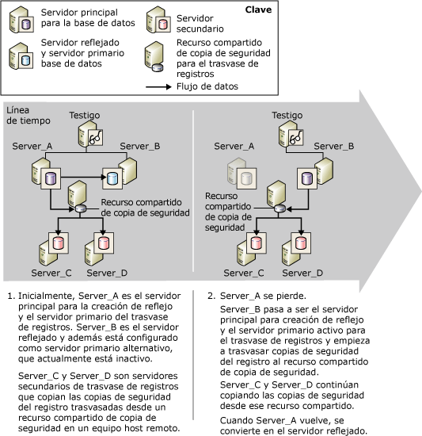

# Crear reflejo de la base de datos y trasvase de registros (SQL Server)
[!INCLUDE[appliesto-ss-xxxx-xxxx-xxx-md](../../includes/appliesto-ss-xxxx-xxxx-xxx-md.md)]
  Se puede crear el reflejo de una determinada base de datos o realizar un trasvase de registros; también es posible realizar ambos procesos de forma simultánea. Para elegir qué método se debe utilizar, tenga en cuenta los siguientes aspectos:  
  
-   ¿Cuántos servidores de destino necesita?  
  
     Si solo es necesaria una base de datos de destino, la creación de reflejo de la base de datos es la solución recomendada.  
  
     Si son necesarias varias bases de datos de destino, debe utilizar el trasvase de registros, ya sea por sí mismo o en combinación con la creación de reflejo de la base de datos. La combinación de estos métodos ofrece las ventajas de la creación de reflejo de la base de datos y la compatibilidad con varios destinos que proporciona el trasvase de registros.  
  
-   Si necesita retrasar la restauración de registros en la base de datos de destino (generalmente para protegerla de errores lógicos), utilice el trasvase de registros, por sí mismo o en combinación con la creación de reflejo.  
  
 En este tema se tratan los aspectos relativos a la combinación del trasvase de registros y la creación de reflejo de la base de datos.  
  
> [!NOTE]  
>  Para ver introducciones a estas tecnologías, consulte [Creación de reflejo de la base de datos &#40;SQL Server&#41;](../../database-engine/database-mirroring/database-mirroring-sql-server.md) y [Acerca del trasvase de registros &#40;SQL Server&#41;](../../database-engine/log-shipping/about-log-shipping-sql-server.md).  
  
## Combinar el trasvase de registros y la creación de reflejo de la base de datos  
 La base de datos principal en una sesión de creación de reflejo puede actuar también como base de datos principal en una configuración de trasvase de registros, o viceversa, ya que el recurso compartido de copia de seguridad de trasvase de registros está intacto. La sesión de creación de reflejo de la base de datos se ejecuta en cualquier modo operativo, ya sea sincrónico (con la seguridad de transacciones configurada en FULL) o asincrónico (con la seguridad de transacciones configurada en OFF).  
  
> [!NOTE]  
>  Para utilizar la creación de reflejo en una base de datos, es obligatorio el modelo de recuperación completa.  
  
 En general, al combinar el trasvase de registros y la creación de reflejo de la base de datos, la sesión de creación de reflejo se establece antes que el trasvase de registros, aunque no es necesario. Después, la base de datos principal actual se configura como principal del trasvase de registros ( *base de datos principal/primaria*), junto con una o varias bases de datos secundarias remotas. Además, la base de datos reflejada debe estar configurada como principal del trasvase de registros ( *base de datos reflejada/principal*). Las bases de datos secundarias del trasvase de registros deben residir en instancias de servidor distintas del servidor principal/primario o el servidor reflejado/primario.  
  
> [!NOTE]  
>  La configuración de uso de mayúsculas y minúsculas de los servidores que participan en el trasvase de registros debe coincidir.  
  
 Durante una sesión de trasvase de registros, los trabajos de copia de seguridad de la base de datos principal crean copias de seguridad de registros en una carpeta. Los trabajos de copia de los servidores secundarios copian de ahí las copias de seguridad. Para que los trabajos de copia de seguridad y los trabajos de copia se realicen correctamente, deben tener acceso a la carpeta de copias de seguridad del trasvase de registros. Para ofrecer la máxima disponibilidad del servidor principal, se recomienda establecer la carpeta de copias de seguridad en una ubicación compartida en un equipo host independiente. Asegúrese de que todos los servidores de trasvase de registros, incluido el servidor reflejado/principal, pueden acceder a la ubicación compartida de copias de seguridad (conocida como *recurso compartido de copia de seguridad*).  
  
 Para que el trasvase de registros pueda continuar tras realizar la conmutación por error de la creación de reflejo de la base de datos, debe configurar también el servidor reflejado como servidor principal, con la misma configuración que utiliza para el servidor primario en la base de datos principal. La base de datos reflejada se encuentra en el estado de restauración, lo que impide que los trabajos de copia de seguridad puedan realizar una copia de seguridad del registro en la base de datos reflejada. De esta forma se asegura que la base de datos reflejada/primaria no interfiere con la base de datos principal/primaria cuyas copias de seguridad de registros están copiando los servidores secundarios. Para evitar falsas alertas, después de que el trabajo de copia de seguridad se ejecute en la base de datos reflejada/principal, el trabajo de copia de seguridad registra un mensaje en la tabla**log_shipping_monitor_history_detail** y el trabajo del agente devuelve un estado de correcto.  
  
 La base de datos reflejada/primaria está inactiva en la sesión de trasvase de registros. No obstante, si en la creación de reflejo se realiza la conmutación por error, la base de datos reflejada anterior se pone en línea como la base de datos principal. En ese momento, dicha base de datos pasa también a ser la base de datos principal activa del trasvase de registros. Los trabajos de copia de seguridad del trasvase de registros que previamente no pudieron trasvasar los registros en esa base de datos comienzan el trasvase. En contraposición, como consecuencia de una conmutación por error, la base de datos principal/primaria anterior se convierte en la nueva base de datos reflejada/primaria, entra en el estado de restauración y los trabajos de copia de seguridad de esa base de datos dejan de realizar la copia de seguridad de registros.  
  
> [!NOTE]  
>  En el caso de producirse una conmutación automática por error, la conmutación al rol reflejado tiene lugar cuando la base de datos principal/primaria anterior se vuelve a unir a la sesión de creación de reflejo.  
  
 Para que se ejecute en modo de alta seguridad con conmutación por error automática, la sesión de creación de reflejo está configurada con una instancia de servidor adicional que se conoce como *testigo*. Si la base de datos principal se pierde por alguna razón después de sincronizar la base de datos y si el servidor reflejado y el testigo pueden seguir comunicándose mutuamente, se produce la conmutación automática por error. La conmutación automática por error hace que el servidor reflejado asuma el rol principal y ponga en línea su base de datos como base de datos principal. Si el nuevo servidor principal/primario no tiene acceso a la ubicación de copias de seguridad del trasvase de registros, los trabajos de copia de seguridad comienzan el trasvase de las copias de seguridad de registros a dicha ubicación. El modo sincrónico de la creación de reflejo de la base de datos garantiza que la conmutación por error de la creación de reflejo no afecta a la cadena de registros y que solo se restauran los registros válidos. Los servidores secundarios continúan copiando copias de seguridad de registros sin saber que una instancia de servidor diferente es ahora el servidor principal.  
  
 Si se utiliza un monitor de trasvase de registros local, no son necesarias consideraciones especiales para admitir este escenario. Para obtener información acerca de cómo utilizar una instancia de supervisión remota con este escenario, vea "Impacto de la creación de reflejo de la base de datos en una instancia de supervisión remota", más adelante en este tema.  
  
## Conmutación por error de la base de datos principal a la base de datos reflejada  
 En la siguiente ilustración se muestra el funcionamiento conjunto del trasvase de registros y la creación de reflejo de la base de datos cuando la creación de reflejo se ejecuta en el modo de alta seguridad con conmutación automática por error. Inicialmente, **Server_A** es el servidor principal para la creación de reflejo y el servidor principal del trasvase de registros. **Server_B** es el servidor reflejado y además está configurado como servidor principal, que actualmente está inactivo. **Server_C** y **Server_D** son servidores secundarios de trasvase de registros. Para ofrecer la máxima disponibilidad de la sesión de trasvase de registros, la ubicación de copias de seguridad se encuentra en un directorio de recurso compartido en un equipo host independiente.  
  
   
  
 Tras una conmutación por error de la creación de reflejo, el nombre del servidor principal definido en el servidor secundario no se modifica. .  
  
## Impacto de la creación de reflejo de la base de datos en una instancia de supervisión remota  
 Si el trasvase de registros se utiliza con una instancia de supervisión remota, la combinación de la sesión de trasvase de registros y la creación de reflejo de la base de datos afecta a la información de las tablas del monitor. La información acerca del servidor principal es una combinación del monitor configurado en el servidor principal/primario y el configurado en cada servidor secundario.  
  
 Para mantener la máxima uniformidad posible de la supervisión, si se utiliza un monitor remoto se recomienda especificar el nombre del servidor principal original al configurar el servidor principal en el secundario. Este enfoque facilita también el cambio de la configuración de trasvase de registros en el Agente Microsoft [!INCLUDE[ssNoVersion](../../includes/ssnoversion-md.md)]. Para obtener más información sobre la supervisión, vea [Supervisar el trasvase de registros &#40;Transact-SQL&#41;](../../database-engine/log-shipping/monitor-log-shipping-transact-sql.md).  
  
## Configurar conjuntamente la creación de reflejo y el trasvase de registros  
 Para configurar conjuntamente la creación de reflejo de la base de datos y el trasvase de registros, es necesario seguir estos pasos:  
  
1.  Restaure las copias de seguridad de la base de datos principal/primaria con la opción NORECOVERY en otra instancia de servidor que posteriormente se utilizará como base de datos reflejada de la creación de reflejo para la base de datos principal/primaria. Para obtener más información, vea [Preparar una base de datos reflejada para la creación de reflejo &#40;SQL Server&#41;](../../database-engine/database-mirroring/prepare-a-mirror-database-for-mirroring-sql-server.md).  
  
2.  Configure la creación de reflejo de la base de datos. Para obtener más información, vea [Establecer una sesión de creación de reflejo de la base de datos mediante la autenticación de Windows &#40;SQL Server Management Studio&#41;](../../database-engine/database-mirroring/establish-database-mirroring-session-windows-authentication.md) y [Configurar la creación de reflejo de la base de datos &#40;SQL Server&#41;](../../database-engine/database-mirroring/setting-up-database-mirroring-sql-server.md).  
  
3.  Restaure las copias de seguridad de la base de datos principal/primaria en otras instancias de servidor que posteriormente se utilizarán como bases de datos secundarias del trasvase de registros para la base de datos principal.  
  
4.  Configure el trasvase de registros en la base de datos principal como la base de datos principal para una o varias bases de datos secundarias.  
  
     Debe configurar un único recurso compartido como directorio de copias de seguridad (recurso compartido de copia de seguridad). De esta forma se asegura que tras la conmutación de roles entre los servidores principal y reflejado, los trabajos de copia de seguridad continúan escribiendo en el mismo directorio que antes. Como práctica recomendada, es conveniente asegurarse de que este recurso compartido se encuentra en un servidor físico diferente de los servidores que hospedan las bases de datos que participan en la creación de reflejo y el trasvase de registros.  
  
     Para obtener más información, vea [Configurar el trasvase de registros &#40;SQL Server&#41;](../../database-engine/log-shipping/configure-log-shipping-sql-server.md).  
  
5.  Realice la conmutación por error manualmente desde el servidor principal al reflejado.  
  
     Para realizar una conmutación por error manualmente:  
  
    -   [Realizar manualmente la conmutación por error de una sesión de creación de reflejo de la base de datos &#40;SQL Server Management Studio&#41;](../../database-engine/database-mirroring/manually-fail-over-a-database-mirroring-session-sql-server-management-studio.md)  
  
    -   [Realizar una conmutación por error manualmente de una sesión de creación de reflejo de la base de datos &#40;Transact-SQL&#41;](../../database-engine/database-mirroring/manually-fail-over-a-database-mirroring-session-transact-sql.md)  
  
6.  Configure el trasvase de registros en el nuevo servidor principal (anteriormente el reflejado) como la base de datos principal.  
  
    > [!IMPORTANT]  
    >  No realice ninguna configuración en los servidores secundarios.  
  
     Debe utilizar el mismo recurso compartido de copia de seguridad que utilizó en el paso 4.  
  
     La interfaz **Trasvase de registro de transacción** de [!INCLUDE[ssManStudioFull](../../includes/ssmanstudiofull-md.md)] solo admite una base de datos principal por cada configuración de trasvase de registros. Por lo tanto, debe utilizar procedimientos almacenados para configurar el nuevo servidor de la entidad de seguridad como servidor principal.  
  
7.  Realice otra conmutación por error manualmente para conmutar a la entidad de seguridad original.  
  
  
