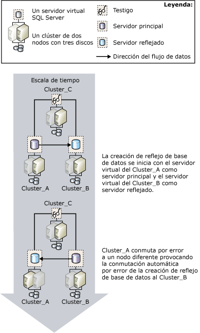

# Creación de reflejo de la base de datos e instancias de clúster de conmutación por error
[!INCLUDE[appliesto-ss-xxxx-xxxx-xxx-md](../../includes/appliesto-ss-xxxx-xxxx-xxx-md.md)] Un clúster de conmutación por error es una combinación de uno o más discos físicos en un grupo de clústeres del servicio de clústeres de [!INCLUDE[msCoName](../../includes/msconame-md.md)] (MSCS), conocido como grupo de recursos, que son nodos participantes en el clúster. El grupo de recursos está configurado como una instancia en clúster de conmutación por error que hospeda una instancia de [!INCLUDE[ssNoVersion](../../includes/ssnoversion-md.md)]. Una instancia en clúster de conmutación por error de [!INCLUDE[ssNoVersion](../../includes/ssnoversion-md.md)] aparece en la red como si fuera un solo equipo, pero dispone de funcionalidad que proporciona conmutación por error de un nodo a otro si un nodo deja de estar disponible. Para obtener más información, vea [Instancias de clúster de conmutación por error de AlwaysOn &#40;SQL Server&#41;](../../sql-server/failover-clusters/windows/always-on-failover-cluster-instances-sql-server.md).  
  
 Los clústeres de conmutación por error proporcionan compatibilidad de alta disponibilidad para una instancia entera de [!INCLUDE[msCoName](../../includes/msconame-md.md)] [!INCLUDE[ssNoVersion](../../includes/ssnoversion-md.md)] , a diferencia de la creación de reflejo de la base de datos, que proporciona compatibilidad de alta disponibilidad para una sola base de datos. La creación de reflejo de la base de datos trabaja entre clústeres de conmutación por error y, también, entre un clúster de conmutación por error y un host no agrupado.  
  
> [!NOTE]  
>  Para obtener una introducción a la creación de reflejo de la base de datos, vea [Creación de reflejo de la base de datos &#40;SQL Server&#41;](../../database-engine/database-mirroring/database-mirroring-sql-server.md).  
  
## Creación de reflejos y agrupación en clústeres  
 Normalmente, cuando se utiliza la creación de reflejo con la agrupación en clústeres, el servidor principal y el reflejado residen en clústeres, el servidor principal se ejecuta en la instancia en clúster de conmutación por error de un clúster y el servidor reflejado se ejecuta en la instancia en clúster de conmutación por error de otro clúster. Sin embargo, puede establecer una sesión de creación de reflejos en la que un asociado resida en la instancia en clúster de conmutación por error de un clúster y el otro asociado resida en un equipo no agrupado independiente.  
  
 Si una conmutación por error de clúster hace que un servidor principal deje de estar disponible temporalmente, las conexiones de cliente se desconectan de la base de datos. Una vez completada la conmutación por error de clúster, los clientes pueden volverse a conectarse al servidor principal en el mismo clúster, en otro clúster o en un equipo no agrupado, dependiendo del [modo de funcionamiento](../../database-engine/database-mirroring/database-mirroring-operating-modes.md). Por tanto, a la hora de decidir cómo configurar la creación de reflejo de la base de datos en un entorno en clúster, el modo de funcionamiento que se emplea para la creación de reflejo es importante.  
  
### Sesión en modo de alta seguridad con conmutación automática por error  
 Si pretende crear un reflejo de una base de datos en modo de alta seguridad con conmutación automática por error, se recomienda una configuración de dos clústeres para los asociados. Esta configuración proporciona la disponibilidad máxima. El testigo puede residir en un tercer clúster o en un equipo no agrupado.  
  
 Si el nodo que ejecuta el servidor principal actual tiene un error, en unos segundos empezará la conmutación automática por error de la base de datos, mientras que el clúster sigue con la conmutación por error a otro nodo. La sesión de creación de reflejo de la base de datos realiza una conmutación por error al servidor reflejado en el otro clúster o en el equipo no agrupado, y el servidor reflejado anterior se convierte en el servidor principal. El nuevo servidor principal pone al día su copia de la base de datos lo más rápido posible y la pone en línea como la base de datos principal. Una vez completada la conmutación por error del clúster, que suele tardar varios minutos, la instancia en clúster de conmutación por error que antes era el servidor principal se convierte en el servidor reflejado.  
  
 La siguiente ilustración muestra una conmutación automática por error entre clústeres en una sesión de creación de reflejos que se ejecuta en modo de alta seguridad con un testigo (que admite la conmutación automática por error).  
  
   
  
 Las tres instancias de servidor de la sesión de creación de reflejo residen en tres clústeres distintos: **Cluster_A**, **Cluster_B**y **Cluster_C**. En cada clúster, se ejecuta una instancia predeterminada de [!INCLUDE[ssNoVersion](../../includes/ssnoversion-md.md)] como una instancia en clúster de conmutación por error de [!INCLUDE[ssNoVersion](../../includes/ssnoversion-md.md)] . Al iniciarse la sesión de creación de reflejo, la instancia en clúster de conmutación por error en **Cluster_A** es el servidor principal, la instancia en clúster de conmutación por error en **Cluster_B** es el servidor reflejado y la instancia en clúster de conmutación por error en **Cluster_C** es el testigo de la sesión de creación de reflejo. Es posible que el nodo activo de **Cluster_A** tenga un error, lo que provocará que el servidor principal deje de estar disponible.  
  
 Antes de que el clúster tenga tiempo de realizar la conmutación por error, el servidor reflejado detecta la pérdida del servidor principal con la ayuda del testigo. El servidor reflejado pone al día su base de datos y la pone en línea como nueva base de datos principal lo más rápido posible. Cuando **Cluster_A** finaliza la conmutación por error, el servidor principal anterior se convierte en servidor reflejado y sincroniza su base de datos con la base de datos principal actual en **Cluster_B**.  
  
### Sesión en modo de alta seguridad sin conmutación automática por error  
 Si crea el reflejo de una base de datos en modo de alta seguridad sin conmutación automática por error, otro nodo del clúster actuará como servidor principal si el nodo en el que se ejecuta el servidor principal actual produce un error. Tenga en cuenta que mientras el clúster no está disponible, la base de datos tampoco lo está.  
  
### Sesión de modo de alto rendimiento  
 Si pretende crear el reflejo de una base de datos en modo de alto rendimiento, considere la posibilidad de colocar el servidor principal en la instancia en clúster de conmutación por error de un clúster y colocar el servidor reflejado en un servidor no en clúster en una ubicación remota. Si el clúster realiza una conmutación por error a otro nodo, la instancia en clúster de conmutación por error continuará como servidor principal en la sesión de creación de reflejo. Si todo el clúster tiene problemas, puede forzar el servicio en el servidor reflejado.  
  
 **Para configurar un nuevo clúster de conmutación por error de SQL Server**  
  
-   [Crear un nuevo clúster de conmutación por error de SQL Server &#40;programa de instalación&#41;](../../sql-server/failover-clusters/install/create-a-new-sql-server-failover-cluster-setup.md)  
  
 **Para configurar la creación de reflejo de la base de datos**  
  
-   [Configurar la creación de reflejo de la base de datos &#40;SQL Server&#41;](../../database-engine/database-mirroring/setting-up-database-mirroring-sql-server.md)  
  
-   [Establecer una sesión de creación de reflejo de la base de datos mediante la autenticación de Windows &#40;SQL Server Management Studio&#41;](../../database-engine/database-mirroring/establish-database-mirroring-session-windows-authentication.md)  
  
## Vea también  
 [Creación de reflejo de la base de datos &#40;SQL Server&#41;](../../database-engine/database-mirroring/database-mirroring-sql-server.md)   
 [Modos de funcionamiento de la creación de reflejo de la base de datos](../../database-engine/database-mirroring/database-mirroring-operating-modes.md)   
 [Instancias de clúster de conmutación por error de AlwaysOn &#40;SQL Server&#41;](../../sql-server/failover-clusters/windows/always-on-failover-cluster-instances-sql-server.md)  
  
  
