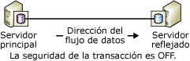
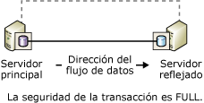
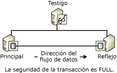

# <a name="database-mirroring-operating-modes"></a>Modos de funcionamiento de la creación de reflejo de la base de datos
 [!INCLUDE [SQL Server](../../includes/applies-to-version/sqlserver.md)]
  En este tema se describen los modos de funcionamiento sincrónico y asincrónico para las sesiones de creación de reflejo de la base de datos.  
  
> [!NOTE]  
>  Para obtener una introducción a la creación de reflejo de la base de datos, vea [Creación de reflejo de la base de datos &#40;SQL Server&#41;](../../database-engine/database-mirroring/database-mirroring-sql-server.md).  
  
  
##  <a name="terms-and-definitions"></a><a name="TermsAndDefinitions"></a> Términos y definiciones  
 En esta sección se presenta una serie de términos que son esenciales para este tema.  
  
 Modo de alto rendimiento  
 La sesión de creación de reflejo de la base de datos funciona asincrónicamente y usa solo el servidor principal y el servidor reflejado. La única forma de conmutación de roles es el servicio forzado (con posible pérdida de datos).  
  
 modo Alta seguridad  
 La sesión de creación de reflejo de la base de datos funciona sincrónicamente y, de forma opcional, usa un testigo, así como el servidor principal y el servidor reflejado.  
  
 Seguridad de las transacciones  
 Propiedad de base de datos específica de la creación de reflejo que determina si una sesión de creación de reflejo de la base de datos funciona de forma sincrónica o asincrónica. Hay dos niveles de seguridad: FULL y OFF.  
  
 Testigo  
 Para su uso únicamente con el modo de alta seguridad, instancia opcional de SQL Server que habilita al servidor reflejado para que reconozca si se debe iniciar una conmutación automática por error. A diferencia de los dos asociados de conmutación por error, el testigo no sirve a la base de datos. El único rol del testigo es hacer posible la conmutación automática por error.  
  
## <a name="asynchronous-database-mirroring-high-performance-mode"></a>Operación asincrónica de creación de reflejo de la base de datos (Modo de alto rendimiento)  
 En esta sección se describe cómo funciona la creación de reflejo de la base de datos asincrónica, cuándo es adecuado utilizar el modo de alto rendimiento y cómo responder si se produce un error en el servidor principal.  
  
> [!NOTE]  
>  La mayoría de las ediciones de [!INCLUDE[ssCurrent](../../includes/sscurrent-md.md)] solo admiten la creación de reflejo de la base de datos sincrónica (“Solo seguridad completa”). Para más información sobre las ediciones que permiten totalmente crear reflejos de la base de datos, vea "Alta disponibilidad (AlwaysOn)" en [Ediciones y características admitidas de SQL Server 2016](../../sql-server/editions-and-components-of-sql-server-2016.md).
  
 Si la seguridad de las transacciones está configurada en OFF, la sesión de creación de reflejo de la base de datos funciona de forma asincrónica. La operación asincrónica solo admite el modo operativo de alto rendimiento. Este modo mejora el rendimiento a costa de la alta disponibilidad. El modo de alto rendimiento utiliza solamente el servidor principal y el servidor reflejado. Los problemas del servidor reflejado nunca afectan al servidor principal. Al perderse el servidor principal, la base de datos reflejada se marca como DISCONNECTED, pero está disponible como base de datos en espera activa.  
  
 El modo de alto rendimiento solo admite un formato de conmutación de roles: el servicio forzado (con posible pérdida de datos), que utiliza el servidor reflejado como servidor en estado de espera activa. El servicio forzado es una de las posibles respuestas a los errores del servidor principal. Dado que es posible la pérdida de datos, debe considerar otras alternativas antes de forzar el servicio en el servidor reflejado. Para obtener más información, vea [Responder ante los errores del servidor principal](#WhenPrincipalFails), más adelante en este tema.  
  
 En la siguiente ilustración se muestra la configuración de una sesión con el modo de alto rendimiento.  
  
   
  
 En el modo de alto rendimiento, en cuanto el servidor principal envía el registro de una transacción al servidor reflejado, el servidor principal envía una confirmación al cliente, sin esperar una confirmación del servidor reflejado. Las transacciones se confirman sin esperar a que el servidor reflejado escriba el registro en el disco. La operación asincrónica permite que el servidor principal se ejecute con la mínima latencia de transacciones.  
  
 El servidor reflejado intenta hacer frente a las entradas de registro enviadas por el servidor principal. Sin embargo, la base de datos reflejada puede retrasarse un poco con respecto a la base de datos principal, aunque la diferencia entra ambas suele ser pequeña. No obstante, la diferencia puede ser considerable si el servidor principal soporta una gran carga de trabajo o el sistema del servidor reflejado se encuentra sobrecargado.  
  
 **En esta sección:**  
  
-   [Cuándo está indicado utilizar el modo de alto rendimiento](#WhenUseHighPerf)  
  
-   [El impacto de un testigo en el modo de alto rendimiento](#WitnessImpactOnHighPerf)  
  
-   [Responder ante los errores del servidor principal](#WhenPrincipalFails)  
  
###  <a name="when-is-high-performance-mode-appropriate"></a><a name="WhenUseHighPerf"></a> Cuándo está indicado utilizar el modo de alto rendimiento  
 El modo de alto rendimiento puede resultar útil en un caso de recuperación de desastres en el que los servidores principal y reflejado se encuentran separados por una distancia considerable y no se desea que los pequeños errores afecten al servidor principal.  
  
> [!NOTE]  
>  El trasvase de registros puede complementar a la creación de reflejo de la base de datos y es una alternativa conveniente a la creación asincrónica de reflejo de la base de datos. Para obtener información sobre las ventajas del trasvase de registros, vea [Soluciones de alta disponibilidad &#40;SQL Server&#41;](../sql-server-business-continuity-dr.md). Para obtener información sobre cómo usar el trasvase de registros con la creación de reflejo de la base de datos, vea [Crear reflejo de la base de datos y trasvase de registros &#40;SQL Server&#41;](../../database-engine/database-mirroring/database-mirroring-and-log-shipping-sql-server.md).  
  
###  <a name="the-impact-of-a-witness-on-high-performance-mode"></a><a name="WitnessImpactOnHighPerf"></a> El impacto de un testigo en el modo de alto rendimiento  
 Si se utiliza Transact-SQL para configurar el modo de alto rendimiento, siempre que la propiedad SAFETY esté establecida en OFF, se recomienda encarecidamente que la propiedad WITNESS también se establezca en OFF. Un testigo puede coexistir con el modo de alto rendimiento, pero no proporciona ventaja alguna y genera riesgo.  
  
 Si el testigo está desconectado de la sesión y uno de los asociados se bloquea, la base de datos no estará disponible. Esto es así porque, aun cuando el modo de alto rendimiento no necesita un testigo, si se establece uno, la sesión requiere un quórum compuesto de dos o más instancias de servidor. Si la sesión pierde el quórum, no puede servir a la base de datos.  
  
 Cuando se establece un testigo en una sesión en modo de alto rendimiento, la aplicación de quórum implica que:  
  
-   Si se pierde el servidor reflejado, el servidor principal se debe conectar al testigo. De lo contrario, el servidor principal mantiene su base de datos sin conexión hasta que el testigo o el servidor reflejado vuelven a unirse a la sesión.  
  
-   Si se pierde el servidor principal, forzar el servicio en el servidor reflejado requiere que éste se conecte al testigo.  
  
> [!NOTE]  
>  Para obtener información sobre los tipos de cuórum, vea [Cuórum: cómo un testigo afecta a la disponibilidad de la base de datos &#40;creación de reflejo de la base de datos&#41;](../../database-engine/database-mirroring/quorum-how-a-witness-affects-database-availability-database-mirroring.md).  
  
###  <a name="responding-to-failure-of-the-principal"></a><a name="WhenPrincipalFails"></a> Responder ante los errores del servidor principal  
 Si se produce un error en el servidor principal, el propietario de la base de datos tiene varias opciones:  
  
-   Dejar la base de datos inactiva hasta que el servidor principal vuelva a estar disponible.  
  
     Si la base de datos principal y su registro de transacciones están intactos, esta opción conserva todas las transacciones confirmadas a costa de la disponibilidad.  
  
-   Detener la sesión de creación de reflejo de la base de datos, actualizar manualmente la base de datos y, después, iniciar una nueva sesión de creación de reflejo.  
  
     Si la base de datos principal se pierde pero el servidor principal sigue en funcionamiento, intente inmediatamente realizar una copia de seguridad del final del registro en la base de datos principal. Si la copia del final del registro se realiza correctamente, la mejor opción puede ser eliminar la creación de reflejo. Tras eliminar la creación de reflejo, puede restaurar el registro en la base de datos reflejada anterior, que conserva todos los datos.  
  
    > [!NOTE]  
    >  Si no se puede realizar la copia del final del registro y no puede esperar a que el servidor principal se recupere, considere la posibilidad de forzar el servicio, que ofrece la ventaja de mantener el estado de la sesión.  
  
-   Forzar el servicio (con posible pérdida de datos) en el servidor reflejado.  
  
     El servicio forzado es estrictamente un método de recuperación de desastres y no se debe utilizar demasiado a menudo. Solo es posible forzar el servicio si el servidor principal está inactivo, la sesión es asincrónica (la seguridad de transacciones está configurada en OFF) y la sesión no tiene un testigo (la propiedad WITNESS está configurada en OFF) o el testigo se ha conectado al servidor reflejado (esto es, hay quórum).  
  
     Al forzar el servicio, el servidor reflejado asume el rol de servidor principal y ofrece su copia de la base de datos a los clientes. Una vez forzado el servicio, los registros de transacciones que el servidor principal no haya enviado todavía al servidor reflejado se pierden. Por lo tanto, el servicio forzado debe limitarse a situaciones en las que sea aceptable la posible pérdida de datos y sea crucial la disponibilidad inmediata de la base de datos. Para obtener información sobre cómo funciona el servicio forzado y las prácticas recomendadas para su uso, vea [Conmutación de roles durante una sesión de creación de reflejo de la base de datos &#40;SQL Server&#41;](../../database-engine/database-mirroring/role-switching-during-a-database-mirroring-session-sql-server.md).  
  
##  <a name="synchronous-database-mirroring-high-safety-mode"></a><a name="Sync"></a> Creación de reflejo sincrónico de la base de datos (modo de alta seguridad)  
 En esta sección se describe cómo funciona la creación de reflejo de la base de datos sincrónica, incluidos los modos de alta seguridad alternativos (con y sin conmutación automática por error), y contiene información sobre el rol del testigo en la conmutación automática por error.  
  
 Cuando la seguridad de las transacciones se define como FULL, la sesión de creación de reflejo de la base de datos se ejecuta en modo de alta seguridad y funciona de forma sincrónica después de una fase inicial de sincronización. En esta sección se describen los detalles de las sesiones de creación de reflejo de la base de datos que están configuradas para el funcionamiento sincrónico.  
  
 Para que una sesión funcione de forma sincrónica, el servidor reflejado debe sincronizar la base de datos reflejada con la base de datos principal. Cuando la sesión se inicia, el servidor principal comienza a enviar su registro activo al servidor reflejado. El servidor reflejado escribe todos los registros de entrada en el disco lo antes posible. Las bases de datos se sincronizan cuando todos los registros recibidos se escriben en el disco. Las bases de datos se sincronizan siempre y cuando los asociados permanezcan en comunicación.  
  
> [!NOTE]  
>  Utilice la clase de eventos **Database Mirroring State Change** para supervisar los cambios de estado en una sesión de creación de reflejo de la base de datos. Para obtener más información, consulte [Database Mirroring State Change Event Class](../../relational-databases/event-classes/database-mirroring-state-change-event-class.md).  
  
 Cuando finaliza la sincronización, cada transacción confirmada en la base de datos de principal también se confirma en el servidor reflejado, garantizando así la protección de los datos. Esto se consigue esperando la confirmación de una transacción en la base de datos principal hasta que el servidor principal recibe un mensaje del servidor reflejado indicando que ha reforzado el registro de transacciones en el disco. Tenga en cuenta que la espera de este mensaje aumenta la latencia de la transacción.  
  
 El tiempo necesario para la sincronización depende básicamente de la diferencia entre la base de datos reflejada y la base de datos principal en el momento de iniciar la sesión (diferencia calculada por el número de registros inicialmente recibidos del servidor principal), la carga de trabajo en la base de datos principal y la velocidad del sistema reflejo. Una vez sincronizada una sesión, el registro reforzado que aún debe rehacerse en la base de datos reflejada permanece en la cola de puesta al día.  
  
 En cuanto se sincroniza la base de datos reflejada, el estado de ambas copias de base de datos cambia a SYNCHRONIZED.  
  
 La operación sincrónica se mantiene de la siguiente manera:  
  
1.  Al recibir una transacción de un cliente, el servidor principal escribe el registro para la transacción en el registro de transacciones.  
  
2.  El servidor principal escribe la transacción en la base de datos y, al mismo tiempo, envía el registro al servidor reflejado. El servidor principal espera el reconocimiento del servidor reflejado antes de confirmar cualquiera de los elementos siguientes al cliente: una confirmación de transacción o una reversión.  
  
3.  El servidor reflejado refuerza el registro en el disco y devuelve un reconocimiento al servidor principal.  
  
4.  Al recibir el reconocimiento del servidor reflejado, el servidor principal envía un mensaje de confirmación al cliente.  
  
 El modo de alta seguridad protege los datos al hacer que sea necesario sincronizar los datos de dos lugares. Se garantiza que todas las transacciones confirmadas serán escritas en el disco del servidor reflejado.  
  
 **En esta sección:**  
  
-   [Modo de alta seguridad sin conmutación automática por error](#HighSafetyWithOutAutoFailover)  
  
-   [Modo de alta seguridad con conmutación automática por error](#HighSafetyWithAutoFailover)  
  
###  <a name="high-safety-mode-without-automatic-failover"></a><a name="HighSafetyWithOutAutoFailover"></a> Modo de alta seguridad sin conmutación automática por error  
 En la siguiente ilustración se muestra la configuración del modo de alta seguridad sin conmutación automática por error. La configuración solo consta de dos asociados.  
  
   
  
 Cuando los asociados están conectados y la base de datos ya está sincronizada, se admite la conmutación por error manual. Si la instancia del servidor reflejado se bloquea, la instancia de servidor principal no se ve afectada y queda expuesta (sin reflejar los datos). Si se pierde el servidor principal, el reflejo se suspende, pero el servicio puede forzarse en el servidor reflejado (con una posible pérdida de datos). Para obtener más información, vea [Conmutación de roles durante una sesión de creación de reflejo de la base de datos &#40;SQL Server&#41;](../../database-engine/database-mirroring/role-switching-during-a-database-mirroring-session-sql-server.md).  
  
###  <a name="high-safety-mode-with-automatic-failover"></a><a name="HighSafetyWithAutoFailover"></a> Modo de alta seguridad con conmutación automática por error  
 La conmutación automática por error ofrece una alta disponibilidad al garantizar que se pueda servir a la base de datos incluso después de la pérdida de un servidor. La conmutación automática por error requiere que la sesión disponga de una tercera instancia de servidor, el *testigo*, que idealmente reside en un tercer equipo. En la siguiente ilustración se muestra la configuración de una sesión en modo de alta seguridad que admite la conmutación automática por error.  
  
   
  
 A diferencia de los dos asociados, el testigo no sirve a la base de datos. El testigo simplemente admite la conmutación automática por error al comprobar que el servidor principal se encuentre activo y en funcionamiento. El servidor reflejado inicia la conmutación automática por error solo si éste y el testigo permanecen mutuamente conectados después de haberse desconectado del servidor principal.  
  
 Cuando se define un testigo, la sesión requiere *quórum*, una relación entre al menos dos instancias de servidor que permite que la base de datos pueda estar disponible. Para obtener más información, vea [Testigo de creación de reflejo de la base de datos](../../database-engine/database-mirroring/database-mirroring-witness.md) y [Cuórum: cómo un testigo afecta a la disponibilidad de la base de datos &#40;creación de reflejo de la base de datos&#41;](../../database-engine/database-mirroring/quorum-how-a-witness-affects-database-availability-database-mirroring.md).  
  
 La conmutación automática por error requiere las condiciones siguientes:  
  
-   La base de datos ya está sincronizada.  
  
-   El error se produce mientras están conectadas las tres instancias de servidor, y el servidor testigo y el reflejado permanecen conectados.  
  
 La pérdida de un asociado tiene el siguiente efecto:  
  
-   Si la instancia de servidor principal no está disponible en las condiciones anteriores, se produce la conmutación automática por error. El servidor reflejado cambia al rol de principal y ofrece su base de datos como base de datos principal.  
  
-   Si el servidor principal no está disponible cuando estas condiciones no se cumplen, se puede forzar el servicio (con una posible pérdida de datos). Para obtener más información, vea [Conmutación de roles durante una sesión de creación de reflejo de la base de datos &#40;SQL Server&#41;](../../database-engine/database-mirroring/role-switching-during-a-database-mirroring-session-sql-server.md).  
  
-   Si únicamente el servidor reflejado no está disponible, el principal y el testigo continúan.  
  
 Si la sesión pierde el testigo, el quórum requiere ambos asociados. Si uno de los asociados pierde el quórum, ambos lo pierden y la base de datos deja de estar disponible hasta que se restablece el quórum. El requisito de quórum garantiza que, en ausencia de un testigo, la base de datos no quede nunca *expuesta*, es decir, sin un reflejo.  
  
> [!NOTE]  
>  Si cree que el testigo va a permanecer desconectado durante bastante tiempo, se recomienda eliminarlo temporalmente de la sesión hasta que esté disponible.  
  
##  <a name="transact-sql-settings-and-database-mirroring-operating-modes"></a><a name="TsqlSettingsAndOpModes"></a> Configuración de Transact-SQL y modos de funcionamiento de la creación de reflejo de la base de datos  
 En esta sección se describe una sesión de creación de reflejo de la base de datos desde el punto de vista de la configuración de ALTER DATABASE y de los estados de la base de datos reflejada y del testigo, si existen. Esta sección está dirigida a los usuarios que administran la creación de reflejo de la base de datos principal o exclusivamente mediante [!INCLUDE[tsql](../../includes/tsql-md.md)], en vez de mediante [!INCLUDE[ssManStudioFull](../../includes/ssmanstudiofull-md.md)].  
  
> [!TIP]  
>  Como alternativa al uso de [!INCLUDE[tsql](../../includes/tsql-md.md)], puede controlar el modo de funcionamiento de una sesión en el Explorador de objetos mediante la página **Creación de reflejos** del cuadro de diálogo **Propiedades de la base de datos** . Para obtener más información, vea [Establecer una sesión de creación de reflejo de la base de datos mediante la autenticación de Windows &#40;SQL Server Management Studio&#41;](../../database-engine/database-mirroring/establish-database-mirroring-session-windows-authentication.md).  
  
 **En esta sección:**  
  
-   [Cómo la seguridad de transacción y el estado del testigo afectan al modo de funcionamiento](#TxnSafetyAndWitness)  
  
-   [Ver la configuración de seguridad y el estado del testigo](#ViewWitness)  
  
-   [Factores que afectan al comportamiento en caso de pérdida del servidor principal](#FactorsOnLossOfPrincipal)  
  
###  <a name="how-transaction-safety-and-witness-state-affect-the-operating-mode"></a><a name="TxnSafetyAndWitness"></a> Cómo la seguridad de transacción y el estado del testigo afectan al modo de funcionamiento  
 El modo de funcionamiento de una sesión viene determinado por la combinación de su configuración de seguridad de las transacciones y el estado del testigo. En cualquier momento, el propietario de la base de datos puede cambiar la configuración de seguridad de las transacciones y puede agregar o quitar el testigo.  
  
 **En esta sección:**  
  
-   [Transaction Safety](#TxnSafety)  
  
-   [Estado del testigo](#WitnessState)  
  
####  <a name="transaction-safety"></a><a name="TxnSafety"></a> Transaction Safety  
 La seguridad de las transacciones es una propiedad de base de datos específica de la creación de reflejo que determina si una sesión de creación de reflejo de la base de datos funciona de forma sincrónica o asincrónica. Hay dos niveles de seguridad: FULL y OFF.  
  
-   SAFETY FULL  
  
     La seguridad de las transacciones completa hace que la sesión funcione de forma asincrónica en modo de alta seguridad. Si existe un testigo, una sesión admite la conmutación automática por error.  
  
     Cuando se establece una sesión mediante instrucciones ALTER DATABASE, ésta empieza con el valor SAFETY establecido en FULL; es decir, la sesión empieza en modo de alta seguridad. Una vez que se ha iniciado la sesión, puede agregarse un testigo.  
  
     Para obtener más información, vea [Creación de reflejo sincrónico de la base de datos (modo de alta seguridad)](#Sync), anteriormente en este tema.  
  
-   SAFETY OFF  
  
     Desactivar la seguridad de las transacciones hace que la sesión funcione de forma asincrónica, en modo de alto rendimiento. Si la propiedad SAFETY está establecida en OFF, la propiedad WITNESS también debe estar establecida en OFF (el valor predeterminado). Para obtener información sobre el efecto del testigo en el modo de alto rendimiento, vea [Estado del testigo](#WitnessState)a continuación. Para obtener más información sobre la ejecución con la seguridad de transacción desactivada, vea [Operación asincrónica de creación de reflejo de la base de datos (Modo de alto rendimiento)](#asynchronous-database-mirroring-high-performance-mode), anteriormente en este tema.  
  
 La configuración de seguridad de las transacciones de la base de datos está registrada en cada asociado de la vista de catálogo **sys.database_mirroring** en las columnas **mirroring_safety_level** y **mirroring_safety_level_desc**. Para obtener más información, vea [sys.database_mirroring &#40;Transact-SQL&#41;](../../relational-databases/system-catalog-views/sys-database-mirroring-transact-sql.md).  
  
 El propietario de la base de datos puede cambiar el nivel de seguridad de las transacciones en cualquier momento.  
  
####  <a name="the-state-of-the-witness"></a><a name="WitnessState"></a> Estado del testigo  
 Si se establece un testigo, es necesario que haya quórum, por lo que el estado del testigo será siempre significativo.  
  
 Si existe, el testigo tendrá uno de estos dos estados:  
  
-   Cuando el testigo está conectado a un asociado, el testigo tiene el estado CONNECTED en relación con el asociado y tiene quórum con ese asociado. En este caso, la base de datos puede estar disponible, incluso si alguno de los asociados no está disponible.  
  
-   Cuando hay un testigo pero no está conectado a un asociado, el testigo tiene el estado UNKOWN o DISCONNECTED en relación con el asociado. En este caso, el testigo carece de quórum con ese asociado y, si los asociados no están conectados entre sí, la base de datos se vuelve no disponible.  
  
 Para obtener información sobre el cuórum, vea [Cuórum: cómo un testigo afecta a la disponibilidad de la base de datos &#40;creación de reflejo de la base de datos&#41;](../../database-engine/database-mirroring/quorum-how-a-witness-affects-database-availability-database-mirroring.md).  
  
 El estado de cada testigo en una instancia del servidor se registra en la vista de catálogo **sys.database_mirroring**, en las columnas **mirroring_witness_state** y **mirroring_witness_state_desc**. Para obtener más información, vea [sys.database_mirroring &#40;Transact-SQL&#41;](../../relational-databases/system-catalog-views/sys-database-mirroring-transact-sql.md).  
  
 En la tabla siguiente se resume cómo el modo de funcionamiento de una sesión depende de su configuración de seguridad de las transacciones y del estado del testigo.  
  
|Modo de funcionamiento|Seguridad de las transacciones|Estado del testigo|  
|--------------------|------------------------|-------------------|  
|Modo de alto rendimiento|Apagado|NULL (sin testigo)**|  
|Modo de alta seguridad sin conmutación automática por error|FULL|NULL (sin testigo)|  
|Modo de seguridad alta con conmutación automática por error*|FULL|CONNECTED|  
  
 *Si el testigo se desconecta, se recomienda establecer WITNESS OFF hasta que la instancia del servidor testigo esté disponible.  
  
 **Si hay un testigo en modo de alto rendimiento, no participará en la sesión. Sin embargo, para que la base de datos esté disponible, al menos dos de las instancias de servidor deben permanecer conectadas. Por lo tanto, se recomienda mantener la propiedad WITNESS establecida en OFF en las sesiones en modo de alto rendimiento. Para más información, vea [Cuórum: cómo un testigo afecta a la disponibilidad de la base de datos &#40;creación de reflejo de la base de datos&#41;](../../database-engine/database-mirroring/quorum-how-a-witness-affects-database-availability-database-mirroring.md).  
  
###  <a name="viewing-the-safety-setting-and-state-of-the-witness"></a><a name="ViewWitness"></a> Ver la configuración de seguridad y el estado del testigo  
 Para ver la configuración de seguridad y el estado del testigo de una base de datos, use la vista de catálogo **sys.database_mirroring** . Las columnas relevantes son:  
  
|Factor|Columnas|Descripción|  
|------------|-------------|-----------------|  
|Seguridad de las transacciones|**mirroring_safety_level** o **mirroring_safety_level_desc**|La configuración de seguridad de las transacciones para las actualizaciones de la base de datos reflejada es una de las siguientes:<br /><br /> DESCONOCIDO<br /><br /> Apagado<br /><br /> FULL<br /><br /> NULL= la base de datos no está en línea.|  
|¿Existe un testigo?|**mirroring_witness_name**|Nombre de servidor del testigo de creación de reflejo de la base de datos o NULL, que indica que no existe ningún testigo.|  
|Estado del testigo|**mirroring_witness_state** o **mirroring_witness_state_desc**|Estado del testigo en la base de datos en un determinado asociado:<br /><br /> DESCONOCIDO<br /><br /> CONNECTED<br /><br /> DISCONNECTED<br /><br /> NULL = no existe ningún testigo o la base de datos no está en línea.|  
  
 Por ejemplo, en el servidor principal o el servidor reflejado, escriba:  
  
```  
SELECT mirroring_safety_level_desc, mirroring_witness_name, mirroring_witness_state_desc FROM sys.database_mirroring  
```  
  
 Para obtener más información sobre esta vista de catálogo, vea [sys.database_mirroring &#40;Transact-SQL&#41;](../../relational-databases/system-catalog-views/sys-database-mirroring-transact-sql.md).  
  
###  <a name="factors-affecting-behavior-on-loss-of-the-principal-server"></a><a name="FactorsOnLossOfPrincipal"></a> Factores que afectan al comportamiento en caso de pérdida del servidor principal  
 En la tabla siguiente se resume el efecto combinado de la configuración de seguridad de las transacciones, el estado de la base de datos y el estado del testigo en el comportamiento de una sesión de creación de reflejo en caso de pérdida del servidor principal.  
  
|Seguridad de las transacciones|Estado del reflejo de la base de datos reflejada|Estado del testigo|Comportamiento al perderse el servidor principal|  
|------------------------|----------------------------------------|-------------------|-------------------------------------|  
|FULL|SYNCHRONIZED|CONNECTED|Se produce la conmutación automática por error.|  
|FULL|SYNCHRONIZED|DISCONNECTED|El servidor reflejado se detiene; la conmutación por error no es posible y no se puede hacer que la base de datos esté disponible.|  
|Apagado|SUSPENDED o DISCONNECTED|NULL (sin testigo)|El servicio se puede forzar en el servidor reflejado (con posible pérdida de datos).|  
|FULL|SYNCHRONIZING o SUSPENDED|NULL (sin testigo)|El servicio se puede forzar en el servidor reflejado (con posible pérdida de datos).|  
  
##  <a name="related-tasks"></a><a name="RelatedTasks"></a> Tareas relacionadas  
  
-   [Agregar o reemplazar un testigo de creación de reflejo de la base de datos &#40;SQL Server Management Studio&#41;](../../database-engine/database-mirroring/add-or-replace-a-database-mirroring-witness-sql-server-management-studio.md)  
  
-   [Establecer una sesión de creación de reflejo de la base de datos mediante la autenticación de Windows &#40;SQL Server Management Studio&#41;](../../database-engine/database-mirroring/establish-database-mirroring-session-windows-authentication.md)  
  
-   [Agregar un testigo de creación de reflejo de la base de datos mediante la autenticación de Windows &#40;Transact-SQL&#41;](../../database-engine/database-mirroring/add-a-database-mirroring-witness-using-windows-authentication-transact-sql.md)  
  
-   [Quitar el testigo de una sesión de creación de reflejo de la base de datos &#40;SQL Server&#41;](../../database-engine/database-mirroring/remove-the-witness-from-a-database-mirroring-session-sql-server.md)  
  
-   [Cambiar la seguridad de las transacciones en una sesión de creación de reflejo de la base de datos &#40;Transact-SQL&#41;](../../database-engine/database-mirroring/change-transaction-safety-in-a-database-mirroring-session-transact-sql.md)  
  
## <a name="see-also"></a>Consulte también  
 [Supervisar la creación de reflejo de la base de datos &#40;SQL Server&#41;](../../database-engine/database-mirroring/monitoring-database-mirroring-sql-server.md)   
 [Testigo de creación de reflejo de la base de datos](../../database-engine/database-mirroring/database-mirroring-witness.md)  
  
