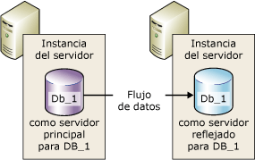
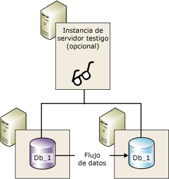
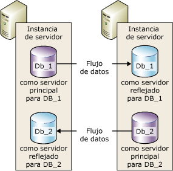

# Creación de reflejo de la base de datos (SQL Server)
    
> [!NOTE]  
>  [!INCLUDE[ssNoteDepFutureAvoid](../../includes/ssnotedepfutureavoid-md.md)] Use [!INCLUDE[ssHADR](../../includes/sshadr-md.md)] en su lugar.  
  
 *Creación de reflejo de la base de datos* es una solución para aumentar la disponibilidad de una base de datos de [!INCLUDE[ssNoVersion](../../includes/ssnoversion-md.md)] . La creación de reflejo se implementa en cada una de las bases de datos y solo funciona con las que utilizan el modelo de recuperación completa.  
  
> [!IMPORTANT]  
>  Para obtener más información sobre la compatibilidad con la creación de reflejo de la base de datos, restricciones, requisitos previos, recomendaciones para configurar servidores asociados y recomendaciones para implementar la creación de reflejo de la base de datos de datos, vea [Requisitos previos, restricciones y recomendaciones para la creación de reflejo de la base de datos](../../database-engine/database-mirroring/prerequisites-restrictions-and-recommendations-for-database-mirroring.md).  
  
  
##   Ventajas de la creación de reflejo de la base de datos  
 La creación de reflejo de la base de datos es una estrategia sencilla que ofrece las siguientes ventajas:  
  
-   Incrementa la disponibilidad de una base de datos.  
  
     Si se produce un desastre en el modo de alta seguridad con conmutación automática por error, la conmutación por error pone en línea rápidamente la copia en espera de la base de datos, sin pérdida de datos. En los demás modos operativos, el administrador de bases de datos tiene la alternativa del servicio forzado (con una posible pérdida de datos) para la copia en espera de la base de datos. Para obtener más información, vea [Conmutación de roles](#RoleSwitching)más adelante en este tema.  
  
-   Aumenta la protección de los datos.  
  
     La creación de reflejo de la base de datos proporciona una redundancia completa o casi completa de los datos, en función de si el modo de funcionamiento es el de alta seguridad o el de alto rendimiento. Para obtener más información, vea [Modos de funcionamiento](#OperatingModes), más adelante en este tema.  
  
     Un asociado de creación de reflejo de la base de datos que se ejecute en [!INCLUDE[ssEnterpriseEd10](../../includes/ssenterpriseed10-md.md)] o en versiones posteriores intentará resolver automáticamente cierto tipo de errores que impiden la lectura de una página de datos. El socio que no puede leer una página, solicita una copia nueva al otro socio. Si la solicitud se realiza correctamente, la copia sustituirá a la página que no se puede leer, de forma que se resuelve el error en la mayoría de los casos. Para obtener más información, vea [Reparación de página automática &#40;grupos de disponibilidad/creación de reflejo de la base de datos&#41;](../../sql-server/failover-clusters/automatic-page-repair-availability-groups-database-mirroring.md).  
  
-   Mejora la disponibilidad de la base de datos de producción durante las actualizaciones.  
  
     Para minimizar el tiempo de inactividad para una base de datos reflejada, puede actualizar secuencialmente las instancias de [!INCLUDE[ssNoVersion](../../includes/ssnoversion-md.md)] que hospedan los asociados de creación de reflejo de la base de datos. Esto incurrirá en el tiempo de inactividad de solo una conmutación por error única. Este formulario de actualización se conoce como *actualización gradual*. Para más información, consulte [Upgrading Mirrored Instances](../../database-engine/database-mirroring/upgrading-mirrored-instances.md).  
  
  
##   Términos y definiciones de la creación de reflejo de la base de datos  
 conmutación automática por error  
 Proceso por el que, cuando el servidor principal deja de estar disponible, el servidor reflejado asume el rol de servidor principal y convierte su copia de la base de datos en línea como la base de datos principal.  
  
 asociados de conmutación por error  
 Las dos instancias de servidor (el servidor principal o el servidor reflejado) que actúan como asociados de conmutación de roles para una base de datos reflejada.  
  
 servicio forzado  
 Conmutación por error iniciada por el propietario de la base de datos cuando se producen errores del servidor principal que transfiere el servicio a la base de datos reflejada mientras se encuentra en un estado desconocido.  
  
 Modo de alto rendimiento  
 La sesión de creación de reflejo de la base de datos funciona asincrónicamente y usa solo el servidor principal y el servidor reflejado. La única forma de conmutación de roles es el servicio forzado (con posible pérdida de datos).  
  
 modo Alta seguridad  
 La sesión de creación de reflejo de la base de datos funciona sincrónicamente y, de forma opcional, usa un testigo, así como el servidor principal y el servidor reflejado.  
  
 conmutación por error manual  
 Conmutación por error iniciada por el propietario de la base de datos, mientras continúa ejecutándose el servidor principal, que transfiere el servicio desde la base de datos principal a la base de datos reflejada mientras están en un estado sincronizado.  
  
 base de datos reflejada  
 Copia de la base de datos que normalmente se sincroniza de forma completa con la base de datos principal.  
  
 servidor reflejado  
 En una configuración de creación de reflejo de la base de datos, instancia del servidor donde reside la base de datos reflejada.  
  
 base de datos principal  
 En la creación de reflejo de la base de datos, base de datos de lectura-escritura cuyas entradas de registro de transacciones se aplican a una copia de solo lectura de la base de datos (una base de datos reflejada).  
  
 servidor principal  
 En la creación de reflejo de la base de datos, el asociado cuya base de datos es actualmente la base de datos principal.  
  
 cola rehecha  
 Entradas de registro de transacciones recibidas que esperan en el disco de un servidor reflejado.  
  
 rol  
 El servidor principal y el servidor reflejado realizan roles de principal y reflejo complementarios. Opcionalmente, el rol de testigo la realiza una tercera instancia de servidor.  
  
 Conmutación de roles  
 Asumir el rol principal por parte del reflejo.  
  
 cola de envío  
 Entradas de registro de transacciones no enviadas que se han acumulado en el disco de registro del servidor principal.  
  
 sesión  
 Relación que se produce durante la creación de reflejo de la base de datos entre el servidor principal, el servidor reflejado y el servidor testigo (si está presente).  
  
 Después de una sesión de creación de reflejo de la base de datos, proceso por el que las entradas del registro de la base de datos principal acumuladas en el servidor principal se envían al servidor reflejado, que escribe las entradas del registro en el disco lo más rápidamente posible para ponerse al día con el servidor principal.  
  
 Seguridad de las transacciones  
 Propiedad de base de datos específica de la creación de reflejo que determina si una sesión de creación de reflejo de la base de datos funciona de forma sincrónica o asincrónica. Hay dos niveles de seguridad: FULL y OFF.  
  
 Testigo  
 Para su uso únicamente con el modo de alta seguridad, instancia opcional de SQL Server que habilita al servidor reflejado para que reconozca cuándo se debe iniciar una conmutación automática por error. A diferencia de los dos asociados de conmutación por error, el testigo no sirve a la base de datos. El único rol del testigo es hacer posible la conmutación automática por error.  
  
  
##   Información general de la creación de reflejos de la base de datos  
 La creación de reflejos de la base de datos mantiene dos copias de una sola base de datos que deben residir en diferentes instancias de [!INCLUDE[ssDEnoversion](../../includes/ssdenoversion-md.md)]. Generalmente, estas instancias de servidor residen en equipos de diferentes ubicaciones. A partir de una creación de reflejo de la base de datos en una base de datos, inicia una relación, denominada *sesión de creación de reflejo de la base de datos*, entre estas dos instancias de servidor.  
  
 Una instancia del servidor sirve la base de datos a los clientes ( *servidor principal*). La otra instancia actúa como un servidor en estado de espera semiactiva (el *servidor reflejado*), dependiendo de la configuración y del estado de la sesión de creación de reflejo. Cuando una sesión de creación de reflejo de la base de datos está sincronizada, la creación de reflejo de la base de datos proporciona un servidor en espera activa que admite la conmutación por error rápida sin que se produzca ninguna pérdida de datos derivada de las transacciones confirmadas. Cuando la sesión no está sincronizada, el servidor reflejado suele estar disponible como servidor en espera activa (con posible pérdida de datos).  
  
 Los dos servidores, principal y reflejado, se comunican y colaboran como *asociados* en una *sesión de creación de reflejo de la base de datos*. Los dos asociados tienen roles complementarios en la sesión: el *rol principal* y el *rol reflejado*. En cada momento, un asociado realiza el rol principal y el otro realiza el rol reflejado. Cada asociado se describe como *poseedor* de su rol actual. El asociado que posee el rol principal se denomina *servidor principal*y su copia de la base de datos es la base de datos principal actual. El asociado que posee el rol reflejado se denomina *servidor reflejado*y su copia de la base de datos es la base de datos reflejada actual. Cuando se implementa la creación de reflejo de la base de datos en un entorno de producción, la base de datos principal es la *base de datos de producción*.  
  
 La creación de reflejo de la base de datos implica *rehacer* cada operación de inserción, actualización y eliminación que se produce desde la base de datos principal a la base de datos reflejada tan pronto como sea posible. Para rehacer estas operaciones, se envía cada flujo de entradas del registro de transacciones activo al servidor reflejado, que las aplica a la base de datos reflejada, en secuencia, lo más rápido posible. A diferencia de la replicación, que trabaja en el nivel lógico, la creación de reflejo de la base de datos trabaja en el nivel de registro físico. A partir de [!INCLUDE[ssKatmai](../../includes/sskatmai-md.md)], el servidor principal comprime el flujo de entradas del registro de transacciones antes de enviarla al servidor reflejado. Esta compresión del registro se produce en todas las sesiones de creación de reflejo.  
  
> [!NOTE]  
>  Una determinada instancia de servidor puede participar en varias sesiones simultáneas de creación de reflejo de la base de datos con el mismo asociado o con asociados distintos. Una instancia de servidor puede ser asociado en algunas sesiones y testigo en otras. La instancia del servidor reflejado se debe estar ejecutando en la misma edición de [!INCLUDE[ssNoVersion](../../includes/ssnoversion-md.md)].  
  
 **En esta sección:**  
  
-   [Modos de funcionamiento](#OperatingModes)  
  
-   [Conmutación de roles](#RoleSwitching)  
  
-   [Sesiones simultáneas](#ConcurrentSessions)  
  
-   [Conexiones de cliente](#ClientConnections)  
  
-   [Impacto al pausar una sesión en el registro de transacciones del servidor principal](#ImpactOfPausing)  
  
  
###   Modos de funcionamiento  
 Una sesión de creación de reflejo de la base de datos se ejecuta en modo sincrónico o asincrónico. Con el funcionamiento asincrónico, las transacciones se confirman sin esperar a que el servidor reflejado escriba el registro en el disco, lo que maximiza el rendimiento. Con el funcionamiento sincrónico, una transacción se confirma en ambos asociados, pero a costa de aumentar la latencia de las transacciones.  
  
 Existen dos modos de funcionamiento de la creación de reflejo. Uno de ellos, el *modo de alta seguridad* , admite el funcionamiento sincrónico. En el modo de alta seguridad, cuando se inicia una sesión, el servidor reflejado sincroniza la base de datos reflejada con la base de datos principal lo más rápido posible. Una vez sincronizadas las bases de datos, una transacción se confirma en ambos asociados, pero a costa de aumentar la latencia de las transacciones.  
  
 El segundo modo de funcionamiento, el *modo de alto rendimiento*, se ejecuta de manera asincrónica. El servidor reflejado intenta hacer frente a las entradas de registro enviadas por el servidor principal. La base de datos reflejada podría retrasarse ligeramente en relación con la base de datos principal. No obstante, lo habitual es que dicha diferencia sea pequeña. Sin embargo, la diferencia puede ser considerable si el servidor principal soporta una gran carga de trabajo o el sistema del servidor reflejado se encuentra sobrecargado.  
  
 En el modo de alto rendimiento, en cuanto el servidor principal envía una entrada de registro al servidor reflejado, el servidor principal envía una confirmación al cliente. No espera a una confirmación del servidor reflejado. Esto significa que las transacciones se confirman sin esperar a que el servidor reflejado escriba el registro en el disco. Este funcionamiento asincrónico permite que el servidor principal se ejecute con la mínima latencia de transacciones, pero a riesgo de una pérdida potencial de datos.  
  
 Todas las sesiones de creación de reflejo de la base de datos solo admiten un servidor principal y un servidor reflejado. Esta configuración se muestra en la ilustración siguiente.  
  
   
  
 El modo de alta seguridad con conmutación automática por error requiere una tercera instancia de servidor denominada *testigo*. A diferencia de los dos asociados, el testigo no sirve a la base de datos. El testigo admite la conmutación automática por error al comprobar que el servidor principal se encuentre activo y en funcionamiento. El servidor reflejado inicia la conmutación automática por error solo si éste y el testigo permanecen mutuamente conectados después de haberse desconectado del servidor principal.  
  
 En la siguiente ilustración se muestra una configuración que incluye un testigo.  
  
   
  
 Para obtener más información, vea [Conmutación de roles](#RoleSwitching)más adelante en este tema.  
  
> [!NOTE]  
>  El establecimiento de una nueva sesión de creación de reflejo o la incorporación de un testigo a una configuración de creación de reflejo existente requiere que en todas las instancias de servidor involucradas se ejecute la misma versión de [!INCLUDE[ssNoVersion](../../includes/ssnoversion-md.md)]. Sin embargo, al actualizar a [!INCLUDE[ssKatmai](../../includes/sskatmai-md.md)] o a una versión posterior, pueden existir variaciones en las versiones de las instancias involucradas. Para más información, consulte [Upgrading Mirrored Instances](../../database-engine/database-mirroring/upgrading-mirrored-instances.md).  
  
  
####   Seguridad de las transacciones y modos de funcionamiento  
 Que el modo operativo sea asincrónico o sincrónico depende de la configuración de seguridad de las transacciones. Si utiliza exclusivamente [!INCLUDE[ssManStudioFull](../../includes/ssmanstudiofull-md.md)] para configurar la creación de reflejo de la base de datos, la configuración de seguridad de las transacciones se realiza automáticamente cuando selecciona el modo operativo.  
  
 Si utiliza [!INCLUDE[tsql](../../includes/tsql-md.md)] para configurar la creación de reflejo de la base de datos, deberá comprender cómo establecer la seguridad de las transacciones. El control de la seguridad de las transacciones está a cargo de la propiedad SAFETY de la instrucción ALTER DATABASE. En la base de datos que se va a reflejar, la opción SAFETY se establece en FULL o en OFF.  
  
-   Si la opción SAFETY se establece en FULL, la operación de creación de reflejo de la base de datos es sincrónica, tras la fase inicial de sincronización. Si un testigo se establece en el modo de alta seguridad, la sesión admite la conmutación automática por error.  
  
-   Si la opción SAFETY se establece en OFF, la operación de creación de reflejo de la base de datos es asincrónica. La sesión se ejecuta en modo de alto rendimiento y la opción WITNESS también debe establecerse en OFF.  
  
 Para más información, consulte [Database Mirroring Operating Modes](../../database-engine/database-mirroring/database-mirroring-operating-modes.md).  
  
  
###   Conmutación de roles  
 En el contexto de una sesión de creación de reflejo de la base de datos, los roles principal y reflejado suelen ser intercambiables en un proceso conocido como *conmutación de roles*. La conmutación de roles implica la transferencia del rol principal al servidor reflejado. En la conmutación de roles, el servidor reflejado actúa como el *asociado de conmutación por error* del servidor principal. Cuando se produce una conmutación de roles, el servidor reflejado asume el rol de servidor principal y pone en línea su copia de la base de datos como la nueva base de datos principal. El servidor principal anterior, si está disponible, asume el rol reflejado y su base de datos se convierte en la nueva base de datos reflejada. Los roles pueden conmutarse repetidamente.  
  
 Hay tres formas de intercambiar roles.  
  
-   *Automatic failover*  
  
     Esta función requiere el modo de alta seguridad y la presencia del servidor reflejado y de un testigo. La base de datos ya debe estar sincronizada y el testigo debe estar conectado al servidor reflejado.  
  
     El rol del testigo es comprobar si un determinado servidor asociado está activo y en funcionamiento. Si el servidor reflejado pierde su conexión con el servidor principal, pero el testigo aún está conectado al servidor principal, el servidor reflejado no inicia una conmutación por error. Para obtener más información, vea [Testigo de creación de reflejo de la base de datos](../../database-engine/database-mirroring/database-mirroring-witness.md).  
  
-   *Manual failover*  
  
     Esta función requiere el modo de alta seguridad. Los asociados deben estar conectados entre sí y la base de datos ya debe estar sincronizada.  
  
-   *Servicio forzado* (con posible pérdida de datos)  
  
     En los modos de alto rendimiento y alta seguridad sin conmutación automática por error, se puede forzar el servicio si el servidor principal no ha funcionado y el servidor reflejado está disponible.  
  
    > [!IMPORTANT]  
    >  El modo de alto rendimiento se ha diseñado para que se ejecute sin un testigo. No obstante, si existe un testigo, el servicio forzado requiere que el testigo esté conectado al servidor reflejado.  
  
 En cualquier escenario de conmutación de roles, una vez que la nueva base de datos principal se pone en línea, las aplicaciones cliente se pueden recuperar rápidamente si vuelven a conectarse a la base de datos.  
  
  
###   Sesiones simultáneas  
 Una determinada instancia de servidor puede participar en varias sesiones simultáneas de creación de reflejo de la base de datos (una por cada base de datos reflejada) con la misma instancia o con instancias de servidor distintas. Con frecuencia, una instancia de servidor sirve exclusivamente como asociado o como token en todas las sesiones de creación de reflejo de la base de datos. Sin embargo, puesto que cada sesión depende de las demás, una instancia de servidor puede actuar como asociado en algunas sesiones y como token en otras. Por ejemplo, considere las siguientes cuatro sesiones entre tres instancias de servidor (`SSInstance_1`, `SSInstance_2`y `SSInstance_3`). Cada estancia de servidor sirve como asociado en algunas sesiones y como token en otras:  
  
|Instancia del servidor|Sesión para la base de datos A|Sesión para la base de datos B|Sesión para la base de datos C|Sesión para la base de datos D|  
|---------------------|----------------------------|----------------------------|----------------------------|----------------------------|  
|`SSInstance_1`|Testigo|Asociado|Asociado|Asociado|  
|`SSInstance_2`|Asociado|Testigo|Asociado|Asociado|  
|`SSInstance_3`|Asociado|Asociado|Testigo|Testigo|  
  
 En la siguiente ilustración se muestran dos instancias de servidor que participan como asociados en dos sesiones de creación de reflejo. Una sesión es para una base de datos llamada **Db_1**y la otra, para una base de datos llamada **Db_2**.  
  
   
  
 Cada una de las bases de datos es independiente de las demás. Por ejemplo, una instancia de servidor puede ser inicialmente el servidor reflejado de dos bases de datos. Si en una de esas bases de datos se produce una conmutación por error, la instancia de servidor se convierte en el servidor principal de la base de datos en la que se ha realizado la conmutación por error y, a la vez, sigue siendo el servidor reflejado de la otra base de datos.  
  
 Como ejemplo adicional, suponga una instancia de servidor que sea el servidor principal de dos o más bases de datos que se ejecutan en modo de alta seguridad con conmutación automática por error. Si se produce un error en la instancia de servidor, todas las bases de datos realizan automáticamente la conmutación por error a sus respectivas bases de datos reflejadas.  
  
 Al configurar una instancia de servidor para que actúe como asociado y token, asegúrese de que el punto de conexión de creación de reflejo de la base de datos admite ambos roles (para obtener más información, vea [El punto de conexión de creación de reflejo de la base de datos &#40;SQL Server&#41;](../../database-engine/database-mirroring/the-database-mirroring-endpoint-sql-server.md)). Asegúrese también de que el sistema dispone de suficientes recursos para reducir la contención de recursos.  
  
> [!NOTE]  
>  Dado que las bases de datos reflejadas son independientes entre sí, no pueden realizar la conmutación por error en grupo.  
  
###   Conexiones de cliente  
 El proveedor de datos de [!INCLUDE[msCoName](../../includes/msconame-md.md)] .NET para [!INCLUDE[ssNoVersion](../../includes/ssnoversion-md.md)]proporciona compatibilidad con la conexión de cliente en sesiones de creación de reflejo de la base de datos. Para obtener más información, vea [Conectar clientes a una sesión de creación de reflejo de la base de datos &#40;SQL Server&#41;](../../database-engine/database-mirroring/connect-clients-to-a-database-mirroring-session-sql-server.md).  
  
  
###   Impacto al pausar una sesión en el registro de transacciones del servidor principal  
 En cualquier momento, el propietario de la base de datos puede pausar una sesión. La pausa preserva el estado de la sesión mientras se quita la creación de reflejo. Cuando se pausa una sesión, el servidor principal no envía ninguna entrada del registro nueva al servidor reflejado. Todas estas entradas permanecen activas y se acumulan en el registro de transacciones de la base de datos principal. Mientras una sesión de creación de reflejo de la base de datos permanece pausada, el registro de transacciones no se puede truncar. Por tanto, si se realiza una pausa demasiado larga en la sesión de creación de reflejo de la base de datos, el registro puede llenarse.  
  
 Para obtener más información, vea [Pausar y reanudar la creación de reflejo de la base de datos &#40;SQL Server&#41;](../../database-engine/database-mirroring/pausing-and-resuming-database-mirroring-sql-server.md).  
  
##   Configurar la sesión de creación de reflejo de la base de datos  
 Para que pueda comenzar una sesión de creación de reflejo, el propietario de la base de datos o el administrador del sistema deben crear la base de datos reflejada, configurar los extremos e inicios de sesión, y en algunos casos, crear y configurar certificados. Para obtener más información, vea [Configurar la creación de reflejo de la base de datos &#40;SQL Server&#41;](../../database-engine/database-mirroring/setting-up-database-mirroring-sql-server.md).  
  
##   Interoperabilidad y coexistencia con otras características del motor de base de datos  
 La creación de reflejo de la base de datos se puede utilizar con las siguientes características o componentes de [!INCLUDE[ssNoVersion](../../includes/ssnoversion-md.md)].  
  
-   [Trasvase de registros](../../database-engine/database-mirroring/database-mirroring-and-log-shipping-sql-server.md)  
  
-   [Catálogos de texto completo](../../database-engine/database-mirroring/database-mirroring-and-full-text-catalogs-sql-server.md)  
  
-   [Instantáneas de base de datos](../../database-engine/database-mirroring/database-mirroring-and-database-snapshots-sql-server.md)  
  
-   [Replicación](../../database-engine/database-mirroring/database-mirroring-and-replication-sql-server.md)  
  
##   En esta sección  
 [Requisitos previos, restricciones y recomendaciones para la creación de reflejo de la base de datos](../../database-engine/database-mirroring/prerequisites-restrictions-and-recommendations-for-database-mirroring.md)  
 Describe los requisitos previos y las recomendaciones para configurar la creación de reflejo de la base de datos.  
  
 [Database Mirroring Operating Modes](../../database-engine/database-mirroring/database-mirroring-operating-modes.md)  
 Contiene información sobre los modos de funcionamiento sincrónicos y asincrónicos para las sesiones de creación de reflejo de la base de datos y sobre cómo intercambiar los roles de asociado durante una sesión de creación de reflejo de la base de datos.  
  
 [Testigo de creación de reflejo de la base de datos](../../database-engine/database-mirroring/database-mirroring-witness.md)  
 Describe el rol de un testigo en la creación de reflejo de la base de datos, cómo usar un solo testigo en múltiples sesiones de creación de reflejo, recomendaciones de software y hardware para testigos y el rol del testigo en la conmutación automática por error. También contiene información acerca de cómo agregar o quitar un testigo.  
  
 [Conmutación de roles durante una sesión de creación de reflejo de la base de datos &#40;SQL Server&#41;](../../database-engine/database-mirroring/role-switching-during-a-database-mirroring-session-sql-server.md)  
 Contiene información sobre cómo intercambiar los roles de asociado durante una sesión de creación de reflejo de la base de datos, incluida la conmutación automática por error, la conmutación por error manual y el servicio forzado (con posible pérdida de datos). Además contiene información sobre cómo calcular la interrupción de servicio durante el cambio de rol.  
  
 [Posibles errores durante la creación de reflejo de la base de datos](../../database-engine/database-mirroring/possible-failures-during-database-mirroring.md)  
 Explica los problemas físicos, de sistema operativo y de [!INCLUDE[ssNoVersion](../../includes/ssnoversion-md.md)] , incluidos los errores de hardware y de software, que pueden provocar un error en la sesión de creación de reflejo de la base de datos. Explica cómo el mecanismo de tiempo de espera de creación de reflejo responde a los errores de software.  
  
 [El punto de conexión de creación de reflejo de la base de datos &#40;SQL Server&#41;](../../database-engine/database-mirroring/the-database-mirroring-endpoint-sql-server.md)  
 Explica cómo funciona el extremo de creación de reflejo de la base de datos.  
  
 [Configurar la creación de reflejo de la base de datos &#40;SQL Server&#41;](../../database-engine/database-mirroring/setting-up-database-mirroring-sql-server.md)  
 Contiene temas acerca de los requisitos previos, las recomendaciones y los pasos para configurar la creación de reflejo de la base de datos.  
  
 [Conectar clientes a una sesión de creación de reflejo de la base de datos &#40;SQL Server&#41;](../../database-engine/database-mirroring/connect-clients-to-a-database-mirroring-session-sql-server.md)  
 Contiene temas que tratan sobre los atributos de la cadena de conexión del cliente y los algoritmos para conectar y volver a conectar un cliente a una base de datos reflejada.  
  
 [Pausar y reanudar la creación de reflejo de la base de datos &#40;SQL Server&#41;](../../database-engine/database-mirroring/pausing-and-resuming-database-mirroring-sql-server.md)  
 Explica lo que sucede mientras la creación de reflejo de la base de datos está detenida, incluido el impacto en el truncamiento del registro de transacciones, y contiene descripciones acerca de cómo pausar y reanudar la creación de reflejo de la base de datos.  
  
 [Quitar la creación de reflejo de la base de datos &#40;SQL Server&#41;](../../database-engine/database-mirroring/removing-database-mirroring-sql-server.md)  
 Explica el impacto de quitar la creación de reflejo y contiene descripciones acerca de cómo finalizar una sesión  
  
 [Supervisar la creación de reflejo de la base de datos &#40;SQL Server&#41;](../../database-engine/database-mirroring/monitoring-database-mirroring-sql-server.md)  
 Contiene información sobre cómo usar el Monitor de creación de reflejo de la base de datos o de los procedimientos almacenados **dbmmonitor** para supervisar las sesiones o la creación de reflejo de la base de datos.  
  
  
##   Tareas relacionadas  
  
### Tareas de configuración  
 **Usar SQL Server Management Studio**  
  
-   [Iniciar el Asistente para la configuración de seguridad de la creación de reflejo de la base de datos &#40;SQL Server Management Studio&#41;](../../database-engine/database-mirroring/start-the-configuring-database-mirroring-security-wizard.md)  
  
-   [Establecer una sesión de creación de reflejo de la base de datos mediante la autenticación de Windows &#40;SQL Server Management Studio&#41;](../../database-engine/database-mirroring/establish-database-mirroring-session-windows-authentication.md)  
  
 **Usar Transact-SQL**  
  
-   [Permitir el acceso de red a un punto de conexión de creación de reflejo de la base de datos mediante la autenticación de Windows &#40;SQL Server&#41;](../../database-engine/database-mirroring/database-mirroring-allow-network-access-windows-authentication.md)  
  
-   [Permitir que un punto de conexión de creación de reflejo de la base de datos utilice certificados para las conexiones salientes &#40;Transact-SQL&#41;](../../database-engine/database-mirroring/database-mirroring-use-certificates-for-outbound-connections.md)  
  
-   [Permitir que un punto de conexión de creación de reflejo de la base de datos utilice certificados para las conexiones entrantes &#40;Transact-SQL&#41;](../../database-engine/database-mirroring/database-mirroring-use-certificates-for-inbound-connections.md)  
  
-   [Crear un punto de conexión de creación de reflejo de la base de datos para la autenticación de Windows &#40;Transact-SQL&#41;](../../database-engine/database-mirroring/create-a-database-mirroring-endpoint-for-windows-authentication-transact-sql.md)  
  
-   [Establecer una sesión de creación de reflejo de la base de datos mediante la autenticación de Windows &#40;Transact-SQL&#41;](../../database-engine/database-mirroring/database-mirroring-establish-session-windows-authentication.md)  
  
-   [Agregar un testigo de creación de reflejo de la base de datos mediante la autenticación de Windows &#40;Transact-SQL&#41;](../../database-engine/database-mirroring/add-a-database-mirroring-witness-using-windows-authentication-transact-sql.md)  
  
-   [Configurar una base de datos reflejada para usar la propiedad Trustworthy &#40;Transact-SQL&#41;](../../database-engine/database-mirroring/set-up-a-mirror-database-to-use-the-trustworthy-property-transact-sql.md)  
  
 **Usar Transact-SQL o SQL Server Management Studio**  
  
-   [Upgrading Mirrored Instances](../../database-engine/database-mirroring/upgrading-mirrored-instances.md)  
  
-   [Preparar una base de datos reflejada para la creación de reflejo &#40;SQL Server&#41;](../../database-engine/database-mirroring/prepare-a-mirror-database-for-mirroring-sql-server.md)  
  
  
### Tareas administrativas  
 **Transact-SQL**  
  
-   [Cambiar la seguridad de las transacciones en una sesión de creación de reflejo de la base de datos &#40;Transact-SQL&#41;](../../database-engine/database-mirroring/change-transaction-safety-in-a-database-mirroring-session-transact-sql.md)  
  
-   [Realizar una conmutación por error manualmente de una sesión de creación de reflejo de la base de datos &#40;Transact-SQL&#41;](../../database-engine/database-mirroring/manually-fail-over-a-database-mirroring-session-transact-sql.md)  
  
-   [Forzar el servicio en una sesión de creación de reflejo de la base de datos &#40;Transact-SQL&#41;](../../database-engine/database-mirroring/force-service-in-a-database-mirroring-session-transact-sql.md)  
  
-   [Pausar o reanudar una sesión de creación de reflejo de la base de datos &#40;SQL Server&#41;](../../database-engine/database-mirroring/pause-or-resume-a-database-mirroring-session-sql-server.md)  
  
-   [Quitar el testigo de una sesión de creación de reflejo de la base de datos &#40;SQL Server&#41;](../../database-engine/database-mirroring/remove-the-witness-from-a-database-mirroring-session-sql-server.md)  
  
-   [Quitar la creación de reflejo de la base de datos &#40;SQL Server&#41;](../../database-engine/database-mirroring/remove-database-mirroring-sql-server.md)  
  
 **SQL Server Management Studio**  
  
-   [Agregar o reemplazar un testigo de creación de reflejo de la base de datos &#40;SQL Server Management Studio&#41;](../../database-engine/database-mirroring/add-or-replace-a-database-mirroring-witness-sql-server-management-studio.md)  
  
-   [Realizar manualmente la conmutación por error de una sesión de creación de reflejo de la base de datos &#40;SQL Server Management Studio&#41;](../../database-engine/database-mirroring/manually-fail-over-a-database-mirroring-session-sql-server-management-studio.md)  
  
-   [Pausar o reanudar una sesión de creación de reflejo de la base de datos &#40;SQL Server&#41;](../../database-engine/database-mirroring/pause-or-resume-a-database-mirroring-session-sql-server.md)  
  
-   [Quitar el testigo de una sesión de creación de reflejo de la base de datos &#40;SQL Server&#41;](../../database-engine/database-mirroring/remove-the-witness-from-a-database-mirroring-session-sql-server.md)  
  
-   [Quitar la creación de reflejo de la base de datos &#40;SQL Server&#41;](../../database-engine/database-mirroring/remove-database-mirroring-sql-server.md)  
  
  
## Vea también  
 [El punto de conexión de creación de reflejo de la base de datos &#40;SQL Server&#41;](../../database-engine/database-mirroring/the-database-mirroring-endpoint-sql-server.md)   
 [Reparación de página automática &#40;grupos de disponibilidad/creación de reflejo de la base de datos&#41;](../../sql-server/failover-clusters/automatic-page-repair-availability-groups-database-mirroring.md)   
 [Solucionar problemas de configuración de creación de reflejo de la base de datos &#40;SQL Server&#41;](../../database-engine/database-mirroring/troubleshoot-database-mirroring-configuration-sql-server.md)   
 [Creación de reflejo de la base de datos: interoperabilidad y coexistencia &#40;SQL Server&#41;](../../database-engine/database-mirroring/database-mirroring-interoperability-and-coexistence-sql-server.md)   
 [Requisitos previos, restricciones y recomendaciones para la creación de reflejo de la base de datos](../../database-engine/database-mirroring/prerequisites-restrictions-and-recommendations-for-database-mirroring.md)   
 [Información general de los grupos de disponibilidad AlwaysOn &#40;SQL Server&#41;](../../database-engine/availability-groups/windows/overview-of-always-on-availability-groups-sql-server.md)   
 [Acerca del trasvase de registros &#40;SQL Server&#41;](../../database-engine/log-shipping/about-log-shipping-sql-server.md)  
  
  

