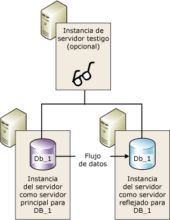
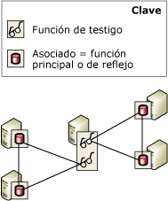

# Testigo de creación de reflejo de la base de datos
  Para admitir la conmutación automática por error, una sesión de creación de reflejo de la base de datos debe configurarse en modo de alta seguridad y tener una tercera instancia del servidor, denominada *testigo*. El testigo es una instancia opcional de [!INCLUDE[ssNoVersion](../../includes/ssnoversion-md.md)] que habilita al servidor reflejado en una sesión en modo de alta seguridad para que reconozca si se debe iniciar una conmutación automática por error. A diferencia de los dos asociados, el testigo no sirve a la base de datos. El único rol del testigo es hacer posible la conmutación automática por error.  
  
> [!NOTE]  
>  En el modo de alto rendimiento, el testigo puede afectar negativamente a la disponibilidad. Si se configura un testigo para una sesión de creación de reflejo de la base de datos, el servidor principal debe conectarse al menos a otra de las instancias de servidor, el servidor reflejado o el testigo, o bien a ambos. De lo contrario, la base de datos no estará disponible y no se podrá forzar el servicio (con posible pérdida de datos). Por lo tanto, para el modo de alto rendimiento, se recomienda mantener el testigo establecido siempre en OFF. Para obtener información sobre las repercusiones de un testigo en el modo de alto rendimiento, vea [Modos de funcionamiento de la creación de reflejo de la base de datos](../../database-engine/database-mirroring/database-mirroring-operating-modes.md).  
  
 En la siguiente ilustración se muestra una sesión en modo de alta seguridad que incluye un testigo.  
  
   
  
 **En este tema:**  
  
-   [Usar un testigo en varias sesiones](#InMultipleSessions)  
  
-   [Recomendaciones de software y hardware](#SwHwRecommendations)  
  
-   [Rol del testigo en la conmutación automática por error](#InAutoFo)  
  
-   [Para agregar o quitar un testigo](#AddRemoveWitness)  
  
##   Usar un testigo en varias sesiones  
 Una instancia de servidor específica puede actuar como testigo en sesiones de creación de reflejo de la base de datos simultáneas, cada una de ellas para una base de datos distinta. Sesiones diferentes pueden tener asociados diferentes. En la siguiente ilustración se muestra una instancia de servidor que actúa como testigo de dos sesiones de creación de reflejo de la base de datos con asociados diferentes.  
  
   
  
 Una sola instancia de servidor también puede funcionar simultáneamente como testigo en unas sesiones y como asociado en otras. Sin embargo, en la práctica, las instancias de servidor suelen funcionar o como testigo o como asociado. Esto se debe a que los asociados requieren equipos complejos que tienen hardware suficiente para admitir una base de datos de producción, mientras que los testigos se pueden ejecutar en cualquier sistema de Windows disponible que admita [!INCLUDE[ssCurrent](../../includes/sscurrent-md.md)].  
  
##   Recomendaciones de software y hardware  
 Es muy recomendable que el testigo se encuentre en un equipo diferente de los asociados. Los asociados de creación de reflejo de la base de datos solo se admiten en la edición [!INCLUDE[ssNoVersion](../../includes/ssnoversion-md.md)] Standard y [!INCLUDE[ssNoVersion](../../includes/ssnoversion-md.md)] Enterprise. Por el contrario, [!INCLUDE[ssNoVersion](../../includes/ssnoversion-md.md)] Workgroup y [!INCLUDE[ssNoVersion](../../includes/ssnoversion-md.md)] Express también admiten los testigos. Excepto durante una actualización de una versión anterior de [!INCLUDE[ssNoVersion](../../includes/ssnoversion-md.md)], todas las instancias de servidor de una sesión de creación de reflejo deben ejecutar la misma versión de [!INCLUDE[ssNoVersion](../../includes/ssnoversion-md.md)]. Por ejemplo, se admite un testigo de [!INCLUDE[ssKatmai](../../includes/sskatmai-md.md)] al actualizar desde una configuración de creación de reflejo de [!INCLUDE[ssKatmai](../../includes/sskatmai-md.md)] pero no se puede agregar a una configuración de creación de reflejo existente o nueva de [!INCLUDE[ssKilimanjaro](../../includes/sskilimanjaro-md.md)] o posterior.  
  
 Un testigo puede ejecutarse en cualquier sistema informático confiable que admita cualquiera de estas ediciones de [!INCLUDE[ssNoVersion](../../includes/ssnoversion-md.md)]. No obstante, se recomienda que cualquier instancia del servidor que se utilice como testigo cumpla con los requisitos mínimos de configuración necesarios para la versión Standard de la versión de [!INCLUDE[ssNoVersion](../../includes/ssnoversion-md.md)] que esté usando. Para obtener más información sobre estos requisitos, vea [Requisitos de hardware y software para instalar SQL Server 2016](../../sql-server/install/hardware-and-software-requirements-for-installing-sql-server.md).  
  
##   Rol del testigo en la conmutación automática por error  
 Durante la sesión de creación de reflejo de una base de datos, todas las instancias de servidor supervisan su estado de conexión. Si los asociados quedan desconectados entre sí, dependen del testigo para garantizar que únicamente uno de ellos sirve actualmente a la base de datos. Si un servidor reflejado sincronizado pierde su conexión con el servidor principal pero permanece conectado al testigo, se pondrá en contacto con el testigo para determinar si este último ha perdido la conexión con el servidor principal.  
  
-   Si el servidor principal aún está conectado al testigo, no se produce la conmutación automática por error. Por el contrario, el servidor principal continúa sirviendo a la base de datos y, al mismo tiempo, acumula entradas del registro para enviarlas al servidor reflejado cuando los asociados vuelvan a conectarse.  
  
-   Si el testigo también está desconectado del servidor principal, el servidor reflejado sabrá que la base de datos principal no está disponible. En este caso, el servidor reflejado inicia de inmediato la conmutación automática por error.  
  
-   Si el servidor reflejado está desconectado del testigo y también del servidor principal, no se puede realizar la conmutación automática por error, independientemente del estado del servidor principal.  
  
 El requisito de que al menos dos de las instancias de servidor estén conectadas se denomina *quórum*. El quórum garantiza el servicio de la base de datos únicamente por parte de un asociado cada vez. Para obtener información sobre cómo funciona el cuórum y sus repercusiones en una sesión, vea [Cuórum: cómo un testigo afecta a la disponibilidad de la base de datos &#40;creación de reflejo de la base de datos&#41;](../../database-engine/database-mirroring/quorum-how-a-witness-affects-database-availability-database-mirroring.md).  
  
##   Para agregar o quitar un testigo  
 **Para agregar un testigo**  
  
-   [Agregar o reemplazar un testigo de creación de reflejo de la base de datos &#40;SQL Server Management Studio&#41;](../../database-engine/database-mirroring/add-or-replace-a-database-mirroring-witness-sql-server-management-studio.md)  
  
-   [Agregar un testigo de creación de reflejo de la base de datos mediante la autenticación de Windows &#40;Transact-SQL&#41;](../../database-engine/database-mirroring/add-a-database-mirroring-witness-using-windows-authentication-transact-sql.md)  
  
 **Para quitar el testigo**  
  
-   [Quitar el testigo de una sesión de creación de reflejo de la base de datos &#40;SQL Server&#41;](../../database-engine/database-mirroring/remove-the-witness-from-a-database-mirroring-session-sql-server.md)  
  
## Vea también  
 [Conmutación de roles durante una sesión de creación de reflejo de la base de datos &#40;SQL Server&#41;](../../database-engine/database-mirroring/role-switching-during-a-database-mirroring-session-sql-server.md)   
 [Modos de funcionamiento de la creación de reflejo de la base de datos](../../database-engine/database-mirroring/database-mirroring-operating-modes.md)   
 [Cuórum: cómo un testigo afecta a la disponibilidad de la base de datos &#40;creación de reflejo de la base de datos&#41;](../../database-engine/database-mirroring/quorum-how-a-witness-affects-database-availability-database-mirroring.md)   
 [Posibles errores durante la creación de reflejo de la base de datos](../../database-engine/database-mirroring/possible-failures-during-database-mirroring.md)   
 [Estados de creación de reflejo &#40;SQL Server&#41;](../../database-engine/database-mirroring/mirroring-states-sql-server.md)  
  
  
