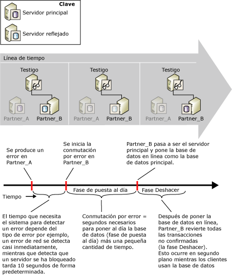

# Calcular la interrupción del servicio durante la conmutación de roles (creación de reflejo de la base de datos)
  Durante una conmutación de roles, la cantidad de tiempo que la creación de reflejo de la base de datos estará fuera de servicio depende del tipo y la causa de la conmutación de roles.  
  
-   En el caso de la conmutación automática por error, existen dos factores que influyen en el tiempo durante el cual estará interrumpido el servicio: el tiempo necesario para que el servidor reflejado reconozca que ha fallado la instancia del servidor principal (es decir, detección del error) y el tiempo necesario para realizar una conmutación por error de la base de datos (es decir, tiempo de conmutación por error).  
  
-   En una operación de servicio forzado, aunque se produzca un error, la detección y respuesta ante el error depende de la capacidad de respuesta humana. Sin embargo, la estimación de la interrupción potencial del servicio se limita a la estimación del tiempo que tarda el servidor reflejado en conmutar los roles una vez que se emite el comando de servicio forzado.  
  
    > [!NOTE]  
    >  Para reducir el tiempo necesario para detectar condiciones específicas, como algunos tipos de error, puede definir las alertas para estas condiciones.  
  
-   En el caso de la conmutación por error manual, el único factor es el tiempo necesario para realizar la conmutación por error de la base de datos una vez que se emite el comando de conmutación por error.  
  
## Detección de errores  
 El tiempo que necesita el sistema para detectar un error depende del tipo de error; por ejemplo, un error de red se detecta casi al instante, mientras que la detección de un servidor que no responde tarda 10 segundos de forma predeterminada, ya que ése es el tiempo de espera predeterminado.  
  
 Para obtener información sobre los errores que pueden causar un error durante una sesión de creación de reflejo de la base de datos y detección del tiempo de espera en modo de seguridad alta con conmutación automática por error, vea [Posibles errores durante la creación de reflejo de la base de datos](../../database-engine/database-mirroring/possible-failures-during-database-mirroring.md).  
  
## Tiempo de la conmutación por error  
 El tiempo de la conmutación por error consiste principalmente en el tiempo que el servidor reflejado anterior necesita para poner al día los registros pendientes en su cola rehecha más un breve tiempo adicional (para obtener más información sobre cómo procesa las entradas de registro el servidor reflejado, vea [Creación de reflejo de la base de datos &#40;SQL Server&#41;](../../database-engine/database-mirroring/database-mirroring-sql-server.md)). Para obtener información acerca de cómo calcular el tiempo de la conmutación por error, vea Calcular la tasa de puesta al día de la conmutación por error, más adelante en este tema.  
  
> [!IMPORTANT]  
>  Si la conmutación por error se produce durante una transacción en la que se crea un índice o tabla y después se cambia, es posible que tarde más de lo habitual.  Por ejemplo, si se realiza una conmutación por error durante la siguiente secuencia de operaciones, es posible que el tiempo de conmutación por error sea mayor: BEGIN TRANSACTION, CREATE INDEX en una tabla y SELECT INTO en la tabla. Existe la posibilidad de un mayor tiempo de conmutación por error durante una transacción de este tipo hasta su finalización con una instrucción COMMIT TRANSACTION o ROLLBACK TRANSACTION.  
  
### Cola rehecha  
 La confirmación de la base de datos conlleva aplicar las entradas de registro que se encuentren en la cola rehecha del servidor reflejado. La *cola rehecha* está formada por las entradas de registro que se han escrito en el disco del servidor reflejado, pero todavía no se han puesto al día en la base de datos reflejada.  
  
 El tiempo de la conmutación por error para la base de datos depende de la rapidez con la que el servidor reflejado pueda poner al día el registro en la cola rehecha, que, a su vez, se determina principalmente por el hardware del sistema y la carga de trabajo actual. Potencialmente, una base de datos principal puede estar tan ocupada que el servidor principal envía los registros al servidor reflejado mucho más rápidamente de lo que puede confirmarlos. En esta situación, la conmutación por error puede tardar mucho tiempo mientras el servidor reflejado pone al día el registro en la cola rehecha. Para conocer el tamaño actual de la cola rehecha, utilice el contador **Cola rehecha** en el objeto de rendimiento de creación de reflejo de la base de datos. Para más información, consulte [SQL Server, Database Mirroring Object](../../relational-databases/performance-monitor/sql-server-database-mirroring-object.md).  
  
### Calcular la tasa de puesta al día de la conmutación por error  
 Puede medir la cantidad de tiempo que se necesita para poner al día las entradas de registro ( *tasa de puesta al día*) utilizando una copia de prueba de la base de datos de producción.  
  
 El método para calcular el tiempo de confirmación durante la conmutación por error depende del número de subprocesos que el servidor reflejado utiliza durante la fase de puesta al día. El número de subprocesos depende de lo siguiente:  
  
-   En [!INCLUDE[ssStandard](../../includes/ssstandard-md.md)], el servidor reflejado siempre usa un único subproceso para la puesta al día de la base de datos.  
  
-   En [!INCLUDE[ssEnterprise](../../includes/ssenterprise-md.md)], los servidores reflejados en equipos con menos de cinco CPUs también utilizan un único subproceso. Con cinco CPU o más, un servidor reflejado distribuye las operaciones de puesta al día entre varios subprocesos durante una conmutación por error (esto se conoce como *puesta al día en paralelo*). La puesta al día en paralelo está optimizada para utilizar un subproceso por cada cuatro CPU.  
  
#### Calcular la tasa de puesta al día con un único subproceso  
 En la puesta al día con un único subproceso, la puesta al día de la base de datos reflejada durante la conmutación por error tarda aproximadamente lo mismo que la puesta al día de igual cantidad de registro por parte de la restauración de una copia de seguridad de registros. Para calcular el tiempo de la conmutación por error, cree una base de datos de prueba en el entorno en el que pretende ejecutar la creación de reflejo. Después, realice una copia de seguridad de registros de la base de datos de producción. Para medir la tasa de puesta al día para esa copia de seguridad de registros, controle cuánto tiempo tarda en restaurar la copia de seguridad de registros con WITH NORECOVERY en la base de datos de prueba.  
  
 Cuando conozca la tasa de puesta al día del servidor reflejado, podrá calcular el tiempo necesario para realizar la conmutación por error de la base de datos en un momento dado, dividiendo la cantidad de registro actual que se debe poner al día en el servidor reflejado (según la medición efectuada por el contador de rendimiento **Cola rehecha** ) entre la tasa de puesta al día. En condiciones normales, si el servidor reflejado puede hacer frente a la carga del servidor principal, el valor de **Cola rehecha** es pequeño o cercano a cero, y la conmutación por error solo tarda unos segundos.  
  
#### Calcular la tasa de puesta al día en paralelo  
 En [!INCLUDE[ssEnterprise](../../includes/ssenterprise-md.md)], la puesta al día en paralelo está optimizada para usar un subproceso por cada cuatro CPU. Para calcular el tiempo de la puesta al día en paralelo, es más preciso obtener acceso a un sistema de prueba en ejecución que a una base de datos de prueba. Durante la supervisión de la cola rehecha en el servidor reflejado, aumente la carga en el servidor principal. Durante el funcionamiento normal, el valor de la cola rehecha es casi cero. Aumente la carga en el servidor principal hasta que el valor de la Cola rehecha comience a aumentar de forma continua; el sistema estará en su valor máximo de tasa de puesta al día y el contador de rendimiento **Bytes rehechos/s** en ese momento representa la tasa máxima de puesta al día. Para más información, consulte [SQL Server, Database Mirroring Object](../../relational-databases/performance-monitor/sql-server-database-mirroring-object.md).  
  
## Calcular la interrupción del servicio durante una conmutación automática por error  
 En la siguiente ilustración se muestra cómo la detección de errores y el tiempo de la conmutación por error influyen en el tiempo completo necesario para que una conmutación automática por error finalice en **Partner_B**. La conmutación por error necesita tiempo para confirmar la base de datos (fase de puesta al día) más una pequeña cantidad de tiempo para poner la base de datos en línea. La fase de deshacer, que consiste en revertir las transacciones no confirmadas, tiene lugar después de poner en línea la nueva base de datos principal y continúa después de la conmutación por error. Durante esta fase, la base de datos está disponible.  
  
   
  
## Vea también  
 [Modos de funcionamiento de la creación de reflejo de la base de datos](../../database-engine/database-mirroring/database-mirroring-operating-modes.md)   
 [Conmutación de roles durante una sesión de creación de reflejo de la base de datos &#40;SQL Server&#41;](../../database-engine/database-mirroring/role-switching-during-a-database-mirroring-session-sql-server.md)   
 [Supervisar la creación de reflejo de la base de datos &#40;SQL Server&#41;](../../database-engine/database-mirroring/monitoring-database-mirroring-sql-server.md)  
  
  
