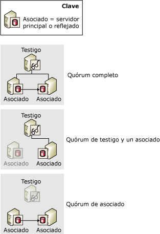
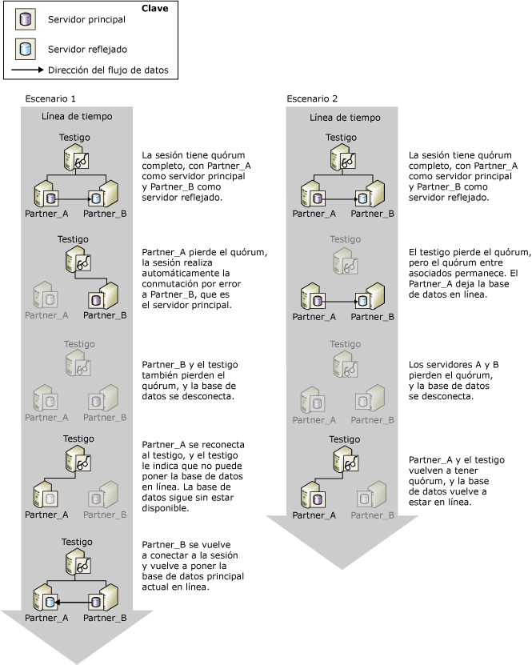

# Quórum: cómo un testigo afecta a la disponibilidad de la base de datos (reflejo de base de datos)
[!INCLUDE[appliesto-ss-xxxx-xxxx-xxx-md](../../includes/appliesto-ss-xxxx-xxxx-xxx-md.md)] Siempre que se establece un testigo para una sesión de creación de reflejo de la base de datos, es necesario disponer de *cuórum*. Quórum es una relación que existe cuando dos o más instancias de servidor en una sesión de creación de reflejo de la base de datos están conectadas entre sí. Normalmente, el quórum implica a tres instancias de servidor interconectadas. Cuando se establece un testigo, se requiere quórum para que la base de datos esté disponible. El quórum se ha diseñado para sesiones en modo de alta seguridad con conmutación automática por error y garantiza que una base de datos pertenezca a un solo asociado cada vez.  
  
 Si una instancia concreta de servidor se desconecta de una sesión de creación de reflejo, esa instancia pierde el quórum. Si no hay instancias de servidor conectadas, la sesión pierde el quórum y la base de datos no está disponible. Hay tres tipos de quórum posibles:  
  
-   Un *quórum completo* incluye tanto a asociados como al testigo.  
  
-   Un *cuórum entre testigo y asociado* consta del testigo y uno de los asociados.  
  
-   Un *cuórum entre asociados* consta de los dos asociados.  
  
 En la siguiente ilustración se muestran estos tipos de quórum.  
  
   
  
 Mientras el servidor principal actual tenga quórum, este servidor posee el rol de servidor principal y continúa dando servicio a la base de datos, salvo que el propietario de la base de datos realice una conmutación por error manual. Si el servidor principal pierde el quórum, deja de ofrecer la base de datos. La conmutación automática por error puede ocurrir solamente si la base de datos principal pierde el quórum, lo que garantiza que ya no da servicio a la base de datos.  
  
 Una instancia de servidor desconectada guarda su rol más reciente en la sesión. Normalmente, las instancias de servidor desconectadas se vuelven a conectar a la sesión cuando se reinician y vuelven a obtener el quórum.  
  
> [!IMPORTANT]  
>  Solo debe configurar el testigo cuando vaya a utilizar el modo de alta seguridad con conmutación automática por error. En el modo de alto rendimiento, en el que nunca se requiere un testigo, es recomendable establecer la propiedad WITNESS en OFF. Para información sobre las repercusiones de un testigo en el modo de alto rendimiento, vea [Modos de funcionamiento de la creación de reflejo de la base de datos](../../database-engine/database-mirroring/database-mirroring-operating-modes.md).  
  
## Quórum en sesiones en modo de alta seguridad  
 En el modo de alta seguridad, el quórum permite la conmutación automática por error proporcionando un contexto en el que las instancias de servidor con quórum arbitran qué asociado posee el rol de servidor principal. El servidor principal proporciona servicio a la base de datos si tiene el quórum. Si el servidor principal pierde el quórum cuando el servidor reflejado sincronizado y el testigo lo mantienen, se produce la conmutación automática por error.  
  
 Los escenarios de quórum para el modo de alta seguridad son los siguientes:  
  
-   *Quórum completo* , que está formado por ambos asociados y el testigo.  
  
     Normalmente, las tres instancias de servidor participan en un cuórum tripartito llamado *cuórum completo*. En un quórum completo, los servidores principal y reflejado continúan realizando sus respectivos roles (salvo que se produzca la conmutación por error manual).  
  
-   Un *cuórum entre testigo y asociado* que consta del testigo y uno de los asociados.  
  
     Si la conexión de red entre los asociados se pierde debido a la pérdida de uno de los asociados, pueden darse los casos siguientes:  
  
    -   El servidor reflejado se pierde y el servidor principal y el testigo conservan el quórum.  
  
         En este caso, el principal establece su base de datos en desconectada (DISCONNECTED) y se ejecuta con reflejo en el estado suspendido (SUSPENDED). Esto se denomina *ejecución expuesta*, ya que la base de datos no se está reflejando en ese momento. Cuando el servidor reflejado se reincorpora a la sesión, vuelve a tener quórum como servidor reflejado y comienza una nueva sincronización de su copia de la base de datos.  
  
    -   El servidor principal se pierde y el testigo y el servidor reflejado conservan el quórum.  
  
         En este caso, se produce la conmutación automática por error. Para más información, consulte [Database Mirroring Operating Modes](../../database-engine/database-mirroring/database-mirroring-operating-modes.md).  
  
    -   Todas las instancias de servidor pierden quórum, pero posteriormente el servidor reflejado y el testigo se vuelven a conectar. La base de datos no se servirá en este caso.  
  
     La conexión de red entre los asociados de conmutación por error raramente se pierde mientras ambos asociados permanezcan conectados al testigo. En este evento, existen dos quórum independientes entre testigo y asociado, con el testigo como enlace. El testigo informa al servidor reflejado de que el servidor principal se encuentra aún conectado. En consecuencia, no se produce la conmutación automática por error. En su lugar, el servidor reflejado mantiene el rol reflejado y espera para volver a conectarse al servidor principal. Si la cola de puesta al día contiene entradas de registro en este punto, el servidor reflejado continúa poniendo al día la base de datos reflejada. Al volver a conectarse, el servidor reflejado sincronizará de nuevo la base de datos reflejada.  
  
-   Un *cuórum entre asociados* que consta de los dos asociados.  
  
     Mientras los asociados conserven el quórum, la base de datos continúa en el estado sincronizado (SYNCHRONIZED) y sigue siendo posible la conmutación por error manual. Sin el testigo, no puede tener lugar la conmutación automática por error, pero, cuando el testigo vuelve a obtener el quórum, la sesión continúa su funcionamiento normal y se vuelve a admitir la conmutación automática por error.  
  
-   La sesión pierde el quórum.  
  
     Si todas las instancias de servidor se desconectan, se dice que la sesión ha *perdido el quórum*. Al volverse a conectarse entre sí las instancias de servidor, vuelven a obtener el quórum unas con otras.  
  
    -   Si el servidor principal se vuelva a conectar a cualquiera de las otras dos instancias de servidor, la base de datos pasa a estar disponible.  
  
    -   Si el servidor principal sigue desconectado, pero el servidor reflejado y el testigo se vuelven a conectar entre sí, no puede tener lugar la conmutación automática por error, ya que podría producirse una perdida de datos. Por ello, la base de datos sigue sin estar disponible hasta que el servidor principal vuelva a unirse a la sesión.  
  
    -   Una vez que se han vuelto a conectar las tres instancias de servidor, se vuelve a obtener el quórum completo y la sesión reanuda su funcionamiento normal.  
  
> [!IMPORTANT]  
>  Cuando una sesión tiene un quórum entre asociados, si uno de ellos pierde el quórum, la sesión lo pierde. No obstante, si cree que el testigo va a permanecer desconectado durante bastante tiempo, se recomienda eliminar temporalmente el testigo de la sesión. La eliminación del testigo elimina el requisito del quórum. Así, si el servidor reflejado se desconecta, el servidor principal puede continuar sirviendo a la base de datos. Para obtener información sobre cómo agregar o quitar un testigo, vea [Database Mirroring Witness](../../database-engine/database-mirroring/database-mirroring-witness.md).  
  
### Cómo afecta el quórum a la disponibilidad de la base de datos  
 En la siguiente ilustración se muestra cómo cooperan el testigo y los asociados para asegurarse de que, en un momento dado, un solo asociado es el propietario del rol de servidor principal y solo el servidor principal actual puede poner en línea su base de datos. Ambos escenarios empiezan con un cuórum completo, **Partner_A** en el rol principal y **Partner_B** en el rol reflejado.  
  
   
  
 En el escenario 1 se muestra cómo, después de un error del servidor principal original (**Partner_A**), el servidor reflejado y el testigo se ponen de acuerdo en que el principal, **Partner_A**, ya no está disponible y forman un cuórum. Tras ello, el servidor reflejado, **Partner_B** , asume el rol principal. Se da la conmutación automática por error y **Partner_B**pone en línea su copia de la base de datos. Después, **Partner_B** se bloquea y la base de datos se queda sin conexión. Más adelante, el antiguo servidor principal, **Partner_A**, se vuelve a conectar al testigo recuperando el cuórum, pero al comunicarse con el testigo, **Partner_A** detecta que no puede poner en línea su copia de la base de datos, ya que ahora **Partner_B** posee el rol principal. Cuando **Partner_B** se vuelve a unir a la sesión, vuelve a poner en línea la base de datos.  
  
 En el escenario 2, el testigo pierde el cuórum, mientras que los asociados, **Partner_A** y **Partner_B**, conservan el cuórum entre sí y la base de datos permanece en línea. A continuación, los asociados pierden también su quórum y la base de datos se queda sin conexión. Más adelante, el servidor principal, **Partner_A**, se vuelve a conectar al testigo y recupera el cuórum. El testigo confirma que **Partner_A** sigue siendo el propietario del rol principal y **Partner_A** vuelve a poner la base de datos en línea.  
  
## Ver también  
 [Modos de funcionamiento de la creación de reflejo de la base de datos](../../database-engine/database-mirroring/database-mirroring-operating-modes.md)   
 [Conmutación de roles durante una sesión de creación de reflejo de la base de datos &#40;SQL Server&#41;](../../database-engine/database-mirroring/role-switching-during-a-database-mirroring-session-sql-server.md)   
 [Testigo de creación de reflejo de la base de datos](../../database-engine/database-mirroring/database-mirroring-witness.md)   
 [Posibles errores durante la creación de reflejo de la base de datos](../../database-engine/database-mirroring/possible-failures-during-database-mirroring.md)   
 [Estados de creación de reflejo &#40;SQL Server&#41;](../../database-engine/database-mirroring/mirroring-states-sql-server.md)  
  
  
