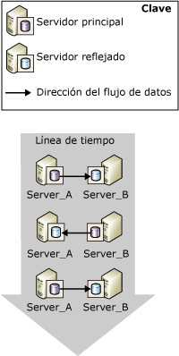
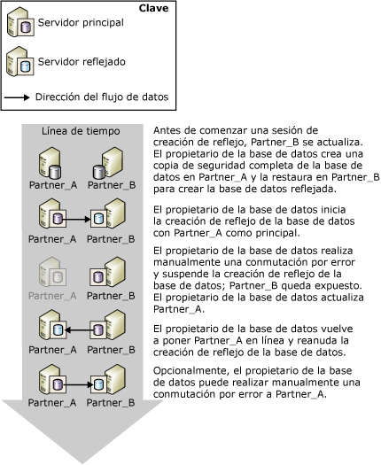
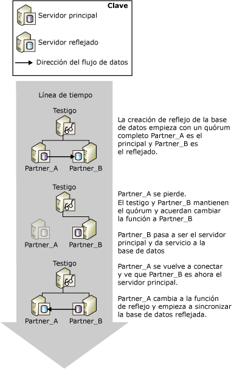
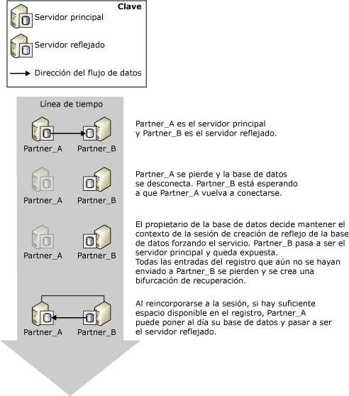

# Conmutación de roles durante una sesión de creación de reflejo de la base de datos (SQL Server)
 [!INCLUDE [SQL Server](../../includes/applies-to-version/sqlserver.md)]
  En el contexto de una sesión de creación de reflejo de la base de datos, los roles principal y reflejado suelen ser intercambiables en un proceso conocido como *conmutación de roles*. En la conmutación de roles, el servidor reflejado actúa como el *asociado de conmutación por error* para el servidor principal al asumir el rol principal, y al recuperar su copia de la base de datos y ponerla en línea como la nueva base de datos principal. El servidor principal anterior, cuando esté disponible, asumirá el rol reflejado y su base de datos se convertirá en la nueva base de datos reflejada. Potencialmente, los roles pueden conmutarse como respuesta a varios errores o con fines administrativos.  
  
> [!NOTE]  
>  En este tema se supone que está familiarizado con los modos operativos de creación de reflejo de la base de datos. Para más información, consulte [Database Mirroring Operating Modes](../../database-engine/database-mirroring/database-mirroring-operating-modes.md).  
  
 En la siguiente ilustración se muestran los asociados de creación de reflejo **Partner_A** y **Partner_B**en el proceso de conmutación de los roles principal y reflejo durante una serie de conmutaciones por error automáticas o manuales.  
  
   
  
> [!IMPORTANT]  
>  Tras una conmutación de roles, los trabajos que se ejecutaron en la anterior base de datos principal se deben recrear en el nuevo servidor principal para que se ejecuten allí. Para obtener más información, vea [Administración de inicios de sesión y trabajos tras la conmutación de roles &#40;SQL Server&#41;](../../sql-server/failover-clusters/management-of-logins-and-jobs-after-role-switching-sql-server.md).  
  
 Existen tres tipos de conmutación de roles: conmutación automática por error, conmutación por error manual y servicio forzado (con posible pérdida de datos). La compatibilidad con cada forma depende del modo operativo de la sesión.  
  
> [!NOTE]  
>  Si no está familiarizado con estos modos operativos, vea [Modos de funcionamiento de la creación de reflejo de la base de datos](../../database-engine/database-mirroring/database-mirroring-operating-modes.md).  
  
-   **Conmutación por error manual**  
  
     El modo de alta seguridad admite la conmutación por error manual. Al sincronizar la base de datos, su propietario puede iniciar una conmutación por error manual.  
  
     La conmutación por error manual se proporciona con fines administrativos. Para obtener más información, vea [Conmutación por error manual](#ManualFailover), más adelante en este tema.  
  
-   **Conmutación por error automática**  
  
     En presencia de un testigo, el modo de alta seguridad admite la conmutación automática por error. La conmutación automática por error solo se produce con la pérdida del servidor principal cuando el testigo y el servidor reflejado siguen conectados entre sí y la base de datos ya está sincronizada. Para obtener más información, vea [Conmutación automática por error](#AutomaticFailover), más adelante en este tema.  
  
-   **Servicio forzado (con posible pérdida de datos)**  
  
     Se permite forzar el servicio en modo de alta seguridad si no hay ningún testigo definido y en modo de alto rendimiento. Al perderse el servidor principal, el propietario de la base de datos puede hacer que ésta esté disponible forzando el servicio en el servidor reflejado (con posible pérdida de datos).  
  
    > [!NOTE]  
    >  Se recomienda establecer la propiedad WITNESS en OFF en modo de alto rendimiento. De lo contrario, para poner la base de datos en línea, el servidor reflejado debe estar conectado al testigo.  
  
     Para obtener más información, vea [Servicio forzado (con posible pérdida de datos)](#ForcedService), más adelante en este tema.  
  
 En la siguiente tabla se resumen las formas de conmutación por error admitidas en cada uno de los modos operativos.  
  
|Forma de conmutación por error|Alto rendimiento|Modo de alta seguridad sin ningún testigo|Modo de alta seguridad con un testigo|  
|-|----------------------|-----------------------------------------|--------------------------------------|  
|Conmutación por error automática|No|Sin|Sí|  
|Conmutación por error manual|No|Sí|Sí|  
|Servicio forzado|Sí|Sí|No|  
  
 Tras una conmutación de roles, deben existir ciertos metadatos en ambos asociados para garantizar que todos los usuarios de bases de datos puedan tener acceso a la nueva base de datos principal. Además, se deben crear los trabajos de copia de seguridad en el nuevo servidor principal para garantizar que se siga realizando una copia de seguridad de la base de datos de acuerdo con su programación periódica. Para obtener más información, vea [Administración de inicios de sesión y trabajos tras la conmutación de roles &#40;SQL Server&#41;](../../sql-server/failover-clusters/management-of-logins-and-jobs-after-role-switching-sql-server.md).  
  
 Durante una conmutación de roles, la cantidad de tiempo que la creación de reflejo de la base de datos estará sin servicio depende del tipo de conmutación de roles y de la causa. Para obtener más información, vea [Calcular la interrupción del servicio durante la conmutación de roles &#40;creación de reflejo de la base de datos&#41;](../../database-engine/database-mirroring/estimate-the-interruption-of-service-during-role-switching-database-mirroring.md).  
  
##   Manual Failover  
 La conmutación por error manual desconecta los clientes de la base de datos e invierte los roles de los asociados. El modo de alta seguridad es el único que admite la conmutación por error manual.  
  
 **En esta sección:**  
  
-   [Mantener la disponibilidad durante las actualizaciones](#AvailabilityDuringUpgrades)  
  
-   [Condiciones requeridas para una conmutación por error manual](#ConditionsForManualFo)  
  
-   [Cómo funciona la conmutación por error manual](#HowManualFoWorks)  
  
###   Mantener la disponibilidad durante las actualizaciones  
 El administrador de la base de datos puede utilizar la conmutación por error manual para actualizar hardware o software sin sacrificar la disponibilidad. Para utilizar la creación de reflejo de la base de datos para las actualizaciones de software, el servidor reflejado y/o el sistema deben haber recibido ya las actualizaciones.  
  
> [!NOTE]  
>  La creación de reflejo de la base de datos podrá realizar una actualización gradual, pero no está garantizado, ya que no se conocen los cambios futuros. Para más información, consulte [Upgrading Mirrored Instances](../../database-engine/database-mirroring/upgrading-mirrored-instances.md).  
  
 En la ilustración siguiente se muestra un ejemplo del uso de la conmutación por error manual para mantener la disponibilidad de la base de datos mientras se actualiza una instancia de servidor de bases de datos. Cuando se ha completado la actualización, un administrador puede realizar la conmutación por error para volver a la instancia de servidor original. Esto resulta útil cuando el administrador desea detener la sesión de creación de reflejos y utilizar el servidor reflejado en cualquier otro lugar. De este modo, se puede utilizar repetidamente una única instancia de servidor al actualizar una serie de instancias de servidor de bases de datos.  
  
   
  
###   Condiciones requeridas para una conmutación por error manual  
 La conmutación por error manual exige establecer la seguridad de la transacción en FULL (es decir, modo de alta seguridad). Cuando los asociados están conectados y la base de datos ya está sincronizada, se admite la conmutación por error manual.  
  
###   Cómo funciona la conmutación por error manual  
 La conmutación por error manual inicia la siguiente secuencia de acciones:  
  
1.  El servidor principal desconecta los clientes de la base de datos principal, envía el final del registro al servidor reflejado y, como preparación para cambiar al rol reflejado, establece el estado de creación de reflejo en SYNCHRONIZING.  
  
2.  El servidor reflejado registra el número de flujo de registro (LSN) de la última entrada de registro recibida desde el servidor principal como el LSN de la conmutación por error manual.  
  
    > [!NOTE]  
    >  Para ver este LSN, seleccione la columna **mirroring_failover_lsn** en [sys.database_mirroring &#40;Transact-SQL&#41;](../../relational-databases/system-catalog-views/sys-database-mirroring-transact-sql.md).  
  
3.  Si hay algún registro esperando en la cola de puesta al día, el servidor reflejado deja de poner al día la base de datos reflejada. La cantidad de tiempo que se necesita para ello depende de la velocidad del sistema, la carga de trabajo reciente y la cantidad de registro en la cola rehecha. Para un modo de funcionamiento sincrónico, el tiempo de conmutación por error se puede regular limitando el tamaño de la cola rehecha. Sin embargo, esto puede hacer que el servidor principal se ralentice para permitir que el servidor reflejado no se retrase.  
  
    > [!NOTE]  
    >  Para conocer el tamaño actual de la cola rehecha, use el contador de rendimiento **Cola rehecha** en el objeto de rendimiento de creación de reflejo de la base de datos (para obtener más información, vea [Supervisar la creación de reflejo de la base de datos &#40;SQL Server&#41;](../../database-engine/database-mirroring/monitoring-database-mirroring-sql-server.md)).  
  
4.  El servidor reflejado pasa a ser el nuevo servidor principal, y el que antes era el servidor principal se convierte en el nuevo servidor reflejado.  
  
5.  El nuevo servidor principal revierte todas las transacciones no confirmadas y pone en línea su copia de la base de datos como la base de datos principal.  
  
6.  El servidor principal anterior asume el rol reflejado, y la anterior base de datos principal se convierte en la base de datos reflejada. El nuevo servidor reflejado vuelve a sincronizar rápidamente la nueva base de datos reflejada con la nueva base de datos principal.  
  
    > [!NOTE]  
    >  Tan pronto como el nuevo servidor reflejado haya resincronizado las bases de datos, la conmutación por error vuelve a ser posible, pero en la dirección inversa.  
  
 Tras la conmutación por error, los clientes deben volver a conectarse a la base de datos principal actual. Para más información, consulte [Conectar clientes a una sesión de creación de reflejo de la base de datos &#40;SQL Server&#41;](../../database-engine/database-mirroring/connect-clients-to-a-database-mirroring-session-sql-server.md).  
  
 **Para iniciar la conmutación por error manual**  
  
-   [Realizar manualmente la conmutación por error de una sesión de creación de reflejo de la base de datos &#40;SQL Server Management Studio&#41;](../../database-engine/database-mirroring/manually-fail-over-a-database-mirroring-session-sql-server-management-studio.md)  
  
-   [Realizar una conmutación por error manualmente de una sesión de creación de reflejo de la base de datos &#40;Transact-SQL&#41;](../../database-engine/database-mirroring/manually-fail-over-a-database-mirroring-session-transact-sql.md).  
  
##   Automatic Failover  
 La conmutación automática por error solo se admite en sesiones de creación de reflejo de la base de datos que se ejecutan con un testigo en modo de alta seguridad (*modo de alta seguridad con conmutación automática por error*). En modo de alta seguridad con conmutación automática por error, una vez que se ha sincronizado la base de datos, si la base de datos principal deja de estar disponible, se produce la conmutación automática por error. La conmutación automática por error hace que el servidor reflejado asuma el rol de servidor principal y ponga en línea su copia de la base de datos como base de datos principal. El hecho de que se requiera la sincronización de la base de datos evita que se pierdan datos durante la conmutación por error, dado que cada transacción confirmada en la base de datos principal también se confirma en la base de datos reflejada.  
  
> [!IMPORTANT]  
>  Para que la conmutación automática por error mejore la confiabilidad, las bases de datos reflejada y principal deben residir en equipos diferentes.  
  
 **En esta sección:**  
  
-   [Condiciones requeridas para una conmutación automática por error](#ConditionsForAutoFo)  
  
-   [Cómo funciona la conmutación automática por error](#HowAutoFoWorks)  
  
-   [Para deshabilitar la conmutación automática por error (SQL Server Management Studio)](#DisableAutoSSMS)  
  
-   [Para deshabilitar la conmutación automática por error (mediante Transact-SQL)](#DisableAutoTsql)  
  
###   Condiciones requeridas para una conmutación automática por error  
 La conmutación automática por error requiere las condiciones siguientes:  
  
-   La sesión de creación de reflejo de la base de datos debe ejecutarse en modo de alta seguridad y debe poseer un testigo. Para más información, consulte [Database Mirroring Operating Modes](../../database-engine/database-mirroring/database-mirroring-operating-modes.md).  
  
-   La base de datos reflejada ya debe estar sincronizada. Esto garantiza que toda la parte del registro que se haya enviado al servidor reflejado se haya escrito en el disco.  
  
-   El servidor principal ha perdido la comunicación con el resto de la configuración del reflejo de la base de datos, mientras que el servidor reflejado y el testigo conservan el quórum. Sin embargo, si todas las instancias de servidor pierden la comunicación, y el testigo y el servidor reflejado la recuperan después, no se produce la conmutación automática por error.  
  
    > [!NOTE]  
    >  Para más información, vea [Cuórum: cómo un testigo afecta a la disponibilidad de la base de datos &#40;creación de reflejo de la base de datos&#41;](../../database-engine/database-mirroring/quorum-how-a-witness-affects-database-availability-database-mirroring.md).  
  
-   El servidor reflejado ha detectado la pérdida del servidor principal.  
  
     El modo en que el servidor reflejado detecta un error en el servidor principal depende de si éste es un error de software o de hardware. Para más información, consulte [Possible Failures During Database Mirroring](../../database-engine/database-mirroring/possible-failures-during-database-mirroring.md).  
  
###   Cómo funciona la conmutación automática por error  
 Si se cumplen las condiciones anteriores, la conmutación automática por error inicia la siguiente secuencia de acciones:  
  
1.  Si el servidor principal sigue en funcionamiento, cambiará el estado de la base de datos principal a DISCONNECTED y desconectará a todos los clientes de la base de datos principal.  
  
2.  Los servidores testigo y reflejado registran que el servidor principal no está disponible.  
  
3.  Si hay algún registro esperando en la cola de puesta al día, el servidor reflejado deja de poner al día la base de datos reflejada.  
  
    > [!NOTE]  
    >  La cantidad de tiempo que requiere la aplicación del registro depende de la velocidad del sistema, la carga de trabajo reciente y la cantidad de registro en la cola de puesta al día.  
  
4.  La base de datos reflejada anterior pasa a estar en línea como la nueva base de datos principal, y la recuperación limpia todas las transacciones no confirmadas revirtiéndolas lo más rápido posible. Los bloqueos aíslan esas transacciones.  
  
5.  Cuando el servidor principal anterior se reincorpora a la sesión, reconoce que su asociado de conmutación por error ahora tiene el rol principal. El servidor principal anterior asume el rol reflejado, con lo que su base de datos pasa a ser la base de datos reflejada. El nuevo servidor reflejado sincroniza la nueva base de datos reflejada con la base de datos principal lo más rápido posible. Tan pronto como el nuevo servidor reflejado haya resincronizado las bases de datos, la conmutación por error vuelve a ser posible, pero en la dirección inversa.  
  
 En la siguiente ilustración se muestra una sola instancia de conmutación automática por error.  
  
   
  
 Inicialmente, los tres servidores están conectados (es decir, la sesión tiene un quórum completo). **Partner_A** es el servidor principal y **Partner_B** , el servidor reflejado. **Partner_A** (o la base de datos principal en **Partner_A**) pasa a no estar disponible. El testigo y **Partner_B** reconocen que el servidor principal ya no está disponible y la sesión conserva el cuórum. **Partner_B** se convierte en el servidor principal y hace que su copia de la base de datos esté disponible como la nueva base de datos principal. Finalmente, **Partner_A** se vuelve a conectar a la sesión y descubre que **Partner_B** posee ahora el rol principal. Por tanto,**Partner_A** asume el rol reflejado.  
  
 Tras la conmutación por error, los clientes deben volver a conectarse a la base de datos principal actual. Para más información, consulte [Conectar clientes a una sesión de creación de reflejo de la base de datos &#40;SQL Server&#41;](../../database-engine/database-mirroring/connect-clients-to-a-database-mirroring-session-sql-server.md).  
  
> [!NOTE]  
>  Las transacciones que se han preparado mediante el Coordinador de transacciones distribuidas de [!INCLUDE[msCoName](../../includes/msconame-md.md)] , pero que aún no están confirmadas en el momento de la conmutación por error, se consideran anuladas tras la conmutación por error de la base de datos.  
  
###   Para deshabilitar la conmutación automática por error (SQL Server Management Studio)  
 Abra la página **Creación de reflejo** de Propiedades de la base de datos y cambie el modo de funcionamiento seleccionando una de las opciones siguientes:  
  
-   **Seguridad alta sin conmutación automática por error (sincrónico)**  
  
     En este modo, la base de datos sigue estando sincronizada y la conmutación manual por error sigue siendo posible.  
  
-   **Rendimiento alto (asincrónico)**  
  
     En este modo, la base de datos reflejada podría ir un poco retrasada con respecto a la base de datos principal y la conmutación manual por error no es posible.  
  
###   Para deshabilitar la conmutación automática por error (mediante Transact-SQL)  
 En cualquier punto de una sesión de creación de reflejo de la base de datos, el propietario de la base de datos puede deshabilitar la conmutación automática por error desactivando el testigo.  
  
 **Para desactivar el testigo**  
  
-   [Quitar el testigo de una sesión de creación de reflejo de la base de datos &#40;SQL Server&#41;](../../database-engine/database-mirroring/remove-the-witness-from-a-database-mirroring-session-sql-server.md)  
  
    > [!NOTE]  
    >  Desactivar el testigo mientras se mantiene la seguridad de las transacciones completa pone la sesión en modo de alta seguridad sin conmutación automática por error.  
  
##   Forced Service (with Possible Data Loss)  
 La creación de reflejo de base de datos permite forzar el servicio (con posible pérdida de datos) como método de recuperación de desastres para permitir el uso de un servidor reflejado como servidor en espera activa. Solo se puede forzar el servicio si el servidor principal se desconecta del servidor reflejado en una sesión de creación de reflejo. Puesto que forzar el servicio puede suponer una posible pérdida de datos, se debe hacer con precaución y moderación.  
  
 La compatibilidad con el servicio forzado depende del modo de funcionamiento y del estado de la sesión, según se indica a continuación:  
  
-   Generalmente, el modo de alto rendimiento permite forzar el servicio siempre que el servidor principal esté desconectado. Sin embargo, aunque es innecesario, puede existir un testigo para una sesión en modo de alto rendimiento. En este caso, forzar el servicio requiere que el servidor reflejado y el testigo estén conectados entre sí.  
  
-   El modo de alta seguridad sin conmutación automática por error permite forzar el servicio siempre que el servidor principal esté desconectado.  
  
-   El modo de alta seguridad con conmutación automática por error permite forzar el servicio siempre que el servidor reflejado y el testigo estén conectados entre sí y ninguno de ellos esté conectado al servidor principal (siempre que el servidor reflejado no estuviera en el proceso para revertir la base de datos reflejada cuando se conectó por última vez al principal).  
  
 Se recomienza que el servicio solo se fuerce si es necesario restaurarlo en la base de datos inmediatamente y es aceptable el riesgo de perder algunos datos. El efecto de forzar el servicio es similar a quitar la creación de reflejo, excepto en que al forzar el servicio se facilita volver a sincronizar las bases de datos cuando se reanuda la creación de reflejo, con el riesgo de la posible pérdida de datos. Al forzar el servicio se inicia una transición sin problemas del rol principal a la base de datos reflejada. El servidor reflejado asume el rol de servidor principal y ofrece su copia de la base de datos a los clientes inmediatamente. La nueva base de datos principal se ejecuta sin reflejar (es decir, se ejecuta expuesta).  
  
> [!IMPORTANT]  
>  Si el servidor principal simplemente se desconecta de la sesión de creación de reflejo de la base de datos y sigue ejecutándose, algunos clientes podrían continuar teniendo acceso a la base de datos principal original. Antes de forzar el servicio, es importante impedir que los clientes tengan acceso al servidor principal original. De lo contrario, una vez forzado el servicio, la base de datos principal original y la base de datos principal actual podrían actualizarse independientemente.  
  
 **En esta sección:**  
  
-   [Caso típico de servicio forzado](#TypicalCaseFS)  
  
-   [Riesgos de forzar el servicio](#FSrisks)  
  
-   [Administrar la potencial pérdida de datos](#ManageDataLoss)  
  
-   [Tareas relacionadas para administrar una conmutación por error forzada](#RelatedTasksForFS)  
  
###   Caso típico de servicio forzado  
 En la figura siguiente se ilustra un caso típico de servicio forzado (con posible pérdida de datos).  
  
   
  
 En la figura, el servidor principal original, **Partner_A**, deja de estar disponible para el servidor reflejado, **Partner_B**, lo que ocasiona la desconexión de la base de datos reflejada. Después de asegurarse de que el servidor **Partner_A** no está disponible para los clientes, el administrador de base de datos fuerza el servicio, con posible pérdida de datos, en el servidor **Partner_B**. **Partner_B** se convierte en el servidor principal y se ejecuta con la base de datos *expuesta* (sin reflejo). En este momento, los clientes pueden volver a conectarse a **Partner_B**.  
  
 Cuando **Partner_A** está disponible, se vuelve a conectar al nuevo servidor principal, con lo que se vuelve a unir a la sesión y asume el rol reflejado. La sesión de creación de reflejo se suspende inmediatamente, sin haber sincronizado la nueva base de datos reflejada. Al suspender la sesión, se permite al administrador de la base de datos decidir si reanudarla o, en casos extremos, quitar la creación de reflejo e intentar salvar los datos desde la antigua base de datos principal. En este caso, el administrador de la base de datos elige reanudar la creación de reflejo. En este momento, **Partner_A** asume el rol de servidor reflejado y revierte la base de datos principal anterior hasta el momento en que se produjo la última transacción que se sincronizó correctamente; si alguna transacción confirmada no se grabó en el disco en el servidor reflejado antes de forzar el servicio, se pierde. **Partner_A** revierte entonces la nueva base de datos reflejada y aplica los cambios establecidos en la nueva base de datos principal desde que el anterior servidor reflejado se convirtió en el nuevo servidor principal.  
  
> [!NOTE]  
>  Si bien el modo de alto rendimiento no necesita ningún testigo, si se configura uno, solo es posible forzar el servicio si el testigo está actualmente conectado al servidor reflejado.  
  
###   Riesgos de forzar el servicio  
 Es esencial tener en cuenta que si se fuerza el servicio se pueden perder datos. La pérdida de datos es posible porque el servidor reflejado no se puede comunicar con el principal y, por lo tanto, no puede garantizar que las dos bases de datos estén sincronizadas. Al forzar el servicio se inicia una nueva bifurcación de recuperación. Puesto que la base de datos principal original y la base de datos reflejada están en bifurcaciones de recuperación diferentes, cada base de datos contiene ahora datos que no contiene la otra: la base de datos principal original contiene los cambios que aún no hayan sido enviados desde su cola de envío a la base de datos reflejada anterior (el registro sin enviar); la base de datos reflejada anterior contiene los cambios que se hayan producido después de forzar el servicio.  
  
 Si el servicio se fuerza debido a que el servidor principal no funcionó, la posible pérdida de datos depende de si no se envió ningún registro de transacciones al servidor reflejado antes del problema. En el modo de alta seguridad, esto solo es posible hasta que se sincroniza la base de datos reflejada. En el modo de alto rendimiento, la acumulación del registro sin enviar siempre es una posibilidad.  
  
 Las implicaciones derivadas de forzar el servicio dependen en parte de si la sesión tiene un testigo:  
  
-   En ausencia de un testigo, el servicio se puede forzar si los asociados se desconectan, por ejemplo, debido a que se interrumpa su conexión de red. Si el servidor principal original se sigue ejecutando, ambos asociados tienen el rol principal. Los clientes que se conecten al nuevo servidor principal tendrán acceso a la versión actual de la base de datos, mientras que los clientes que se conecten al servidor principal original tendrán acceso a la base de datos principal original. Esta situación aumenta la posibilidad de perder los datos. Si se permite a los asociados volver a conectarse, el servidor principal original asume el rol de servidor reflejado y cambia el estado de su base de datos a "recuperando" antes de que se suspenda la creación de reflejo. Si la sesión se reanuda, se pierden las transacciones de la base de datos principal original cuyo registro estuviera en la cola de envío en el momento de la desconexión más reciente. Además, también se pierde cualquier transacción que se produzca después de forzar el servicio.  
  
-   En presencia de un testigo, si el servidor reflejado se desconecta tanto del servidor principal como del testigo, siempre que los dos últimos permanezcan conectados entre sí, el principal se ejecuta expuesto. Si el servidor principal se desconecta entonces del testigo, deja de atender a la base de datos. Después, si el servidor reflejado vuelve a conectarse al testigo, es posible forzar el servicio. Si se fuerza el servicio, todos los cambios realizados mientras el servidor principal original se ejecutaba expuesto se perderán si éste vuelve a conectarse.  
  
 Para obtener más información, vea [Administrar la potencial pérdida de datos](#ManageDataLoss), más adelante en este tema.  
  
###   Administrar la potencial pérdida de datos  
 Después de forzar el servicio, una vez que el servidor principal anterior está disponible, siempre que su base de datos no esté dañada, se puede intentar administrar la posible pérdida de datos. El enfoque disponible para administrar la posible pérdida de datos depende de si el servidor principal original se ha vuelto a conectar a su asociado o se ha vuelto a unir a la sesión de creación de reflejo. Suponiendo que el servidor principal original pueda tener acceso a la nueva instancia principal, la reconexión se produce de forma automática y transparente.  
  
#### El servidor principal original se ha vuelto a conectar  
 Generalmente, después de un problema, cuando el servidor principal original se reinicia, se vuelve a conectar rápidamente a su asociado. Al reconectarse, el servidor principal original se convierte en el servidor reflejado. Su base de datos se convierte en la base de datos reflejada y entra en el estado de recuperación antes de suspenderse la sesión. La base de datos reflejada no se revertirá a menos que se reanude la creación de reflejo.  
  
 Sin embargo, la recuperación de la base de datos es inaccesible; por lo tanto, no se puede inspeccionar para evaluar qué datos se perderían si se reanudara la creación de reflejo. Por lo tanto, la decisión de si reanudar o quitar el reflejo depende de si se está dispuesto a aceptar de algún modo la pérdida de datos.  
  
-   Si la pérdida de datos sería inaceptable, debe quitar la creación de reflejo para salvarlos.  
  
     Quitar la creación de reflejo permitiría al administrador de la base de datos recuperar la base de datos principal original e intentar recuperar los datos que se hubieran perdido. Sin embargo, cuando la base de datos reflejada anterior vuelva a ponerse en línea, los asociados anteriores atenderán a bases de datos diferentes con el mismo nombre. El administrador de la base de datos tiene que hacer que una de las bases de datos esté inaccesible para los clientes con el fin de evitar una mayor diferencia de la base de datos e impedir problemas de conmutación por error del cliente.  
  
-   Si la pérdida de datos fuera aceptable, podría reanudar la creación de reflejo.  
  
     Al reanudar la creación de reflejo, la nueva base de datos reflejada se revierte como primer paso para sincronizarla. Si alguna entrada del registro estuviera esperando en la cola de envío en el momento del problema, se perderían las transacciones correspondientes, incluso si se hubieran confirmado.  
  
#### El servidor principal original no se ha vuelto a conectar  
 Si puede impedir temporalmente que el servidor principal original se vuelva a conectar a través de la red al nuevo servidor principal, puede inspeccionar la base de datos principal original para evaluar qué datos se perderían si se reanudara la creación de reflejo.  
  
-   Si la posible pérdida de datos es aceptable  
  
     Permita que el servidor principal original se vuelva a conectar a su asociado. La reconexión ocasiona la suspensión de la creación de reflejo. Para continuar con la creación de reflejo, simplemente reanude la sesión. El servidor principal anterior asume el rol de servidor reflejado. El nuevo servidor reflejado descarta la bifurcación de recuperación original, con lo que se pierden las transacciones que no se hubieran enviado al servidor reflejado anterior o que éste no hubiera recibido.  
  
-   Si la pérdida de datos es inaceptable  
  
     Si la base de datos principal original contiene datos esenciales que se perderían si se reanudara la sesión, puede quitar la creación de reflejo para preservar los datos del servidor principal original. Recomendamos que intente realizar una copia de seguridad del registro después del error de la base de datos principal en este momento. Luego puede actualizar la base de datos principal actual (la base de datos reflejada anterior) exportando los datos que desea salvar de la base de datos principal original e importándolos a la base de datos principal actual. Se recomienda realizar una copia de seguridad completa de la base de datos actualizada tan pronto como sea posible.  
  
     Para restablecer la creación de reflejo con la base de datos actualizada como la base de datos principal inicial, utilice esta copia de seguridad (y al menos una copia de seguridad del registro posterior) para crear una base de datos reflejada. Se debe aplicar cada copia de seguridad del registro tomada después de quitar la creación de reflejo. Por lo tanto, se recomienda retrasar otras copias de seguridad de registros adicionales de la base de datos principal hasta que se inicie la sesión de creación de reflejo.  
  
###   Tareas relacionadas para administrar una conmutación por error forzada  
 **Para forzar el servicio**  
  
-   [Forzar el servicio en una sesión de creación de reflejo de la base de datos &#40;Transact-SQL&#41;](../../database-engine/database-mirroring/force-service-in-a-database-mirroring-session-transact-sql.md).  
  
 **Para reanudar la creación de reflejo de la base de datos**  
  
-   [Pausar o reanudar una sesión de creación de reflejo de la base de datos &#40;SQL Server&#41;](../../database-engine/database-mirroring/pause-or-resume-a-database-mirroring-session-sql-server.md)  
  
 **Para crear una nueva base de datos reflejada**  
  
 [Preparar una base de datos reflejada para la creación de reflejo &#40;SQL Server&#41;](../../database-engine/database-mirroring/prepare-a-mirror-database-for-mirroring-sql-server.md)  
  
 **Para iniciar la creación de reflejo de la base de datos**  
  
-   [Configurar la creación de reflejo de la base de datos &#40;SQL Server&#41;](../../database-engine/database-mirroring/setting-up-database-mirroring-sql-server.md)  
  
-   [Establecer una sesión de creación de reflejo de la base de datos mediante la autenticación de Windows &#40;SQL Server Management Studio&#41;](../../database-engine/database-mirroring/establish-database-mirroring-session-windows-authentication.md)  
  
## Consulte también  
 [Calcular la interrupción del servicio durante la conmutación de roles &#40;creación de reflejo de la base de datos&#41;](../../database-engine/database-mirroring/estimate-the-interruption-of-service-during-role-switching-database-mirroring.md)   
 [Posibles errores durante la creación de reflejo de la base de datos](../../database-engine/database-mirroring/possible-failures-during-database-mirroring.md)   
 [Conectar clientes a una sesión de creación de reflejo de la base de datos &#40;SQL Server&#41;](../../database-engine/database-mirroring/connect-clients-to-a-database-mirroring-session-sql-server.md)   
 [Testigo de creación de reflejo de la base de datos](../../database-engine/database-mirroring/database-mirroring-witness.md)   
 [Restauraciones de base de datos completas &#40;modelo de recuperación completa&#41;](../../relational-databases/backup-restore/complete-database-restores-full-recovery-model.md)   
 [Modos de funcionamiento de la creación de reflejo de la base de datos](../../database-engine/database-mirroring/database-mirroring-operating-modes.md)   
 [Estados de creación de reflejo &#40;SQL Server&#41;](../../database-engine/database-mirroring/mirroring-states-sql-server.md)  
  
  
