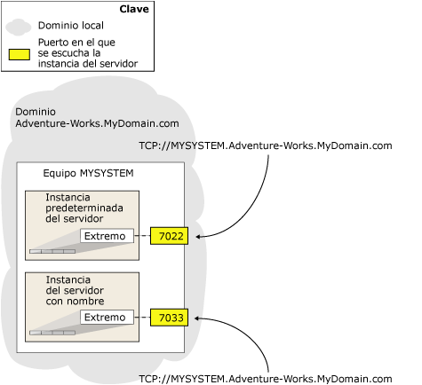

# <a name="specify-a-server-network-address-database-mirroring"></a>Especificar una dirección de red de servidor (creación de reflejo de la base de datos)
[!INCLUDE[appliesto-ss-xxxx-xxxx-xxx-md](../../includes/appliesto-ss-xxxx-xxxx-xxx-md.md)]
  La configuración de una sesión de creación de reflejo de la base de datos necesita una dirección de red de servidor para cada una de las instancias de servidor. La dirección de red de servidor de una instancia de servidor debe identificar sin ambigüedades la instancia proporcionando una dirección del sistema y el número del puerto en el que la instancia escucha.  
  
 Antes de que pueda especificar un puerto en una dirección de red de servidor, debe existir un extremo de creación de reflejo de la base de datos en la instancia de servidor. Para obtener más información, vea [Crear un punto de conexión de creación de reflejo de la base de datos para la autenticación de Windows &#40;Transact-SQL&#41;](../../database-engine/database-mirroring/create-a-database-mirroring-endpoint-for-windows-authentication-transact-sql.md).  
  
  
##  <a name="Syntax"></a> Sintaxis para una dirección de red de servidor  
 La sintaxis para una dirección de red de servidor tiene el siguiente formato:  
  
 TCP<strong>://</strong> *\<dirección del sistema>* <strong>:</strong> *\<puerto>*  
  
 donde  
  
-   *\<dirección del sistema>* es una cadena que identifica de forma inequívoca el equipo de destino. Generalmente, la dirección del servidor es un nombre del sistema (si los sistemas están en el mismo dominio), un nombre de dominio completo o una dirección IP:  
  
    -   Si los sistemas están en el mismo dominio, puede utilizar el nombre del equipo; por ejemplo, `SYSTEM46`.  
  
    -   Para utilizar una dirección IP, ésta debe ser única en el entorno. Recomendamos que utilice una dirección IP solo si es estática. La dirección IP puede ser IP Versión 4 (IPv4) o IP Versión 6 (IPv6). Las direcciones IPv6 se deben incluir entre corchetes, por ejemplo: **[** _<dirección_IPv6>_ **]** .  
  
         Para conocer la dirección IP de un sistema, en el símbolo del sistema de Windows, escriba el comando **ipconfig** .  
  
    -   El nombre de dominio completo siempre funciona. Éste es una cadena de dirección definida localmente que tiene diferentes formatos en los distintos lugares. Con frecuencia, aunque no siempre, el nombre de dominio completo es un nombre compuesto que incluye el nombre del equipo y una serie de segmentos de dominio separados por puntos con el siguiente formato:  
  
         _nombre_equipo_ **.** _segmento_dominio_[... **.** _segmento_dominio_]  
  
         donde *nombre_equipo*es el nombre de red del equipo que ejecuta la instancia de servidor y *segmento_dominio*[... **.** _segmento_dominio_] es la información restante de dominio del servidor; por ejemplo: `localinfo.corp.Adventure-Works.com`.  
  
         El contenido y el número de segmentos de dominio se determinan en la empresa u organización. Si no conoce el nombre de dominio completo del servidor, consulte con el administrador del sistema.  
  
        > [!NOTE]  
        >  Para obtener información acerca de cómo buscar un nombre de dominio completo, vea "Buscar el nombre de dominio completo" más adelante en este tema.  
  
-   *\<puerto>* es el número de puerto usado por el punto de conexión de reflejo de la instancia del servidor asociado. Para obtener más información sobre cómo especificar un punto de conexión, vea [Crear un punto de conexión de creación de reflejo de la base de datos para la autenticación de Windows &#40;Transact-SQL&#41;](../../database-engine/database-mirroring/create-a-database-mirroring-endpoint-for-windows-authentication-transact-sql.md).  
  
     Un extremo de creación de reflejo de la base de datos puede utilizar cualquier puerto disponible en el equipo. Cada número de puerto de un sistema debe estar asociado con un único extremo y cada extremo está asociado con una sola instancia de servidor; en consecuencia, diferentes instancias del mismo servidor escuchan en diferentes extremos con distintos puertos. Por lo tanto, el puerto que especifique en la dirección de red de servidor al configurar una sesión de creación de reflejo de la base de datos siempre dirigirá la sesión a la instancia de servidor cuyo extremo esté asociado con dicho puerto.  
  
     En la dirección de red de servidor de una instancia de servidor, solo el número del puerto asociado con su extremo de creación de reflejo distingue esa instancia de las demás instancias del equipo. En la siguiente ilustración se muestran las direcciones de red de servidor de dos instancias de servidor en un solo equipo. La instancia predeterminada usa el puerto `7022` y la instancia con nombre usa el puerto `7033`. Las direcciones de red de servidor de estas dos instancias de servidor son, respectivamente, `TCP://MYSYSTEM.Adventure-works.MyDomain.com:7022` y `TCP://MYSYSTEM.Adventure-works.MyDomain.com:7033`. Observe que la dirección no contiene el nombre de la instancia de servidor.  
  
       
  
     Para identificar el puerto asociado actualmente al extremo de creación de reflejo de la base de datos de una instancia de servidor, utilice la siguiente instrucción [!INCLUDE[tsql](../../includes/tsql-md.md)] :  
  
    ```  
    SELECT type_desc, port FROM sys.tcp_endpoints  
    ```  
  
     Busque la fila cuyo valor **type_desc** sea "DATABASE_MIRRORING" y use el número de puerto correspondiente.  
  
### <a name="examples"></a>Ejemplos  
  
#### <a name="a-using-a-system-name"></a>A. Usar un nombre de sistema  
 La siguiente dirección de red de servidor especifica un nombre de sistema, `SYSTEM46`, y el puerto `7022`.  
  
```  
ALTER DATABASE AdventureWorks SET PARTNER ='tcp://SYSTEM46:7022';  
```  
  
#### <a name="b-using-a-fully-qualified-domain-name"></a>B. Usar un nombre de dominio completo  
 La siguiente dirección de red de servidor especifica un nombre de dominio completo, `DBSERVER8.manufacturing.Adventure-Works.com`, y el puerto `7024`.  
  
```  
ALTER DATABASE AdventureWorks SET PARTNER ='tcp://DBSERVER8.manufacturing.Adventure-Works.com:7024';  
```  
  
#### <a name="c-using-ipv4"></a>C. Usar IPv4  
 La siguiente dirección de red de servidor especifica una dirección IPv4 `10.193.9.134`, y el puerto `7023`.  
  
```  
ALTER DATABASE AdventureWorks SET PARTNER ='tcp://10.193.9.134:7023';  
```  
  
#### <a name="d-using-ipv6"></a>D. Usar IPv6  
 La siguiente dirección de red de servidor contiene una dirección IPv6, `2001:4898:23:1002:20f:1fff:feff:b3a3`, y el puerto `7022`.  
  
```  
ALTER DATABASE AdventureWorks SET PARTNER ='tcp://[2001:4898:23:1002:20f:1fff:feff:b3a3]:7022';  
```  
  
## <a name="finding-the-fully-qualified-domain-name"></a>Buscar el nombre de dominio completo  
 Para buscar el nombre de dominio completo de un sistema, en el símbolo del sistema de Windows de ese sistema, escriba:  
  
 **IPCONFIG /ALL**  
  
 Para formar el nombre de dominio completo, concatene los valores de *<host_name>* y *<Primary_Dns_Suffix>* de la siguiente manera:  
  
 _&lt;nombre_host&gt;_ **.** _<sufijo_DNS_primario>_  
  
 Por ejemplo, la configuración IP  
  
 `Host Name  .  .  .  .  .  .  : MYSERVER`  
  
 `Primary Dns Suffix  .  .  .  : mydomain.Adventure-Works.com`  
  
 equivale al siguiente nombre de dominio completo:  
  
 `MYSERVER.mydomain.Adventure-Works.com`  
  
##  <a name="Examples"></a> Ejemplos  
 En este ejemplo se muestra la dirección de red de servidor para una instancia de servidor en un equipo denominado `REMOTESYSTEM3` en otro dominio. La información del dominio es `NORTHWEST.ADVENTURE-WORKS.COM`y el puerto del extremo de creación de reflejo de la base de datos es `7025`. Dados los componentes de este ejemplo, la dirección de red de servidor es:  
  
 `TCP://REMOTESYSTEM3.NORTHWEST.ADVENTURE-WORKS.COM:7025`  
  
 En este ejemplo se muestra la dirección de red de servidor para una instancia de servidor en un equipo denominado `DBSERVER1`. Este sistema se encuentra en el dominio local y su nombre de sistema lo identifica de forma inequívoca. El puerto del extremo de creación de reflejo de la base de datos es `7022`.  
  
 `TCP://DBSERVER1:7022`  
  
##  <a name="RelatedTasks"></a> Tareas relacionadas  
  
-   [Crear un punto de conexión de creación de reflejo de la base de datos para la autenticación de Windows &#40;Transact-SQL&#41;](../../database-engine/database-mirroring/create-a-database-mirroring-endpoint-for-windows-authentication-transact-sql.md)  
  
## <a name="see-also"></a>Consulte también  
 [Creación de reflejo de la base de datos &#40;SQL Server&#41;](../../database-engine/database-mirroring/database-mirroring-sql-server.md)   
 [El punto de conexión de creación de reflejo de la base de datos &#40;SQL Server&#41;](../../database-engine/database-mirroring/the-database-mirroring-endpoint-sql-server.md)  
  
  
