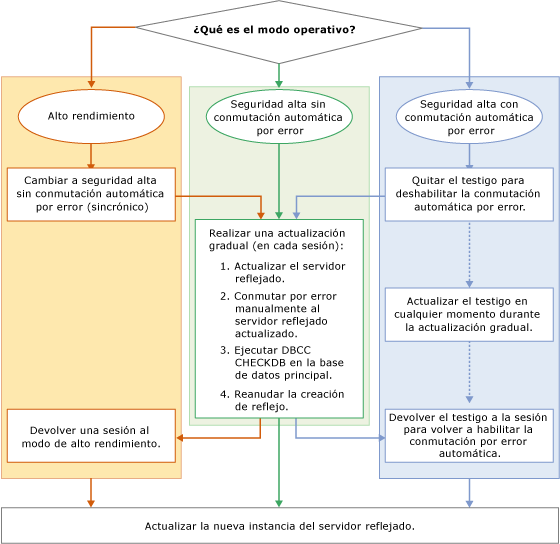

# Actualización de instancias reflejadas
  Al actualizar una instancia reflejada de [!INCLUDE[ssNoVersion](../../includes/ssnoversion-md.md)] a una nueva versión de [!INCLUDE[ssCurrent](../../includes/sscurrent-md.md)] , que puede ser un Service Pack o una actualización acumulativa de [!INCLUDE[ssNoVersion](../../includes/ssnoversion-md.md)], o a un nuevo Service Pack o una actualización acumulativa de Windows, puede reducir el tiempo de inactividad de cada base de datos reflejada a solo una conmutación por error manual realizando una actualización gradual (o dos conmutaciones por error manuales si conmuta por recuperación a la base de datos primaria original). Una actualización gradual es un proceso de varias etapas que, en su forma más simple, implica la actualización de la instancia de [!INCLUDE[ssCurrent](../../includes/sscurrent-md.md)] que está actuando actualmente como servidor reflejado en una sesión de creación de reflejo, la conmutación por error manual de la base de datos reflejada, la actualización de la instancia de [!INCLUDE[ssCurrent](../../includes/sscurrent-md.md)] de la base de datos principal anterior y la reanudación de la creación de reflejo. En la práctica, el proceso exacto dependerá del modo de funcionamiento y del número y diseño de la sesión de creación de reflejo que se ejecute en las instancias de [!INCLUDE[ssCurrent](../../includes/sscurrent-md.md)] que se van a actualizar.  
  
> [!NOTE]  
>  Para obtener más información sobre el uso de la creación de reflejo de la base de datos con el trasvase de registros durante una migración, descargue este [documento](https://t.co/RmO6ruCT4J).  
  
## Requisitos previos  
 Antes de empezar, revise la siguiente información importante:  
  
-   [Supported Version and Edition Upgrades](../../database-engine/install-windows/supported-version-and-edition-upgrades.md): Compruebe que puede actualizar a SQL Server 2016 desde su versión del sistema operativo Windows y la versión de SQL Server. Por ejemplo, no puede actualizar directamente desde una instancia de SQL Server 2005 a [!INCLUDE[ssCurrent](../../includes/sscurrent-md.md)].  
  
-   [Choose a Database Engine Upgrade Method](../../database-engine/install-windows/choose-a-database-engine-upgrade-method.md): seleccione el método y los pasos de actualización adecuados en función de la revisión de versiones admitidas y actualizaciones de ediciones, y también teniendo en cuenta otros componentes instalados en el entorno con el fin de actualizar los componentes en el orden correcto.  
  
-   [Planeamiento y prueba del plan de actualización del motor de base de datos](../../database-engine/install-windows/plan-and-test-the-database-engine-upgrade-plan.md): revise las notas de la versión y los problemas conocidos de actualización, la lista de comprobación previa a la actualización y desarrolle y pruebe el plan de actualización.  
  
-   [Requisitos de hardware y software para instalar SQL Server 2016:](../../sql-server/install/hardware-and-software-requirements-for-installing-sql-server.md)revise los requisitos de software para instalar [!INCLUDE[ssCurrent](../../includes/sscurrent-md.md)]. Si es necesario software adicional, puede instalarlo en cada nodo antes de comenzar el proceso de actualización para reducir los posibles tiempos de inactividad.  
  
## Preparación recomendada (prácticas recomendadas)  
 Antes de iniciar una actualización gradual, es recomendable que:  
  
1.  Realice una conmutación por error manual de prueba en al menos una de las sesiones de creación de reflejo:  
  
    -   [Realizar manualmente la conmutación por error de una sesión de creación de reflejo de la base de datos &#40;SQL Server Management Studio&#41;](../../database-engine/database-mirroring/manually-fail-over-a-database-mirroring-session-sql-server-management-studio.md)  
  
    -   [Realizar una conmutación por error manualmente de una sesión de creación de reflejo de la base de datos &#40;Transact-SQL&#41;](../../database-engine/database-mirroring/manually-fail-over-a-database-mirroring-session-transact-sql.md).  
  
    > [!NOTE]  
    >  Para obtener más información sobre el funcionamiento de la conmutación por error manual, vea [Conmutación de roles durante una sesión de creación de reflejo de la base de datos &#40;SQL Server&#41;](../../database-engine/database-mirroring/role-switching-during-a-database-mirroring-session-sql-server.md).  
  
2.  Proteja los datos:  
  
    1.  Realice una copia de seguridad completa de cada base de datos principal:  
  
         [Cree una copia de seguridad completa de base de datos &#40;SQL Server&#41;](../../relational-databases/backup-restore/create-a-full-database-backup-sql-server.md).  
  
    2.  Ejecute el comando [DBCC CHECKDB](../../t-sql/database-console-commands/dbcc-checkdb-transact-sql.md) en cada base de datos principal.  
  
## Etapas de una actualización gradual  
 Los pasos específicos de una actualización gradual dependen del modo de funcionamiento de la configuración de creación de reflejo. No obstante, las etapas básicas son las mismas.  
  
> [!NOTE]  
>  Para obtener información sobre los modos de funcionamiento, vea [Modos de funcionamiento de la creación de reflejo de la base de datos](../../database-engine/database-mirroring/database-mirroring-operating-modes.md).  
  
 La ilustración siguiente es un diagrama de flujo en el que se muestran las etapas básicas de una actualización gradual para cada modo de funcionamiento. Los procedimientos correspondientes se describen después de la ilustración.  
  
   
  
> [!IMPORTANT]  
>  Una instancia del servidor podría estar realizando roles de creación de reflejo distintos (servidor principal, servidor reflejado o testigo) en sesiones de creación de reflejo simultáneas. En ese caso, tendrá que adaptar el proceso básico de actualización gradual a la función. Para obtener más información, vea [Conmutación de roles durante una sesión de creación de reflejo de la base de datos &#40;SQL Server&#41;](../../database-engine/database-mirroring/role-switching-during-a-database-mirroring-session-sql-server.md).  
  
> [!NOTE]  
>  En muchos casos, una vez completada la actualización gradual, se conmutará por recuperación al servidor principal original.  
  
### Para cambiar una sesión del modo de alto rendimiento al modo de alta seguridad  
  
1.  Si una sesión de creación de reflejo se está ejecutando en modo de alto rendimiento, antes de realizar una actualización gradual, cambie al modo de seguridad alta sin conmutación automática por error.  
  
    > [!IMPORTANT]  
    >  Si el servidor reflejado está geográficamente distante del servidor principal, puede no ser conveniente realizar una actualización gradual.  
  
    -   En [!INCLUDE[ssManStudioFull](../../includes/ssmanstudiofull-md.md)]: cambie la opción **Modo de funcionamiento** a **Seguridad alta sin conmutación automática por error (sincrónico)** mediante la página [Creación de reflejo](../../relational-databases/databases/database-properties-mirroring-page.md) del cuadro de diálogo **Propiedades de la base de datos**. Para obtener información sobre cómo obtener acceso a esta página, vea [Iniciar el Asistente para la configuración de seguridad de la creación de reflejo de la base de datos &#40;SQL Server Management Studio&#41;](../../database-engine/database-mirroring/start-the-configuring-database-mirroring-security-wizard.md).  
  
    -   En [!INCLUDE[tsql](../../includes/tsql-md.md)]: establezca la seguridad de transacciones en FULL. Para obtener más información, vea [Cambiar la seguridad de las transacciones en una sesión de creación de reflejo de la base de datos &#40;Transact-SQL&#41;](../../database-engine/database-mirroring/change-transaction-safety-in-a-database-mirroring-session-transact-sql.md).  
  
### Para quitar un testigo de una sesión  
  
1.  Si una sesión de creación de reflejo conlleva un testigo, recomendamos que lo quite antes de realizar una actualización gradual. Si no lo hace, al actualizar la instancia del servidor reflejado, la disponibilidad de la base de datos depende del testigo que sigue estando conectado a la instancia del servidor principal. Después de quitar un testigo, puede actualizarlo en cualquier momento durante el proceso de actualización gradual sin aumentar el tiempo de inactividad de la base de datos.  
  
    > [!NOTE]  
    >  Para obtener más información, vea [Cuórum: cómo un testigo afecta a la disponibilidad de la base de datos &#40;reflejo de la base de datos&#41;](../../database-engine/database-mirroring/quorum-how-a-witness-affects-database-availability-database-mirroring.md).  
  
    -   [Quitar el testigo de una sesión de creación de reflejo de la base de datos &#40;SQL Server&#41;](../../database-engine/database-mirroring/remove-the-witness-from-a-database-mirroring-session-sql-server.md)  
  
### Para realizar la actualización gradual  
  
1.  Para minimizar el tiempo de inactividad, recomendamos que inicie la actualización gradual actualizando todos los asociados de creación de reflejo que sean actualmente el servidor reflejado en todas sus sesiones de creación de reflejo. Podría tener que actualizar varias instancias del servidor en este momento.  
  
    > [!NOTE]  
    >  Un testigo se puede actualizar en cualquier momento del proceso de actualización gradual. Por ejemplo, si una instancia del servidor es un servidor reflejado en la Sesión 1 y es un testigo en la Sesión 2, puede actualizar ahora la instancia del servidor.  
  
     La instancia del servidor que se debe actualizar en primer lugar depende de la configuración actual de las sesiones de creación de reflejo, como se indica a continuación:  
  
    -   Si cualquier instancia del servidor ya es el servidor reflejado en todas sus sesiones de creación de reflejo, actualice la instancia del servidor a la nueva versión.  
  
    -   Si todas las instancias del servidor son actualmente el servidor principal en cualquier sesión de creación de reflejo, seleccione una instancia del servidor para actualizarla primero. A continuación, conmute por error manualmente cada una de sus bases de datos principales y actualice esa instancia del servidor.  
  
     Una vez que se ha actualizado, una instancia del servidor vuelve a unirse automáticamente a cada una de sus sesiones de creación de reflejo.  
  
2.  En cada sesión de creación de reflejo cuya instancia del servidor reflejado se acaba de actualizar, espere a que la sesión se sincronice. A continuación, conéctese a la instancia del servidor principal y realice una conmutación manual por error de la sesión. Tras la conmutación por error, la instancia del servidor actualizada se convierte en el servidor principal para esa sesión y el servidor principal anterior se convierte en el servidor reflejado.  
  
     El objetivo de este paso es que otra instancia del servidor se convierta en el servidor reflejado en cada sesión de creación de reflejo en la que es un asociado.  
  
     **Restricciones después de la conmutación por error a una instancia del servidor actualizada.**  
  
     Después de la conmutación por error de una instancia de servidor anterior a una instancia de servidor de [!INCLUDE[ssCurrent](../../includes/sscurrent-md.md)] , la sesión de la base de datos se suspende. No se puede reanudar hasta que se haya actualizado el otro asociado. Sin embargo, el servidor principal sigue aceptando conexiones, y permitiendo acceso y modificaciones a datos en la base de datos principal.  
  
    > [!NOTE]  
    >  El establecimiento de una nueva sesión de creación de reflejo requiere que todas las instancias del servidor se ejecuten en la misma versión de [!INCLUDE[ssNoVersion](../../includes/ssnoversion-md.md)].  
  
3.  Después de la conmutación por error, recomendamos que ejecute el comando [DBCC CHECKDB](../../t-sql/database-console-commands/dbcc-checkdb-transact-sql.md) en la base de datos principal.  
  
4.  Actualice todas las instancias del servidor que es ahora el servidor reflejado en todas las sesiones de creación de reflejo en las que sea asociado. Podría tener que actualizar varios servidores en este momento.  
  
    > [!IMPORTANT]  
    >  En una configuración de creación de reflejo compleja, alguna instancia de servidor podría seguir siendo el servidor principal original en una o varias sesiones de creación de reflejo. Repita los pasos 2 a 4 para esas instancias de servidor hasta que se actualicen todas las instancias implicadas.  
  
5.  Reanude la sesión de creación de reflejo.  
  
    > [!NOTE]  
    >  La conmutación automática por error no funcionará hasta que el testigo se haya actualizado y agregado de nuevo a la sesión de creación de reflejo.  
  
6.  Actualice cualquier instancia de servidor que quede y sea testigo en todas sus sesiones de creación de reflejo. Cuando un testigo actualizado se vuelva a unir a una sesión de creación de reflejo, la conmutación automática por error vuelve a ser posible. Podría tener que actualizar varios servidores en este momento.  
  
### Para devolver una sesión al modo de alto rendimiento  
  
1.  Si lo desea, vuelva al modo de alto rendimiento utilizando uno de los métodos siguientes:  
  
    -   En [!INCLUDE[ssManStudioFull](../../includes/ssmanstudiofull-md.md)]: cambie la opción **Modo de funcionamiento** a **Rendimiento alto (asincrónico)** mediante la página [Creación de reflejo](../../relational-databases/databases/database-properties-mirroring-page.md) del cuadro de diálogo **Propiedades de la base de datos** .  
  
    -   En [!INCLUDE[tsql](../../includes/tsql-md.md)]: utilice [ALTER DATABASE](../../t-sql/statements/alter-database-transact-sql-database-mirroring.md)para desactivar la seguridad de las transacciones.  
  
### Para volver a agregar un testigo a una sesión de creación de reflejo  
  
1.  Si lo desea, en modo de alta seguridad, restablezca el testigo en cada sesión de creación de reflejo.  
  
     **Para devolver un testigo**  
  
    -   [Agregar o reemplazar un testigo de creación de reflejo de la base de datos &#40;SQL Server Management Studio&#41;](../../database-engine/database-mirroring/add-or-replace-a-database-mirroring-witness-sql-server-management-studio.md)  
  
    -   [Agregar un testigo de creación de reflejo de la base de datos mediante la autenticación de Windows &#40;Transact-SQL&#41;](../../database-engine/database-mirroring/add-a-database-mirroring-witness-using-windows-authentication-transact-sql.md)  
  
## Vea también  
 [Actualización a SQL Server 2016 mediante el Asistente para instalación &#40;programa de instalación&#41;](../../database-engine/install-windows/upgrade-sql-server-using-the-installation-wizard-setup.md)   
 [Instalar SQL Server 2016 desde el símbolo del sistema](../../database-engine/install-windows/install-sql-server-2016-from-the-command-prompt.md)   
 [Reflejo de la base de datos ALTER DATABASE &#40;Transact-SQL&#41;](../../t-sql/statements/alter-database-transact-sql-database-mirroring.md)   
 [BACKUP &#40;Transact-SQL&#41;](../../t-sql/statements/backup-transact-sql.md)   
 [Ver el estado de una base de datos reflejada &#40;SQL Server Management Studio&#41;](../../database-engine/database-mirroring/view-the-state-of-a-mirrored-database-sql-server-management-studio.md)   
 [Creación de reflejo de la base de datos &#40;SQL Server&#41;](../../database-engine/database-mirroring/database-mirroring-sql-server.md)   
 [Conmutación de roles durante una sesión de creación de reflejo de la base de datos &#40;SQL Server&#41;](../../database-engine/database-mirroring/role-switching-during-a-database-mirroring-session-sql-server.md)   
 [Forzar el servicio en una sesión de creación de reflejo de la base de datos &#40;Transact-SQL&#41;](../../database-engine/database-mirroring/force-service-in-a-database-mirroring-session-transact-sql.md)   
 [Iniciar el Monitor de creación de reflejo de la base de datos &#40;SQL Server Management Studio&#41;](../../database-engine/database-mirroring/start-database-mirroring-monitor-sql-server-management-studio.md)   
 [Database Mirroring Operating Modes](../../database-engine/database-mirroring/database-mirroring-operating-modes.md)  
  
  

