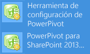

# <a name="upgrade-power-pivot-for-sharepoint"></a>Actualización de PowerPivot para SharePoint

[!INCLUDE[appliesto-ss-xxxx-xxxx-xxx-md-winonly](../../includes/appliesto-ss-xxxx-xxxx-xxx-md-winonly.md)]
  
  En este artículo se resumen los pasos necesarios para actualizar una implementación de [!INCLUDE[ssGeminiShort](../../includes/ssgeminishort-md.md)] a [!INCLUDE[ssGeminiLong](../../includes/ssgeminilong-md.md)]. Los pasos específicos dependen de la versión de SharePoint que está ejecutando el entorno e incluyen el complemento [!INCLUDE[ssGemini](../../includes/ssgemini-md.md)] para SharePoint (**spPowerPivot.msi**).  
  
 **[!INCLUDE[applies](../../includes/applies-md.md)]**  SharePoint 2010 | SharePoint 2013  
  
 Para ver las notas de la versión, consulte [SQL Server 2016 Release Notes](http://go.microsoft.com/fwlink/?LinkID=398124)(Notas de la versión de SQL Server 2016).  
  
 **En este artículo:**  
  
 [Requisitos previos](#bkmk_prereq)  
  
 [Actualizar una granja existente de SharePoint 2013](#bkmk_uprgade_sharepoint2013)  
  
 [Actualizar una granja existente de SharePoint 2010](#bkmk_uprgade_sharepoint2010)  
  
 [Libros](#bkmk_workbooks)  
  
 [Actualización de datos](#bkmk_datarefresh)  
  
 [Comprobación de las versiones de componentes y servicios de PowerPivot](#bkmk_verify_versions)  
  
 [Actualización de varios servidores PowerPivot para SharePoint en una granja de servidores de SharePoint](#geminifarm)  
  
 [Aplicación de un QFE a una instancia de PowerPivot en la granja](#qfe)  
  
 [Tareas de comprobación posteriores a la actualización](#verify)  
  
## <a name="background"></a>Información previa  
  
-   Si va a actualizar una granja multiservidor de SharePoint 2010 que tiene dos o más instancias de [!INCLUDE[ssGeminiShort](../../includes/ssgeminishort-md.md)] , debe actualizar totalmente cada servidor **antes** de continuar con el servidor siguiente. Una actualización completa incluye ejecutar el programa de instalación de SQL Server para actualizar los archivos de programa de [!INCLUDE[ssGeminiShort](../../includes/ssgeminishort-md.md)] , seguido de acciones de actualización de SharePoint que configuran los servicios actualizados. Se limitará la disponibilidad del servidor hasta que ejecute las acciones de actualización en la Herramienta de configuración de [!INCLUDE[ssGemini](../../includes/ssgemini-md.md)] o el comando de Windows PowerShell adecuado.  
  
-   Todas las instancias del Servicio de sistema de [!INCLUDE[ssGemini](../../includes/ssgemini-md.md)] y Analysis Services de una granja de SharePoint 2010 tienen que ser de la misma versión. Para más información sobre cómo comprobar la versión, vea la sección [Comprobación de las versiones de componentes y servicios de PowerPivot](#bkmk_verify_versions) en este artículo.  
  
-   Las herramientas de configuración de [!INCLUDE[ssGemini](../../includes/ssgemini-md.md)] son una de las características compartidas de SQL Server y todas las características compartidas se actualizan al mismo tiempo. Si durante un proceso de actualización selecciona otras instancias o características de SQL Server que necesitan la actualización de una característica compartida, la herramienta de configuración de [!INCLUDE[ssGemini](../../includes/ssgemini-md.md)] también se actualizará. Puede tener problemas si se actualiza la herramienta de configuración de [!INCLUDE[ssGemini](../../includes/ssgemini-md.md)] , pero no la instancia de [!INCLUDE[ssGemini](../../includes/ssgemini-md.md)] . Para más información sobre las características compartidas de SQL Server, vea [Actualización a SQL Server 2016 mediante el Asistente para instalación &#40;programa de instalación&#41;](../../database-engine/install-windows/upgrade-sql-server-using-the-installation-wizard-setup.md).  
  
-   El complemento [!INCLUDE[ssGemini](../../includes/ssgemini-md.md)] para SharePoint (**spPowerPivot.msi**) se instala en paralelo con las versiones anteriores. Por ejemplo, el complemento [!INCLUDE[ssCurrent](../../includes/sscurrent-md.md)] se instala en la carpeta `c:\Program Files\Microsoft SQL Server\130\Tools\PowerPivotTools`.  
  
##  <a name="bkmk_prereq"></a> Requisitos previos  
 **Permisos**  
  
-   Debe ser administrador de granja para actualizar una instalación de [!INCLUDE[ssGemini](../../includes/ssgemini-md.md)] para SharePoint. Debe ser administrador local para ejecutar el programa de instalación de SQL Server.  
  
-   Debe tener permisos **db_owner** en la base de datos de configuración de la granja.  
  
 **SQL Server:**  
  
-   Si la instalación existente de [!INCLUDE[ssGemini](../../includes/ssgemini-md.md)] es [!INCLUDE[ssKilimanjaro](../../includes/sskilimanjaro-md.md)], se necesita [!INCLUDE[ssKilimanjaro](../../includes/sskilimanjaro-md.md)] Service Pack 2 (SP2) para realizar una actualización a [!INCLUDE[ssCurrent](../../includes/sscurrent-md.md)] [!INCLUDE[ssGeminiShort](../../includes/ssgeminishort-md.md)].  
  
-   Si la instalación existente de [!INCLUDE[ssGemini](../../includes/ssgemini-md.md)] es [!INCLUDE[ssSQL11](../../includes/sssql11-md.md)], se necesita [!INCLUDE[ssSQL11](../../includes/sssql11-md.md)] Service Pack 1 (SP1) para realizar una actualización a [!INCLUDE[ssCurrent](../../includes/sscurrent-md.md)] [!INCLUDE[ssGeminiShort](../../includes/ssgeminishort-md.md)].  
  
 **SharePoint 2010:**  
  
-   Si la instalación existente ejecuta SharePoint 2010, instale SharePoint 2010 Service Pack 2 antes de realizar la actualización a [!INCLUDE[ssCurrent](../../includes/sscurrent-md.md)][!INCLUDE[ssGeminiShort](../../includes/ssgeminishort-md.md)]. Para obtener más información, vea [Service Pack 2 para Microsoft SharePoint 2010](http://www.microsoft.com/download/details.aspx?id=39672). Use el comando `(Get-SPfarm).BuildVersion.ToString()` de PowerShell para comprobar la versión. Para saber la versión de compilación en la fecha de lanzamiento, vea [Números de compilación de SharePoint 2010](http://www.toddklindt.com/blog/Lists/Posts/Post.aspx?ID=224).  
  
##  <a name="bkmk_uprgade_sharepoint2013"></a> Actualizar una granja existente de SharePoint 2013  
 Para actualizar [!INCLUDE[ssGeminiShort](../../includes/ssgeminishort-md.md)] implementado en SharePoint 2013, haga lo siguiente:  
  
   
  
1.  Ejecute el programa de instalación de [!INCLUDE[ssCurrent](../../includes/sscurrent-md.md)] en los servidores back-end que ejecutan [!INCLUDE[ssASnoversion](../../includes/ssasnoversion-md.md)] en modo de SharePoint. Si el servidor hospeda varias instancias de [!INCLUDE[ssASnoversion](../../includes/ssasnoversion-md.md)], actualice al menos la instancia de **POWERPIVOT** . La lista siguiente es un resumen de pasos del Asistente para la instalación relacionados con una actualización de [!INCLUDE[ssGemini](../../includes/ssgemini-md.md)] :  
  
    1.  En el Asistente para la instalación de [!INCLUDE[ssNoVersion](../../includes/ssnoversion-md.md)] , haga clic en **Instalación**.  
  
    2.  Haga clic en **Actualizar desde SQL Server…..**.  
  
    3.  En la página **Seleccionar instancia** , seleccione el nombre de instancia **POWERPIVOT** y, a continuación, haga clic en **Siguiente**.  
  
    4.  Para más información, vea [Actualización a SQL Server 2016 mediante el Asistente para instalación &#40;programa de instalación&#41;](../../database-engine/install-windows/upgrade-sql-server-using-the-installation-wizard-setup.md).  
  
2.  Reinicie el servidor.  
  
3.  Ejecute el complemento [!INCLUDE[ssGemini](../../includes/ssgemini-md.md)] para SharePoint (**spPowerPivot.msi**) en todos los servidores de la granja de SharePoint 2013 para instalar los proveedores de datos. La excepción está en los servidores donde se ejecutó el Asistente para la instalación de SQL Server, que también actualiza los proveedores de datos. Para más información, vea [Download Microsoft SQL Server 2014 Power Pivot for Microsoft SharePoint 2013](https://www.microsoft.com/en-us/download/details.aspx?id=42300) (Descarga de Microsoft SQL Server 2014 PowerPivot para Microsoft SharePoint 2013) e [Instalar o desinstalar el complemento PowerPivot para SharePoint &#40;SharePoint 2013&#41;](../../analysis-services/instances/install-windows/install-or-uninstall-the-power-pivot-for-sharepoint-add-in-sharepoint-2013.md).  
  
4.  **Ejecute el complemento [!INCLUDE[ssGemini](../../includes/ssgemini-md.md)] para SharePoint 2013** en uno de los servidores de aplicaciones de SharePoint para configurar la granja de servidores de SharePoint con los archivos de solución actualizados que el complemento ha instalado. No puede usar Administración central de SharePoint para este paso. Para obtener más información, vea:  
  
    1.  En la página Inicio de Windows, escriba **[!INCLUDE[ssGemini](../../includes/ssgemini-md.md)]** y después, en los resultados de la búsqueda, haga clic en **[!INCLUDE[ssGemini](../../includes/ssgemini-md.md)] for SharePoint 2013 Configuration**(Configuración de PowerPivot para SharePoint 2013). Tenga en cuenta la búsqueda puede devolver ambas versiones de la herramienta de configuración.  
  
           
  
         o bien  
  
         En el menú **Inicio** , elija **Todos los programas**, haga clic en [!INCLUDE[ssCurrentUI](../../includes/sscurrentui-md.md)], en **Herramientas de configuración**y, después, en **[!INCLUDE[ssGemini](../../includes/ssgemini-md.md)] for SharePoint 2013 Configuration Tool**(Herramienta de configuración de PowerPivot para SharePoint 2013). Observe que esta herramienta solo se enumera cuando [!INCLUDE[ssGeminiShort](../../includes/ssgeminishort-md.md)] está instalado en el servidor local.  
  
    2.  Al iniciarse, la herramienta de configuración comprueba el estado de actualización de la solución de granja de [!INCLUDE[ssGemini](../../includes/ssgemini-md.md)] y las soluciones de aplicación web de [!INCLUDE[ssGemini](../../includes/ssgemini-md.md)] . Si se detectan versiones anteriores de estas soluciones, verá el mensaje "**Se han detectado versiones más recientes de los archivos de solución de [!INCLUDE[ssGemini](../../includes/ssgemini-md.md)]. Seleccione la opción de actualización para actualizar la granja**". Haga clic en **Aceptar** para cerrar el mensaje de validación del sistema.  
  
    3.  Haga clic en **Actualizar características, servicios, aplicaciones y soluciones**y, a continuación, haga clic en **Aceptar**.  
  
    4.  Revise las acciones de la lista de tareas del panel izquierdo y excluya las que no desea que realice la herramienta. Todas las acciones se incluyen de forma predeterminada. Para quitar una acción, selecciónela en la lista de tareas de la izquierda y, a continuación, en la página **Parámetros** , desactive la casilla **Incluir esta acción en la lista de tareas** .  
  
    5.  También puede revisar información detallada en la pestaña **Script** o en la pestaña **Salida** .  
  
         La pestaña Salida es un resumen de las acciones que realizará la herramienta. Esta información se guarda en archivos de registro en `C:\Program Files\Microsoft SQL Server\130\Tools\PowerPivotTools\SPAddinConfiguration\Log`.  
  
         La pestaña Script muestra los cmdlets de PowerShell o hace referencia a los archivos de script de PowerShell que la herramienta ejecutará.  
  
    6.  Haga clic en **Validar** para comprobar si cada acción es válida. Si la opción **Validar** no está disponible, significa que todas las acciones son válidas para el sistema. Si la opción **Validar** está disponible, puede que haya modificado un valor de entrada (por ejemplo, el nombre de aplicación de servicios de Excel), o que la herramienta haya determinado que una acción determinada no se puede realizar. Si una acción no se puede realizar, debe excluirla o corregir las condiciones subyacentes que hacen que la acción se indique como no válida.  
  
        > [!IMPORTANT]  
        >  La primera acción, **Actualizar solución de granja**, siempre se debe procesar primero. Registra los cmdlets de PowerShell que se utilizan para configurar el servidor. Si obtiene un error en esta acción, no debe continuar. En su lugar, utilice la información proporcionada por el error para diagnosticar y resolver el problema antes de procesar acciones adicionales en la lista de tareas.  
  
    7.  Haga clic en **Ejecutar** para realizar todas las acciones válidas para esta tarea. La opción**Ejecutar** solo está disponible si se supera la comprobación de validación. Cuando se hace clic en **Ejecutar**, aparece la advertencia siguiente recordándole que las acciones se procesan en modo por lotes: "**Todos los parámetros de configuración que se indican como válidos en la herramienta se aplicarán a la granja de SharePoint. ¿Quiere continuar?**".  
  
    8.  Haga clic en **Sí** para continuar.  
  
    9. La actualización de soluciones y características de la granja puede tardar varios minutos en completarse. Durante este período, las solicitudes de conexión para los datos [!INCLUDE[ssGemini](../../includes/ssgemini-md.md)] **generarán errores** similares a "**No se pueden actualizar datos**" o "**Error al intentar realizar la acción solicitada. Inténtelo de nuevo**". Una vez finalizada la actualización, el servidor estará disponible y estos errores ya no se producirán.  
  
     Para obtener más información, vea:  
  
    -   [Herramientas de configuración de Power Pivot](../../analysis-services/power-pivot-sharepoint/power-pivot-configuration-tools.md)  
  
    -   [Configure or Repair Power Pivot for SharePoint 2013 &#40;Power Pivot Configuration Tool&#41; (Configurar o reparar Power Pivot para SharePoint 2013 &#40;Herramienta de configuración de Power Pivot&#41;)](../../analysis-services/power-pivot-sharepoint/configure-or-repair-power-pivot-for-sharepoint-2013.md)  
  
    -   [Configuración de Power Pivot mediante Windows PowerShell](../../analysis-services/power-pivot-sharepoint/power-pivot-configuration-using-windows-powershell.md)  
  
    -   [Referencia de PowerShell para Power Pivot para SharePoint](../../analysis-services/powershell/powershell-reference-for-power-pivot-for-sharepoint.md)  
  
5.  Para comprobar que la actualización se ha efectuado correctamente, ejecute los pasos posteriores a la actualización y compruebe la versión de los servidores de [!INCLUDE[ssGemini](../../includes/ssgemini-md.md)] en la granja de servidores. Para más información, vea [Tareas de comprobación posteriores a la actualización](#verify) en este artículo y la sección siguiente.  
  
##  <a name="bkmk_uprgade_sharepoint2010"></a> Actualizar una granja existente de SharePoint 2010  
 Para actualizar [!INCLUDE[ssGeminiShort](../../includes/ssgeminishort-md.md)] implementado en SharePoint 2010, haga lo siguiente:  
  
   
  
1.  Descargue [Service Pack 2 para Microsoft SharePoint 2010](http://www.microsoft.com/download/details.aspx?id=39672) y aplíquelo en todos los servidores de la granja. Compruebe que la instalación de SharePoint SP2 se ha realizado correctamente. En Administración central, en la página Actualización y migración, abra la página Verificar el estado de la instalación de productos y revisiones para ver el estado de los mensajes relacionados con SP2.  
  
2.  Compruebe que el servicio de Windows Administración de SharePoint 2010 está en ejecución.  
  
    ```  
    Get-Service | where {$_.displayname -like "*SharePoint*"}  
    ```  
  
3.  Compruebe que los servicios de **SharePoint** **SQL Server Analysis Services** y **Servicio de sistema de SQL Server [!INCLUDE[ssGemini](../../includes/ssgemini-md.md)]** se han iniciado en Administración central de SharePoint o use el siguiente comando de PowerShell:  
  
    ```  
    get-SPserviceinstance | where {$_.typename -like "*sql*"}  
    ```  
  
4.  Compruebe que el servicio de **Windows** **SQL Server Analysis Services ([!INCLUDE[ssGemini](../../includes/ssgemini-md.md)])** se está ejecutando.  
  
    ```  
    Get-Service | where {$_.displayname -like "*powerpivot*"}  
    ```  
  
5.  **Ejecute el programa de instalación de [!INCLUDE[ssCurrent](../../includes/sscurrent-md.md)]** en el primer servidor de aplicaciones de SharePoint que ejecuta el servicio de Windows **SQL Server Analysis Services ([!INCLUDE[ssGemini](../../includes/ssgemini-md.md)])** para actualizar la instancia POWERPIVOT. En la página Instalación del Asistente para la instalación de SQL Server, elija la opción de actualización. Para obtener más información, vea [Actualización a SQL Server 2016 mediante el Asistente para instalación &#40;programa de instalación&#41;](../../database-engine/install-windows/upgrade-sql-server-using-the-installation-wizard-setup.md).  
  
6.  **Reinicie el servidor** antes de ejecutar la herramienta de configuración. Este paso garantizará que las actualizaciones o requisitos previos instalados con el programa de instalación de SQL Server se configuren totalmente en el sistema.  
  
7.  **Ejecute la herramienta de configuración de [!INCLUDE[ssGemini](../../includes/ssgemini-md.md)]** en el primer servidor de aplicaciones de SharePoint que ejecuta el servicio SQL Server Analysis Services ([!INCLUDE[ssGemini](../../includes/ssgemini-md.md)]) para actualizar las soluciones y los servicios web de SharePoint. No puede utilizar Administración Central para este paso.  
  
    1.  En el menú **Inicio**, elija **Todos los programas**, haga clic en [!INCLUDE[ssCurrentUI](../../includes/sscurrentui-md.md)], en **Herramientas de configuración** y, después, en **Herramienta de configuración de [!INCLUDE[ssGemini](../../includes/ssgemini-md.md)]**. Observe que esta herramienta solo se enumera cuando [!INCLUDE[ssGeminiShort](../../includes/ssgeminishort-md.md)] está instalado en el servidor local.  
  
    2.  Al iniciarse, la herramienta de configuración comprueba el estado de actualización de la solución de granja de [!INCLUDE[ssGemini](../../includes/ssgemini-md.md)] y las soluciones de aplicación web de [!INCLUDE[ssGemini](../../includes/ssgemini-md.md)] . Si se detectan versiones anteriores de estas soluciones, verá el mensaje “Se han detectado versiones más recientes de los archivos de solución de [!INCLUDE[ssGemini](../../includes/ssgemini-md.md)] . Seleccione la opción de actualización para actualizar la granja". Haga clic en **Aceptar** para cerrar el mensaje.  
  
    3.  Haga clic en **Actualizar características, servicios, aplicaciones y soluciones**y, a continuación, haga clic en **Aceptar** para continuar.  
  
    4.  Aparecerá la advertencia siguiente: “Los libros del Panel de administración de [!INCLUDE[ssGemini](../../includes/ssgemini-md.md)] se van a actualizar a la última versión. Se perderán las personalizaciones realizadas en los libros existentes. ¿Desea continuar?"  
  
         Esta advertencia se refiere a los libros del Panel de administración de [!INCLUDE[ssGemini](../../includes/ssgemini-md.md)] que informan sobre la actividad de actualización de datos. Si ha personalizado estos libros, los cambios realizados en ellos se perderán cuando los archivos existentes se reemplacen con versiones más recientes.  
  
         Haga clic en **Sí** para sobrescribir los libros con versiones más recientes. De lo contrario, haga clic en **No** para volver a la página principal. Guarde los libros en una ubicación diferente para tener una copia y vuelva a este paso cuando esté listo para continuar.  
  
         Para obtener más información sobre cómo personalizar los libros utilizados en el panel, consulte [Customizing the PowerPivot Management Dashboard](http://go.microsoft.com/fwlink/?linkID=229639)(Personalización del Panel de administración de PowerPivot).  
  
    5.  Revise las acciones de la lista de tareas y excluya las que no desea que la herramienta realice. Todas las acciones se incluyen de forma predeterminada. Para quitar una acción, selecciónela en la lista de tareas y, a continuación, desactive la casilla **Incluir esta acción en la lista de tareas** en la página Parámetros.  
  
    6.  También puede revisar información detallada en la pestaña **Salida** o en la pestaña **Script** .  
  
         La pestaña Salida es un resumen de las acciones que realizará la herramienta. Esta información se guarda en archivos de registro en `c:\Program Files\Microsoft SQL Server\130\Tools\PowerPivotTools\ConfigurationTool\Log`.  
  
         La pestaña Script muestra los cmdlets de PowerShell o hace referencia a los archivos de script de PowerShell que la herramienta ejecutará.  
  
    7.  Haga clic en **Validar** para comprobar si cada acción es válida. Si la opción **Validar** no está disponible, significa que todas las acciones son válidas para el sistema. Si la opción **Validar** está disponible, puede que haya modificado un valor de entrada (por ejemplo, el nombre de aplicación de servicios de Excel), o que la herramienta haya determinado que una acción determinada no se puede realizar. Si una acción no se puede realizar, debe excluirla o corregir las condiciones subyacentes que hacen que la acción se indique como no válida.  
  
        > [!IMPORTANT]  
        >  La primera acción, **Actualizar solución de granja**, siempre se debe procesar primero. Registra los cmdlets de PowerShell que se utilizan para configurar el servidor. Si obtiene un error en esta acción, no debe continuar. En su lugar, utilice la información proporcionada por el error para diagnosticar y resolver el problema antes de procesar acciones adicionales en la lista de tareas.  
  
    8.  Haga clic en **Ejecutar** para realizar todas las acciones válidas para esta tarea. La opción**Ejecutar** solo está disponible si se supera la comprobación de validación. Cuando se hace clic en **Ejecutar**, aparece la advertencia siguiente recordándole que las acciones se procesan en modo por lotes: “Todos los parámetros de configuración que se indican como válidos en la herramienta se aplicarán a la granja de SharePoint. ¿Desea continuar?"  
  
    9. Haga clic en **Sí** para continuar.  
  
    10. La actualización de soluciones y características de la granja puede tardar varios minutos en completarse. Durante este periodo, las solicitudes de conexión para los datos [!INCLUDE[ssGemini](../../includes/ssgemini-md.md)] generarán errores similares a “No se pueden actualizar datos” o “Se ha producido un error al intentar realizar la acción solicitada. Inténtelo de nuevo". Una vez finalizada la actualización, el servidor estará disponible y estos errores ya no se producirán.  
  
8.  **Repita el proceso** para cada servicio SQL Server Analysis Services ([!INCLUDE[ssGemini](../../includes/ssgemini-md.md)]) de la granja: 1) Ejecute el programa de instalación de SQL Server. 2) Ejecute la herramienta de configuración de [!INCLUDE[ssGemini](../../includes/ssgemini-md.md)] .  
  
9. Para comprobar que la actualización se ha efectuado correctamente, ejecute los pasos posteriores a la actualización y compruebe la versión de los servidores de [!INCLUDE[ssGemini](../../includes/ssgemini-md.md)] en la granja de servidores. Para más información, vea [Tareas de comprobación posteriores a la actualización](#verify) en este artículo y la sección siguiente.  
  
10. **Solucionar errores**  
  
     Puede ver la información de error en el panel Parámetros para cada acción.  
  
     Para los problemas relacionados con la implementación o la retracción de soluciones, compruebe que se ha iniciado el servicio Administrador de SharePoint 2010 . Este servicio ejecuta los trabajos de temporizador que desencadenan cambios de configuración en una granja. Si el servicio no se está ejecutando, la implementación o la retracción de soluciones producirá un error. Los errores persistentes indican que un trabajo existente de implementación o de retracción ya está en la cola y está bloqueando la acción posterior de la herramienta de configuración.  
  
    1.  Inicie el Shell de administración de SharePoint 2010 como administrador y ejecute el siguiente comando para ver los trabajos de la cola:  
  
        ```  
        Stsadm –o enumdeployments  
        ```  
  
    2.  Revise las implementaciones existentes para la siguiente información: el **Tipo** es Retracción o Implementación, el **Archivo** es powerpivotwebapp.wsp o powerpivotfarm.wsp.  
  
    3.  En las implementaciones o las retracciones relacionadas con soluciones de [!INCLUDE[ssGemini](../../includes/ssgemini-md.md)] , copie el valor GUID para **JobId** y péguelo en el siguiente comando (use los comandos Marcar, Copiar y Pegar del menú Edición del shell para copiar el GUID):  
  
        ```  
        Stsadm –o canceldeployment –id “<GUID>”  
        ```  
  
    4.  Intente de nuevo la tarea en la herramienta de configuración haciendo clic en **Validar** seguido de **Ejecutar**.  
  
     Para todos los demás errores, compruebe los registros ULS. Para obtener más información, vea [Configurar y ver archivos de registro de SharePoint y el registro de diagnósticos &#40;Power Pivot para SharePoint&#41;](~/analysis-services/power-pivot-sharepoint/configure-and-view-sharepoint-and-diagnostic-logging.md).  
  
##  <a name="bkmk_workbooks"></a> Libros  
 Al actualizar un servidor, no se actualizan necesariamente los libros [!INCLUDE[ssGemini](../../includes/ssgemini-md.md)] que se ejecutan en él, pero los libros anteriores creados en la versión anterior de [!INCLUDE[ssGemini](../../includes/ssgemini-md.md)] para Excel continuarán funcionando como antes y utilizando las características disponibles en esa versión. Los libros permanecen funcionales porque un servidor actualizado tiene la versión del proveedor OLE DB de Analysis Services que formaba parte de la instalación anterior.  
  
##  <a name="bkmk_datarefresh"></a> Actualización de datos  
 La actualización afectará a las operaciones de actualización de datos. La actualización de datos programada en el servidor solo está disponible para los libros que coincidan con la versión del servidor. Si hospeda libros de la versión anterior, puede que la actualización de datos ya no funcione para dichos libros. Para volver a habilitar la actualización de datos, debe actualizar los libros. Puede actualizar cada libro manualmente en [!INCLUDE[ssGemini](../../includes/ssgemini-md.md)] para Excel o bien puede habilitar la actualización automática para la característica de actualización de datos en SharePoint 2010. Con la actualización automática, se actualizará un libro a la versión anterior a la ejecución de la actualización de datos, lo que permite que se continúe la programación de las operaciones de actualización de datos.  
  
##  <a name="bkmk_verify_versions"></a> Comprobación de las versiones de componentes y servicios de PowerPivot  
 Todas las instancias del Servicio de sistema de [!INCLUDE[ssGemini](../../includes/ssgemini-md.md)] y Analysis Services tienen que ser de la misma versión. Para comprobar que todos los componentes del servidor tienen la misma versión después, compruebe lo siguiente en la información de la versión:  
  
### <a name="verify-the-version-of-power-pivot-solutions-and-the-power-pivot-system-service"></a>Comprobación de la versión de las soluciones de PowerPivot y del servicio de sistema de PowerPivot  
 Ejecute el siguiente comando de PowerShell:  
  
```  
Get-PowerPivotSystemService  
```  
  
 Compruebe **CurrentSolutionVersion**. [!INCLUDE[ssCurrent](../../includes/sscurrent-md.md)] es la versión 13.0.\<compilación principal>.\<compilación secundaria>  
  
### <a name="verify-the-version-of-the-analysis-services-windows-service"></a>Comprobar la versión del servicio de Windows Analysis Services  
 Si solo actualizó alguno de los servidores [!INCLUDE[ssGeminiShort](../../includes/ssgeminishort-md.md)] de una granja de SharePoint 2010, la instancia de [!INCLUDE[ssASnoversion](../../includes/ssasnoversion-md.md)] en los servidores sin actualizar será anterior a la de la versión esperada en la granja. Necesitará actualizar todos los servidores a la misma versión para que puedan utilizarse. Use uno de los métodos siguientes para comprobar la versión del servicio de Windows SQL Server Analysis Services ([!INCLUDE[ssGemini](../../includes/ssgemini-md.md)]) en cada equipo.  
  
 **Explorador de archivos de Windows**:  
  
1.  Navegue hasta la carpeta **Bin** para la instancia de [!INCLUDE[ssGemini](../../includes/ssgemini-md.md)] . Por ejemplo, `C:\Program Files\Microsoft SQL Server\MSAS13.POWERPIVOT\OLAP\bin`.  
  
2.  Haga clic con el botón derecho en `msmdsrv.exe`y seleccione **Propiedades**.  
  
3.  Haga clic en **Detalles**.  
  
4.  La versión del archivo de [!INCLUDE[ssCurrent](../../includes/sscurrent-md.md)] debe ser 13.00.\<compilación principal>.\<compilación secundaria>.  
  
5.  Compruebe que este número sea idéntico a la versión de la solución y del servicio de sistema de [!INCLUDE[ssGemini](../../includes/ssgemini-md.md)] .  
  
 **Información de inicio del servicio:**  
  
 Cuando el servicio [!INCLUDE[ssGemini](../../includes/ssgemini-md.md)] se inicia, escribe la información de versión en el registro de eventos de Windows.  
  
1.  Ejecute Windows `eventvwr`  
  
2.  Cree un filtro para el origen `MSOLAP$POWERPIVOT`.  
  
3.  Busque un evento de nivel de información similar al siguiente  
  
     Se ha iniciado el servicio  de. Microsoft SQL Server Analysis Services 64 Bit Evaluation (x64) RTM **13.0.2000.8**.  
  
 **Use PowerShell para comprobar la versión del archivo.**  
  
 Puede usar PowerShell para comprobar la versión del producto. PowerShell es una buena opción si desea incluir en un script o automatizar la comprobación de la versión.  
  
```  
(get-childitem "C:\Program Files\Microsoft SQL Server\MSAS13.POWERPIVOT2000\OLAP\bin\msmdsrv.exe").VersionInfo  
```  
  
 El comando PowerShell anterior devuelve información similar a la siguiente:  
  
 ProductVersion   FileVersion           FileName  
  
 **13.0.2000.8** 2016.0130.200    C:\Archivos de programa\Microsoft SQL Server\MSAS13.POWERPIVOT2000\OLAP\bin\msmdsrv.exe  
  
### <a name="verify-the-msolap-data-provider-version-on-sharepoint"></a>Comprobar la versión del proveedor de datos MSOLAP en SharePoint  
 Utilice las siguientes instrucciones para comprobar qué versiones de los proveedores OLE DB de Analysis Services son de confianza en Excel Services. Debe ser administrador de las aplicaciones de servicio o de una granja para comprobar la configuración del proveedor de datos de confianza de Excel Services.  
  
1.  En Administración central, en Administración de aplicaciones, haga clic en **Administrar aplicaciones de servicio**.  
  
2.  Haga clic en el nombre de la aplicación de servicio Excel Services; por ejemplo, **ExcelServiceApp1**.  
  
3.  Haga clic en **Proveedores de datos de confianza**. Debe ver MSOLAP.5 (Proveedor OLE DB de Microsoft para OLAP Services 11.0). Si actualizó la instalación de [!INCLUDE[ssGeminiShort](../../includes/ssgeminishort-md.md)] , también verá MSOLAP.4 de la versión anterior.  
  
4.  Para obtener más información, vea [Add MSOLAP.5 as a Trusted Data Provider in Excel Services](../../analysis-services/power-pivot-sharepoint/add-msolap-5-as-a-trusted-data-provider-in-excel-services.md).  
  
 MSOLAP.4 se describe como el proveedor Microsoft OLE DB para OLAP Services 10.0. Esta versión podría ser la predeterminada de [!INCLUDE[ssKatmai](../../includes/sskatmai-md.md)] que se instala con Excel Services o podría ser la versión de [!INCLUDE[ssKilimanjaro](../../includes/sskilimanjaro-md.md)] . La versión predeterminada que SharePoint instala no admite el acceso a datos [!INCLUDE[ssGemini](../../includes/ssgemini-md.md)] . Debe tener la versión de [!INCLUDE[ssKilimanjaro](../../includes/sskilimanjaro-md.md)] o posterior para conectarse a los libros [!INCLUDE[ssGemini](../../includes/ssgemini-md.md)] en SharePoint. Para comprobar que tiene la versión de [!INCLUDE[ssKilimanjaro](../../includes/sskilimanjaro-md.md)] , utilice las instrucciones de la sección anterior que explican cómo comprobar la versión viendo las propiedades del archivo.  
  
### <a name="verify-the-adomdnet-data-provider-version"></a>Comprobar la versión del proveedor de datos ADOMD.NET  
 Use las instrucciones siguientes para comprobar la versión de ADOMD.NET instalada. Debe ser administrador de las aplicaciones de servicio o de una granja para comprobar la configuración del proveedor de datos de confianza de Excel Services.  
  
1.  En el servidor de aplicaciones de SharePoint, vaya a `c:\Windows\Assembly`.  
  
2.  Ordene por nombre del ensamblado y busque **Microsoft.Analysis Services.Adomd.Client**.  
  
3.  Compruebe que tiene la versión 13.0.\<número de compilación>.  
  
##  <a name="geminifarm"></a> Actualización de varios servidores PowerPivot para SharePoint en una granja de servidores de SharePoint  
 En una topología multiservidor que incluya más de un servidor [!INCLUDE[ssGeminiShort](../../includes/ssgeminishort-md.md)] , todas las instancias y componentes del servidor deben ser de la misma versión. El servidor que ejecuta la versión más reciente del software establece el nivel para todos los servidores de la granja. Si simplemente actualiza algunos de los servidores, los que ejecuten versiones anteriores del software dejarán de estar disponibles hasta que también se actualicen.  
  
 Después de actualizar el primer servidor, los servidores adicionales que aún no se hayan actualizado **dejarán de estar disponibles**. La disponibilidad se restaura una vez que todos los servidores se ejecutan en el mismo nivel.  
  
 El programa de instalación de SQL Server actualiza los archivos de solución de [!INCLUDE[ssGemini](../../includes/ssgemini-md.md)] en el equipo físico, pero para actualizar las soluciones que se usan en la granja debe usar la Herramienta de configuración de [!INCLUDE[ssGemini](../../includes/ssgemini-md.md)] que se describe en una sección anterior de este artículo.  
  
##  <a name="qfe"></a> Aplicación de un QFE a una instancia de PowerPivot en la granja  
 Al aplicar una revisión a un servidor [!INCLUDE[ssGemini](../../includes/ssgemini-md.md)] para SharePoint, se actualizan los archivos de programa existentes con una versión más reciente que incluye la corrección de un problema concreto. Al aplicar un QFE a una topología multi-servidor, no hay ningún servidor principal con el que deba comenzar. Puede empezar con cualquier servidor, siempre que aplique el mismo QFE a los demás servidores [!INCLUDE[ssGemini](../../includes/ssgemini-md.md)] de la granja.  
  
 Al aplicar el QFE, también debe realizar un paso de configuración que actualiza la información de versión del servidor en la base de datos de configuración de la granja. La versión del servidor al que se aplicó la revisión pasa a ser la nueva versión que se espera para la granja. Hasta que el QFE se aplique y configure en todas las máquinas, las instancias de [!INCLUDE[ssGemini](../../includes/ssgemini-md.md)] para SharePoint que no tienen el QFE no podrán atender solicitudes de datos de [!INCLUDE[ssGemini](../../includes/ssgemini-md.md)] .  
  
 Para asegurarse de que el QFE se aplica y configura correctamente, siga estas instrucciones:  
  
1.  Instale la revisión usando las instrucciones que se proporcionan con el QFE.  
  
2.  Inicie la herramienta de configuración de [!INCLUDE[ssGemini](../../includes/ssgemini-md.md)] .  
  
3.  Haga clic en **Actualizar características, servicios, aplicaciones y soluciones**y, a continuación, haga clic en **Aceptar**.  
  
4.  Revise las acciones que se incluyen en la tarea de actualización y haga clic en **Validar**.  
  
5.  Haga clic en **Ejecutar** para aplicar las acciones.  
  
6.  Repita esos pasos para las instancias adicionales de [!INCLUDE[ssGemini](../../includes/ssgemini-md.md)] para SharePoint de la granja.  
  
    > [!IMPORTANT]  
    >  En una implementación multiservidor, asegúrese de aplicar la revisión y configurar cada instancia antes de continuar con el equipo siguiente. La Herramienta de configuración de [!INCLUDE[ssGemini](../../includes/ssgemini-md.md)] debe completar la tarea de actualización de la instancia actual antes de pasar a la instancia siguiente.  
  
 Para comprobar la información de versión de los servicios de la granja de servidores, use la página **Verificar el estado de la instalación de productos y revisiones** en la sección Administración de actualizaciones y revisiones de Administración central.  
  
##  <a name="verify"></a> Tareas de comprobación posteriores a la actualización  
 Una vez completada la actualización, use los siguientes pasos para comprobar si el servidor está operativo.  
  
|Tarea|Vínculo|  
|----------|----------|  
|Compruebe que el servicio se está ejecutando en todos los equipos que ejecutan [!INCLUDE[ssGemini](../../includes/ssgemini-md.md)] para SharePoint.|[Iniciar o detener un servidor de Power Pivot para SharePoint](../../analysis-services/power-pivot-sharepoint/start-or-stop-a-power-pivot-for-sharepoint-server.md)|  
|Comprobar la activación de las características en el nivel de colección de sitios.|[Activar la integración de características de PowerPivot para colecciones de sitios en Administración central](../../analysis-services/power-pivot-sharepoint/activate-power-pivot-integration-for-site-collections-in-ca.md)|  
|Compruebe que los libros [!INCLUDE[ssGemini](../../includes/ssgemini-md.md)] individuales están cargados correctamente abriendo un libro y haciendo clic en los filtros y segmentaciones para iniciar una consulta.|Compruebe si hay archivos almacenados en la memoria caché del disco duro. Si hay un archivo almacenado en memoria caché, se confirma que el archivo de datos se cargó en ese servidor físico. Busque los archivos almacenados en caché en la carpeta c:\Archivos de programa\Microsoft SQL Server\MSAS13.POWERPIVOT\OLAP\Backup.|  
|Pruebe la actualización de datos en los libros seleccionados que estén configurados para la actualización de datos.|La manera más fácil de probar la actualización de datos consiste en modificar una programación de actualización de datos y activar la casilla **También actualizar lo más rápido posible** de modo que la actualización de datos se ejecute inmediatamente. Este paso determinará si la actualización de datos es correcta para el libro actual. Repita estos pasos en otros libros de uso frecuente para asegurarse de que la actualización de datos funciona. Para obtener más información sobre la programación de una actualización de datos, vea [Programar una actualización de datos (Power Pivot para SharePoint)](http://msdn.microsoft.com/en-us/8571208f-6aae-4058-83c6-9f916f5e2f9b).|  
|A lo largo del tiempo, supervise los informes de actualización de datos en el Panel de administración de [!INCLUDE[ssGemini](../../includes/ssgemini-md.md)] para confirmar que no se produjo ningún error en dicha actualización.|[Panel de administración de Power Pivot y datos de uso](../../analysis-services/power-pivot-sharepoint/power-pivot-management-dashboard-and-usage-data.md)|  
  
 Para obtener más información sobre cómo configurar las opciones y las características de [!INCLUDE[ssGemini](../../includes/ssgemini-md.md)] , vea [Power Pivot Server Administration and Configuration in Central Administration (Administración y configuración del servidor de Power Pivot en la Administración central)](../../analysis-services/power-pivot-sharepoint/power-pivot-server-administration-and-configuration-in-central-administration.md).  
  
 Para obtener instrucciones paso a paso que le guiarán por todas las tareas de configuración posteriores a la instalación, vea [Configuración inicial (PowerPivot para SharePoint)](http://msdn.microsoft.com/en-us/3a0ec2eb-017a-40db-b8d4-8aa8f4cdc146).  
  
## <a name="see-also"></a>Ver también  
 [Características compatibles con las ediciones de SQL Server 2016](../../sql-server/editions-and-supported-features-for-sql-server-2016.md)   
 [Instalación de PowerPivot para SharePoint 2010](http://msdn.microsoft.com/en-us/8d47dde7-c941-4280-a934-e2fe3f9a938f)  
  
  
