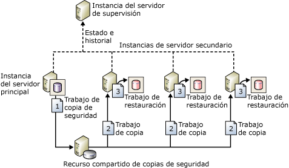

# Acerca del trasvase de registros (SQL Server)

[!INCLUDE [SQL Server](../../includes/applies-to-version/sqlserver.md)]

  [!INCLUDE[ssNoVersion](../../includes/ssnoversion-md.md)] El trasvase de registros permite enviar automáticamente copias de seguridad del registro de transacciones desde una *base de datos principal* de una instancia del *servidor principal* a una o varias *bases de datos secundarias* en instancias independientes del *servidor secundario* . Las copias de seguridad del registro de transacciones se aplican a cada una de las bases de datos secundarias de forma individual. En una tercera instancia de servidor opcional, denominado *servidor de supervisión*, se registra el historial y el estado de las operaciones de copias de seguridad y restauración y, opcionalmente, se activan alertas si estas operaciones no se producen según lo programado.  
  
 **En este tema:**  
  
-   [Ventajas](#Benefits)  
  
-   [Términos y definiciones](#TermsAndDefinitions)  
  
-   [Información general de trasvase de registros](#ComponentsAndConcepts)  
  
-   [Interoperabilidad](#Interoperability)  
  
-   [Tareas relacionadas](#RelatedTasks)  
  
##   Ventajas  
  
-   Proporciona una solución de recuperación ante desastres para una sola base de datos principal y una o más bases de datos secundarias, cada una en una instancia independiente de [!INCLUDE[ssNoVersion](../../includes/ssnoversion-md.md)].  
  
-   Admite acceso limitado de solo lectura a bases de datos secundarias (durante el intervalo entre los trabajos de restauración).  
  
-   Permite un retraso especificado por el usuario entre el momento en que el servidor principal realiza una copia de seguridad del registro de la base de datos principal y el momento en que los servidores secundarios deben restaurar (aplicar) la copia de seguridad de registros. Un retraso más largo puede ser útil, por ejemplo, si los datos se cambian en la base de datos principal de manera accidental. Si se detecta rápidamente el cambio accidental, un retraso puede permitirle recuperar los datos aún sin modificar de una base de datos secundaria antes de que el cambio se refleje en ella.  
  
##   Términos y definiciones  
 servidor principal  
 La instancia de [!INCLUDE[ssNoVersion](../../includes/ssnoversion-md.md)] que es el servidor de producción.  
  
 base de datos principal  
 La base de datos del servidor principal de la que desea realizar una copia de seguridad en otro servidor. Toda la administración de la configuración de trasvase de registros mediante [!INCLUDE[ssManStudioFull](../../includes/ssmanstudiofull-md.md)] se realiza en la base de datos principal.  
  
 servidor secundario  
 La instancia de [!INCLUDE[ssNoVersion](../../includes/ssnoversion-md.md)] donde desea mantener una copia en estado de espera activa de la base de datos principal.  
  
 base de datos secundaria  
 La copia en estado de espera activa de la base de datos principal. La base de datos secundaria debe encontrarse en el estado RECOVERING o STANDBY, que deja la base de datos disponible para acceso limitado de solo lectura.  
  
 servidor de supervisión  
 Una instancia opcional de [!INCLUDE[ssNoVersion](../../includes/ssnoversion-md.md)] que realiza un seguimiento de todos los detalles del trasvase de registros, como:  
  
-   Cuándo se realizó por última vez una copia de seguridad del registro de transacciones de la base de datos principal.  
  
-   Cuándo se realizó por última vez la copia y restauración de los archivos de copia de seguridad en los servidores secundarios.  
  
-   Información acerca de las alertas de error de copia de seguridad.  
  
> [!IMPORTANT]  
>  Una vez configurado el servidor de supervisión, no puede modificarse sin quitar primero el trasvase de registros.  
  
 trabajo de copia de seguridad  
 Un trabajo del Agente de [!INCLUDE[ssNoVersion](../../includes/ssnoversion-md.md)] que lleva a cabo la operación de copia de seguridad, registra el historial en el servidor local y el servidor de supervisión, y elimina los archivos de copia de seguridad y la información de historial antiguos. La categoría de trabajo "Copia de seguridad de trasvase de registros" se crea en la instancia del servidor principal al habilitar el trasvase de registros.  
  
 trabajo de copia  
 Un trabajo del Agente de [!INCLUDE[ssNoVersion](../../includes/ssnoversion-md.md)] que copia los archivos de copia de seguridad del servidor principal en un destino configurable del servidor secundario y registra el historial en el servidor secundario y el servidor de supervisión. La categoría de trabajo "Copia de seguridad de trasvase de registros" se crea en cada servidor secundario en una configuración de trasvase de registros al habilitar el trasvase de registros.  
  
 trabajo de restauración  
 Un trabajo del Agente de [!INCLUDE[ssNoVersion](../../includes/ssnoversion-md.md)] que restaura los archivos de copia de seguridad copiados en las bases de datos secundarias. Registra el historial en el servidor local y el servidor de supervisión, y elimina los archivos de copia de seguridad y la información de historial antiguos. La categoría de trabajo "Restauración de trasvase de registros" se crea en la instancia del servidor secundario al habilitar el trasvase de registros en una base de datos.  
  
 trabajo de alerta  
 Un trabajo del Agente de [!INCLUDE[ssNoVersion](../../includes/ssnoversion-md.md)] que activa alertas para las bases de datos principal y secundaria cuando una operación de copia de seguridad o restauración no se completa correctamente según un umbral especificado. La categoría de trabajo "Alerta de trasvase de registros" se crea en la instancia del servidor de supervisión al habilitar el trasvase de registros en una base de datos.  
  
> [!TIP]  
>  Para cada alerta, debe especificar un número de alerta. Además, asegúrese de configurar la alerta para notificar a un operador cuándo se activa una alerta.  
  
##   Información general de trasvase de registros  
 El trasvase de registros consta de tres operaciones:  
  
1.  Realizar una copia de seguridad del registro de transacciones en la instancia del servidor principal.  
  
2.  Copiar el archivo de registro de transacciones en la instancia del servidor secundario.  
  
3.  Restaurar la copia de seguridad de registros en la instancia del servidor secundario.  
  
 El registro se puede trasvasar a varias instancias del servidor secundario En ese caso, las operaciones 2 y 3 se repiten para cada instancia del servidor secundario.  
  
 En una configuración de trasvase de registros no se realiza automáticamente la conmutación por error del servidor principal al servidor secundario. Si la base de datos principal deja de estar disponible, cualquiera de las bases de datos secundarias se puede poner en línea manualmente.  
  
 Puede utilizar una base de datos secundaria para la generación de informes.  
  
 Además, puede configurar alertas para la configuración de trasvase de registros.  
  
### Una configuración de trasvase de registros típica  
 La siguiente ilustración muestra una configuración de trasvase de registros con la instancia del servidor principal, tres instancias del servidor secundario y una instancia del servidor de supervisión. La ilustración presenta los pasos realizados por los trabajos de copia de seguridad, copia y restauración del siguiente modo:  
  
1.  La instancia del servidor principal ejecuta el trabajo de copia de seguridad del registro de transacciones en la base de datos principal. A continuación, esta instancia de servidor coloca la copia de seguridad del registro en un archivo principal de copias de seguridad de registros que se envía a la carpeta de copia de seguridad.  En esta ilustración, la carpeta de copia de seguridad es un directorio compartido: el *recurso compartido de copia de seguridad*.  
  
2.  Cada una de las tres instancias del servidor secundario ejecuta su propio trabajo de copia para copiar el archivo principal de copia de seguridad de registros a su propia carpeta de destino local.  
  
3.  Cada instancia del servidor secundario ejecuta su propio trabajo de restauración para restaurar la copia de seguridad del registro desde la carpeta de destino local a la base de datos secundaria local.  
  
 Las instancias del servidor principal y secundario envían su propio historial y estado a la instancia del servidor de supervisión.  
  
   
  
##   Interoperabilidad  
 El trasvase de registros se puede usar con las siguientes características o componentes de [!INCLUDE[ssNoVersion](../../includes/ssnoversion-md.md)]:  
  
-   [Requisitos previos para migrar desde grupos de trasvase de registros a grupos de disponibilidad AlwaysOn &#40;SQL Server&#41;](../../database-engine/availability-groups/windows/prereqs-migrating-log-shipping-to-always-on-availability-groups.md)  
  
-   [Crear reflejo de la base de datos y trasvase de registros &#40;SQL Server&#41;](../../database-engine/database-mirroring/database-mirroring-and-log-shipping-sql-server.md)  
  
-   [Trasvase de registros y replicación &#40;SQL Server&#41;](../../database-engine/log-shipping/log-shipping-and-replication-sql-server.md)  
  
> [!NOTE]  
>  [!INCLUDE[ssHADR](../../includes/sshadr-md.md)] y la creación de reflejo de la base de datos son mutuamente excluyentes. Una base de datos configurada para una de estas características no puede configurarse para la otra.  
  
##   Tareas relacionadas  
  
-   [Actualización del trasvase de registros a SQL Server 2016 &#40;Transact-SQL&#41;](../../database-engine/log-shipping/upgrading-log-shipping-to-sql-server-2016-transact-sql.md)  
  
-   [Configurar el trasvase de registros &#40;SQL Server&#41;](../../database-engine/log-shipping/configure-log-shipping-sql-server.md)  
  
-   [Agregar una base de datos secundaria a la configuración de trasvase de registros &#40;SQL Server&#41;](../../database-engine/log-shipping/add-a-secondary-database-to-a-log-shipping-configuration-sql-server.md)  
  
-   [Quitar una base de datos secundaria desde una configuración de trasvase de registros &#40;SQL Server&#41;](../../database-engine/log-shipping/remove-a-secondary-database-from-a-log-shipping-configuration-sql-server.md)  
  
-   [Quitar el trasvase de registros &#40;SQL Server&#41;](../../database-engine/log-shipping/remove-log-shipping-sql-server.md)  
  
-   [Ver el informe de trasvase de registros &#40;SQL Server Management Studio&#41;](../../database-engine/log-shipping/view-the-log-shipping-report-sql-server-management-studio.md)  
  
-   [Supervisar el trasvase de registros &#40;Transact-SQL&#41;](../../database-engine/log-shipping/monitor-log-shipping-transact-sql.md)  
  
-   [Conmutar por error a una base de datos secundaria de trasvase de registros &#40;SQL Server&#41;](../../database-engine/log-shipping/fail-over-to-a-log-shipping-secondary-sql-server.md)  
  
-   [Conmutar por error a una base de datos secundaria de trasvase de registros &#40;SQL Server&#41;](../../database-engine/log-shipping/fail-over-to-a-log-shipping-secondary-sql-server.md)  
  
-   [Administración de inicios de sesión y trabajos tras la conmutación de roles &#40;SQL Server&#41;](../../sql-server/failover-clusters/management-of-logins-and-jobs-after-role-switching-sql-server.md)  
  
## Consulte también  
 [Información general de los grupos de disponibilidad AlwaysOn &#40;SQL Server&#41;](../../database-engine/availability-groups/windows/overview-of-always-on-availability-groups-sql-server.md)  
  
  
