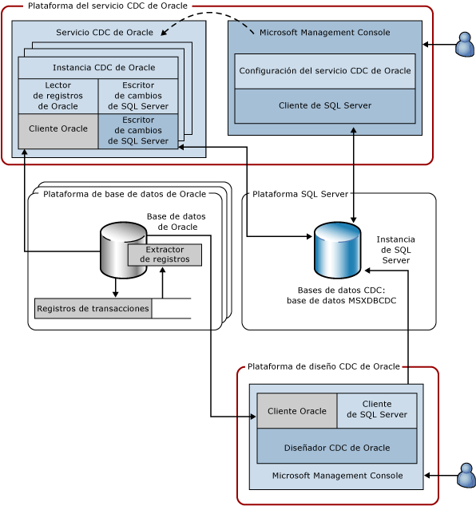

# Servicio de captura de datos modificados para Oracle de Attunity (Arquitectura del sistema)

[!INCLUDE[ssis-appliesto](../../includes/ssis-appliesto-ssvrpluslinux-asdb-asdw-xxx.md)]

  El servicio CDC para Oracle captura los cambios realizados en las tablas seleccionadas de una o varias bases de datos de Oracle de origen en bases de datos CDC de [!INCLUDE[ssNoVersion](../../includes/ssnoversion-md.md)] ubicadas en una instancia de [!INCLUDE[ssNoVersion](../../includes/ssnoversion-md.md)] . En el diagrama siguiente se muestran los componentes que constituyen el servicio CDC para Oracle.  
  
   
  
 Esta ilustración muestra cuatro plataformas que se emplean. En muchos casos, estas plataformas se pueden superponer; sin embargo, este diagrama representa un caso de uso estándar. Por ejemplo, conviene que las bases de datos de Oracle y de [!INCLUDE[ssNoVersion](../../includes/ssnoversion-md.md)] se ejecuten en equipos diferentes y que no se compartan con la plataforma del servicio CDC de Oracle o con la plataforma desde la que se diseñe el servicio CDC. Las plataformas mostradas en esta ilustración son:  
  
-   El servicio CDC de Oracle: puede ser cualquier equipo compatible con Windows donde se instale y ejecute el servicio CDC de Oracle. Esta plataforma también puede representar un nodo de clúster en un clúster de conmutación por error de Microsoft (las configuraciones de alta disponibilidad se describen más adelante en este documento).  
  
-   Oracle Database: puede ser cualquier equipo donde se ejecute una versión compatible de la base de datos Oracle. Esto incluye cualquier equipo que ejecute Windows, Linux o cualquier otro sistema operativo compatible con la versión de la base de datos de Oracle instalada. Tenga en cuenta que el diagrama muestra esta plataforma en plural porque un único servicio CDC de Oracle puede capturar cambios de varias bases de datos de origen de Oracle.  
  
-   [!INCLUDE[ssNoVersion](../../includes/ssnoversion-md.md)]: puede ser cualquier equipo donde se ejecute la base de datos de [!INCLUDE[ssNoVersion](../../includes/ssnoversion-md.md)] de destino (se ejecuta una SKU de [!INCLUDE[ssCurrent](../../includes/sscurrent-md.md)] admitida). Un servicio CDC de Oracle admite un destino de [!INCLUDE[ssNoVersion](../../includes/ssnoversion-md.md)] donde almacena las tablas de cambios y la configuración del servicio. La plataforma [!INCLUDE[ssNoVersion](../../includes/ssnoversion-md.md)] también puede representar una instancia en clúster de [!INCLUDE[ssCurrent](../../includes/sscurrent-md.md)] o una instancia reflejada de [!INCLUDE[ssCurrent](../../includes/sscurrent-md.md)] que use la característica **AlwaysOn** .  
  
-   CDC Designer: puede ser cualquier equipo compatible con Windows que pueda acceder a la base de datos Oracle de origen y a la base de datos de [!INCLUDE[ssNoVersion](../../includes/ssnoversion-md.md)] de destino.  
  
 En la tabla siguiente se describen los componentes que se ejecutan en las cuatro plataformas descritas anteriormente.  
  
|Componente/Descripción|El componente consta de:|  
|----------------------------|----------------------------|  
|Servicio CDC de Oracle: es un servicio de Windows donde tiene lugar la actividad de captura de datos modificados.|Instancia CDC de Oracle: un subproceso del servicio CDC de Oracle que controla la actividad de captura de datos modificados para una única base de datos Oracle de origen (hay una instancia CDC de Oracle por base de datos Oracle de origen).|  
||Lector de registros de Oracle: lee registros de transacciones de Oracle mediante el cliente de Oracle.|  
||Cliente de Oracle: el cliente Oracle Instant usado para la comunicación con Oracle. Se trata de un requisito previo que se debe obtener de Oracle e instalar antes de instalar el servicio CDC de Oracle.|  
||[!INCLUDE[ssNoVersion](../../includes/ssnoversion-md.md)] Escritor de cambios: escribe los cambios confirmados realizados en la tabla de Oracle capturada en las tablas de cambios de [!INCLUDE[ssNoVersion](../../includes/ssnoversion-md.md)]. Este componente también mantiene ese estado de captura dentro de la base de datos de [!INCLUDE[ssNoVersion](../../includes/ssnoversion-md.md)] de destino.|  
||[!INCLUDE[ssNoVersion](../../includes/ssnoversion-md.md)]Cliente ODBC: el cliente nativo de Microsoft de [!INCLUDE[ssCurrent](../../includes/sscurrent-md.md)]. Se trata de un componente que es un requisito previo y que se debe obtener de Microsoft e instalar antes de instalar el servicio CDC de Oracle.|  
|Configuración de Oracle CDC Service: complemento de Microsoft Management Console que crea el servicio de Windows y establece su configuración.|[!INCLUDE[ssNoVersion](../../includes/ssnoversion-md.md)] Cliente: cliente ADO.NET para SQL que se incluye con la versión 4 de .NET Framework.|  
|Oracle Database: base de datos de origen de Oracle de la que se capturan los cambios en las tablas seleccionadas.|Extractor de registros: componente de Oracle a través del cual se leen los registros de transacciones de Oracle.|  
||Registros de transacciones: registros de recuperación de datos de Oracle en línea y archivados usados por Oracle para garantizar que la base de datos puede revertir las transacciones y recuperarse de errores (en este caso, la base de datos Oracle debe ejecutarse en modo archive-log).|  
|[!INCLUDE[ssNoVersion](../../includes/ssnoversion-md.md)] Instancia: instancia de [!INCLUDE[ssNoVersion](../../includes/ssnoversion-md.md)] donde se hospedan las bases de datos CDC. Puede ser una instancia de [!INCLUDE[ssNoVersion](../../includes/ssnoversion-md.md)] en clúster (clúster de conmutación por error) o una base de datos reflejada (AlwaysOn).|La base de datos MSXDBCDC: base de datos donde se mantiene información sobre los servicios CDC que funcionan con esta instancia de [!INCLUDE[ssNoVersion](../../includes/ssnoversion-md.md)]. También mantiene información sobre las instancias CDC de Oracle controladas por cada servicio CDC. Esta base de datos se crea como parte del proceso de creación del servicio CDC.|  
||Las bases de datos CDC: bases de datos de [!INCLUDE[ssNoVersion](../../includes/ssnoversion-md.md)] que almacenan los cambios realizados en una de las bases de datos de origen de Oracle. Las bases de datos CDC están habilitadas para CDC de [!INCLUDE[ssNoVersion](../../includes/ssnoversion-md.md)] , por lo que tienen las tablas y funciones CDC de [!INCLUDE[ssNoVersion](../../includes/ssnoversion-md.md)] , lo que simplifica el uso de cambios procedentes de Oracle.|  
|Oracle CDC Designer: complemento de Microsoft Management Console que ayuda a crear instancias CDC de Oracle. Use este complemento para seleccionar las tablas y columnas que se van a capturar, proporcionar información de conexión de Oracle y administrar el ciclo de vida de las instancias CDC.|[!INCLUDE[ssNoVersion](../../includes/ssnoversion-md.md)] Cliente: cliente ADO.NET para SQL que se incluye con la versión 4 de .NET Framework.|  
||Cliente de Oracle: el cliente Oracle Instant usado para la comunicación con Oracle. Se trata de un componente que es un requisito previo y que se debe obtener de Oracle e instalar antes de instalar el servicio CDC de Oracle.|  
  
 El servicio CDC de Oracle y sus instancias CDC de Oracle secundarias solo pueden comunicarse con las bases de datos de origen de Oracle y con la instancia de [!INCLUDE[ssNoVersion](../../includes/ssnoversion-md.md)] de destino como clientes. No realizan escuchas activas en una red y otros protocolos. El servicio CDC de Oracle supervisa las bases de datos CDC para ver si hay cambios de configuración y actualiza su funcionamiento según la configuración actualizada.  
  
  
