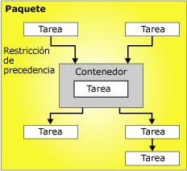

# Flujo de control
  Un paquete consta de un flujo de control y, opcionalmente, uno o varios flujos de datos. [!INCLUDE[ssNoVersion](../../includes/ssnoversion-md.md)] [!INCLUDE[ssISnoversion](../../includes/ssisnoversion-md.md)] proporciona tres tipos diferentes de elementos de flujo de control: los contenedores que proporcionan las estructuras de los paquetes, las tareas que proporcionan la funcionalidad y las restricciones de precedencia que conectan los ejecutables, los contenedores y las tareas en un flujo de control ordenado.  
  
 Para obtener más información, consulte [Precedence Constraints](../../integration-services/control-flow/precedence-constraints.md), [Integration Services Containers](../../integration-services/control-flow/integration-services-containers.md)y [Integration Services Tasks](../../integration-services/control-flow/integration-services-tasks.md).  
  
 El siguiente diagrama muestra un flujo de control que posee un contenedor y seis tareas. Cinco de las tareas se definen en el nivel de paquete y una de ellas se define en el nivel de contenedor. La tarea se encuentra dentro de un contenedor.  
  
   
  
 La arquitectura de [!INCLUDE[ssISnoversion](../../includes/ssisnoversion-md.md)] admite el anidamiento de contenedores, y un flujo de control puede incluir varios niveles de contenedores anidados. Por ejemplo, un paquete puede incluir un contenedor tal como un contenedor de bucles Foreach, que a su vez puede contener otro contenedor de bucles Foreach y así sucesivamente.  
  
 Los controladores de eventos también poseen flujos de control, que se generan con los mismos tipos de elementos de flujo de control.  
  
## Implementación de flujo de control  
 Puede crear el flujo de control en un paquete mediante la pestaña **Flujo de control** en el Diseñador [!INCLUDE[ssIS](../../includes/ssis-md.md)] . Cuando la pestaña **Flujo de control** está activa, el cuadro de herramientas enumera las tareas y los contenedores que se pueden agregar al flujo de control.  
  
 El siguiente diagrama muestra el flujo de control de un paquete simple en el diseñador de flujo de control. El flujo de control que se muestra en el diagrama se compone de tres tareas de nivel de paquete y un contenedor de nivel de paquete que contiene tres tareas. Las tareas y el contenedor se conectan mediante restricciones de precedencia.  
  
   
  
 Crear un flujo de control incluye las siguientes tareas:  
  
-   Agregar contenedores que implementan flujos de trabajo repetidos en un paquete o dividen un flujo de control en subconjuntos.  
  
-   Agregar tareas que admiten flujo de datos, preparan datos, realizan flujo de trabajo y funciones de inteligencia empresarial e implementan script.  
  
     [!INCLUDE[ssISnoversion](../../includes/ssisnoversion-md.md)] incluye una serie de tareas que se pueden usar para crear un flujo de control que cumple con los requisitos empresariales del paquete. Si el paquete tiene que trabajar con datos, el flujo de control debe incluir por lo menos una tarea Flujo de datos. Por ejemplo, es posible que un paquete deba extraer datos, agregar valores de datos y luego escribir los resultados en un origen de datos.  Para más información, vea [Tareas de Integration Services](../../integration-services/control-flow/integration-services-tasks.md) y [Agregar o eliminar tareas o contenedores en un flujo de control](../../integration-services/control-flow/add-or-delete-a-task-or-a-container-in-a-control-flow.md).  
  
-   Conectar contenedores y tareas en un flujo de control ordenado mediante restricciones de precedencia.  
  
     Después de agregar una tarea o contenedor a la superficie de diseño de la pestaña **Flujo de control** , el Diseñador [!INCLUDE[ssIS](../../includes/ssis-md.md)] agrega automáticamente un conector al elemento. Si un paquete incluye dos o más elementos, tareas o contenedores, puede combinarlos en un flujo de control arrastrando sus conectores desde un elemento a otro.  
  
     El conector entre dos elementos representa una restricción de precedencia. Una restricción de precedencia define la relación entre dos elementos conectados. Especifica el orden en que las tareas y contenedores se ejecutan en el tiempo de ejecución y las condiciones bajo las cuales se ejecutan las tareas y contenedores. Por ejemplo, una restricción de precedencia puede especificar que una tarea debe ejecutarse correctamente para que la próxima tarea en el flujo de control pueda ejecutarse. Para obtener más información, vea [Restricciones de precedencia](../../integration-services/control-flow/precedence-constraints.md).  
  
-   Agregar administradores de conexión.  
  
     Muchas tareas requieren una conexión a un origen de datos y tiene que agregar al paquete los administradores de conexión que la tarea requiere. Según el tipo de enumerador que usa, el contenedor de bucles Foreach también puede requerir un administrador de conexiones. Puede agregar los administradores de conexión a medida que genera el flujo de control elemento por elemento o antes de empezar a generar el flujo de control. Para más información, vea [Conexiones de Integration Services &#40;SSIS&#41;](../../integration-services/connection-manager/integration-services-ssis-connections.md) y [Crear administradores de conexiones](http://msdn.microsoft.com/library/6ca317b8-0061-4d9d-b830-ee8c21268345).  
  
 El Diseñador [!INCLUDE[ssIS](../../includes/ssis-md.md)] también incluye varias características de tiempo de diseño que se pueden usar para administrar la superficie de diseño y hacer que el flujo de control se autodocumente.  
  
## Related Tasks  
  
-   [Agregar o eliminar tareas o contenedores en un flujo de control](../../integration-services/control-flow/add-or-delete-a-task-or-a-container-in-a-control-flow.md)  
  
-   [Establecer las propiedades de tareas o contenedores](http://msdn.microsoft.com/library/52d47ca4-fb8c-493d-8b2b-48bb269f859b)  
  
-   [Agrupar o desagrupar componentes](../../integration-services/group-or-ungroup-components.md)  
  
  
