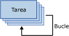

# Contenedor de bucles For
  El contenedor de bucles For define un flujo de control que se repite en un paquete. La implementación del bucle es similar a la estructura de bucle **For** de los lenguajes de programación. En cada repetición del bucle, el contenedor de bucles For evalúa una expresión y repite el flujo de trabajo hasta que la expresión se evalúe como **False**.  
  
 El contenedor de bucles For usa los elementos siguientes para definir el bucle:  
  
-   Una expresión de inicialización opcional que asigna valores a los contadores de bucle.  
  
-   Una expresión de evaluación que contiene la expresión usada para comprobar si el bucle debe detenerse o continuar.  
  
-   Una expresión de iteración opcional que incrementa o disminuye el contador del bucle.  
  
 El siguiente diagrama muestra un contenedor de bucles For con una tarea Enviar correo. Si la expresión de inicialización es `@Counter = 0`, la expresión de evaluación es `@Counter < 4`y la expresión de iteración es `@Counter = @Counter + 1`, el bucle se repetirá cuatro veces y enviará cuatro mensajes de correo electrónico.  
  
   
  
 Las expresiones deben ser expresiones de [!INCLUDE[ssNoVersion](../../includes/ssnoversion-md.md)] [!INCLUDE[ssISnoversion](../../includes/ssisnoversion-md.md)] válidas.  
  
 Para crear las expresiones de inicialización y asignación, puede utilizar el operador de asignación (=). La gramática de expresiones de Integration Services no admite este operador; solo se puede utilizar en las expresiones de inicialización y asignación del contenedor de bucles For. Cualquier expresión que use el operador de asignación necesita tener la sintaxis `@Var = <expression>`, donde **Var** es una variable de tiempo de ejecución y \<expression> es una expresión que sigue las reglas de sintaxis de la expresión [!INCLUDE[ssIS](../../includes/ssis-md.md)]. La expresión puede incluir variables, literales y cualquier operador o función compatible con la gramática de expresiones de SSIS. La evaluación de la expresión debe devolver un tipo de datos que se pueda convertir al tipo de datos de la variable.  
  
 Un contenedor de bucles For solo puede tener una expresión de evaluación. Esto significa que el contenedor de bucles For ejecutará todos los elementos de flujo de control el mismo número de veces. Como el contenedor de bucles For puede incluir otros contenedores de bucles For, es posible generar bucles anidados e implementar bucles complejos en paquetes.  
  
 Puede establecer una propiedad de transacción en el contenedor de bucles For para definir una transacción para un subconjunto del flujo de control del paquete. De esta manera, puede administrar las transacciones en mayor detalle. Por ejemplo, si un contenedor de bucles For repite un flujo de control que actualiza los datos de una tabla varias veces, puede configurar el bucle For y su flujo de control para que utilicen una transacción, a fin de asegurarse de que si no se actualizan todos los datos correctamente, no se actualice ningún dato. Para más información, vea [Transacciones de Integration Services](../../integration-services/integration-services-transactions.md).  
  
## Agregar iteración a un flujo de control con el contenedor de bucles Para
  [!INCLUDE[ssISnoversion](../../includes/ssisnoversion-md.md)] incluye el contenedor de bucles Para, un elemento de flujo de control que simplifica la inclusión de bucles que repiten condicionalmente un flujo de control en un paquete. Para más información, vea [Contenedor de bucles For](../../integration-services/control-flow/for-loop-container.md).  
  
 El contenedor de bucles For evalúa una condición en cada iteración del bucle y se detiene cuando la condición es false. El contenedor de bucles For incluye expresiones para inicializar el bucle, especificando la condición de evaluación que detiene la ejecución del flujo de control repetido y asignando un valor a una expresión que actualiza el valor con el que se compara la condición de evaluación. Debe proporcionar una condición de evaluación, pero las expresiones de inicialización y asignación son opcionales.  
  
 El contenedor de bucles For no proporciona ninguna funcionalidad, sino que proporciona solo la estructura sobre la que se genera un flujo de control repetible. Para proporcionar la funcionalidad del contenedor, debe incluir por lo menos una tarea en el contenedor de bucles For. Para más información, consulte [Integration Services Tasks](../../integration-services/control-flow/integration-services-tasks.md).  
  
 El contenedor de bucles For puede incluir un flujo de control con varias tareas y otros contenedores. Agregar tareas y contenedores a un contenedor de bucles For es similar a agregarlas a un paquete, salvo que las tareas y contenedores se arrastran al contenedor de bucles For en lugar de al paquete. Si el contenedor de bucles For incluye más de una tarea o contenedor, puede conectarlos mediante restricciones de precedencia, tal y como se hace en un paquete. Para obtener más información, vea [Restricciones de precedencia](../../integration-services/control-flow/precedence-constraints.md).  
  
## Agregar un contenedor de bucles Para en un flujo de control  
  
1.  Agregue el contenedor de bucles For al paquete. Para más información, vea [Agregar o eliminar tareas o contenedores en un flujo de control](../../integration-services/control-flow/add-or-delete-a-task-or-a-container-in-a-control-flow.md).  
  
2.  Agregue tareas y contenedores al contenedor de bucles For. Para más información, vea [Agregar o eliminar tareas o contenedores en un flujo de control](../../integration-services/control-flow/add-or-delete-a-task-or-a-container-in-a-control-flow.md).  
  
3.  Conecte tareas y contenedores en el contenedor de bucles For mediante restricciones de precedencia. Para más información, vea [Conectar tareas y contenedores mediante una restricción de precedencia predeterminada](http://msdn.microsoft.com/library/8f31f15f-98ff-4c35-b41f-8b8cfd148d75).  
  
4.  Configure el contenedor de bucles For. Para más información, vea [Configurar un contenedor de bucles For](http://msdn.microsoft.com/library/b9cd7ea7-b198-4a35-8b16-6acf09611ca5).  

##  Configurar el contenedor de bucles Para
En este procedimiento se describe cómo configurar un contenedor de bucles For mediante el cuadro de diálogo **Editor de bucles For** .  
  
 Para obtener un ejemplo del contenedor de bucles For, vea [Bucles de SSIS que no producen error](http://go.microsoft.com/fwlink/?LinkId=240295) en bimonkey.com.  
  
1.  En [!INCLUDE[ssBIDevStudioFull](../../includes/ssbidevstudiofull-md.md)], haga doble clic en el contenedor de bucles For para abrir el **Editor de bucles For**.  
  
2.  Opcionalmente, modifique el nombre y la descripción del contenedor de bucles For.  
  
3.  También puede escribir una expresión de inicialización en el cuadro de texto **InitExpression** .  
  
4.  Escriba una expresión de evaluación en el cuadro de texto **EvalExpression** .  
  
    > [!NOTE]  
    >  La expresión debe evaluarse como un valor booleano. Cuando la expresión se evalúa como **false**, el bucle deja de ejecutarse.  
  
5.  Opcionalmente, escriba una expresión de asignación en el cuadro de texto **AssignExpression** .  
  
6.  También puede hacer clic en **Expresiones** y, en la página **Expresiones** , crear expresiones de propiedades para las propiedades del contenedor de bucles For. Para más información, vea [Agregar o cambiar una expresión de propiedad](../../integration-services/expressions/add-or-change-a-property-expression.md).  
  
7.  Haga clic en **Aceptar** para cerrar el **Editor de bucles For**.  

## Cuadro de diálogo Editor de bucles Para
Use la página **Bucle For** del cuadro de diálogo **Editor de bucles For** para configurar un bucle que repita un flujo de trabajo hasta que una condición específica se evalúe como False.  
  
 Para obtener información acerca del contenedor de bucles For y cómo utilizarlo en paquetes, vea [For Loop Container](../../integration-services/control-flow/for-loop-container.md).  
  
### Opciones  
 **InitExpression**  
 Opcionalmente, escriba una expresión que inicialice los valores utilizados por el bucle.  
  
 **EvalExpression**  
 Escriba una expresión para evaluar si el bucle debe detenerse o continuar.  
  
 **AssignExpression**  
 Opcionalmente, escriba una expresión que cambie una condición cada vez que se repita el bucle.  
  
 **Nombre**  
 Escriba un nombre único para el contenedor de bucles For. Este nombre se utiliza como etiqueta en el icono de tarea.  
  
> [!NOTE]  
>  Los nombres de objeto deben ser únicos en un paquete.  
  
 **Descripción**  
 Escriba una descripción del contenedor de bucles For.  
 
## Usar expresiones con el contenedor de bucles Para  
 Al configurar el contenedor de bucles For especificando una condición de evaluación, valor de inicialización o valor de asignación, puede usar literales o expresiones.  
  
 Las expresiones pueden incluir variables. La ventaja de usar variables es que se pueden actualizar en tiempo de ejecución, lo que hace que los paquetes sean más flexibles y fáciles de administrar. La longitud máxima de una expresión es 4000 caracteres.  
  
 Al especificar una variable en una expresión, el nombre de la variable debe venir precedido por el signo (@). Por ejemplo, en el caso de una variable llamada **Counter**, escriba @Counter en la expresión utilizada por el contenedor de bucles Para. Si se incluye la propiedad de espacio de nombres en la variable, debe escribir la variable y el espacio de nombres entre paréntesis. Por ejemplo, en el caso de una variable **Counter** en el espacio de nombres **MyNamespace**, escriba [@MyNamespace::Counter].  
  
 Las variables que usa el contenedor de bucles For se deben definir en el ámbito del contenedor de bucles For o en el ámbito de cualquier contenedor que se encuentre más arriba en la jerarquía de contenedores de paquetes. Por ejemplo, un contenedor de bucles For puede usar variables definidas en su ámbito y también variables definidas en el ámbito de paquetes. Para más información, vea [Variables de Integration Services &#40;SSIS&#41;](../../integration-services/integration-services-ssis-variables.md) y [Usar variables en paquetes](http://msdn.microsoft.com/library/7742e92d-46c5-4cc4-b9a3-45b688ddb787).  
  
 La gramática de expresiones de [!INCLUDE[ssIS](../../includes/ssis-md.md)] proporciona un conjunto completo de operadores y funciones para implementar expresiones complejas usadas para la evaluación, inicialización o asignación. Para más información, vea [Expresiones de Integration Services &#40;SSIS&#41;](../../integration-services/expressions/integration-services-ssis-expressions.md).  
  
  
## Ver también  
 [Flujo de control](../../integration-services/control-flow/control-flow.md)   
 [Expresiones de Integration Services &#40;SSIS&#41;](../../integration-services/expressions/integration-services-ssis-expressions.md)  
  
  
