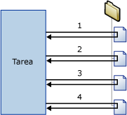

# Contenedor Foreach Loop
  El contenedor de bucles Foreach define un flujo de control que se repite en un paquete. La implementación del bucle es similar a la estructura de bucle **Foreach** de los lenguajes de programación. En un paquete, los bucles se habilitan mediante un enumerador Foreach.  El contenedor de bucles Foreach repite el flujo de control para cada miembro de un enumerador especificado.  
  
 [!INCLUDE[ssNoVersion](../../includes/ssnoversion-md.md)] [!INCLUDE[ssISnoversion](../../includes/ssisnoversion-md.md)] proporciona los siguientes tipos de enumerador:  
  
-   Enumerador de ADO para Foreach, para enumerar filas de tablas. Por ejemplo, puede obtener las filas de un conjunto de registros ADO.  
  
     El destino de conjunto de registros guarda los datos en memoria, en un conjunto de registros que se almacena en una variable de paquete del tipo de datos **Object** . Normalmente usa un contenedor de bucles Foreach con el enumerador Foreach ADO para procesar una fila del conjunto cada vez. La variable especificada para el enumerador Foreach ADO debe ser del tipo de datos Object. Para obtener más información acerca del destino de conjunto de registros, vea [Usar un destino de conjunto de registros](../../integration-services/data-flow/use-a-recordset-destination.md).  
  
-   Enumerador de conjunto de filas del esquema para Foreach de ADO.NET, para enumerar la información de esquema sobre un origen de datos. Por ejemplo, puede enumerar y obtener una lista de tablas de la base de datos [!INCLUDE[ssSampleDBnormal](../../includes/sssampledbnormal-md.md)] [!INCLUDE[ssNoVersion](../../includes/ssnoversion-md.md)] .  
  
-   Enumerador Foreach File para enumerar los archivos de una carpeta. El enumerador puede recorrer subcarpetas. Por ejemplo, puede leer todos los archivos de la carpeta y subcarpetas de Windows que tengan la extensión de nombre de archivo *.log.  
  
-   Enumerador de variable para Foreach, para enumerar el objeto enumerable contenido en una variable especificada. El objeto enumerable puede ser una matriz, una **DataTable**de ADO.NET, un enumerador de [!INCLUDE[ssISnoversion](../../includes/ssisnoversion-md.md)] , etc. Por ejemplo, puede enumerar los valores de una matriz que contenga los nombres de los servidores.  
  
-   Enumerador de elementos para Foreach para enumerar elementos que son colecciones. Por ejemplo, puede enumerar los nombres de los ejecutables y directorios de trabajo que utiliza una tarea Ejecutar proceso.  
  
-   Enumerador de lista de nodos para Foreach para enumerar el conjunto de resultados de una expresión del Lenguaje de rutas XML (XPath). Por ejemplo, esta expresión enumera y obtiene una lista de todos los autores de la época clásica: `/authors/author[@period='classical']`.  
  
-   Enumerador de SMO para Foreach para enumerar objetos de Objetos de administración de [!INCLUDE[ssNoVersion](../../includes/ssnoversion-md.md)] (SMO). Por ejemplo, puede enumerar y obtener una lista de vistas de una base de datos de [!INCLUDE[ssNoVersion](../../includes/ssnoversion-md.md)] .  
  
-   Enumerador de archivos HDFS para Foreach para enumerar los archivos HDFS en la ubicación especificada de HDFS.  
  
-   Enumerador de blobs de Azure para Foreach usado para enumerar blobs en un contenedor de blobs en Almacenamiento de Azure.  

-   Enumerador de archivos de ADLS para el bucle Para cada uno para enumerar los archivos en un directorio en Azure Data Lake Store.
  
 El siguiente diagrama muestra un contenedor de bucles Foreach que tiene una tarea Sistema de archivos. El bucle Foreach utiliza el Enumerador de archivos para Foreach y la tarea Sistema de archivos está configurada para copiar un archivo. Si la carpeta especificada por el enumerador contiene cuatro archivos, el bucle se repetirá cuatro veces y copiará cuatro archivos.  
  
   
  
 Puede utilizar una combinación de variables y expresiones de propiedades para actualizar la propiedad del objeto de paquete con el valor de colección de enumerador. Primero debe asignar el valor de colección a una variable definida por el usuario y después debe implementar una expresión de propiedad en la propiedad que utiliza la variable. Por ejemplo, el valor de la colección del Enumerador de archivos para Foreach se asigna a una variable denominada **MyFile** , que se usa en la expresión de propiedad para la propiedad Subject de una tarea Enviar correo. Cuando se ejecuta el paquete, la propiedad Subject se actualiza con el nombre de un archivo cada vez que se repite el bucle. Para más información, vea [Usar expresiones de propiedad en paquetes](../../integration-services/expressions/use-property-expressions-in-packages.md).  
  
 Las variables asignadas al valor de colección del enumerador también se pueden usar en expresiones y en scripts.  
  
 Un contenedor de bucles Foreach puede incluir varias tareas y contenedores, pero solamente puede usar un tipo de enumerador. Si el contenedor de bucles Foreach incluye varias tareas, puede asignar el valor de colección del enumerador a varias propiedades de cada tarea.  
  
 Puede establecer un atributo de transacción en el contenedor de bucles Foreach para definir una transacción para un subconjunto del flujo de control del paquete. De esta manera, puede administrar las transacciones en el nivel del contenedor de bucles Foreach en lugar de hacerlo en el nivel de paquete. Por ejemplo, si un contenedor de bucles Foreach repite un flujo de control que actualiza las dimensiones y las tablas de hechos de un esquema de estrella, puede configurar una transacción para asegurarse de que o se actualizan todas las tablas de hechos correctamente o no se actualiza ninguna. Para más información, vea [Transacciones de Integration Services](../../integration-services/integration-services-transactions.md).  
  
## Tipos de enumerador  
 Los enumeradores son configurables. Deberá proporcionar información diferente en función del enumerador.  
  
 En la tabla siguiente se resume la información requerida por cada tipo de enumerador.  
  
|Enumerador|Requisitos de configuración|  
|----------------|--------------------------------|  
|ADO para Foreach|Especifique la variable de origen del objeto ADO y el modo de enumerador. La variable debe ser del tipo de datos Object.|  
|Conjunto de filas del esquema para Foreach de ADO.NET|Especifique la conexión a una base de datos y el esquema que se va a enumerar.|  
|Archivos para Foreach|Especifique una carpeta y los archivos que se van a enumerar, el formato de nombre de archivo de los archivos recuperados y si hay que recorrer las subcarpetas.|  
|Variable para Foreach|Especifique la variable que contiene los objetos que se van a enumerar.|  
|Foreach Item|Defina los elementos de la colección Foreach Item, incluidas las columnas y los tipos de datos de columna.|  
|Lista de nodos para Foreach|Especifique el origen del documento XML y configure la operación de XPath.|  
|SMO para Foreach|Especifique la conexión a una base de datos y los objetos SMO que se van a enumerar.|  
|Enumerador de archivos HDFS para Foreach|Especifique una carpeta y los archivos que se van a enumerar, el formato de nombre de archivo de los archivos recuperados y si hay que recorrer las subcarpetas.|  
|Por cada blob de Azure|Deberá especificar el contenedor de blobs de Azure que contendrá los blobs que se van a enumerar.|  
|Archivo de ADLS para Para cada uno|Especifique el directorio de Azure Data Lake Store que contiene los archivos que hay que enumerar.|

## Agregar enumeración a un flujo de control con un contenedor de bucles Para cada uno
 [!INCLUDE[ssISnoversion](../../includes/ssisnoversion-md.md)] incluye el contenedor de bucles Foreach, un elemento de flujo de control que simplifica la inclusión de una construcción de bucle que enumera archivos y objetos en el flujo de control de un paquete. Para más información, consulte [Foreach Loop Container](../../integration-services/control-flow/foreach-loop-container.md).  
  
 El contenedor de bucles Foreach no proporciona una funcionalidad, sino solamente la estructura en la que se genera el flujo de control repetible, se especifica un tipo de enumerador y se configura el enumerador. Para proporcionar la funcionalidad del contenedor, debe incluir por lo menos una tarea en el contenedor de bucles Foreach. Para más información, consulte [Integration Services Tasks](../../integration-services/control-flow/integration-services-tasks.md).  
  
 El contenedor de bucles Foreach puede incluir un flujo de control con varias tareas y otros contenedores. Agregar tareas y contenedores a un contenedor de bucles Foreach es similar a agregarlas a un paquete, salvo que las tareas y contenedores se arrastran al contenedor de bucles Foreach en lugar de al paquete. Si el contenedor de bucles Foreach incluye más de una tarea o contenedor, puede conectarlos mediante restricciones de precedencia, tal y como se hace en un paquete. Para obtener más información, vea [Restricciones de precedencia](../../integration-services/control-flow/precedence-constraints.md).  
  
### Agregar y configurar el contenedor de bucles Para cada uno
  
1.  Agregue el contenedor de bucles Foreach al paquete. Para más información, vea [Agregar o eliminar tareas o contenedores en un flujo de control](../../integration-services/control-flow/add-or-delete-a-task-or-a-container-in-a-control-flow.md).  
  
2.  Agregue tareas y contenedores al contenedor de bucles Foreach. Para más información, vea [Agregar o eliminar tareas o contenedores en un flujo de control](../../integration-services/control-flow/add-or-delete-a-task-or-a-container-in-a-control-flow.md).  
  
3.  Conecte tareas y contenedores en el contenedor de bucles Foreach mediante restricciones de precedencia. Para más información, vea [Conectar tareas y contenedores mediante una restricción de precedencia predeterminada](http://msdn.microsoft.com/library/8f31f15f-98ff-4c35-b41f-8b8cfd148d75).  
  
4.  Configure el contenedor de bucles Foreach. Para más información, vea [configurar un contenedor de bucles Foreach](http://msdn.microsoft.com/library/519c6f96-5e1f-47d2-b96a-d49946948c25).  

## Configurar un contenedor de bucles Foreach
Este procedimiento describe cómo configurar un contenedor de bucles Foreach, incluyendo expresiones de propiedad en los niveles de enumerador y contenedor.  
  
1.  En [!INCLUDE[ssBIDevStudioFull](../../includes/ssbidevstudiofull-md.md)], abra el proyecto de [!INCLUDE[ssISnoversion](../../includes/ssisnoversion-md.md)] que contiene el paquete que desea.  
  
2.  Haga clic en la pestaña **Flujo de control** y haga doble clic en el bucle Foreach.  
  
3.  En el cuadro de diálogo **Editor de bucles Foreach** , haga clic en **General** y, opcionalmente, modifique el nombre y descripción del bucle Foreach.  
  
4.  Haga clic en **Colección** y seleccione un tipo de enumerador de la lista **Enumerador** .  
  
5.  Especifique un enumerador y establezca las opciones del enumerador de la manera siguiente:  
  
    -   Para usar el enumerador de archivos Para cada uno, proporcione la carpeta que contiene los archivos que se deben enumerar, especifique un filtro para el nombre y tipo de archivo, y especifique si se debe devolver el nombre de archivo completo. Además, indique si se deben recorrer las subcarpetas para obtener más archivos.  
  
    -   Para usar el enumerador de elementos para Foreach, haga clic en **Columnas**y, en el cuadro de diálogo **Columnas For Each Item** , haga clic en **Agregar** para agregar columnas. Seleccione un tipo de datos de la lista **Tipo de datos** para cada columna y haga clic en **Aceptar**.  
  
         Escriba valores en las columnas o seleccione valores de las listas.  
  
        > [!NOTE]  
        >  Para agregar una nueva fila, haga clic en cualquier punto fuera de la celda en la que escribió.  
  
        > [!NOTE]  
        >  Si un valor no es compatible con el tipo de datos de la columna, el texto se resalta.  
  
    -   Para usar el enumerador Foreach ADO, seleccione una variable existente o haga clic en **Nueva variable** en la lista **Variable de origen de objeto ADO** para especificar la variable que contiene el nombre del objeto ADO que se debe enumerar, y seleccione una opción de modo de enumeración.  
  
         Si se crea una nueva variable, establezca las propiedades de la variable en el cuadro de diálogo **Agregar variable** .  
  
    -   Para usar el Enumerador de conjunto de filas del esquema para Foreach de ADO.NET, seleccione una conexión ADO.NET existente o haga clic en **Nueva conexión** en la lista **Conexión** y luego seleccione un esquema.  
  
         Si lo desea, haga clic en **Establecer restricciones** y seleccione las restricciones de esquemas, seleccione la variable que contenga el valor de restricción o escriba el valor de restricción, y haga clic en **Aceptar**.  
  
    -   Para usar el Enumerador de variable para Foreach, seleccione una variable en la lista **Variable** .  
  
    -   Para usar el enumerador NodeList para Foreach, haga clic en DocumentSourceType, seleccione el tipo de origen de la lista y, después, haga clic en DocumentSource. Según el valor seleccionado para DocumentSourceType, seleccione una variable o una conexión de archivo de la lista, cree una variable o una conexión de archivo, o bien escriba el origen XML en el **Editor de origen del documento**.  
  
         Después, haga clic en EnumerationType y seleccione el tipo de enumeración de la lista. Si EnumerationType es **Navigator, Node o NodeText**, haga clic en OuterXPathStringSourceType, seleccione el tipo de origen y, después, haga clic en OuterXPathString. Según el valor establecido para OuterXPathStringSourceType, seleccione una variable o una conexión de archivo de la lista, cree una variable o una conexión de archivo, o bien escriba la cadena de la expresión XPath (lenguaje de rutas XML) externa.  
  
         Si EnumerationType es **ElementCollection**, establezca OuterXPathStringSourceType y OuterXPathString como se ha descrito anteriormente. Después, haga clic en InnerElementType, seleccione un tipo de enumeración para los elementos internos y, después, haga clic en InnerXPathStringSourceType. Según el valor establecido para InnerXPathStringSourceType, seleccione una variable o conexión de archivo, cree una variable o una conexión de archivo, o bien escriba la cadena para la expresión XPath interna.  
  
    -   Para usar el Enumerador de SMO para Foreach, seleccione una conexión ADO.NET existente o haga clic en **Nueva conexión** en la lista **Conexión** y luego escriba la cadena que se debe usar o haga clic en **Examinar**. Si hace clic en **Examinar**, en el cuadro de diálogo **Seleccionar enumeración de SMO** , seleccione el tipo de objeto que se debe enumerar y el tipo de enumeración, y haga clic en **Aceptar**.  
  
6.  De manera opcional, haga clic en el botón Examinar ( **…** ) en el cuadro de texto **Expresiones** de la página **Colección** para crear expresiones que actualicen valores de propiedades. Para más información, vea [Agregar o cambiar una expresión de propiedad](../../integration-services/expressions/add-or-change-a-property-expression.md).  
  
    > [!NOTE]  
    >  Las propiedades de la lista **Propiedad** varían según el enumerador.  
  
7.  Si quiere, puede hacer clic en **Asignaciones de variables** para asignar propiedades de objetos al valor de la colección y, luego, haga lo siguiente:  
  
    1.  En la lista **Variables**, seleccione una variable o haga clic en **\<Nueva variable>** para crear una.  
  
    2.  Si agrega una nueva variable, establezca las propiedades de la variable en el cuadro de diálogo **Agregar variable** y haga clic en **Aceptar**.  
  
    3.  Si usa el enumerador Foreach Item, puede actualizar el valor de índice en la lista **Índice** .  
  
        > [!NOTE]  
        >  El valor de índice indica cuál es la columna en el elemento que se debe asignar a la variable. Solo el enumerador Foreach Item puede usar un valor de índice que no sea 0.  
  
8.  Opcionalmente, haga clic en **Expresiones** y, en la página **Expresiones** , cree expresiones de propiedades para las propiedades del contenedor de bucles Foreach. Para más información, vea [Agregar o cambiar una expresión de propiedad](../../integration-services/expressions/add-or-change-a-property-expression.md).  
  
9. Haga clic en **Aceptar**.  

## Página General: Editor de bucles Para cada uno
Utilice la página **General** del cuadro de diálogo **Editor de bucles Foreach** para asignar nombre y describir un contenedor de bucles Foreach que utiliza un enumerador especificado para repetir un flujo de trabajo para cada miembro de una colección.  
  
 Para más información sobre el contenedor de bucles Foreach y cómo configurarlo, vea [Contenedor de bucles Foreach](../../integration-services/control-flow/foreach-loop-container.md) y [Configurar un contenedor de bucles Foreach](http://msdn.microsoft.com/library/519c6f96-5e1f-47d2-b96a-d49946948c25).  
  
### .  
 **Nombre**  
 Proporcione un nombre único para el contenedor de bucles Foreach. Este nombre se utiliza como etiqueta en el icono de tarea y en los registros.  
  
> [!NOTE]  
>  Los nombres de objeto deben ser únicos en un paquete.  
  
 **Descripción**  
 Escriba una descripción del contenedor de bucles Foreach.  

## Página Colección: Editor de bucles Para cada uno
 Use la página **Colección** del cuadro de diálogo **Editor de bucles Para cada uno** para especificar el tipo de enumerador y configurarlo.  
  
 Para más información sobre el contenedor de bucles Foreach y cómo configurarlo, vea [Contenedor de bucles Foreach](../../integration-services/control-flow/foreach-loop-container.md) y [Configurar un contenedor de bucles Foreach](http://msdn.microsoft.com/library/519c6f96-5e1f-47d2-b96a-d49946948c25).  
  
### Opciones estáticas  
 **Enumerador**  
 Seleccione el tipo de enumerador de la lista. Esta propiedad presenta las opciones indicadas en la siguiente tabla:  
  
|Valor|Description|  
|-----------|-----------------|  
|**Enumerador de archivos para Para cada uno**|Enumera archivos. Si selecciona este valor se muestran las opciones dinámicas en la sección **Enumerador de archivos para Foreach**.|  
|**Enumerador de elementos para Para cada uno**|Enumera los valores de un elemento. Si selecciona este valor se muestran las opciones dinámicas en la sección **Enumerador de elementos para Foreach**.|  
|**Enumerador de ADO para Para cada uno**|Enumera tablas o filas de las tablas. Si selecciona este valor se muestran las opciones dinámicas en la sección **Enumerador de ADO para Foreach**.|  
|**Enumerador de conjunto de filas del esquema para Para cada uno de ADO.NET**|Enumera un esquema. Si selecciona este valor se muestran las opciones dinámicas en la sección **Enumerador de conjunto de filas del esquema para Foreach de ADO.NET**.|  
|**Enumerador de variable para Para cada uno**|Enumera el valor en una variable. Si selecciona este valor, se muestran las opciones dinámicas en la sección **Enumerador de variable para Foreach**.|  
|**Enumerador de lista de nodos para Para cada uno**|Enumera los nodos de un documento XML. Si selecciona este valor, se muestran las opciones dinámicas en la sección **Enumerador de lista de nodos para Foreach**.|  
|**Enumerador de SMO para Para cada uno**|Enumera un objeto SMO. Si selecciona este valor, se muestran las opciones dinámicas en la sección **Enumerador de SMO para Foreach**.|  
|**Enumerador de archivos HDFS para Foreach**|Enumerar archivos HDFS en la ubicación de HDFS especificada. Si selecciona este valor se muestran las opciones dinámicas en la sección **Enumerador de archivos HDFS para Foreach**.|  
|**Enumerador de blob de Azure para Para cada uno**|Enumerar archivos blob en la ubicación de blob especificada. Si selecciona este valor, se muestran las opciones dinámicas en la sección **Enumerador de blob de Azure para Foreach**.|  
|**Enumerador de archivos de ADLS para Para cada uno**|Enumerar archivos en el directorio de Data Lake Store especificado. Si selecciona este valor, se muestran las opciones dinámicas en la sección **Enumerador de archivos ADLS para Para cada uno**.|
  
 **Expresiones**  
 Haga clic en **Expresiones** o expándalo para ver la lista de expresiones de propiedad existentes. Haga clic en el botón de puntos suspensivos **(…)** para agregar una expresión de propiedad para una propiedad de enumerador o para editar y evaluar una expresión de propiedad existente.  
  
 **Temas relacionados:** [Expresiones de Integration Services &#40;SSIS&#41;](../../integration-services/expressions/integration-services-ssis-expressions.md), [Editor de expresiones de propiedad](../../integration-services/expressions/property-expressions-editor.md), [Generador de expresiones](../../integration-services/expressions/expression-builder.md).  
  
### Opciones dinámicas de los enumeradores  
  
#### Enumerador = Enumerador de archivos para Foreach  
 El enumerador de archivos para Foreach se utiliza para enumerar los archivos de una carpeta. Por ejemplo, si el bucle Foreach incluye una tarea Ejecutar SQL, puede utilizar el enumerador de archivos para Foreach para enumerar los archivos que contienen instrucciones SQL que ejecuta la tarea Ejecutar SQL. El enumerador puede configurarse para incluir subcarpetas.  
  
 El contenido de las carpetas y subcarpetas que enumera el enumerador de archivos para Foreach puede cambiar mientras el bucle se ejecuta ya que los procesos externos o las tareas del bucle agregan, cambian el nombre o eliminan archivos mientras el bucle se ejecuta. Estos cambios pueden provocar varias situaciones inesperadas:  
  
-   Si los archivos se eliminan, las acciones de una tarea del bucle Para cada uno pueden afectar a un conjunto de archivos diferente de los archivos utilizados por las tareas posteriores.  
  
-   Si los archivos se cambian de nombre y un proceso externo agrega archivos automáticamente para reemplazar los archivos cuyo nombre ha cambiado, las acciones de las tareas en el bucle Para cada uno pueden afectar dos veces a los mismos archivos.  
  
-   Si se agregan archivos, puede resultar difícil determinar los archivos que el bucle Para cada uno ha afectado.  
  
 **Carpeta**  
 Permite especificar la ruta de la carpeta raíz que se va a enumerar.  
  
 **Examinar**  
 Permite buscar la carpeta raíz.  
  
 **Archivos**  
 Permite especificar los archivos que se van a enumerar.  
  
> [!NOTE]  
>  Use caracteres comodín (*) para especificar los archivos que desea incluir en la colección. Por ejemplo, para incluir los archivos con nombres que contienen "abc", use el filtro siguiente: \*abc\*.  
>   
>  Cuando se especifica una extensión de nombre de archivo, el enumerador también devuelve archivos que tienen la misma extensión con caracteres adicionales anexados. (Este comportamiento es el mismo que el del comando **dir** en el sistema operativo, que también compara nombres de archivo con formato 8.3 para mantener la compatibilidad con versiones anteriores). Este comportamiento del enumerador podría producir resultados inesperados. Por ejemplo, suponga que desea enumerar solo archivos de Excel 2003 y especifica "* .xls". Sin embargo, el enumerador también devuelve archivos de Excel 2007 porque esos archivos tienen la extensión ".xlsx".  
>   
>  Puede usar una expresión para especificar los archivos que quiere incluir en una colección. Para ello, expanda **Expresiones** en la página **Colección** , seleccione la propiedad **FileSpec** y, después, haga clic en el botón de puntos suspensivos (…) para agregar la expresión de propiedad.  
  
 **Completo**  
 Seleccione esta opción si desea recuperar la ruta completa de los nombres de archivo. Si se especifican caracteres comodín en la opción Archivos, las rutas completas devueltas coinciden con el filtro.  
  
 **Solo nombre**  
 Seleccione esta opción si desea recuperar únicamente los nombres. Si se especifican caracteres comodín en la opción Archivos, los nombres de archivo devueltos coinciden con el filtro.  
  
 **Nombre y extensión**  
 Seleccione esta opción si desea recuperar los nombres y las extensiones de archivo asociadas. Si se especifican caracteres comodín en la opción Archivos, el nombre y extensión de los archivos devueltos coinciden con el filtro.  
  
 **Recorrer subcarpetas**  
 Seleccione esta opción si desea incluir las subcarpetas en la enumeración.  
  
#### Enumerador = Enumerador de elementos para Foreach  
 El enumerador de elementos para Foreach se utiliza para enumerar los elementos de una colección. Los elementos de la colección se definen especificando las columnas y los valores de las columnas. Las columnas de una fila definen un elemento. Por ejemplo, un elemento que especifica los ejecutables que ejecuta una tarea Ejecutar proceso y el directorio de trabajo que utiliza la tarea tiene dos columnas, una que enumera los nombres de los ejecutables y otra que indica el directorio de trabajo. El número de filas determina el número de veces que se repite el bucle. Si la tabla tiene 10 filas, el bucle se repetirá 10 veces.  
  
 Para actualizar las propiedades de la tarea Ejecutar proceso, se asignan variables a las columnas de elementos mediante el índice de la columna. La primera columna definida en el elemento enumerador tiene el valor de índice de 0, la segunda columna el valor 1 y así sucesivamente. Los valores de la variable se actualizan con cada repetición del bucle. Las propiedades **Executable** y **WorkingDirectory** de la tarea Ejecutar proceso se pueden actualizar mediante expresiones de propiedad que utilizan estas variables.  
  
 **Definir los elementos de la colección de elementos para Para cada uno**  
 Proporcione un valor para cada columna de la tabla.  
  
> [!NOTE]  
>  Se agrega automáticamente una nueva fila a la tabla después de escribir valores en las columnas de una fila.  
  
> [!NOTE]  
>  Si los valores proporcionados no son compatibles con el tipo de datos de la columna, el texto de muestra en color rojo.  
  
 **Tipo de datos de la columna**  
 Muestra el tipo de datos de la columna activa.  
  
 **Quitar**  
 Si quiere quitar un elemento de la lista, selecciónelo y haga clic en **Quitar** .  
  
 **Columnas**  
 Haga clic para configurar el tipo de datos de las columnas del elemento.  
  
 **Temas relacionados:** [Referencia de la interfaz de usuario del cuadro de diálogo Columnas Foreach Item](http://msdn.microsoft.com/library/ea76aae0-8798-4677-8ab8-4a579de4957c)  
  
#### Enumerador = Enumerador de ADO para Foreach  
 El enumerador de ADO para Foreach se utiliza para enumerar filas o tablas de un objeto ADO o ADO.NET que está almacenado en una variable. Por ejemplo, si el bucle Foreach incluye una tarea Script que escribe un conjunto de datos en una variable, puede utilizar el enumerador de ADO para Foreach para enumerar las filas del conjunto de datos. Si la variable contiene un conjunto de datos ADO.NET, el enumerador puede configurarse para enumerar filas en varias tablas o para enumerar tablas.  
  
 **Variable de origen de objeto ADO**  
 Seleccione en la lista una variable definida por el usuario o haga clic en \<**Nueva variable...**> para crear una.  
  
> [!NOTE]  
>  La variable debe tener el tipo de datos Object o, de lo contrario, se producirán errores.  
  
 **Temas relacionados:** [Variables de Integration Services &#40;SSIS&#41;](../../integration-services/integration-services-ssis-variables.md), [Agregar variable](http://msdn.microsoft.com/library/d09b5d31-433f-4f7c-8c68-9df3a97785d5)  
  
 **Filas en la primera tabla**  
 Seleccione esta opción si desea enumerar solo las filas de la primera tabla.  
  
 **Filas en todas las tablas (solo en el conjunto de datos ADO.NET)**  
 Seleccione esta opción si desea enumerar las filas de todas las tablas. Esta opción solo está disponible si todos los objetos que se van a enumerar son miembros del mismo conjunto de datos ADO.NET.  
  
 **Todas las tablas (solo en el conjunto de datos ADO.NET)**  
 Seleccione esta opción si solo desea enumerar las tablas.  
  
#### Enumerador = Enumerador de conjunto de filas del esquema para Foreach de ADO.NET  
 El enumerador de conjunto de filas del esquema para Foreach de ADO.NET se utiliza para enumerar un esquema para un origen de datos especificado. Por ejemplo, si el bucle Foreach incluye una tarea Ejecutar SQL, puede utilizar el enumerador de conjunto de filas del esquema para Foreach de ADO.NET para enumerar esquemas, como las columnas de la base de datos **AdventureWorks** , y la tarea Ejecutar SQL para obtener los permisos de esquema.  
  
 **Conexión**  
 Seleccione en la lista un administrador de conexiones ADO.NET o haga clic en \<**Nueva conexión...**> para crear un administrador de conexiones ADO.NET.  
  
> [!IMPORTANT]  
>  El administrador de conexiones ADO.NET debe utilizar un proveedor .NET para OLE DB. Si se conecta a SQL Server, el proveedor recomendado es [!INCLUDE[ssNoVersion](../../includes/ssnoversion-md.md)] Native Client, que aparece enumerado en la sección **Proveedores .NET de OleDb** del cuadro de diálogo **Administrador de conexiones** .  
  
 **Temas relacionados:** [ADO Connection Manager](../../integration-services/connection-manager/ado-connection-manager.md), [Configure ADO.NET Connection Manager](../../integration-services/connection-manager/configure-ado-net-connection-manager.md)  
  
 **Esquema**  
 Seleccione el esquema que desea enumerar.  
  
 **Establecer restricciones**  
 Permite establecer las restricciones que se deben aplicar al esquema especificado.  
  
 **Temas relacionados:** [Restricciones de esquema, cuadro de diálogo](http://msdn.microsoft.com/library/92e5fd32-4944-4f7c-a448-b458df93d0d5)  
  
#### Enumerador = Enumerador de variable para Foreach  
 El enumerador de variable para Foreach se utiliza para enumerar los objetos enumerables incluidos en una variable especificada. Por ejemplo, si el bucle Foreach incluye una tarea Ejecutar SQL que ejecuta una consulta y almacena el resultado en una variable, puede utilizar el enumerador de variable para Foreach para enumerar los resultados de la consulta.  
  
 **Variable**  
 Seleccione una variable de la lista o haga clic en \<**Nueva variable…**> para crear una.  
  
 **Temas relacionados:** [Variables de Integration Services &#40;SSIS&#41;](../../integration-services/integration-services-ssis-variables.md), [Agregar variable](http://msdn.microsoft.com/library/d09b5d31-433f-4f7c-8c68-9df3a97785d5)  
  
#### Enumerador = Enumerador de lista de nodos para Foreach  
 El enumerador de lista de nodos para Foreach se utiliza para enumerar el conjunto de nodos XML que resultan de aplicar una expresión XPath a un archivo XML. Por ejemplo, si el bucle Foreach incluye una tarea Script, puede utilizar el enumerador de lista de nodos para Foreach para pasar un valor que coincida con los criterios de la expresión XPath del archivo XML a la tarea Script.  
  
 La expresión XPath que se aplica al archivo XML es la operación XPath externa, almacenada en la propiedad OuterXPathString. Si el tipo de enumeración de XPath está establecido en **ElementCollection**, el enumerador de lista de nodos para Foreach puede aplicar una expresión XPath interna, almacenada en la propiedad InnerXPathString, a una colección de elementos.  
  
 Para obtener más información acerca de cómo trabajar con datos y documentos XML, vea el artículo sobre el[uso de XML en .NET Framework](http://go.microsoft.com/fwlink/?LinkId=56214)en MSDN Library.  
  
 **DocumentSourceType**  
 Seleccione el tipo de origen del documento XML. Esta propiedad presenta las opciones indicadas en la siguiente tabla:  
  
|Valor|Description|  
|-----------|-----------------|  
|**Entrada directa**|Establezca el origen para un documento XML.|  
|**Conexión de archivos**|Seleccione el archivo que contiene el documento XML.|  
|**Variable**|Establezca el origen para la variable que contiene el documento XML.|  
  
 **DocumentSource**  
 Si el valor de **DocumentSourceType** es **Entrada directa**, proporcione el código XML o haga clic en el botón de puntos suspensivos (…) para proporcionarlo a través del cuadro de diálogo **Editor de origen del documento**.  
  
 Si **DocumentSourceType** está establecido en **Conexión de archivos**, seleccione un administrador de conexiones de archivos o haga clic en \<**Nueva conexión…**> para crear uno.  
  
 **Temas relacionados:** [File Connection Manager](../../integration-services/connection-manager/file-connection-manager.md), [File Connection Manager Editor](../../integration-services/connection-manager/file-connection-manager-editor.md)  
  
 Si **DocumentSourceType** está establecido en **Variable**, seleccione una variable existente o haga clic en \<**Nueva variable…**> para crear una.  
  
 **Temas relacionados:** [Variables de Integration Services &#40;SSIS&#41;](../../integration-services/integration-services-ssis-variables.md), [Agregar variable](http://msdn.microsoft.com/library/d09b5d31-433f-4f7c-8c68-9df3a97785d5).  
  
 **EnumerationType**  
 Seleccione un tipo de enumeración de la lista. Esta propiedad presenta las opciones indicadas en la siguiente tabla:  
  
|Valor|Description|  
|-----------|-----------------|  
|**Navigator**|Se enumera mediante un objeto XPathNavigator.|  
|**Node**|Se enumeran los nodos devueltos por una operación XPath.|  
|**NodeText**|Se enumeran los nodos de texto devueltos por una operación XPath.|  
|**ElementCollection**|Se enumeran los nodos de elemento devueltos por una operación XPath.|  
  
 **OuterXPathStringSourceType**  
 Seleccione el tipo de origen de la cadena XPath. Esta propiedad presenta las opciones indicadas en la siguiente tabla: 
  
|Valor|Description|  
|-----------|-----------------|  
|**Entrada directa**|Establezca el origen para un documento XML.|  
|**Conexión de archivos**|Seleccione el archivo que contiene el documento XML.|  
|**Variable**|Establezca el origen para la variable que contiene el documento XML.|  
  
 **OuterXPathString**  
 Si **OuterXPathStringSourceType** está establecido en **Entrada directa**, debe proporcionar la cadena XPath.  
  
 Si **OuterXPathStringSourceType** está establecido en **Conexión de archivos**, seleccione un administrador de conexiones de archivos o haga clic en \<**Nueva conexión…**> para crear uno.  
  
 **Temas relacionados:** [File Connection Manager](../../integration-services/connection-manager/file-connection-manager.md), [File Connection Manager Editor](../../integration-services/connection-manager/file-connection-manager-editor.md)  
  
 Si **OuterXPathStringSourceType** está establecido en **Variable**, seleccione una variable existente o haga clic en \<**Nueva variable…**> para crear una.  
  
 **Temas relacionados:** [Variables de Integration Services &#40;SSIS&#41;](../../integration-services/integration-services-ssis-variables.md), [Agregar variable](http://msdn.microsoft.com/library/d09b5d31-433f-4f7c-8c68-9df3a97785d5).  
  
 **InnerElementType**  
 Si el valor de **EnumerationType** es **ElementCollection**, seleccione el tipo del elemento interno en la lista.  
  
 **InnerXPathStringSourceType**  
 Seleccione el tipo de origen de la cadena XPath interna. Esta propiedad presenta las opciones indicadas en la siguiente tabla:  
  
|Valor|Description|  
|-----------|-----------------|  
|**Entrada directa**|Establezca el origen para un documento XML.|  
|**Conexión de archivos**|Seleccione el archivo que contiene el documento XML.|  
|**Variable**|Establezca el origen para la variable que contiene el documento XML.|  
  
 **InnerXPathString**  
 Si **InnerXPathStringSourceType** está establecido en **Entrada directa**, debe proporcionar la cadena XPath.  
  
 Si **InnerXPathStringSourceType** está establecido en **Conexión de archivos**, seleccione un administrador de conexiones de archivos o haga clic en \<**Nueva conexión…**> para crear uno.  
  
 **Temas relacionados:** [File Connection Manager](../../integration-services/connection-manager/file-connection-manager.md), [File Connection Manager Editor](../../integration-services/connection-manager/file-connection-manager-editor.md)  
  
 Si **InnerXPathStringSourceType** está establecido en **Variable**, seleccione una variable existente o haga clic en \<**Nueva variable…**> para crear una nueva.  
  
 **Temas relacionados:** [Variables de Integration Services &#40;SSIS&#41;](../../integration-services/integration-services-ssis-variables.md), [Agregar variable](http://msdn.microsoft.com/library/d09b5d31-433f-4f7c-8c68-9df3a97785d5).  
  
#### Enumerador = Enumerador de SMO para Foreach  
 El enumerador de SMO para Foreach se utiliza para enumerar objetos de Objetos de administración de SQL Server (SMO). Por ejemplo, si el bucle Para cada uno incluye una tarea Ejecutar SQL, puede utilizar el enumerador de SMO para Para cada uno para enumerar las tablas de la base de datos **AdventureWorks** y ejecutar las consultas que realizan el recuento de filas de cada tabla.  
  
 **Conexión**  
 Seleccione un administrador de conexiones ADO.NET existente o haga clic en \<**Nueva conexión…**> para crear uno.  
  
 Temas relacionados: [ADO.NET Connection Manager](../../integration-services/connection-manager/ado-net-connection-manager.md), [Configure ADO.NET Connection Manager](../../integration-services/connection-manager/configure-ado-net-connection-manager.md)  
  
 **Enumerar**  
 Especifique el objeto SMO que desea enumerar.  
  
 **Examinar**  
 Seleccione la enumeración SMO.  
  
 **Temas relacionados:** [Seleccionar enumeración de SMO, cuadro de diálogo](http://msdn.microsoft.com/library/64ada1fe-21a2-4675-98fc-d5c803aa32f0).  
  
####   Enumerador = Enumerador de archivos HDFS para Para cada uno  
 El **Enumerador de archivos HDFS para Foreach** habilita un paquete SSIS para enumerar los archivos HDFS en la ubicación especificada de HDFS. El nombre de un archivo HDFS se puede almacenar en una variable y usar en tareas en el Contenedor de bucles Foreach.  
  
 **Administrador de conexiones de Hadoop**  
 Especifique un administrador de conexiones de Hadoop existente o cree uno nuevo, que apunta a donde se hospedan los archivos HDFS. Para obtener más información, vea [Hadoop Connection Manager](../../integration-services/connection-manager/hadoop-connection-manager.md).  
  
 **Ruta de acceso al directorio**  
 Especifique el nombre del directorio HDFS que contiene los archivos HDFS que hay que enumerar.  
  
 **Filtro de nombre de archivo**  
 Especifique un filtro de nombre para seleccionar archivos con un determinado patrón de nombre. Por ejemplo, MiHoja*.xls\* incluirá archivos como MiHoja001.xls y MiHojaABC.xlsx.  
  
 **Recuperación del nombre de archivo**  
 Especifique el tipo de nombre de archivo recuperado por SSIS.  
  
-   **Nombre completo** hace referencia al nombre completo que contiene el nombre de archivo y la ruta de acceso al directorio.  
  
-   **Solo nombre** hace referencia a que se recupera el nombre de archivo sin la ruta de acceso.  
  
 **Recorrer subcarpetas**  
 Especifique si desea crear un bucle entre subcarpetas de forma recursiva.  
  
 En la página **Asignaciones de variables** del editor, seleccione o cree una variable para almacenar el nombre del archivo HDFS enumerado.  
  
####   Enumerador = Enumerador de blob de Azure para Para cada uno  
 El  **Enumerador de blob de Azure** habilita un paquete SSIS para enumerar los archivos de blob en la ubicación de blob especificada. Puede almacenar el nombre del archivo de blob enumerado en una variable y usarlo en tareas en el Contenedor de bucles Para cada uno.  
  
 El **Enumerador de blobs de Azure** es un componente de SQL Server Integration Services (SSIS) Feature Pack para Azure para [!INCLUDE[ssSQL15](../../includes/sssql15-md.md)]. Descargue el Feature Pack [aquí](http://go.microsoft.com/fwlink/?LinkID=626967).  
  
 **Administrador de conexiones de almacenamiento de Azure**  
 Seleccione un administrador de conexiones de almacenamiento de Azure existente o cree uno que haga referencia a una cuenta de almacenamiento de Azure.  
  
 Temas relacionados: [Azure Storage Connection Manager](../../integration-services/connection-manager/azure-storage-connection-manager.md).  
  
 **Nombre del contenedor de blob**  
 Especifique el nombre del contenedor de blob que contiene los archivos de blob que hay que enumerar.
  
 **Directorio de blob**  
 Especifique el directorio de blob que contiene los archivos de blob que hay que enumerar. El directorio de blob es una estructura jerárquica virtual.  
  
 **Filtro de nombre de blob**  
 Especifique un nombre de filtro para enumerar los archivos con un determinado patrón de nombre. Por ejemplo, `MySheet*.xls\*` incluirá archivos como MiHoja001.xls y MiHojaABC.xlsx.  
  
 **Filtro de intervalo de tiempo desde/hasta de blob**  
 Especifique un filtro de intervalo de tiempo. Se enumeran los archivos modificados después de **TimeRangeFrom** y antes de **TimeRangeTo**. 

####   Enumerador = Enumerador de archivos de ADLS para Para cada uno 
El **Enumerador de archivos de ADLS** permite que un paquete de SSIS enumere los archivos en Azure Data Lake Store. Puede almacenar la ruta de acceso completa del archivo enumerado (prefijado con una barra diagonal: `/`) en una variable y usar la ruta de acceso de archivo en tareas dentro del contenedor de bucles Para cada uno.
  
**AzureDataLakeConnection**  
Especifica un administrador de conexiones de Azure Data Lake, o crea uno nuevo que hace referencia a una cuenta de ADLS.   
  
**AzureDataLakeDirectory**  
Especifica el directorio de ADLS que contiene los archivos que hay que enumerar.
  
**FileNamePattern**  
Especifica un filtro de nombre de archivo. Se enumeran solo los archivos cuyo nombre coincide con el patrón especificado. Se admite el uso de los caracteres comodín `*` y `?`. 
  
**SearchRecursively**  
Especifica si se debe buscar de forma recursiva en el directorio especificado.  

## Página Asignaciones de variables: Editor de bucles Para cada uno
 Use la página **Asignaciones de variables** del cuadro de diálogo **Editor de bucles Foreach** para asignar variables al valor de la colección. El valor de la variable se actualiza con los valores de la colección en cada iteración del bucle.  
  
 Para obtener más información acerca de cómo utilizar el contenedor de bucles Para cada uno en un paquete de Integration Services, vea [Contenedor de bucles Para cada uno](../../integration-services/control-flow/foreach-loop-container.md). Para saber cómo se configura, vea [Configurar un contenedor de bucles Foreach](http://msdn.microsoft.com/library/519c6f96-5e1f-47d2-b96a-d49946948c25).  
  
 El tutorial de [!INCLUDE[msCoName](../../includes/msconame-md.md)] [!INCLUDE[ssNoVersion](../../includes/ssnoversion-md.md)] [!INCLUDE[ssISnoversion](../../includes/ssisnoversion-md.md)] , llamado Tutorial para crear un paquete ETL sencillo, incluye una lección que le enseña a agregar y configurar un bucle Foreach.  
  
### .  
 **Variable**  
 Seleccione una variable existente o haga clic en **Nueva variable…** para crear una.  
  
> [!NOTE]  
>  Una vez asignada una variable, se agregará automáticamente una nueva fila a la lista **Variable**.  
  
 **Temas relacionados**: [Variables de Integration Services &#40;SSIS&#41;](../../integration-services/integration-services-ssis-variables.md), [Agregar variable](http://msdn.microsoft.com/library/d09b5d31-433f-4f7c-8c68-9df3a97785d5)  
  
 **Index**  
 Si utiliza el enumerador de elementos para Foreach, especifique el índice de la columna en el valor de la colección para asignarlo a la variable. Si utiliza otros tipos de enumeradores, el índice será de solo lectura.  
  
> [!NOTE]  
>  El índice se basa en 0.  
  
**Eliminar**  
 Seleccione una variable y haga clic en **Eliminar**.  

## Cuadro de diálogo Restricciones de esquema (ADO.NET)
Utilice el cuadro de diálogo **Restricciones de esquema** para establecer las restricciones de esquema que se van a aplicar a Foreach ADO.NET Schema Rowset Enumerator.  
  
### .  
 **Restricciones**  
 Seleccione las restricciones que se van a aplicar al esquema.  
  
 **Variable**  
 Utilice una variable para definir restricciones. Seleccione una variable de la lista o haga clic en **Nueva variable** para crear una nueva.  
  
 **Temas relacionados:** [Variables de Integration Services &#40;SSIS&#41;](../../integration-services/integration-services-ssis-variables.md), [Agregar variable](http://msdn.microsoft.com/library/d09b5d31-433f-4f7c-8c68-9df3a97785d5).  
  
 **Texto**  
 Proporciona el texto para definir restricciones.  
 
## Columnas Foreach Item, cuadro de diálogo
Utilice el cuadro de diálogo **Columnas Foreach Item** para definir las columnas en los elementos que el enumerador Foreach Item enumera.  
  
### .  
 **Columna**  
 Enumera las columnas.  
  
 **Tipo de datos**  
 Seleccione el tipo de datos.  
  
 **Agregar**  
 Agregue una nueva columna.  
  
 **Quitar**  
 Seleccione una columna y, después, haga clic en **Quitar**.  
 
 ## Seleccionar enumeración de SMO, cuadro de diálogo
Use el cuadro de diálogo **Seleccionar enumeración de SMO** para especificar el objeto de Objetos de administración de [!INCLUDE[ssNoVersion](../../includes/ssnoversion-md.md)] (SMO) en la instancia de [!INCLUDE[ssNoVersion](../../includes/ssnoversion-md.md)] especificada para enumerar y seleccionar el tipo de enumeración.  
  
### .  
 **Enumerar**  
 Expanda el servidor y seleccione el objeto SMO.  
  
 **Objetos**  
 Utilice el tipo de enumeración Objetos.  
  
 **Rellenar previamente**  
 Use la opción **Rellenar previamente** con el tipo de enumeración Objetos.  
  
 **Nombres**  
 Utilice el tipo de enumeración Nombres.  
  
 **URN**  
 Utilice el tipo de enumeración URN.  
  
 **Ubicaciones**  
 Utilice el tipo de enumeración Ubicaciones. Esta opción solo está disponible para archivos.  

## Usar expresiones de propiedad con contenedores de bucles Para cada uno  
 Se puede configurar que los paquetes ejecuten varios ejecutables simultáneamente. Esta configuración se debe utilizar con precaución cuando el paquete incluye un contenedor de bucles Foreach que implementa expresiones de propiedad.  
  
 Con frecuencia, es útil implementar una expresión de propiedad para establecer el valor de la propiedad ConnectionString de los administradores de conexiones que usan los enumeradores de bucle Foreach. La expresión de propiedad de ConnectionString se establece con una variable que se asigna al valor de la colección del enumerador y se actualiza en cada iteración del bucle.  
  
 Para evitar consecuencias negativas de tiempos no determinativos en la ejecución paralela de tareas en el bucle, se debe configurar el paquete para que ejecute solamente un ejecutable a la vez. Por ejemplo, si un paquete puede ejecutar varias tareas simultáneamente, un contenedor de bucles Foreach que enumera archivos en la carpeta, recupera los nombres de los archivos y luego utiliza una tarea Ejecutar SQL para insertar los nombres de archivos en una tabla puede incurrir en conflictos de escritura cuando dos instancias de la tarea Ejecutar SQL intentan escribir al mismo tiempo. Para más información, vea [Usar expresiones de propiedad en paquetes](../../integration-services/expressions/use-property-expressions-in-packages.md).  

## Ver también  
 [Flujo de control](../../integration-services/control-flow/control-flow.md)   
 [Contenedores de Integration Services](../../integration-services/control-flow/integration-services-containers.md)  
  
  
