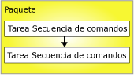
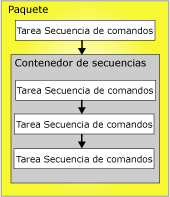

# Restricciones de precedencia
  Las restricciones de precedencia vinculan ejecutables, contenedores y tareas de paquetes en un flujo de control, y especifican condiciones que determinan si se ejecutan los ejecutables. Un ejecutable puede ser un contenedor de bucles For, de bucles Foreach o de secuencia, o bien una tarea o un controlador de eventos. Los controladores de eventos usan las restricciones de precedencia para vincular sus ejecutables en un flujo de control.  
  
 Una restricción de precedencia vincula dos ejecutables: el ejecutable de precedencia y el ejecutable restringido. El ejecutable de precedencia se ejecuta antes del ejecutable restringido y el resultado de la ejecución del ejecutable de precedencia puede determinar si se ejecuta el ejecutable restringido. El siguiente diagrama muestra dos ejecutables vinculados por una restricción de precedencia.  
  
   
  
 En un flujo de control lineal, es decir, un flujo sin bifurcaciones, las restricciones de precedencia controlan ellas mismas la secuencia en que se ejecutan las tareas. Si un flujo de control se bifurca, el motor de tiempo de ejecución de [!INCLUDE[ssISnoversion](../../includes/ssisnoversion-md.md)] determina el orden de ejecución entre las tareas y contenedores que siguen inmediatamente la bifurcación. El motor de tiempo de ejecución también determina el orden de ejecución entre los flujos de trabajo no conectados en un flujo de control.  
  
 La arquitectura de contenedor anidado de [!INCLUDE[ssISnoversion](../../includes/ssisnoversion-md.md)] habilita todos los contenedores, salvo el contenedor del host de la tarea que encapsula una sola tarea, para incluir otros contenedores, cada uno de los cuales tiene su propio flujo de control. Los contenedores de bucles For, de bucles Foreach y de secuencia pueden incluir varias tareas y otros contenedores, que a su vez pueden incluir varias tareas y contenedores. Por ejemplo, un paquete con una tarea Script y un contenedor de secuencias tiene una restricción de precedencia que vincula la tarea Script y el contenedor de secuencias. El contenedor de secuencias incluye tres tareas Script y las restricciones de precedencia vinculan las tres tareas Script en un flujo de control. El siguiente diagrama muestra las restricciones de precedencia en un paquete con dos niveles de anidamiento.  
  
   
  
 Dado que el paquete se encuentra en la parte superior de la jerarquía de contenedores de [!INCLUDE[ssIS](../../includes/ssis-md.md)] , no se pueden vincular varios paquetes mediante restricciones de precedencia. Sin embargo, puede agregar una tarea Ejecutar paquete a un paquete y vincular indirectamente otro paquete en el flujo de control.  
  
 Puede configurar las restricciones de precedencia de las siguientes maneras:  
  
-   Especificar una operación de evaluación. La restricción de precedencia usa un valor de restricción, una expresión, ambas cosas o una de ellas para determinar si se ejecuta el ejecutable restringido.  
  
-   Si la restricción de precedencia usa un resultado de ejecución, puede especificar el resultado de ejecución para que sea correcto, error o conclusión.  
  
-   Si la restricción de precedencia usa un resultado de evaluación, puede proporcionar una expresión que se evalúa como un valor booleano.  
  
-   Especificar si la restricción de precedencia se evalúa individualmente o junto con otras restricciones que se aplican al ejecutable restringido.  
  
## Operaciones de evaluación  
 [!INCLUDE[ssISnoversion](../../includes/ssisnoversion-md.md)] proporciona las siguientes operaciones de evaluación:  
  
-   Una restricción que usa solamente el resultado de la ejecución del ejecutable de precedencia para determinar si el ejecutable restringido se ejecuta. El resultado de la ejecución del ejecutable de precedencia puede ser conclusión, correcto o error. Esta es la operación predeterminada.  
  
-   Una expresión que se evalúa para determinar si se ejecuta el ejecutable restringido. Si la expresión se evalúa como TRUE, el ejecutable restringido se ejecuta.  
  
-   Una expresión y una restricción que combina los requisitos de los resultados de la ejecución del ejecutable de precedencia y los resultados de devolución de la evaluación de la expresión.  
  
-   Una expresión o una restricción que usa los resultados de la ejecución del ejecutable de precedencia o los resultados de devolución de la evaluación de la expresión.  
  
 [!INCLUDE[ssIS](../../includes/ssis-md.md)] usa colores para identificar el tipo de restricción de precedencia. La restricción de operación realizada correctamente es verde, la de error es roja y la de conclusión es azul. Para mostrar etiquetas de texto en el Diseñador [!INCLUDE[ssIS](../../includes/ssis-md.md)] que muestran el tipo de la restricción, debe configurar las características de accesibilidad del Diseñador [!INCLUDE[ssIS](../../includes/ssis-md.md)] .  
  
 La expresión debe ser una expresión de [!INCLUDE[ssIS](../../includes/ssis-md.md)] válida y puede incluir funciones, operadores y variables del sistema y personalizadas. Para obtener más información, vea [Expresiones de Integration Services &#40;SSIS&#41;](../../integration-services/expressions/integration-services-ssis-expressions.md) y [Variables de Integration Services &#40;SSIS&#41;](../../integration-services/integration-services-ssis-variables.md).  
  
## Resultados de la ejecución  
 La restricción de precedencia puede usar los siguientes resultados de ejecución individualmente o combinados con una expresión.  
  
-   La conclusión requiere solamente que el ejecutable de precedencia se haya completado, sin importar su resultado, para que el ejecutable restringido se pueda ejecutar.  
  
-   El resultado correcto requiere que el ejecutable de precedencia se complete correctamente para que pueda ejecutarse el ejecutable restringido.  
  
-   El resultado de error requiere que el ejecutable de precedencia genere un error para que pueda ejecutarse el ejecutable restringido.  
  
> [!NOTE]  
>  Solo las restricciones de precedencia que son miembros de la misma colección **Precedence Constraint** se pueden agrupar en una condición lógica AND. Por ejemplo, no se pueden combinar restricciones de precedencia de dos contenedores de bucles Foreach.  
  
## Establecer las propiedades de una restricción de precedencia con el Editor de restricciones de precedencia  
  
1.  En [!INCLUDE[ssBIDevStudioFull](../../includes/ssbidevstudiofull-md.md)], abra el proyecto de [!INCLUDE[ssISnoversion](../../includes/ssisnoversion-md.md)] que contiene el paquete que desea.  
  
2.  En el Explorador de soluciones, haga doble clic en el paquete para abrirlo.  
  
3.  Haga clic en la pestaña **Flujo de control** .  
  
4.  Haga doble clic en la restricción de precedencia.  
  
     Se abre el **Editor de restricciones de precedencia** .  
  
5.  En la lista desplegable **Operación de evaluación** , seleccione una operación de evaluación.  
  
6.  En la lista desplegable **Valor** , seleccione el resultado de ejecución del ejecutable de precedencia.  
  
7.  Si la operación de evaluación usa una expresión, escriba una expresión en el cuadro **Expresión** y haga clic en **Probar** para evaluarla.  
  
    > [!NOTE]  
    >  Los nombres de variables distinguen entre mayúsculas y minúsculas.  
  
8.  Si hay varias tareas o contenedores conectados al ejecutable restringido, seleccione **AND lógico** para especificar que los resultados de la ejecución de todos los ejecutables anteriores deben evaluarse como **true**. Seleccione **OR lógico** para especificar que solo un resultado de la ejecución debe evaluarse como **true**.  
  
9. Haga clic en **Aceptar** para cerrar el **Editor de restricciones de precedencia**.  
  
10. Para guardar el paquete actualizado, haga clic en **Guardar los elementos seleccionados**, en el menú **Archivo**.  

## Editor de restricciones de precedencia
Utilice el cuadro de diálogo **Editor de restricciones de precedencia** para configurar restricciones de precedencia.  
  
### Opciones  
 **Operación de evaluación**  
 Permite especificar la operación de evaluación que utiliza la restricción de precedencia. Las operaciones son: **Restricción**, **Expresión**, **Expresión y restricción** y **Expresión o restricción**.  
  
 **Value**  
 Especifique el valor de restricción: **Correcto**, **Error** o **Finalización**.  
  
> [!NOTE]  
>  La línea de restricción de precedencia es verde para **Correcto**, resaltada para **Error**y azul para **Conclusión**.  
  
 **Expresión**  
 Si usa las operaciones **Expresión**, **Expresión y restricción**o **Expresión o restricción**, escriba una expresión o inicie el Generador de expresiones para crear la expresión. La expresión debe evaluarse como un valor booleano.  
  
 **Prueba**  
 Permite validar la expresión.  
  
 **Y lógico**  
 Seleccione esta opción para indicar que varias restricciones de precedencia en el mismo archivo ejecutable deben evaluarse de forma conjunta. Todas las restricciones deben evaluarse como **True**.  
  
> [!NOTE]  
>  Este tipo de restricción de precedencia se muestra como una línea sólida verde, resaltada o azul.  
  
 **O lógico**  
 Seleccione esta opción para indicar que varias restricciones de precedencia en el mismo archivo ejecutable deben evaluarse de forma conjunta. Al menos una restricción debe evaluarse como **True**.  
  
> [!NOTE]  
>  Este tipo de restricción de precedencia se muestra como una línea de puntos verde, resaltada o azul.  
  
## Establecer las propiedades de una restricción de precedencia en la ventana Propiedades  
  
1.  En [!INCLUDE[ssBIDevStudioFull](../../includes/ssbidevstudiofull-md.md)], abra el proyecto de [!INCLUDE[ssISnoversion](../../includes/ssisnoversion-md.md)] que contiene el paquete que desea modificar.  
  
2.  En el Explorador de soluciones, haga doble clic en el paquete para abrirlo.  
  
3.  Haga clic en la pestaña **Flujo de control** . En la superficie de diseño de la pestaña **Flujo de control** , haga clic con el botón derecho en la restricción de precedencia y, luego, haga clic en **Propiedades**. En la ventana Propiedades, modifique los valores de las propiedades.  
  
4.  En la ventana **Propiedades** , establezca las siguientes propiedades de lectura y escritura para las restricciones de precedencia:  
  
    |Propiedad de lectura/escritura|Acción de configuración|  
    |--------------------------|--------------------------|  
    |Descripción|Escribir una descripción.|  
    |EvalOp|Seleccionar una operación de evaluación. Si seleccionan las operaciones **Expression**, **ExpressionAndConstant**o **ExpressionOrConstant** , se puede especificar una expresión.|  
    |Expresión|Si la operación de evaluación contiene una expresión, se debe proporcionar una expresión. La expresión debe evaluarse como un valor booleano. Para más información sobre el lenguaje de expresiones, vea [Expresiones de Integration Services &#40;SSIS&#41;](../../integration-services/expressions/integration-services-ssis-expressions.md).|  
    |AND lógico|Configure **AND lógico** para especificar si la restricción de precedencia se evalúa en conjunto con otras restricciones de precedencia, cuando preceden varios ejecutables y están vinculados al ejecutable restringido.|  
    |Nombre|Actualizar el nombre de la restricción de precedencia.|  
    |ShowAnnotation|Especificar el tipo de anotación que se va a usar. Elija **Never** para deshabilitar anotaciones, **AsNeeded** para habilitar anotaciones a petición, **ConstraintName** para realizar anotaciones automáticamente usando el valor de la propiedad Name, **ConstraintDescription** para realizar anotaciones automáticamente usando el valor de la propiedad Description y **ConstraintOptions** para realizar anotaciones automáticamente al usar el valor de las propiedades Value y Expression.|  
    |Valor|Si la operación de evaluación especificada en la propiedad EvalOP contiene una restricción, seleccione el resultado de la ejecución del ejecutable de restricción.|  
  
5.  Cierre la ventana Propiedades.  
  
6.  Para guardar el paquete actualizado, haga clic en **Guardar los elementos seleccionados**, en el menú **Archivo**.  

## Establecer el valor de una restricción de precedencia con el menú contextual  
  
1.  En [!INCLUDE[ssBIDevStudioFull](../../includes/ssbidevstudiofull-md.md)], abra el proyecto de [!INCLUDE[ssISnoversion](../../includes/ssisnoversion-md.md)] que contiene el paquete que desea.  
  
2.  En el Explorador de soluciones, haga doble clic en el paquete para abrirlo.  
  
3.  Haga clic en la pestaña **Flujo de control** .  
  
4.  En la superficie de diseño de la pestaña **Flujo de control** , haga clic con el botón derecho en la restricción de precedencia y luego haga clic en **Correcto**, **Error**o **Conclusión**.  
  
5.  Para guardar el paquete actualizado, haga clic en **Guardar los elementos seleccionados** en el menú **Archivo** .  

## Agregar expresiones a las restricciones de precedencia
 Una restricción de precedencia puede utilizar una expresión para definir la restricción entre dos aplicaciones ejecutables: el ejecutable de precedencia y el ejecutable restringido. Los ejecutables pueden ser tareas o contenedores. La expresión se puede usar por sí sola o combinada con el resultado de la ejecución del ejecutable de precedencia. El resultado de la ejecución de un ejecutable es su ejecución correcta o un error. Cuando configura el resultado de ejecución de una restricción de precedencia, puede establecer el resultado de ejecución en **Success**, **Failure**o **Completion**. **Success** exige la ejecución correcta del ejecutable de precedencia, **Failure** requiere que el ejecutable de precedencia genere un error y **Completion** indica que el ejecutable restringido se debe ejecutar independientemente de si la tarea de precedencia se ejecuta correctamente o genera un error. Para obtener más información, vea [Restricciones de precedencia](../../integration-services/control-flow/precedence-constraints.md).  
  
 La expresión debe evaluarse como **True** o **False** y debe ser una expresión válida de [!INCLUDE[ssISnoversion](../../includes/ssisnoversion-md.md)] . La expresión puede usar literales, variables del sistema y personalizadas, y las funciones y operadores que proporciona la gramática de expresiones de [!INCLUDE[ssIS](../../includes/ssis-md.md)] . Por ejemplo, la expresión `@Count == SQRT(144) + 10` usa la variable **Count**, la función SQRT y los operadores igual (==) y sumar (+). Para más información, vea [Expresiones de Integration Services &#40;SSIS&#41;](../../integration-services/expressions/integration-services-ssis-expressions.md).  
  
 En la ilustración siguiente, la tarea A y la tarea B están vinculadas por una restricción de precedencia que usa un resultado de ejecución y una expresión. El valor de restricción se establece en **Success** y la expresión es  `@X >== @Z`. La tarea B, la tarea restringida, se ejecuta solamente si la tarea A se completa correctamente y el valor de la variable **X** es mayor o igual al valor de la variable **Z**.  
  
   
  
 Los ejecutables también se pueden vincular mediante varias restricciones de precedencia que contienen diferentes expresiones. Por ejemplo, en la siguiente ilustración, las tareas B y C están vinculadas a la tarea A por restricciones de precedencia que usan resultados de ejecución y expresiones. Los dos valores de restricción se establecen en **Success**. Una restricción de precedencia incluye la expresión `@X >== @Z`, y la otra restricción de precedencia la expresión `@X < @Z`. Según los valores de la variable **X** y la variable **Z**, se ejecuta la tarea C o la tarea B.  
  
   
  
 Puede agregar o modificar una expresión mediante el **Editor de restricciones de precedencia** en el Diseñador [!INCLUDE[ssIS](../../includes/ssis-md.md)] , o en la ventana Propiedades que proporciona [!INCLUDE[ssBIDevStudioFull](../../includes/ssbidevstudiofull-md.md)] . Sin embargo, la ventana Propiedades no proporciona ninguna comprobación de la sintaxis de la expresión.  
  
 Si una restricción de precedencia incluye una expresión, aparece un icono en la superficie de diseño de la pestaña **Flujo de control** , junto a la restricción de precedencia, y la información sobre herramientas del icono muestra la expresión.  

### Agregar una expresión a una restricción de precedencia  
  
1.  En [!INCLUDE[ssBIDevStudioFull](../../includes/ssbidevstudiofull-md.md)], abra el proyecto de [!INCLUDE[ssISnoversion](../../includes/ssisnoversion-md.md)] que contiene el paquete que desea.  
  
2.  En el Explorador de soluciones, haga doble clic en el paquete para abrirlo.  
  
3.  Haga clic en la pestaña **Flujo de control** .  
  
4.  En la superficie de diseño de la pestaña **Flujo de control** , haga doble clic en la restricción de precedencia. Se abre el **Editor de restricciones de precedencia** .  
  
5.  Seleccione **Expresión**, **Expresión y restricción**, o **Expresión o restricción** en la lista **Operación de evaluación** .  
  
6.  Escriba una expresión o haga clic en el cuadro **Expresión** o inicie el Generador de expresiones para crear una expresión.  
  
7.  Para validar la sintaxis de expresión, haga clic en **Probar**.  
  
8.  Para guardar el paquete actualizado, haga clic en **Guardar los elementos seleccionados**, en el menú **Archivo**.  
 
### Combinar valores de ejecución y expresiones  
 La siguiente tabla describe los efectos de combinar una restricción de valor de ejecución y una expresión en una restricción de precedencia.  
  
|Operación de evaluación|La restricción se evalúa como|La expresión se evalúa como|El ejecutable restringido se ejecuta|  
|--------------------------|-----------------------------|-----------------------------|---------------------------------|  
|Restricción|True|N/D|True|  
|Restricción|False|N/D|False|  
|Expresión|N/D|True|True|  
|Expresión|N/D|False|False|  
|Restricción y expresión|True|True|True|  
|Restricción y expresión|True|False|False|  
|Restricción y expresión|False|True|False|  
|Restricción y expresión|False|False|False|  
|Restricción o expresión|True|True|True|  
|Restricción o expresión|True|False|True|  
|Restricción o expresión|False|True|True|  
|Restricción o expresión|False|False|False|  

## Escenarios de restricciones complejas con varias restricciones de precedencia 
Una restricción de precedencia conecta dos ejecutables: dos tareas, dos contenedores o uno de cada. Se conocen como el ejecutable de precedencia y el ejecutable restringido. Un ejecutable restringido puede tener varias restricciones de precedencia. Para más información, consulte [Precedence Constraints](../../integration-services/control-flow/precedence-constraints.md).  
  
 El ensamblaje de escenarios de restricciones complejas mediante la agrupación de restricciones le permite implementar un flujo de control complejo en paquetes. Por ejemplo, en la siguiente ilustración, la tarea D se vincula a la tarea A mediante una restricción **Success** , la tarea D se vincula a la tarea B mediante una restricción **Failure** , y la tarea D se vincula a la tarea C mediante una restricción **Success** . Las restricciones de precedencia entre la tarea D y la tarea A, entre la tarea D y la tarea B, y entre la tarea D y la tarea C participan en una relación lógica *and* . Por lo tanto, para que la tarea D se ejecute, la tarea A se debe ejecutar correctamente, la tarea B debe sufrir un error en su ejecución, y la tarea C se debe ejecutar correctamente.  
  
   
  
### Propiedad LogicalAnd  
 Si una tarea o contenedor tiene varias restricciones, la propiedad **LogicalAnd** especifica si se evalúa una restricción de precedencia individualmente o en conjunto con otras restricciones.  
  
 Puede especificar la propiedad **LogicalAnd** mediante el **Editor de restricciones de precedencia** en el Diseñador [!INCLUDE[ssIS](../../includes/ssis-md.md)] , o en la ventana Propiedades que proporciona [!INCLUDE[ssBIDevStudioFull](../../includes/ssbidevstudiofull-md.md)] .  

## Establecer el valor predeterminado para las restricciones de precedencia  
Cuando se usa por primera vez el Diseñador [!INCLUDE[ssIS](../../includes/ssis-md.md)] , el valor predeterminado de una restricción de precedencia es **Success**. Siga estos pasos para configurar el Diseñador [!INCLUDE[ssIS](../../includes/ssis-md.md)] y usar un valor predeterminado diferente para las restricciones de precedencia.
  
1.  Abra [!INCLUDE[ssBIDevStudioFull](../../includes/ssbidevstudiofull-md.md)].  
  
2.  En el menú **Herramientas** , haga clic en **Opciones**.  
  
3.  En el cuadro de diálogo **Opciones** , expanda **Diseñadores de Business Intelligence** y, a continuación, **Diseñadores de Integration Services**.  
  
4.  Haga clic en **Conexión automática de flujo de control** y seleccione **Conectar una nueva forma a la forma seleccionada de manera predeterminada**.  
  
5.  En la lista desplegable, elija **Usar una restricción de error en la operación para la nueva forma** o **Usar una restricción de operación completada para la nueva forma**.  
  
6.  Haga clic en **Aceptar**.  
  
## Crear una restricción de precedencia predeterminada  
  
1.  En [!INCLUDE[ssBIDevStudioFull](../../includes/ssbidevstudiofull-md.md)], abra el proyecto de [!INCLUDE[ssISnoversion](../../includes/ssisnoversion-md.md)] que contiene el paquete que desea.  
  
2.  En el Explorador de soluciones, haga doble clic en el paquete para abrirlo.  
  
3.  Haga clic en la pestaña **Flujo de control** .  
  
4.  En la superficie de diseño de la pestaña **Flujo de control** , haga clic en la tarea o contenedor y arrastre su conector al ejecutable al que desea aplicar la restricción de precedencia.  
  
5.  Para guardar el paquete actualizado, haga clic en **Guardar los elementos seleccionados**, en el menú **Archivo**.  
