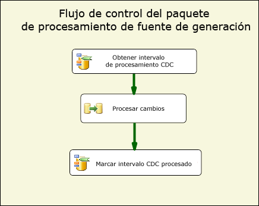
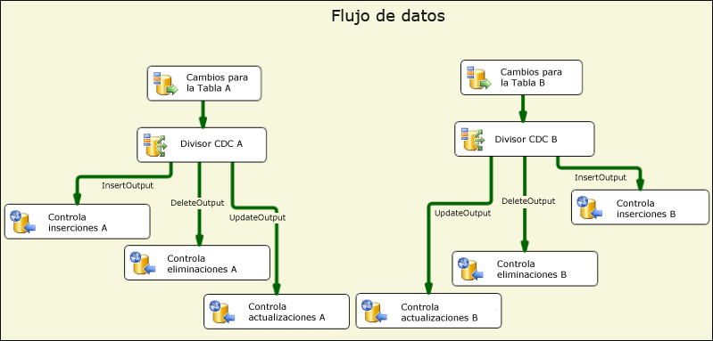
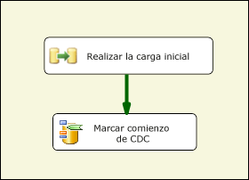
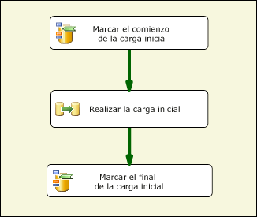
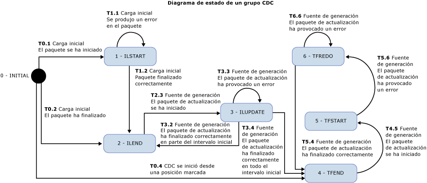

# Componentes del flujo de CDC
  Los componentes de la captura de datos modificados de Attunity para Microsoft [!INCLUDE[ssISCurrent](../../includes/ssiscurrent-md.md)] ayudan a los desarrolladores de SSIS en su trabajo con CDC y reducen la complejidad de los paquetes CDC.  
  
 Los componentes CDC de SSIS están diseñados para funcionar con la característica CDC de [!INCLUDE[ssCurrent](../../includes/sscurrent-md.md)] , donde las tablas de origen son la misma base de datos de [!INCLUDE[ssCurrent](../../includes/sscurrent-md.md)] o una base de datos de Oracle (cuando se usa el servicio CDC de Oracle para [!INCLUDE[ssCurrent](../../includes/sscurrent-md.md)]). Se admiten las tablas con particiones.  
  
 Incluyen los componentes Flujo de control y de datos que simplifican la lectura y el procesamiento de datos modificados en los paquetes SSIS. Los componentes se pueden agregar a la biblioteca de componentes de Microsoft [!INCLUDE[ssCurrent](../../includes/sscurrent-md.md)], pero se instalan por separado.  
  
 Estos son los componentes de la captura de datos modificados de Attunity:  
  
 **Componentes de flujo de control CDC**:  
  
 [Tarea Control CDC](../../integration-services/control-flow/cdc-control-task.md)  
  
 **Componentes de flujo de datos CDC**:  
  
 [Origen de CDC](../../integration-services/data-flow/cdc-source.md)  
  
 [Divisor CDC](../../integration-services/data-flow/cdc-splitter.md)  
  
## Installation  
 En esta sección se describen los procedimientos de instalación de los componentes CDC para Microsoft [!INCLUDE[ssISCurrent](../../includes/ssiscurrent-md.md)].  
  
 Los componentes CDC para SSIS se incluyen con Microsoft® Change Data Capture Designer y Service para Oracle de Attunity para Microsoft SQL Server®. Esta descarga forma parte de SQL Server Feature Pack. Descargue los componentes del Feature Pack, en la [página web de SQL Server 2016 Feature Pack](http://go.microsoft.com/fwlink/?LinkId=746297).  
  
### Compatibilidad de versiones

#### Compatibilidad de versiones de SQL Server

Los componentes CDC para SSIS se admiten en todas las versiones compatibles de Microsoft SQL Server. Actualmente, se admiten las versiones de SQL Server de SQL Server 2012 a SQL Server 2017.

#### Compatibilidad de versiones de sistema operativo
  
Los componentes CDC para SSIS se admiten en los sistemas operativos y las plataformas siguientes:  
  
-   Windows 8 y 8.1
-   Windows 10  
-   Windows Server 2012 y 2012 R2
-   Windows Server 2016
  
### Ejecutar el programa de instalación  
 Antes de ejecutar el asistente para la instalación, asegúrese de que [!INCLUDE[ssCurrent](../../includes/sscurrent-md.md)][!INCLUDE[ssBIDevStudio](../../includes/ssbidevstudio-md.md)] está cerrado. A continuación, siga las instrucciones del asistente para la instalación.  
  
### Reiniciar el servicio SSIS 
Después de instalar los componentes CDC, debe reiniciar el servicio SSIS para asegurarse de que los componentes funcionarán correctamente cuando se desarrollen paquetes en SQL [!INCLUDE[ssBIDevStudio](../../includes/ssbidevstudio-md.md)].  
  
Aparecerá un mensaje después de instalar los componentes. Haga clic en **Sí** cuando se le solicite.  
  
### Desinstalar los componentes CDC de Microsoft  
 Use el asistente para la desinstalación con el fin de desinstalar el origen de CDC, el divisor CDC o la tarea Control CDC. Si usa [!INCLUDE[ssCurrent](../../includes/sscurrent-md.md)][!INCLUDE[ssBIDevStudio](../../includes/ssbidevstudio-md.md)] para el desarrollo de paquetes, asegúrese de que [!INCLUDE[ssBIDevStudio](../../includes/ssbidevstudio-md.md)] está cerrado antes de ejecutar el asistente para la desinstalación.  
  
## Ventajas  
 Con los componentes CDC para los componentes de [!INCLUDE[ssCurrent](../../includes/sscurrent-md.md)][!INCLUDE[ssISnoversion](../../includes/ssisnoversion-md.md)] , los desarrolladores de SSIS pueden compilar fácilmente paquetes SSIS que procesen datos modificados. Estos componentes mejoran la capacidad de los desarrolladores de SSIS para usar CDC y reducir la complejidad de los paquetes CDC.  
  
 Los componentes CDC de SSIS se usan para proporcionar los datos modificados de forma que se facilite su procesamiento para la replicación, la carga de un almacén de datos, la actualización de dimensiones que cambian lentamente para OLAP, la auditoría de cambios o para otros usos posibles. El tipo de procesamiento adicional que se va a usar lo determina el desarrollador de SSIS.  
  
 Los componentes CDC de SSIS están diseñados para trabajar con la característica CDC de [!INCLUDE[ssCurrent](../../includes/sscurrent-md.md)] con tablas de cambios que se encuentran en la misma base de datos de [!INCLUDE[ssCurrent](../../includes/sscurrent-md.md)] .  
  
## Introducción a los componentes de la captura de datos modificados  
 Un paquete CDC típico procesa los cambios para un grupo de tablas. En la figura siguiente se muestra el flujo de control básico de este tipo de paquete CDC. Este paquete se denomina paquete de procesamiento de la fuente de generación.  
  
   
  
 Este flujo de control de [!INCLUDE[ssCurrent](../../includes/sscurrent-md.md)][!INCLUDE[ssISnoversion](../../includes/ssisnoversion-md.md)] contiene dos tareas Control CDC y la tarea Flujo de datos. La primera tarea, denominada **Obtener intervalo de procesamiento CDC** , establece el intervalo de LSN para los cambios que se procesan en la tarea de flujo de datos denominada **Procesar cambios**. Este intervalo se establece según lo que se hubiera procesado durante la ejecución del último paquete y se hubiera guardado en un almacén persistente.  
  
 Para obtener más información sobre cómo usar la tarea Control CDC, vea [CDC Control Task](../../integration-services/control-flow/cdc-control-task.md) y [CDC Control Task Editor](../../integration-services/control-flow/cdc-control-task-editor.md).  
  
 La ilustración siguiente muestra el flujo de datos **Procesar cambios** , que muestra en el plano conceptual cómo se procesan los cambios.  
  
   
  
 Los pasos que se muestran en esta ilustración son:  
  
-   **Cambios para la tabla X** es un origen de CDC que lee los cambios realizados en la tabla X durante el intervalo de procesamiento de CDC que se determinó en el flujo de control principal.  
  
-   **Divisor CDC X** se utiliza para dividir los cambios en inserciones, eliminaciones y actualizaciones. En este escenario, se supone que el origen CDC está configurado para generar cambios netos de forma que tipos diferentes de cambios puedan procesarse en paralelo.  
  
-   Los cambios concretos se procesan posteriormente en un nivel inferior. En esta ilustración, los cambios se insertan en las tablas mediante varios destinos de ODBC, pero en casos reales es posible que el procesamiento sea diferente.  
  
 Para obtener más información acerca del origen de CDC, vea:  
  
 [origen de CDC](../../integration-services/data-flow/cdc-source.md)  
  
 [Editor de origen de CDC &#40;página Administrador de conexiones&#41;](../../integration-services/data-flow/cdc-source-editor-connection-manager-page.md)  
  
 [Editor de origen de CDC &#40;página Columnas&#41;](../../integration-services/data-flow/cdc-source-editor-columns-page.md)  
  
 [Editor de origen de CDC &#40;página Salida de error&#41;](../../integration-services/data-flow/cdc-source-editor-error-output-page.md)  
  
 Para obtener más información acerca del divisor CDC, vea:  
  
 [Divisor CDC](../../integration-services/data-flow/cdc-splitter.md)  
  
 Una de las cuestiones básicas que requieren atención al compilar paquetes CDC es cómo el procesamiento de cambios interactúa con la carga inicial (o el procesamiento inicial) de los datos.  
  
 Los componentes CDC admiten tres escenarios distintos de carga inicial y de procesamiento de cambios:  
  
-   La carga inicial se realiza con una instantánea de base de datos. En este caso, el procesamiento de cambios comienza con el LSN del evento de instantánea.  
  
-   Carga inicial desde una base de datos inactiva. En este caso, no se realizarán cambios durante la carga inicial para que el LSN actual se pueda muestrear en algún momento durante la carga inicial y para que el procesamiento de cambios se inicie con ese LSN.  
  
-   Carga inicial desde una base de datos activa. En este caso, como la carga inicial está en curso, los cambios se efectúan en la base de datos y no hay un LSN único desde el que se pueda iniciar con exactitud el procesamiento de cambios. En este caso, el desarrollador del paquete de carga inicial puede muestrear el LSN actual de la base de datos de origen antes y después de la carga inicial. Posteriormente, cuando se procesen los cambios, se ha de prestar atención cuando este procesamiento se realice en paralelo a la carga inicial, puesto que algunos de los cambios procesados ya se muestran en la carga inicial (por ejemplo, puede que un cambio Insert no se realice correctamente por un error de clave duplicada porque el proceso de carga inicial leyó la fila insertada).  
  
 En la ilustración siguiente se muestra un paquete SSIS que podría controlar los dos primeros escenarios:  
  
   
  
 En la ilustración siguiente se muestra un paquete SSIS que podría controlar el tercer escenario:  
  
   
  
 Después del paquete de carga inicial, se ejecuta de forma repetida un paquete de actualización de fuente de generación de acuerdo con una programación para procesar los cambios a medida que se encuentren disponibles para su consumo.  
  
 La transición del estado de procesamiento de CDC desde el paquete de carga inicial hasta el paquete de fuente de generación y entre las diversas tareas que se producen dentro de cada paquete tiene lugar mediante una variable de cadena de paquete SSIS especial. El valor de esta variable se denomina estado CDC, que refleja el estado actual del procesamiento de CDC para los grupos de tablas controlados por los paquetes de carga inicial y de fuente de generación.  
  
 El valor de la variable de estado de CDC debe mantenerse en un almacenamiento persistente. Se debe leer antes de iniciar el procesamiento de CDC y debe guardarse con el estado actual después de completar el procesamiento. La tarea de carga y almacenamiento del estado CDC la puede controlar el desarrollador de SSIS, pero el componente Control CDC puede automatizar esta tarea conservando el valor de estado CDC en una tabla de base de datos.  
  
## Consideraciones de seguridad  
 En esta sección se enumeran algunas consideraciones de seguridad relacionadas con el uso de los componentes CDC en SSIS.  
  
### Autorización de acceso a datos modificados  
 Los paquetes de actualización de fuente de generación necesitan tener acceso a las funciones CDC de [!INCLUDE[ssCurrent](../../includes/sscurrent-md.md)] . Este acceso se concede de forma predeterminada a los miembros de rol fijo de base de datos **db_owner** . Como **db_owner** es un rol con permisos avanzados, al definir las instancias de captura en [!INCLUDE[ssCurrent](../../includes/sscurrent-md.md)] , se recomienda asociar un rol de seguridad de acceso a cada instancia de captura que permita que el paquete CDC de SSIS use un usuario con permisos mucho más restringidos para procesar los cambios.  
  
### Acceso al LSN actual de la base de datos CDC  
 Las operaciones de la tarea Control CDC para marcar el LSN de inicio para el procesamiento de cambios deben poder encontrar el LSN actual de la base de datos CDC. Los componentes buscan el LSN con el procedimiento **sp_replincrementlsn** desde la base de datos maestra. Es preciso asignar permiso de ejecución de este procedimiento al inicio de sesión que se usa para conectarse a la base de datos CDC de [!INCLUDE[ssCurrent](../../includes/sscurrent-md.md)] .  
  
### Acceso a la tabla de estados CDC  
 La tabla de estados CDC se utiliza para hacer persistentes automáticamente a los estados CDC que el inicio de sesión que se usa para conectarse a la base de datos CDC de [!INCLUDE[ssCurrent](../../includes/sscurrent-md.md)] debe poder actualizar. Como esta tabla la crea el desarrollador de SSIS, establezca el administrador del sistema de [!INCLUDE[ssCurrent](../../includes/sscurrent-md.md)] como un usuario con autorización para crear bases de datos de [!INCLUDE[ssCurrent](../../includes/sscurrent-md.md)] y para realizar tareas administrativas y de mantenimiento. Además, un administrador del sistema de [!INCLUDE[ssCurrent](../../includes/sscurrent-md.md)] que trabaje con bases de datos habilitadas para CDC debe conocer la tecnología y la implementación de CDC de [!INCLUDE[ssCurrent](../../includes/sscurrent-md.md)] .  
  
## Agrupar tablas para el procesamiento de CDC  
 Los proyectos de base de datos varían en cuanto al tamaño y pueden contener desde varias tablas hasta muchos miles de tablas. Al diseñar los paquetes de carga inicial y CDC, conviene agrupar las tablas en grupos mucho más pequeños para que la administración sea más sencilla y lograr mayor eficacia. En esta sección se enumeran varias consideraciones que afectan a la ordenación de tablas en pequeños grupos, donde las tablas en cada uno de ellos se cargan inicialmente y se actualizan posteriormente en grupo.  
  
 Los patrones CDC compatibles con los componentes CDC dan por hecho que esta agrupación se ha determinado previamente. Cada grupo define un contexto CDC independiente que se mantiene por separado de otros grupos. Para cada grupo, se crean paquetes de carga inicial y de actualización de fuente de generación. Las actualizaciones de fuente de generación se programan para ejecuciones periódicas según el índice de restricciones de procesamiento de cambios (por ejemplo, consumo de CPU y de E/S, repercusión en otros sistemas) y la latencia deseada.  
  
 Las tablas se agrupan según las consideraciones siguientes:  
  
1.  Según la base de datos de destino. Todas las tablas que se escriben en distintas bases de datos de destino o experimentan un procesamiento diferente deben asignarse a diferentes grupos CDC.  
  
2.  Las tablas relacionadas con restricciones de integridad referencial deben asignarse al mismo grupo para evitar problemas de integridad referencial en el destino.  
  
3.  Se pueden agrupar las tablas que pueden tolerar una latencia superior, de forma que se puedan procesar con menos frecuencia y reducir la carga global del sistema.  
  
4.  Las tablas con un índice de cambios superior deben agruparse en grupos más pequeños y las tablas con un índice reducido de cambios se pueden agrupar en grupos mayores.  
  
 Se crean los dos paquetes siguientes para cada grupo CDC:  
  
-   Un paquete de carga inicial, que lee el intervalo de datos completo a partir de las tablas de origen y lo aplica a las tablas de destino.  
  
-   Un paquete de actualización de fuente de generación que lee los cambios realizados en las tablas de origen y los aplica a las tablas de destino. Este paquete debe ejecutarse de forma programada periódicamente.  
  
## Estado de CDC  
 Cada grupo CDC tiene un estado asociado, representado por una cadena con un formato concreto. Para obtener más información, vea [CDC Control Task](../../integration-services/control-flow/cdc-control-task.md). En la tabla siguiente se muestran los posibles valores de estado CDC.  
  
|State|Description|  
|-----------|-----------------|  
|0-(INITIAL)|El estado que existe antes de que se ejecuten paquetes en el grupo CDC actual. Es también el estado cuando el estado CDC está vacío.   Para obtener más información acerca de las operaciones de la tarea Control CDC, vea [CDC Control Task](../../integration-services/control-flow/cdc-control-task.md).|  
|1-ILSTART (Carga inicial iniciada)|Es el estado que se produce cuando se inicia el paquete de carga inicial. Se produce tras la llamada de la operación **MarkInitialLoadStart** a la tarea Control CDC.   Para obtener más información acerca de las operaciones de la tarea Control CDC, vea [CDC Control Task](../../integration-services/control-flow/cdc-control-task.md).|  
|2- ILEND (Carga inicial terminada)|Es el estado que se produce cuando el paquete de carga inicial finaliza correctamente. Se produce tras la llamada de la operación MarkInitialLoadEnd a la tarea Control CDC.   Para obtener más información acerca de las operaciones de la tarea Control CDC, vea [CDC Control Task](../../integration-services/control-flow/cdc-control-task.md).|  
|3-ILUPDATE (Actualización de carga inicial)|Es el estado que existe tras la primera ejecución del paquete de actualización después de la carga inicial, mientras continua procesándose el intervalo de procesamiento inicial. Se produce tras la llamada de la operación **GetProcessingRange** a la tarea Control CDC.   Si se usa la columna **_$reprocessing** , se establece en 1 para indicar que el paquete puede estar ya volviendo a procesar filas en el destino.   Para obtener más información acerca de las operaciones de la tarea Control CDC, vea [CDC Control Task](../../integration-services/control-flow/cdc-control-task.md).|  
|4-TFEND (Actualización de fuente de generación terminada)|Es el estado que se espera para las ejecuciones normales de CDC. Indica que la ejecución anterior se completó correctamente y que se puede iniciar una ejecución nueva con un intervalo de procesamiento nuevo.|  
|5-TFSTART (Actualización de fuente de generación iniciada)|Es el estado que existe en ejecuciones posteriores del paquete de actualización tras la llamada de la operación **GetProcessingRange** a la tarea Control CDC.   Esto indica que se ha iniciado correctamente una ejecución de CDC normal, pero que aún no ha terminado (**MarkProcessedRange**).   Para obtener más información acerca de las operaciones de la tarea Control CDC, vea [CDC Control Task](../../integration-services/control-flow/cdc-control-task.md).|  
|6-TFREDO (Reprocesamiento de actualizaciones de fuente de generación)|Es el estado en una **GetProcessingRange** que tiene lugar tras TFSTART. Esto indica que la ejecución anterior no ha finalizado correctamente.   Si se usa la columna __$reprocessing, se establece en 1 para indicar que el paquete puede estar ya volviendo a procesar filas en el destino.|  
|7-ERROR|El grupo CDC tiene un estado ERROR.|  
  
 Este es el diagrama de estado para los componentes CDC. Un estado ERROR tiene lugar cuando se llega a un estado que no se esperaba. Los estados esperados se ilustran en el diagrama siguiente. Aunque el diagrama no muestra el estado ERROR.  
  
 Por ejemplo, al final de un paquete de carga inicial, cuando se intenta establecer el estado en ILEND, si el estado es TFSTART, el grupo CDC tendrá un estado de error y el paquete de actualización de fuente de generación no se ejecuta (el paquete de carga inicial sí se ejecuta).  
  
   
  
 Una vez que el paquete de carga inicial se ejecuta correctamente, el paquete de actualización de fuente de generación se ejecuta varias veces de acuerdo con un programa determinado para que se procesen los cambios en las tablas de origen. Cada ejecución del paquete de actualización de fuente de generación es una ejecución de CDC.  
  
## En esta sección  
  
-   [Origen de CDC](../../integration-services/data-flow/cdc-source.md)  
  
-   [Divisor CDC](../../integration-services/data-flow/cdc-splitter.md)  
  
## Related Tasks  
  
-   [Dirigir el flujo CDC según el tipo de cambio](../../integration-services/data-flow/direct-the-cdc-stream-according-to-the-type-of-change.md)  
  
-   [Definir una variable de estado](../../integration-services/data-flow/define-a-state-variable.md)  
  
## Contenido relacionado  
  
-   Entrada del blog sobre [CDC en SSIS para SQL Server 2012](https://www.mattmasson.com/2011/12/cdc-in-ssis-for-sql-server-2012-2/)en mattmasson.com.  
  
-   Entrada del blog sobre la configuración del servicio CDC, [CDC para Oracle en SQL Server 2012](http://go.microsoft.com/fwlink/?LinkId=247827), en blogs.msdn.com.  
  
-   Artículo técnico [Instalar la captura de datos modificados Microsoft SQL Server 2012 para Oracle de Attunity](http://go.microsoft.com/fwlink/?LinkId=252958), en social.technet.microsoft.com.  
  
-   Artículo técnico [Solucionar problemas de configuración de la captura de datos modificados de Microsoft para Oracle de Attunity](http://go.microsoft.com/fwlink/?LinkId=252960), en social.technet.microsoft.com.  
  
-   Artículo técnico [Solucionar problemas de errores de instancias de CDC de la captura de datos modificados de Microsoft para Oracle de Attunity](http://go.microsoft.com/fwlink/?LinkId=252961), en social.technet.microsoft.com.  
  
-   Vídeo sobre [CDC para bases de datos de Oracle con SQL Server Integration Services 2012 (vídeo de SQL Server)](http://technet.microsoft.com/sqlserver/jj218898)en technet.microsoft.com.  
  
## Ver también  
 [Tarea Control CDC](../../integration-services/control-flow/cdc-control-task.md)  
  
  
