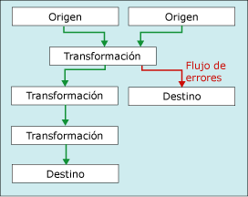

# <a name="error-handling-in-data"></a>Control de errores en los datos

[!INCLUDE[sqlserver-ssis](../../includes/applies-to-version/sqlserver-ssis.md)]


  Cuando un componente de flujo de datos aplica una transformación a los datos de columna, extrae datos de orígenes o carga datos en destinos, pueden producirse errores. Los errores con frecuencia se producen debido a valores de datos inesperados. Por ejemplo, una conversión de datos genera un error porque una columna contiene una cadena en lugar de un número, una inserción en una base de datos genera un error porque los datos corresponden a una fecha y la columna tiene un tipo de datos numéricos, o una expresión genera un error al evaluarse porque el valor de la columna es cero, lo que da como resultado una operación matemática no válida.  
  
 Los errores normalmente corresponden a una de las siguientes categorías:  
  
-   Errores de conversión de datos, que se producen cuando la conversión tiene como resultado la pérdida de dígitos significativos, la pérdida de dígitos insignificantes y el truncamiento de cadenas. Los errores de conversión de datos también se producen si la conversión requerida no se admite.  
  
-   Errores de evaluación de expresiones, que se producen si las expresiones que se evalúan en tiempo de ejecución realizan operaciones no válidas o pasan a ser sintácticamente incorrectas debido a valores de datos faltantes o incorrectos.  
  
-   Errores de búsqueda, que se producen si una operación de búsqueda genera un error al intentar buscar una coincidencia en la tabla de búsqueda.  
  
 Para obtener una lista de los errores, advertencias y otros mensajes de Integration Services, vea [Integration Services Error and Message Reference](../../integration-services/integration-services-error-and-message-reference.md).  
  
## <a name="use-error-outputs-to-capture-row-level-errors"></a>Uso de salidas de error para capturar errores de fila  
 Muchos componentes de flujo de datos admiten salidas de error, que le permiten controlar la forma en que el componente controla los errores de nivel de fila en los datos entrantes y salientes. El modo en que se comporta el componente cuando se produce un truncamiento o error se especifica estableciendo opciones en columnas individuales en la entrada o la salida. Por ejemplo, puede especificar que el componente genere un error si se truncan los datos de nombre del cliente, pero que omita los errores en otra columna que contenga datos menos importantes.  
  
 La salida de error se puede conectar a la entrada de otra transformación o cargarse en un destino diferente de la salida que no es de error. Por ejemplo, la salida de error puede estar conectada a una transformación Columna derivada que proporciona una cadena para una columna en blanco.  
  
 El siguiente diagrama muestra un flujo de datos simple que incluye una salida de error.  
  
   
  
 Para obtener más información, vea [Flujo de datos](../../integration-services/data-flow/data-flow.md) y [Rutas de Integration Services](../../integration-services/data-flow/integration-services-paths.md).  

## <a name="configure-error-output-dialog-box"></a>Cuadro de diálogo Configurar la salida de errores
Use el cuadro de diálogo **Configurar la salida de errores** para configurar las opciones de control de errores para las transformaciones de flujo de datos que admiten salida de errores.  
  
 Para obtener más información sobre cómo trabajar con salidas de error, vea [Control de errores en los datos](../../integration-services/data-flow/error-handling-in-data.md).  
  
### <a name="options"></a>Opciones  
 **Entrada o salida**  
 Muestra el nombre de la salida.  
  
 **Columna**  
 Muestra las columnas de salida que se seleccionaron en el cuadro de diálogo del editor de transformaciones.  
  
 **Error**  
 Si procede, permite especificar qué debe ocurrir cuando se produce un error: omitir el error, redirigir la fila o hacer que el componente no funcione.  
  
 **Temas relacionados:** [Control de errores en los datos](../../integration-services/data-flow/error-handling-in-data.md)  
  
 **Truncamiento**  
 Si procede, permite especificar qué debe ocurrir cuando se produce un truncamiento: omitir el error, redirigir la fila o hacer que el componente no funcione.  
  
 **Temas relacionados:** [Control de errores en los datos](../../integration-services/data-flow/error-handling-in-data.md)  
  
 **Descripción**  
 Muestra la descripción de la operación.  
  
 **Establecer este valor en las celdas seleccionadas**  
 Permite especificar qué debe ocurrir en todas las celdas seleccionadas cuando se produce un error o un truncamiento: omitir el error, redirigir la fila o hacer que el componente no funcione.  
  
 **Aplicar**  
 Aplica la opción de control de errores a las celdas seleccionadas.  
  
## <a name="errors-are-either-failures-or-truncations"></a>Los errores son errores propiamente dichos o truncamientos  
 Los errores se asocian a una de estas dos categorías: errores o truncamientos.  
  
 **Errores**. Un error indica un error inequívoco y genera un resultado NULL. Tales errores pueden incluir errores de conversión de datos o errores de evaluación de expresiones. Por ejemplo, un intento para convertir una cadena que contiene caracteres alfabéticos en un número produce un error. Las conversiones de datos, evaluaciones de expresiones y asignaciones de resultados de expresiones a variables, propiedades y columnas de datos pueden dar error debido a conversiones no válidas y tipos de datos incompatibles. Para obtener más información, vea [Conversión &#40;expresión de SSIS&#41;](../../integration-services/expressions/cast-ssis-expression.md), [Tipos de datos de Integration Services en las expresiones](../../integration-services/expressions/integration-services-data-types-in-expressions.md) y [Tipos de datos de Integration Services](../../integration-services/data-flow/integration-services-data-types.md).  
  
 **Truncamientos**. Un truncamiento es de menor gravedad que un error. Un truncamiento genera resultados se pueden utilizar o que inclusive pueden ser beneficiosos. Puede elegir tratar los truncamientos como errores o como condiciones aceptables. Por ejemplo, si está insertando una cadena de 15 caracteres en una columna que solo tiene un carácter de ancho, puede elegir truncar la cadena.  
  
## <a name="select-an-error-handling-option"></a>Selección de una opción de control de errores  
 Puede configurar la manera en que los orígenes, transformaciones y destinos controlan errores y truncamientos. Las opciones se describen en la siguiente tabla.  
  
|Opción|Descripción|  
|------------|-----------------|  
|Error de componente|La tarea Flujo de datos genera un error cuando se produce un error o truncamiento. El error es la opción predeterminada para un error o truncamiento.|  
|Omitir error|El error o truncamiento se omite y la fila de datos se dirige a la salida de transformación u origen.|  
|Redirigir fila|La fila de datos de error o truncamiento se dirige a la salida de error del origen, transformación o destino.|  
  
## <a name="get-more-info-about-the-error"></a>Obtención de más información sobre el error  
 Además de las columnas de datos, la salida de error incluye las columnas **ErrorCode** y **ErrorColumn** . La columna **ErrorCode** identifica el error y la columna **ErrorColumn** contiene el identificador de linaje de la columna de error.  
  
 En algunas circunstancias, el valor de la columna **ErrorColumn** se establece en cero. Esto ocurre cuando la condición de error afecta a toda la fila en lugar de a una única columna. Un ejemplo es cuando se produce un error de búsqueda en la transformación Búsqueda.  
  
 Estos dos valores numéricos pueden tener un uso limitado sin la descripción del error y el nombre de columna correspondientes. Aquí se muestran algunas maneras de obtener la descripción del error y el nombre de columna.  
  
-   Puede ver las descripciones de error y los nombres de columna adjuntando un visor de datos a la salida de error. En el Diseñador SSIS, haga clic con el botón derecho en la flecha roja que conduce a una salida de error y seleccione **Habilitar visor de datos**.  
  
-   Puede encontrar los nombres de columna habilitando el registro y seleccionando el evento **DiagnosticEx** . Este evento escribe un mapa de columnas de flujo de datos en el registro. A continuación, puede buscar el nombre de columna por su identificador en este mapa de columna. Tenga en cuenta que el evento **DiagnosticEx** no conserva el espacio en blanco en la salida XML para reducir el tamaño del registro. Para mejorar la legibilidad, copie el registro en un editor XML (en Visual Studio, por ejemplo) que admita el formato XML y el resaltado de sintaxis. Para obtener más información sobre el registro, vea [Registro de Integration Services &#40;SSIS&#41;](../../integration-services/performance/integration-services-ssis-logging.md).  
  
     Este es un ejemplo de una asignación de columna de flujo de datos.  
  
    ```xml  
  
    \<DTS:PipelineColumnMap xmlns:DTS="www.microsoft.com/SqlServer/Dts">  
        \<DTS:Pipeline DTS:Path="\Package\Data Flow Task">  
            \<DTS:Column DTS:ID="11" DTS:IdentificationString="ADO NET Source.Outputs[ADO NET Source Output].Columns[Customer]"/>  
            \<DTS:Column DTS:ID="12" DTS:IdentificationString="ADO NET Source.Outputs[ADO NET Source Output].Columns[Product]"/>  
            \<DTS:Column DTS:ID="13" DTS:IdentificationString="ADO NET Source.Outputs[ADO NET Source Output].Columns[Price]"/>  
            \<DTS:Column DTS:ID="14" DTS:IdentificationString="ADO NET Source.Outputs[ADO NET Source Output].Columns[Timestamp]"/>  
            \<DTS:Column DTS:ID="20" DTS:IdentificationString="ADO NET Source.Outputs[ADO NET Source Error Output].Columns[Customer]"/>  
            \<DTS:Column DTS:ID="21" DTS:IdentificationString="ADO NET Source.Outputs[ADO NET Source Error Output].Columns[Product]"/>  
            \<DTS:Column DTS:ID="22" DTS:IdentificationString="ADO NET Source.Outputs[ADO NET Source Error Output].Columns[Price]"/>  
            \<DTS:Column DTS:ID="23" DTS:IdentificationString="ADO NET Source.Outputs[ADO NET Source Error Output].Columns[Timestamp]"/>  
            \<DTS:Column DTS:ID="24" DTS:IdentificationString="ADO NET Source.Outputs[ADO NET Source Error Output].Columns[ErrorCode]"/>  
            \<DTS:Column DTS:ID="25" DTS:IdentificationString="ADO NET Source.Outputs[ADO NET Source Error Output].Columns[ErrorColumn]"/>  
            \<DTS:Column DTS:ID="31" DTS:IdentificationString="Flat File Destination.Inputs[Flat File Destination Input].Columns[Customer]"/>  
            \<DTS:Column DTS:ID="32" DTS:IdentificationString="Flat File Destination.Inputs[Flat File Destination Input].Columns[Product]"/>  
            \<DTS:Column DTS:ID="33" DTS:IdentificationString="Flat File Destination.Inputs[Flat File Destination Input].Columns[Price]"/>  
            \<DTS:Column DTS:ID="34" DTS:IdentificationString="Flat File Destination.Inputs[Flat File Destination Input].Columns[Timestamp]"/>  
        \</DTS:Pipeline>  
    \</DTS:PipelineColumnMap>  
  
    ```  
  
-   También puede usar el componente Script para incluir la descripción del error y el nombre de columna en columnas adicionales de la salida de error. Para obtener un ejemplo, vea [Mejorar una salida de errores con el componente de script](../../integration-services/extending-packages-scripting-data-flow-script-component-examples/enhancing-an-error-output-with-the-script-component.md).  
  
    -   Para incluir la descripción del error en una columna adicional, use una única línea de script para llamar al método <xref:Microsoft.SqlServer.Dts.Pipeline.Wrapper.IDTSComponentMetaData100.GetErrorDescription%2A> de la interfaz <xref:Microsoft.SqlServer.Dts.Pipeline.Wrapper.IDTSComponentMetaData100> .  
  
    -   Incluya el nombre de columna en una columna adicional mediante el uso de una única línea de script para llamar al método [Microsoft.SqlServer.Dts.Pipeline.Wrapper.IDTSComponentMetaData100.GetIdentificationStringByID*] (/previous-versions/sql/sql-server-2016/mt657629(v=sql.130)) de la interfaz <xref:Microsoft.SqlServer.Dts.Pipeline.Wrapper.IDTSComponentMetaData100>.  
  
     Puede agregar el componente Script al segmento de error del flujo de datos en cualquier lugar en un nivel inferior de los componentes del flujo de datos cuyos errores desea capturar. Normalmente el componente Script se coloca inmediatamente antes de que las filas de error se escriban en un destino. De esta manera, el script solo busca descripciones para filas de error escritas. El segmento de error del flujo de datos puede corregir algunos errores y no escribir esas filas en un destino de error.  

## <a name="see-also"></a>Consulte también  
 [Flujo de datos](../../integration-services/data-flow/data-flow.md)   
 [Transformación de datos con transformaciones](../../integration-services/data-flow/transformations/transform-data-with-transformations.md)   
 [Conectar componentes con rutas de acceso](https://msdn.microsoft.com/library/05633e4c-1370-4b05-802b-f36b07dd71c8)   
 [Tarea Flujo de datos](../../integration-services/control-flow/data-flow-task.md)   
 [Flujo de datos](../../integration-services/data-flow/data-flow.md)  
  
  
