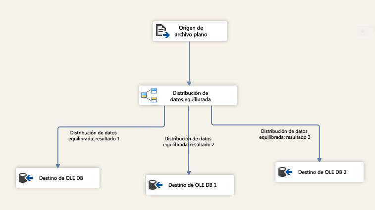

# Transformación Balanced Data Distributor

[!INCLUDE[ssis-appliesto](../../../includes/ssis-appliesto-ssvrpluslinux-asdb-asdw-xxx.md)]

  La transformación Balanced Data Distributor (BDD) aprovecha la capacidad de procesamiento simultáneo de las CPU actuales. Distribuye uniformemente los búferes de filas entrantes entre las salidas de subprocesos independientes. Al usar subprocesos independientes para cada ruta de acceso de los resultados, el componente BDD mejora el rendimiento de un paquete de SSIS en equipos con varios núcleos o varios procesadores.  
  
 En el diagrama siguiente se muestra un ejemplo simple de cómo usar la transformación BDD. En este ejemplo, la transformación BDD elige un búfer de canalización cada vez de los datos de entrada de un origen de archivo plano y lo envía a una de las tres rutas de acceso de los resultados en un modo round robin (por turnos). En SQL Server Data Tools, puede comprobar los valores de <xref:Microsoft.SqlServer.Dts.Pipeline.Wrapper.MainPipeClass.DefaultBufferSize%2A>(tamaño predeterminado del búfer de canalización) y de <xref:Microsoft.SqlServer.Dts.Pipeline.Wrapper.MainPipeClass.DefaultBufferMaxRows%2A>(número máximo de filas predeterminado de un búfer de canalización) en la ventana **Propiedades** , donde se muestran las propiedades de una tarea Flujo de datos.  
  
   
  
 La transformación Balanced Data Distributor ayuda a mejorar el rendimiento de un paquete en un escenario que cumple las condiciones siguientes:  
  
1.  Entra una gran cantidad de datos en la transformación BDD. Si el tamaño de los datos es pequeño y solo un búfer puede contener los datos, no vale la pena usar la transformación BDD. Si el tamaño de los datos es grande y se necesitan varios búferes para almacenar los datos, BDD puede procesar eficazmente los búferes de datos en paralelo mediante subprocesos independientes.  
  
2.  Los datos se pueden leer a una velocidad mayor que la velocidad de proceso del resto del flujo de datos. En este escenario, las transformaciones que se realizan en los datos se ejecutan despacio en comparación con la velocidad a la que llegan los datos. Si el cuello de botella está en el destino, el destino debe ser paralelizable.  
  
3.  No es necesario que los datos estén ordenados. Por ejemplo, si los datos deben estar ordenados, no debe dividirlos mediante la transformación BDD.  
  
 Tenga en cuenta que si el cuello de botella en un paquete de SSIS se debe a la velocidad a la que se pueden leer los datos del origen, el componente BDD no ayuda a mejorar el rendimiento. Si el cuello de botella en un paquete de SSIS se debe a que el destino no admite paralelismo, el BDD no es útil; sin embargo, puede realizar todas las transformaciones en paralelo y usar la transformación Unión de todo para combinar los datos de salida que salen de las diferentes rutas de acceso de los resultados de la transformación BDD antes de enviar los datos al destino.  
  
> [!IMPORTANT]  
>  En el [vídeo sobre el Distribuidor de datos equilibrado](https://go.microsoft.com/fwlink/?LinkID=226278) de la biblioteca de TechNet puede ver una presentación con una demostración del uso de la transformación.  
  
  
