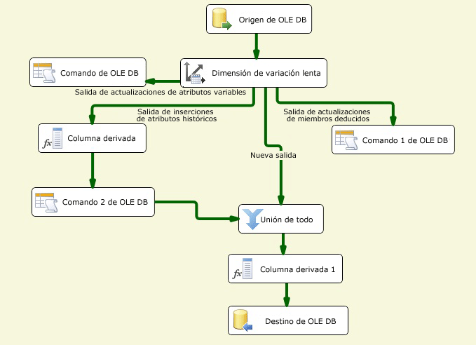

# Configurar salidas mediante el Asistente para dimensión de variación lenta
  El Asistente para dimensiones variables funciona como editor para la transformación Dimensión de variación lenta. Generar y configurar el flujo de datos para datos de dimensiones de variación lenta puede ser una tarea compleja. El Asistente para dimensiones variables ofrece el método más simple para generar el flujo de datos para las salidas de la transformación Dimensión de variación lenta, ya que ofrece una guía paso a paso de la asignación de columnas, la selección de columnas de clave empresarial, el establecimiento de atributos de cambio de las columnas y la configuración de la admisión de miembros de dimensión deducidos.  
  
 Debe elegir por lo menos una columna de clave empresarial en la tabla de dimensiones y asignarla a una columna de entrada. El valor de clave empresarial vincula un registro del origen con un registro de la tabla de dimensión. La transformación utiliza esta asignación para ubicar el registro de la tabla de dimensión y determinar si un registro es nuevo o cambia. La clave empresarial suele ser la clave principal del origen, pero puede ser una clave alternativa siempre que identifique un registro de forma exclusiva y su valor no cambie. La clave empresarial puede ser también una clave compuesta, que se compone de varias columnas. La clave principal de la tabla de dimensión suele ser una clave suplente, lo que se traduce en que una columna de identidad o una solución personalizada, como un script, genera automáticamente un valor numérico.  
  
 Antes de poder ejecutar el Asistente para dimensiones variables lentas, debe agregar un origen y una transformación Dimensión de variación lenta al flujo de datos, y luego conectar la salida desde el origen a la entrada de la transformación Dimensión de variación lenta. Opcionalmente, el flujo de datos puede incluir otras transformaciones entre el origen de datos y la transformación Dimensión de variación lenta.  
  
 Para abrir el Asistente para dimensiones de variación lenta en el Diseñador [!INCLUDE[ssIS](../../../includes/ssis-md.md)] , haga doble clic en la transformación Dimensión de variación lenta.  
  
## Crear salidas de dimensión de variación lenta  
  
#### Para crear salidas de la transformación Dimensión de variación lenta  
  
1.  Elija el administrador de conexiones para obtener acceso al origen de datos que contiene la tabla de dimensiones que desee actualizar.  
  
     Puede seleccionarlo de una lista de administradores de conexión que incluye el paquete.  
  
2.  Elija la tabla de dimensión o vista que desea actualizar.  
  
     Después de seleccionar el administrador de conexiones, puede seleccionar la tabla o vista del origen de datos.  
  
3.  Establezca los atributos clave de las columnas y asigne las columnas de entrada a las columnas en la tabla de dimensiones.  
  
     Debe elegir por lo menos una columna de clave empresarial en la tabla de dimensiones y asignarla a una columna de entrada. Otras columnas de entrada se pueden asignar a columnas de la tabla de dimensiones como asignaciones sin clave.  
  
4.  Elija el tipo de cambio de cada columna.  
  
    -   **Atributo variable** sobrescribe los valores existentes en los registros.  
  
    -   **Atributo histórico** crea nuevos registros en lugar de actualizar registros existentes.  
  
    -   **Atributo fijo** indica que el valor de la columna no debe cambiar.  
  
5.  Establezca las opciones de atributo fijo y variable.  
  
     Si configura las columnas para que usen el tipo de cambio **Atributo fijo** , puede especificar si la transformación Dimensión de variación lenta genera un error cuando se detectan cambios en estas columnas. Si configura las columnas para que usen el tipo de cambio **Atributo variable** , puede especificar si se actualizan todos los registros que coinciden, incluso los registros desusados.  
  
6.  Establezca las opciones de atributos históricos.  
  
     Si configura las columnas para usar el tipo de cambio de **Atributo histórico** , debe elegir si deben distinguir entre registros actuales y expirados. Puede usar una columna de indicador de fila actual o dos columnas de fecha para identificar las filas actuales y expiradas. Si usa la columna de indicador de fila actual, puede establecerla en **Actual**, **Verdadera** cuando es actual y **Expirada,** o **Falsa** cuando ha expirado. También puede escribir valores personalizados. Si usa dos columnas de fechas, una fecha de inicio y otra de finalización, debe especificar la fecha que se debe usar al establecer los valores de las columnas de fechas escribiendo una fecha o seleccionando una variable del sistema y luego usando ese valor.  
  
7.  Especifique la admisión de miembros de dimensión deducidos y elija las columnas que contiene el registro de miembro deducido.  
  
     Al cargar medidas en una tabla de hechos, puede crear registros mínimos para miembros deducidos que aún no existen. Posteriormente, cuando haya datos significativos disponibles, se pueden actualizar los registros de dimensiones. Se pueden crear los siguientes tipos de registros mínimos:  
  
    -   Un registro en el que todas las columnas con tipos de cambios son NULL.  
  
    -   Un registro en que una columna booleana indica que el registro es un miembro deducido.  
  
8.  Revise las configuraciones que genera el Asistente para dimensiones variables. Según los tipos de cambio admitidos, se agregan diferentes conjuntos de componentes de flujo de datos al paquete.  
  
     El siguiente diagrama muestra un ejemplo de flujo de datos que admite cambios de atributo fijo, atributo variable y atributo histórico, miembros deducidos y cambios en los registros coincidentes.  
  
       
  
## Actualizar salidas de dimensión de variación lenta  
 La manera más simple de actualizar la configuración de la transformación Dimensión de variación lenta es volver a ejecutar el Asistente para dimensiones variablesy modificar las propiedades en las páginas del asistente. También puede actualizar la transformación Dimensión de variación lenta mediante el cuadro de diálogo **Editor avanzado** o mediante programación.  
  
## Vea también  
 [Slowly Changing Dimension Transformation](../../../integration-services/data-flow/transformations/slowly-changing-dimension-transformation.md)  
  
  
