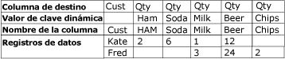
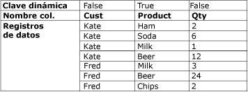

# Anulación de dinamización, transformación
  La transformación Anulación de dinamización transforma un conjunto de datos sin normalizar en una versión más normalizada ampliando los valores de varias columnas de un solo registro en varios registros con los mismos valores en una sola columna. Por ejemplo, un conjunto de datos que enumera nombres de clientes tiene una fila para cada cliente, con los productos y la cantidad comprada en columnas dentro de la fila. Después de que la transformación Anulación de dinamización normaliza el conjunto de datos, el conjunto de datos contiene una fila diferente para cada producto que compró el cliente.  
  
 El diagrama siguiente muestra un conjunto de datos antes de que se anule la dinamización de los datos en la columna Product.  
  
   
  
 El diagrama siguiente muestra un conjunto de datos después de que se haya anulado la dinamización de los datos en la columna Product.  
  
   
  
 En algunas circunstancias, los resultados de anulación de dinamización pueden contener filas con valores no esperados. Por ejemplo, si los datos de muestra del diagrama en los que se va a anular la dinamización tuvieran valores NULL en todas las columnas Qty para Fred, el resultado incluiría solamente una fila para Fred, no cinco. La columna Qty contendría NULL o cero, dependiendo del tipo de datos de la columna.  
  
## Configuración de la transformación Anulación de dinamización  
 La transformación Anulación de dinamización incluye la propiedad personalizada **PivotKeyValue** . Esta propiedad se puede actualizar a través de una expresión de propiedad, al cargar el paquete. Para más información, vea [Expresiones de Integration Services &#40;SSIS&#41;](../../../integration-services/expressions/integration-services-ssis-expressions.md), [Usar expresiones de propiedad en paquetes](../../../integration-services/expressions/use-property-expressions-in-packages.md) y [Propiedades personalizadas de transformación](../../../integration-services/data-flow/transformations/transformation-custom-properties.md).  
  
 Esta transformación tiene una entrada y una salida. No tiene ninguna salida de error.  
  
 Puede establecer propiedades a través del Diseñador de [!INCLUDE[ssIS](../../../includes/ssis-md.md)] o mediante programación.  
  
 Para obtener más información acerca de las propiedades que puede establecer a través del cuadro de diálogo **Editor avanzado** o mediante programación, haga clic en uno de los temas siguientes:  
  
-   [Propiedades comunes](http://msdn.microsoft.com/library/51973502-5cc6-4125-9fce-e60fa1b7b796)  
  
-   [Propiedades personalizadas de transformación](../../../integration-services/data-flow/transformations/transformation-custom-properties.md)  
  
 Para más información sobre cómo establecer las propiedades, vea [Establecer las propiedades de un componente de flujo de datos](../../../integration-services/data-flow/set-the-properties-of-a-data-flow-component.md).  
  
## Editor de transformación Anulación de dinamización
  Use el cuadro de diálogo **Editor de transformación Anulación de dinamización** para seleccionar las columnas que se van a dinamizar en filas y especificar la columna de datos y la nueva columna de salida del valor dinámico.  
  
> [!NOTE]  
>  Este tema usa el escenario Anulación de dinamización descrito en [Transformación Anulación de dinamización](../../../integration-services/data-flow/transformations/unpivot-transformation.md) para mostrar el uso de las opciones.  
  
### .  
 **Columnas de entrada disponibles**  
 Especifique las columnas que deben pasar a ser filas mediante las casillas.  
  
 **Nombre**  
 Muestra el nombre de la columna de entrada disponible.  
  
 **Paso a través**  
 Indique si desea incluir la columna en la salida de anulación de dinamización.  
  
 **Columna de entrada**  
 Seleccione de la lista de entradas disponibles las columnas para cada fila. Las selecciones se reflejan en las casillas activadas en la tabla **Columnas de entrada disponibles** .  
  
 En el escenario Anulación de dinamización descrito en [Unpivot Transformation](../../../integration-services/data-flow/transformations/unpivot-transformation.md), las columnas de entrada son las columnas **Ham**, **Soda**, **Milk**, **Beer**y **Chips** .  
  
 **Columna de destino**  
 Escriba un nombre para la columna de datos.  
  
 En el escenario Anulación de dinamización descrito en [Transformación Anulación de dinamización](../../../integration-services/data-flow/transformations/unpivot-transformation.md), la columna de destino es la columna de cantidad (**Qty**).  
  
 **Valor de clave dinámica**  
 Escriba el nombre del valor de dinamización. El nombre predeterminado es el de la columna de entrada, pero puede elegir cualquier nombre descriptivo único.  
  
 Puede especificar el valor de esta propiedad con una expresión de propiedad.  
  
 En el escenario Anulación de dinamización descrito en [Unpivot Transformation](../../../integration-services/data-flow/transformations/unpivot-transformation.md), los valores de dinamización se mostrarán como valores de texto en la nueva columna Product, designada en la opción **Nombre de la columna del valor de clave dinámica** , como los valores de texto **Ham**, **Soda**, **Milk**, **Beer**y **Chips**.  
  
 **Nombre de la columna del valor de clave dinámica**  
 Escriba un nombre para la columna del valor de dinamización. El valor predeterminado es "Valor de clave dinámica", pero podrá elegir cualquier nombre descriptivo único.  
  
 En el escenario Anulación de dinamización descrito en [Unpivot Transformation](../../../integration-services/data-flow/transformations/unpivot-transformation.md), el Nombre de la columna del valor de clave dinámica es **Product** y designa la nueva columna **Product** en la que se anula la dinamización de las columnas **Ham**, **Soda**, **Milk**, **Beer**y **Chips** .  
  
## Ver también  
 [Referencia de errores y mensajes de Integration Services](../../../integration-services/integration-services-error-and-message-reference.md)   
 [Transformación dinámica](../../../integration-services/data-flow/transformations/pivot-transformation.md)  
  
  
