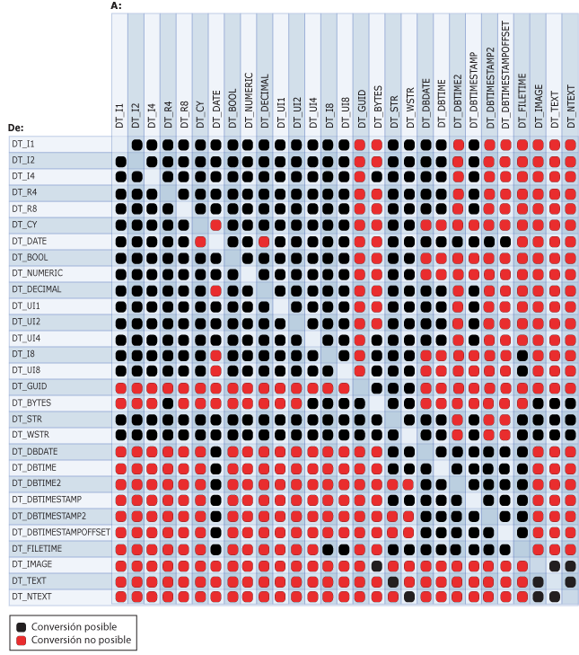

# <a name="cast-ssis-expression"></a>Conversión (expresión de SSIS)
  Convierte explícitamente una expresión de un tipo de datos a otro. El operador de conversión también puede funcionar como un operador de truncamiento.  
  
## <a name="syntax"></a>Sintaxis  
  
```  
  
(type_spec) expression  
  
```  
  
## <a name="arguments"></a>Argumentos  
 *type_spec*  
 Tipo de datos de [!INCLUDE[ssIS](../../includes/ssis-md.md)] válido.  
  
 *expression*  
 Expresión válida.  
  
## <a name="result-types"></a>Tipos de resultado  
 El tipo de datos de *type_spec*. Para más información, consulte [Integration Services Data Types](../../integration-services/data-flow/integration-services-data-types.md).  
  
## <a name="remarks"></a>Notas  
 El siguiente diagrama muestra operaciones de conversión válidas.  
  
   
  
 La conversión a algunos tipos de datos requiere parámetros. En la tabla siguiente se muestran estos tipos de datos y sus parámetros.  
  
|Tipo de datos|Parámetro|Ejemplo|  
|---------------|---------------|-------------|  
|DT_STR|*charcount*<br /><br /> *codepage*|(DT_STR,30,1252) convierte 30 bytes, o 30 caracteres individuales, al tipo de datos DT_STR con la página de códigos 1252.|  
|DT_WSTR|*Charcount*|(DT_WSTR,20) convierte 20 pares de bytes, o 20 caracteres Unicode, al tipo de datos DT_WSTR.|  
|DT_BYTES|*Bytecount*|(DT_BYTES,50) convierte 50 bytes al tipo de datos DT_BYTES.|  
|DT_DECIMAL|*Escala*|(DT_DECIMAL,2) convierte un valor numérico al tipo de datos DT_DECIMAL con una escala de 2.|  
|DT_NUMERIC|*Precisión*<br /><br /> *Escala*|(DT_NUMERIC,10,3) convierte un valor numérico al tipo de datos DT_NUMERIC con una precisión de 10 decimales y una escala de 3.|  
|DT_TEXT|*Codepage*|(DT_TEXT,1252) convierte un valor al tipo de datos DT_TEXT con la página de códigos 1252.|  
  
 Cuando se convierte una cadena al tipo de datos DT_DATE, o viceversa, se usa la configuración regional de la transformación. Sin embargo, la fecha está en el formato ISO de AAAA-MM-DD, sin tener en cuenta si la preferencia de la configuración regional utiliza el formato ISO.  
  
> [!NOTE]  
>  Para convertir una cadena en un tipo de datos de fecha que no sea DT_DATE, vea [Tipos de datos de Integration Services](../../integration-services/data-flow/integration-services-data-types.md).  
  
 Si la página de códigos es una página de códigos de caracteres multibyte, el número de bytes y caracteres puede diferir. La conversión de DT_WSTR a DT_STR con el mismo valor de *charcount* puede provocar el truncamiento de los caracteres finales de la cadena convertida. Si hay suficiente espacio de almacenamiento en la columna de la tabla de destino, establezca el valor del parámetro *charcount* de modo que refleje el número de bytes requeridos por la página de códigos multibyte. Por ejemplo, si convierte datos de caracteres a un tipo de datos DT_STR con la página de códigos 936, debe establecer el valor de *charcount* en un valor hasta dos veces mayor que el número de caracteres que espera que contengan los datos; si convierte datos de caracteres mediante la página de códigos UTF-8, debe establecer *charcount* en un valor hasta cuatro veces mayor.  
  
 Para obtener más información sobre la estructura de los tipos de datos de fecha, vea [Integration Services Data Types](../../integration-services/data-flow/integration-services-data-types.md).  
  
## <a name="ssis-expression-examples"></a>Ejemplos de expresiones de SSIS  
 Este ejemplo convierte un valor numérico en un entero.  
  
```  
(DT_I4) 3.57  
```  
  
 Este ejemplo convierte un entero en una cadena de caracteres con la página de códigos 1252.  
  
```  
(DT_STR,1,1252)5  
```  
  
 Este ejemplo convierte una cadena de tres caracteres en caracteres de doble byte.  
  
```  
(DT_WSTR,3)"Cat"  
```  
  
 Este ejemplo convierte un entero en un decimal con una escala de dos.  
  
```  
(DT_DECIMAl,2)500  
```  
  
 Este ejemplo convierte un entero en un valor numérico con una precisión de siete y una escala de tres.  
  
```  
(DT_NUMERIC,7,3)4000  
```  
  
 En este ejemplo se convierten los valores de la columna **FirstName** , definida con un tipo de datos **nvarchar** y una longitud de 50, en una cadena de caracteres que usa la página de códigos 1252.  
  
```  
(DT_STR,50,1252)FirstName  
```  
  
 En este ejemplo se convierten valores de la columna **DateFirstPurchase** de tipo DT_DBDATE a una cadena de caracteres Unicode con una longitud de 20.  
  
```  
(DT_WSTR,20)DateFirstPurchase  
```  
  
 Este ejemplo convierte el literal de cadena "True" en un valor booleano.  
  
```  
(DT_BOOL)"True"  
```  
  
 En este ejemplo se convierte un literal de cadena en DT_DBDATE.  
  
```  
(DT_DBDATE) "1999-10-11"  
```  
  
 En este ejemplo se convierte un literal de cadena en el tipo de datos DT_DBTIME2 que utiliza 5 dígitos para las fracciones de segundo. (El tipo de datos DT_DBTIME2 puede tener entre 0 y 7 dígitos especificados para las fracciones de segundo.)  
  
```  
(DT_DBTIME2, 5) "16:34:52.12345"  
```  
  
 En este ejemplo se convierte un literal de cadena en el tipo de datos DT_DBTIMESTAMP2 que utiliza 4 dígitos para las fracciones de segundo. (El tipo de datos DT_DBTIMESTAMP2 puede tener entre 0 y 7 dígitos especificados para las fracciones de segundo.)  
  
```  
(DT_DBTIMESTAMP2, 4) "1999-10-11 16:34:52.1234"  
```  
  
 En este ejemplo se convierte un literal de cadena en el tipo de datos DT_DBTIMESTAMPOFFSET que utiliza 7 dígitos para las fracciones de segundo. (El tipo de datos DT_DBTIMESTAMPOFFSET puede tener entre 0 y 7 dígitos especificados para las fracciones de segundo.)  
  
```  
(DT_DBTIMESTAMPOFFSET, 7) "1999-10-11 16:34:52.1234567 + 5:35"  
```  
  
## <a name="see-also"></a>Ver también  
 [Precedencia y capacidad de asociación de operadores](../../integration-services/expressions/operator-precedence-and-associativity.md)   
 [Operadores &#40;expresión de SSIS&#41;](../../integration-services/expressions/operators-ssis-expression.md)   
 [Expresiones de Integration Services &#40;SSIS&#41;](../../integration-services/expressions/integration-services-ssis-expressions.md)   
 [Tipos de datos de Integration Services en las expresiones](../../integration-services/expressions/integration-services-data-types-in-expressions.md)  
  
  
