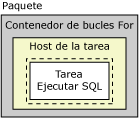
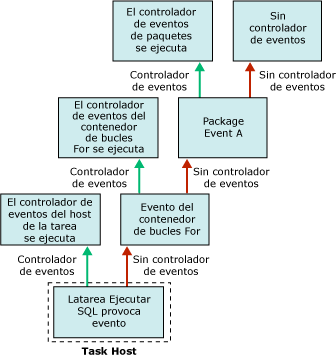

# Controladores de eventos de Integration Services (SSIS)

[!INCLUDE[ssis-appliesto](../includes/ssis-appliesto-ssvrpluslinux-asdb-asdw-xxx.md)]

  En el tiempo de ejecución, los ejecutables (paquetes y contenedores de bucles Foreach, bucles For, de secuencia y de host de tarea) producen eventos. Por ejemplo un evento OnError se produce cuando se genera un error. Puede crear controladores de eventos personalizados para estos eventos con el fin de ampliar la funcionalidad de paquetes y facilitar la administración de paquetes en el tiempo de ejecución. Los controladores de eventos pueden realizar tareas tales como las siguientes:  
  
-   Limpiar un almacén temporal de datos cuando un paquete o tarea termina de ejecutarse.  
  
-   Recuperar la información de sistema para evaluar la disponibilidad de los recursos antes de que el paquete se ejecute.  
  
-   Actualizar datos en una tabla cuando se produce un error en una búsqueda en una tabla de referencia.  
  
-   Enviar un mensaje de correo electrónico cuando se produce un error o una advertencia, o cuando se genera un error en una tarea.  
  
 Si un evento no tiene controlador de eventos, el evento se desencadena en el siguiente contenedor en sentido ascendente en la jerarquía de contenedores en un paquete. Si este contenedor tiene un controlador de eventos, éste se ejecuta en respuesta al evento. En caso contrario, el evento se desencadena en el siguiente contenedor en sentido ascendente en la jerarquía de contenedores.  
  
 El diagrama siguiente muestra un paquete simple que tiene un contenedor de bucles For que contiene una tarea Ejecutar SQL.  
  
   
  
 Solo el paquete tiene un controlador de eventos, para su evento **OnError** . Si se produce un error cuando se ejecuta una tarea Ejecutar SQL, se ejecuta el controlador de eventos **OnError** para el paquete. El siguiente diagrama muestra la secuencia de llamadas que produce el controlador de eventos **OnError** para que se ejecute el paquete.  
  
   
  
 Los controladores de eventos son miembros de una colección de controladores de eventos y todos los contenedores incluyen esta colección. Si crea el paquete mediante el Diseñador [!INCLUDE[ssIS](../includes/ssis-md.md)] , puede ver los miembros de las colecciones de controladores de eventos en las carpetas **Controladores de eventos** en la pestaña **Explorador de paquetes** del Diseñador [!INCLUDE[ssIS](../includes/ssis-md.md)] .  
  
 Puede configurar el contenedor del controlador de eventos de las maneras siguientes:  
  
-   Especifique un nombre y una descripción para el controlador de eventos.  
  
-   Indique si se ejecuta el controlador de eventos, si se produce un error en el paquete cuando se produce un error en el controlador de eventos, y la cantidad de errores que se pueden producir antes de que se produzca un error en el controlador de eventos.  
  
-   Especifique un resultado de ejecución que se debe devolver en lugar del resultado de ejecución real que el controlador de eventos devuelve en el tiempo de ejecución.  
  
-   Especifique la opción de transacción para el controlador de eventos.  
  
-   Especifique el modo de registro que usa el controlador de eventos.  
  
## Contenido del controlador de eventos  
 Crear un controlador de eventos es similar a generar un paquete. Un controlador de eventos tiene tareas y contenedores, que se ordenan en un flujo de control, y un controlador de eventos también puede incluir flujos de datos. El Diseñador [!INCLUDE[ssIS](../includes/ssis-md.md)] incluye la pestaña **Controladores de eventos** para crear controladores de eventos personalizados.  
  
 También se pueden crear controladores de eventos mediante programación. Para obtener más información, consulte [Controlar eventos mediante programación](../integration-services/building-packages-programmatically/handling-events-programmatically.md).  
  
## Eventos de tiempo de ejecución  
 En la siguiente tabla se enumeran los controladores de eventos que proporciona [!INCLUDE[ssISnoversion](../includes/ssisnoversion-md.md)] y se describen los eventos de tiempo de ejecución que hacen que el controlador de eventos se ejecute.  
  
|Controlador de eventos|Evento|  
|-------------------|-----------|  
|**OnError**|El controlador de eventos para el evento **OnError** . Este evento es desencadenado por un ejecutable cuando se produce un error.|  
|**OnExecStatusChanged**|El controlador de eventos para el evento **OnExecStatusChanged** . Este evento es desencadenado por un ejecutable cuando se modifica su estado de ejecución.|  
|**OnInformation**|El controlador de eventos para el evento **OnInformation** . Este evento se desencadena durante la validación y ejecución de un ejecutable para proporcionar información. Este evento transmite únicamente información, no errores o advertencias.|  
|**OnPostExecute**|El controlador de eventos para el evento **OnPostExecute** . Este evento es desencadenado por un ejecutable inmediatamente después de haber terminado de ejecutarse.|  
|**OnPostValidate**|El controlador de eventos para el evento **OnPostValidate** . Este evento es desencadenado por un ejecutable cuando termina su validación.|  
|**OnPreExecute**|El controlador de eventos para el evento **OnPreExecute** . Este evento es desencadenado por un ejecutable inmediatamente antes de que se ejecuta.|  
|**OnPreValidate**|El controlador de eventos para el evento **OnPreValidate** . Este evento es desencadenado por un ejecutable cuando se inicia su validación.|  
|**OnProgress**|El controlador de eventos para el evento **OnProgress** . Este evento es desencadenado por un ejecutable cuando el ejecutable realiza un progreso que se puede medir.|  
|**OnQueryCancel**|El controlador de eventos para el evento **OnQueryCancel** . Este evento es desencadenado por un ejecutable para determinar si debe dejar de ejecutarse.|  
|**OnTaskFailed**|El controlador de eventos para el evento **OnTaskFailed** . Este evento es desencadenado por una tarea cuando se produce un error.|  
|**OnVariableValueChanged**|El controlador de eventos para el evento **OnVariableValueChanged** . Este evento es desencadenado por un ejecutable cuando se modifica el valor de una variable. El evento es desencadenado por el ejecutable en el que se define la variable. Este evento no se desencadena si establece la propiedad **RaiseChangeEvent** de la variable en **False**. Para más información, vea [Variables de Integration Services &#40;SSIS&#41;](../integration-services/integration-services-ssis-variables.md).|  
|**OnWarning**|El controlador de eventos para el evento **OnWarning** . Este evento es desencadenado por un ejecutable cuando se produce una advertencia.|  

## agregar un controlador de eventos a un paquete
En tiempo de ejecución, los contenedores y tareas producen eventos. Puede crear controladores de eventos personalizados que respondan a estos eventos ejecutando un flujo de trabajo cuando se produce el evento. Por ejemplo, puede crear un controlador de eventos que envíe un mensaje de correo electrónico cuando una tarea genera un error.  
  
 Un controlador de eventos es similar a un paquete. Al igual que un paquete, un controlador de eventos puede proporcionar un ámbito para variables, e incluye un flujo de control y flujos de datos opcionales. Puede generar controladores de eventos para paquetes, el contenedor de bucles Foreach, el contenedor de bucles For, el contenedor de secuencias y todas las tareas.  
  
 Puede crear controladores de eventos mediante la superficie de diseño de la pestaña **Controladores de eventos** en el Diseñador [!INCLUDE[ssIS](../includes/ssis-md.md)] .  
  
 Cuando la pestaña **Controladores de eventos** se encuentra activa, los nodos **Elementos de flujo de control** y **Tareas del plan de mantenimiento** del cuadro de herramientas en el Diseñador [!INCLUDE[ssIS](../includes/ssis-md.md)] contienen la tarea y los contenedores para generar el flujo de control en el controlador de eventos. Los nodos **Orígenes de flujo de datos**, **Transformaciones**y **Destinos de flujo de datos** contienen los orígenes de datos, transformaciones y destinos para generar los flujos de datos en el controlador de eventos. Para obtener más información, consulte [Control Flow](../integration-services/control-flow/control-flow.md) y [Data Flow](../integration-services/data-flow/data-flow.md).  
  
 La pestaña **Controlador de eventos** también incluye el área de Administradores de **conexión** , donde se crean y modifican los administradores de conexión que usan los controladores de eventos para conectarse a los servidores y orígenes de datos. Para obtener más información, vea [Crear administradores de conexiones](https://msdn.microsoft.com/library/6ca317b8-0061-4d9d-b830-ee8c21268345).  
  
### Adición de un controlador de eventos en la pestaña Controladores de eventos  
  
1.  En [!INCLUDE[ssBIDevStudioFull](../includes/ssbidevstudiofull-md.md)], abra el proyecto de [!INCLUDE[ssISnoversion](../includes/ssisnoversion-md.md)] que contiene el paquete que desea.  
  
2.  En el Explorador de soluciones, haga doble clic en el paquete para abrirlo.  
  
3.  Haga clic en la pestaña **Controladores de eventos** .  
  
       
  
     La creación del flujo de control y de los flujos de datos en un controlador de eventos se asemeja a la creación del flujo de control y de los flujos de datos en un paquete. Para obtener más información, consulte [Control Flow](../integration-services/control-flow/control-flow.md) y [Data Flow](../integration-services/data-flow/data-flow.md).  
  
4.  En la lista **Ejecutable** , seleccione el ejecutable para el que desee crear un controlador de eventos.  
  
5.  En la lista **Controlador de eventos** , seleccione el controlador que desee crear.  
  
6.  Haga clic en el vínculo en la superficie de diseño de la pestaña **Controlador de eventos** .  
  
7.  Agregue elementos del flujo de control al controlador de eventos y conecte elementos mediante una restricción de precedencia, arrastrando la restricción de un elemento del flujo de control a otro. Para más información, consulte [Control Flow](../integration-services/control-flow/control-flow.md).  
  
8.  De forma opcional, puede agregar una tarea Flujo de datos y, en la superficie de diseño de la pestaña **Flujo de datos** , crear un flujo de datos para el controlador de eventos. Para más información, consulte [Data Flow](../integration-services/data-flow/data-flow.md).  
  
9. En el menú **Archivo** , haga clic en **Guardar los elementos seleccionados** para guardar el paquete.  

## Establecimiento de las propiedades de un controlador de eventos  
 Puede establecer propiedades en la ventana **Propiedades** de [!INCLUDE[ssBIDevStudioFull](../includes/ssbidevstudiofull-md.md)] o mediante programación.  
  
 Para obtener información sobre cómo establecer estas propiedades en [!INCLUDE[ssBIDevStudioFull](../includes/ssbidevstudiofull-md.md)], vea [Establecer las propiedades de tareas o contenedores](https://msdn.microsoft.com/library/52d47ca4-fb8c-493d-8b2b-48bb269f859b).  
  
 Para obtener información sobre cómo establecer mediante programación estas propiedades, vea <xref:Microsoft.SqlServer.Dts.Runtime.DtsEventHandler>.  
  
## Related Tasks  
 Para obtener información sobre cómo agregar un controlador de eventos a un paquete, vea [agregar un controlador de eventos a un paquete](https://msdn.microsoft.com/library/5e56885d-8658-480a-bed9-3f2f8003fd78).  
  
  
