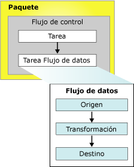

# paquetes de Integration Services (SSIS)
  Un paquete es una colección organizada de conexiones, elementos de flujo de control, elementos de flujo de datos, controladores de eventos, variables, parámetros y configuraciones que se pueden ensamblar con la ayuda de las herramientas gráficas de diseño proporcionadas por [!INCLUDE[ssNoVersion](../includes/ssnoversion-md.md)] [!INCLUDE[ssISnoversion](../includes/ssisnoversion-md.md)] o mediante programación.  A continuación guarda el paquete completado en [!INCLUDE[ssNoVersion](../includes/ssnoversion-md.md)], el Almacén de paquetes [!INCLUDE[ssIS](../includes/ssis-md.md)] o el sistema de archivos, o puede implementar el proyecto de ssISnoversion en el servidor [!INCLUDE[ssIS](../includes/ssis-md.md)] . El paquete es la unidad de trabajo que se recupera, ejecuta y guarda.  
  
 Al crear por primera vez un paquete, es un objeto vacío que no hace nada. Para agregar funcionalidad a un paquete, debe agregarle un flujo de control y, opcionalmente, uno o más flujos de datos.  
  
 El siguiente diagrama muestra un paquete individual que contiene un flujo de control con una tarea Flujo de datos que, a su vez, contiene un flujo de datos.  
  
   
  
 Una vez creado el paquete básico, puede agregarle características avanzadas como registro y variables para extender su funcionalidad. Para obtener más información, vea la sección Objetos que extienden la funcionalidad de un paquete.  
  
 Una vez completado el paquete, puede configurarse estableciendo propiedades de nivel de paquete que permitan implementar la seguridad, reiniciar paquetes desde puntos de comprobación o incorporar transacciones en el flujo de trabajo de paquetes. Para obtener más información, vea la sección Propiedades que ofrecen características extendidas.  
  
## Contenido de un paquete  
 **Tareas y contenedores (flujo de control).** Un flujo de control consta de una o más tareas y contenedores que se ejecutan cuando se ejecuta el paquete. Para controlar el orden o definir las condiciones para ejecutar la siguiente tarea o contenedor del flujo de control del paquete, puede usar restricciones de precedencia para conectar las tareas y los contenedores de un paquete. También se puede agrupar y ejecutar repetidamente un subconjunto de tareas y contenedores como una unidad en el flujo de control del paquete. Para más información, consulte [Control Flow](../integration-services/control-flow/control-flow.md).  
  
 **Orígenes de datos y destinos (flujo de datos).** Un flujo de datos consta de los orígenes y destinos que extraen y cargan datos, las transformaciones que modifican y extienden datos, y las rutas que vinculan orígenes, transformaciones y destinos. Para poder agregar un flujo de datos a un paquete, el flujo de control de paquetes debe incluir una tarea Flujo de datos. La tarea Flujo de datos es el ejecutable del paquete [!INCLUDE[ssIS](../includes/ssis-md.md)] que crea, organiza y ejecuta el flujo de datos. Se abre una instancia independiente del motor de flujo de datos para cada tarea Flujo de datos de un paquete. Para obtener más información, consulte [Data Flow Task](../integration-services/control-flow/data-flow-task.md) y [Data Flow](../integration-services/data-flow/data-flow.md).  
  
 **Administradores de conexiones (conexiones).** Un paquete suele incluir al menos un administrador de conexiones. Un administrador de conexiones es un vínculo entre un paquete y un origen de datos que define la cadena de conexión para acceder a los datos que las tareas, transformaciones y controladores de eventos del paquete usan. [!INCLUDE[ssISnoversion](../includes/ssisnoversion-md.md)] incluye topos de conexiones para orígenes de datos tales como archivos de texto y XML, bases de datos relacionales y proyectos y bases de datos de [!INCLUDE[ssASnoversion](../includes/ssasnoversion-md.md)] . Para más información, vea [Conexiones de Integration Services &#40;SSIS&#41;](../integration-services/connection-manager/integration-services-ssis-connections.md).  
  
## Objetos que extienden la funcionalidad de un paquete  
 Los paquetes pueden incluir objetos adicionales que proporcionan características avanzadas o extienden la funcionalidad existente, como controladores de eventos, configuraciones, registro y variables.  
  
### Controladores de eventos  
 Un controlador de eventos es un flujo de trabajo que se ejecuta en respuesta a los eventos provocados por un paquete, una tarea o un contenedor. Por ejemplo, puede usar un controlador de eventos para comprobar el espacio en disco cuando se produce un evento previo a la ejecución o si se produce un error, y enviar un mensaje de correo electrónico que notifique el espacio disponible o la información de error a un administrador. Un controlador de eventos se crea como un paquete, con un flujo de control y flujos de datos opcionales. Los controladores de eventos pueden agregarse a tareas individuales o a contenedores del paquete. Para obtener más información, vea [Controladores de eventos de Integration Services &#40;SSIS&#41;](../integration-services/integration-services-ssis-event-handlers.md).  
  
### Configuraciones  
 Una configuración es un conjunto de pares propiedad-valor que define las propiedades del paquete y sus tareas, contenedores, variables, conexiones y controladores de eventos cuando se ejecuta el paquete. El uso de configuraciones permite actualizar propiedades sin modificar el paquete. Cuando se ejecuta el paquete, se carga la información de configuración y se actualizan los valores de las propiedades. Por ejemplo, una configuración puede actualizar la cadena de conexión de la conexión.  
  
 La configuración se guarda y se implementa con el paquete cuando se instala el paquete en otro equipo. Los valores de la configuración pueden actualizarse cuando se instala el paquete para ofrecer compatibilidad con un entorno diferente. Para obtener más información, vea [Crear configuraciones de paquetes](../integration-services/packages/create-package-configurations.md).  
  
### Registro y proveedores de registro  
 Un registro es un conjunto de datos sobre el paquete que se recopilan cuando se ejecuta el paquete. Por ejemplo, un registro puede proporcionar la hora de inicio y la hora de finalización de la ejecución de un paquete. Un proveedor de registro define el tipo de destino y el formato que el paquete y sus contenedores y tareas pueden utilizar para registrar información de tiempo de ejecución. Los registros están asociados con un paquete, pero las tareas y los contenedores del paquete pueden registrar información en cualquier registro de paquete. [!INCLUDE[ssISnoversion](../includes/ssisnoversion-md.md)] incluye diversos proveedores de registro integrados para el registro. Por ejemplo, [!INCLUDE[ssISnoversion](../includes/ssisnoversion-md.md)] incluye proveedores de registro para [!INCLUDE[ssNoVersion](../includes/ssnoversion-md.md)] y archivos de texto. También puede crear proveedores de registro personalizados y usarlos para el registro. Para obtener más información, vea [Registro de Integration Services &#40;SSIS&#41;](../integration-services/performance/integration-services-ssis-logging.md).  
  
### Variables  
 [!INCLUDE[ssISnoversion](../includes/ssisnoversion-md.md)] admite variables del sistema y variables definidas por el usuario. Las variables del sistema proporcionan información útil acerca de objetos de paquete en tiempo de ejecución y las variables definidas por el usuario admiten escenarios personalizados en paquetes. Ambos tipos de variables pueden usarse en expresiones, scripts y configuraciones.  
  
 Las variables de nivel de paquete incluyen las variables del sistema predefinidas disponibles para un paquete y las variables definidas por el usuario con el ámbito del paquete. Para más información, consulte [Variables de Integration Services (SSIS)](../integration-services/integration-services-ssis-variables.md).  
 
### Parámetros  
 [!INCLUDE[ssISnoversion](../includes/ssisnoversion-md.md)] permiten asignar valores a propiedades de los paquetes en el momento de la ejecución de los mismos. Puede crear *parámetros de proyecto* en el nivel de proyecto y *parámetros de paquete* en el nivel de paquete. Los parámetros de proyecto se usan para proporcionar cualquier entrada externa que el proyecto recibe a uno o más paquetes del proyecto. Los parámetros de paquete permiten modificar la ejecución del paquete sin tener que modificarlo ni volver a implementarlo. Para más información, consulte [Paquete de Integration Services (SSIS) y los parámetros del proyecto](../integration-services/integration-services-ssis-package-and-project-parameters.md).  
 
## Propiedades de paquete que ofrecen características extendidas  
 Se puede configurar el objeto de paquete para que admita características como reiniciar el paquete en puntos de comprobación, firmar el paquete con un certificado digital, establecer el nivel de protección del paquete y garantizar la integridad de los datos mediante transacciones.  
  
### Reiniciar paquetes  
 El paquete incluye propiedades de punto de comprobación que puede utilizar para reiniciarlo si se produce un error en una o más de sus tareas. Por ejemplo, si un paquete tiene dos tareas Flujo de datos que actualizan dos tablas distintas y la segunda tarea no se ejecuta correctamente, el paquete puede volver a ejecutarse sin repetir la primera tarea Flujo de datos. Si reinicia un paquete, ahorrará tiempo en el caso de los paquetes de ejecución prolongada. Al reiniciar, puede iniciar el paquete a partir de la tarea que no se ejecutó correctamente en lugar de tener que volver a ejecutar el paquete completo. Para obtener más información, vea [Restart Packages by Using Checkpoints](../integration-services/packages/restart-packages-by-using-checkpoints.md).  
  
### Proteger paquetes  
 Un paquete puede firmarse con una firma digital y cifrarse con una contraseña o una clave de usuario. Una firma digital autentica el origen del paquete. Sin embargo, también se debe configurar [!INCLUDE[ssISnoversion](../includes/ssisnoversion-md.md)] para que compruebe la firma digital al cargar el paquete. Para obtener más información, vea [Identificar el origen de paquetes con firmas digitales](../integration-services/security/identify-the-source-of-packages-with-digital-signatures.md) y [Control del acceso a la información confidencial en paquetes](../integration-services/security/access-control-for-sensitive-data-in-packages.md).  
  
### Compatibilidad con las transacciones  
 Si se establece un atributo de transacción en el paquete, las tareas, los contenedores y las conexiones del paquete podrán unirse a la transacción. Los atributos de transacción garantizan que el paquete y sus elementos se ejecuten correctamente o no como una unidad (todos o ninguno). Los paquetes también pueden ejecutar otros paquetes e inscribir otros paquetes en transacciones, de forma que se pueden ejecutar varios paquetes como una sola unidad de trabajo. Para obtener más información, consulte [Transacciones de Integration Services](../integration-services/integration-services-transactions.md).  
  
## Entradas del registro personalizadas disponibles en el paquete  
 La siguiente tabla contiene las entradas del registro personalizadas para paquetes. Para obtener más información, vea [Registro de Integration Services &#40;SSIS&#41;](../integration-services/performance/integration-services-ssis-logging.md).  
  
|Entrada del registro|Description|  
|---------------|-----------------|  
|**PackageStart**|Indica que se inició la ejecución del paquete.   Nota: Esta entrada del registro se escribe automáticamente en el registro. No se puede excluir.|  
|**PackageEnd**|Indica que finalizó la ejecución del paquete.   Nota: Esta entrada del registro se escribe automáticamente en el registro. No se puede excluir.|  
|**Diagnostic**|Proporciona información sobre la configuración del sistema que afecta a la ejecución de paquetes, como el número de ejecutables que se pueden ejecutar simultáneamente.|  
  
## Establecimiento de las propiedades de un paquete  
 Puede establecer propiedades en la ventana **Propiedades** de [!INCLUDE[ssBIDevStudioFull](../includes/ssbidevstudiofull-md.md)] o mediante programación.  
  
 Para obtener más información sobre cómo establecer estas propiedades usando [!INCLUDE[ssBIDevStudioFull](../includes/ssbidevstudiofull-md.md)], vea [Establecer las propiedades de paquetes](../integration-services/set-package-properties.md).  
  
 Para obtener información sobre cómo establecer mediante programación estas propiedades, vea <xref:Microsoft.SqlServer.Dts.Runtime.Package>.  

## Reutilizar un paquete existente como plantilla  
 Los paquetes se utilizan con frecuencia como plantillas para generar paquetes que comparten una funcionalidad básica. Puede generar el paquete básico y luego copiarlo, o puede designar que el paquete sea una plantilla. Por ejemplo, un paquete que descarga y copia archivos, y luego extrae los datos, puede incluir las tareas FTP y Sistema de archivos en un bucle Foreach que enumera archivos de una carpeta. También podría incluir administradores de conexión de archivos planos para el acceso a los datos, y orígenes de archivos planos para la extracción de los datos. El destino de los datos varía y se agrega a cada nuevo paquete una vez copiado del paquete básico. También puede crear paquetes y luego usarlos como plantillas para los nuevos paquetes que agregue a un proyecto de [!INCLUDE[ssISnoversion](../includes/ssisnoversion-md.md)] . Para obtener más información, vea [Create Packages in SQL Server Data Tools](../integration-services/create-packages-in-sql-server-data-tools.md).  
  
 Cuando se crea un paquete por primera vez, ya sea mediante programación o mediante el Diseñador SSIS, se agrega un GUID a su propiedad **ID** y un nombre a su propiedad **Name** . Si crea un nuevo paquete mediante la copia de un paquete existente o mediante una plantilla de paquetes, también se copian el nombre y GUID del paquete existente. Esto puede ser un problema si se está realizando el registro, dado que el nombre y GUID del paquete se escriben en los registros para identificar el paquete al que pertenece la información registrada. Por lo tanto, debe actualizar el nombre y GUID de los nuevos paquetes para diferenciarlos entre sí y del paquete del que se copiaron en los datos de registro.  
  
 Para cambiar el GUID del paquete, debe volver a generar un GUID en la propiedad **ID** y en la ventana Propiedades de [!INCLUDE[ssBIDevStudioFull](../includes/ssbidevstudiofull-md.md)]. Para cambiar el nombre del paquete, puede actualizar el valor de la propiedad **Name** en la ventana Propiedades. También puede utilizar el símbolo del sistema **dtutil** o actualizar el nombre y el GUID mediante programación. Para obtener más información, vea [Establecer las propiedades de paquetes](../integration-services/set-package-properties.md) y [dtutil (utilidad)](../integration-services/dtutil-utility.md).  
  
## Tareas relacionadas  
 [!INCLUDE[ssISnoversion](../includes/ssisnoversion-md.md)] incluye dos herramientas gráficas para crear paquetes aparte del modelo de objetos [!INCLUDE[ssIS](../includes/ssis-md.md)] : el Diseñador [!INCLUDE[ssNoVersion](../includes/ssnoversion-md.md)] y el Asistente para importación y exportación de [!INCLUDE[ssIS](../includes/ssis-md.md)] . Para obtener detalles, vea los siguientes temas.  
  
-   [Importar y exportar datos con el Asistente para importación y exportación de SQL Server](../integration-services/import-export-data/import-and-export-data-with-the-sql-server-import-and-export-wizard.md)  
  
-   [Crear paquetes en herramientas de datos de SQL Server](../integration-services/create-packages-in-sql-server-data-tools.md)  
  
-   Vea [Building Packages Programmatically](../integration-services/building-packages-programmatically/building-packages-programmatically.md) (Generación de paquetes mediante programación) en la Guía del desarrollador. 
  
  
