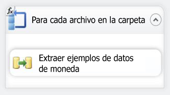
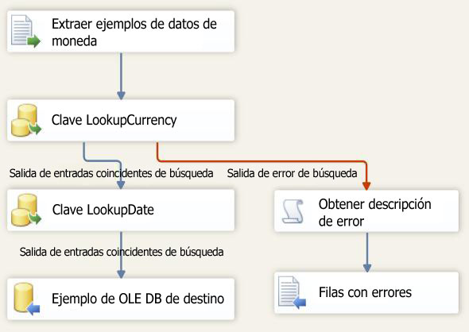

# Lección 6-3: Probar el paquete de la lección 6
En tiempo de ejecución, el paquete obtendrá el valor de la Propiedad de directorio desde el parámetro VarFolderName.  
  
Para comprobar que, durante la ejecución, el paquete actualiza la propiedad Directory con el nuevo valor, simplemente debe ejecutar el paquete. Puesto que en el directorio solamente se copiaron tres archivos de datos de ejemplo, el flujo de datos solamente se ejecutará tres veces, en lugar de repetirse a través de los 14 archivos de la carpeta original.  
  
## Comprobar el diseño del paquete  
Antes de probar el paquete, debe comprobar que los flujos de datos y de control de la lección 6 contienen los objetos mostrados en los diagramas siguientes. El flujo de control debe ser idéntico al flujo de datos de la lección 5. El flujo de datos debe ser idéntico al flujo de datos de la lección 5.  
  
**Flujo de control**  
  
  
  
**Flujo de datos**  
  
  
  
### Para probar el paquete del tutorial de la lección 6  
  
1.  En el menú Depurar, haga clic en Iniciar depuración.  
  
2.  Una vez que se haya completado la ejecución del paquete, en el menú Depurar, haga clic en Detener depuración.  
  
## Siguiente tarea de la lección  
[Paso 4: implementar el paquete de la lección 6](../integration-services/lesson-6-4-deploying-the-lesson-6-package.md)  
  
  
  
