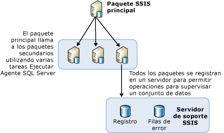

# Realizar el equilibrio de carga de paquetes en servidores remotos mediante el Agente SQL Server

[!INCLUDE[ssis-appliesto](../../includes/ssis-appliesto-ssvrpluslinux-asdb-asdw-xxx.md)]

  Cuando se tienen que ejecutar varios paquetes, es conveniente utilizar otros servidores que están disponibles. Se denomina equilibrio de carga a este método de utilizar otros servidores para ejecutar paquetes cuando los paquetes están todos bajo el control de un paquete primario. En [!INCLUDE[ssNoVersion](../../includes/ssnoversion-md.md)] [!INCLUDE[ssISnoversion](../../includes/ssisnoversion-md.md)], el equilibrio de carga es un procedimiento manual que deben llevar a cabo los propietarios de los paquetes. Los servidores no realizan el equilibrio de carga automáticamente. Asimismo, los paquetes ejecutados en los servidores remotos deben ser paquetes completos, y no tareas individuales en otros paquetes.  
  
 El equilibrio de carga es útil en los siguientes escenarios:  
  
-   Los paquetes se pueden ejecutar al mismo tiempo.  
  
-   Los paquetes son grandes y, si se ejecutan de manera secuencial, el tiempo de ejecución puede ser superior al permitido para procesamiento.  
  
 Los administradores y arquitectos pueden determinar si la utilización de servidores adicionales para procesamiento beneficiaría sus procesos.  
  
## Ilustración de equilibrio de carga  
 El siguiente diagrama muestra un paquete primario en un servidor. El paquete primario contiene varias tareas Ejecutar trabajo del Agente SQL. Cada tarea del paquete primario llama a un Agente SQL Server en un servidor remoto. Esos servidores remotos contienen trabajos del Agente SQL Server que incluyen un paso que llama a un paquete en ese servidor.  
  
   
  
 Los pasos requeridos para el equilibrio de carga en esta arquitectura no son conceptos nuevos. En lugar de ello, el equilibrio de carga se logra al utilizar conceptos existentes y objetos SSIS comunes de una nueva manera.  
  
## Ejecución de paquetes en una instancia remota mediante el Agente SQL Server  
 En la arquitectura básica de la ejecución remota de paquetes, un paquete central reside en la instancia del SQL Server que controla a los otros paquetes remotos. El diagrama muestra este paquete central, denominado primario SSIS. La instancia en la que reside este paquete primario controla la ejecución de los trabajos del Agente SQL Server que ejecutan los paquetes secundarios. La ejecución de los paquetes secundarios no sigue un programa fijo bajo el control del Agente SQL Server en el servidor remoto. En su lugar, el Agente SQL Server inicia los paquetes secundarios cuando los llama el paquete primario y se ejecutan en la misma instancia de SQL Server en la que reside el Agente SQL Server.  
  
 Para poder ejecutar un paquete remoto a través del Agente SQL Server, primero debe configurar los paquetes primarios y secundarios, además de configurar los trabajos del Agente SQL Server que controlan los paquetes secundarios. Las siguientes secciones proporcionan más información sobre cómo crear, configurar, ejecutar y mantener paquetes que se ejecutan en servidores remotos. Este proceso comprende varios pasos:  
  
-   Crear paquetes secundarios e instalarlos en servidores remotos.  
  
-   Crear los trabajos del Agente SQL Server en las instancias remotas que ejecutarán los paquetes.  
  
-   Crear el paquete primario.  
  
-   Determinar el escenario de registro de los paquetes secundarios.  
  
## Implementación de paquetes secundarios
  Cuando implementa el equilibrio de carga mediante [!INCLUDE[ssISnoversion](../../includes/ssisnoversion-md.md)], los paquetes secundarios se instalan en otros servidores para aprovechar el tiempo de servidor o CPU disponible. Para crear y ejecutar los paquetes secundarios, es necesario realizar los pasos siguientes:  
  
-   Diseñar los paquetes secundarios.  
  
-   Mover los paquetes al servidor remoto.  
  
-   Crear un trabajo del Agente SQL Server en el servidor remoto que contenga un paso que ejecute el paquete secundario.  
  
-   Probar y depurar el trabajo del Agente SQL Server y los paquetes secundarios.  
  
 Cuando diseñe los paquetes secundarios, puesto que no hay ningún límite establecido para el diseño, podrá incluir la funcionalidad que desee. Sin embargo, si el paquete tiene acceso a datos, debe asegurarse de que el servidor que ejecuta el paquete tenga acceso a los datos.  
  
 Para identificar el paquete primario que ejecuta paquetes secundarios, en [!INCLUDE[ssBIDevStudioFull](../../includes/ssbidevstudiofull-md.md)] haga clic con el botón derecho en el paquete en el Explorador de soluciones y, después, haga clic en **Paquete de punto de entrada**.  
  
 Una vez diseñados los paquetes secundarios, el próximo paso es implementarlos en los servidores remotos.  
  
### Mover el paquete secundario a la instancia remota  
 Existen varias formas de mover paquetes a otros servidores. Los dos métodos sugeridos son:  
  
-   Exportar paquetes mediante [!INCLUDE[ssManStudioFull](../../includes/ssmanstudiofull-md.md)].  
  
-   Implementar paquetes generando una utilidad de implementación para el proyecto que contiene los paquetes que desea implementar y, a continuación, ejecutar el Asistente para la instalación de paquetes para instalar los paquetes en el sistema de archivos o en una instancia de [!INCLUDE[ssNoVersion](../../includes/ssnoversion-md.md)]. Para obtener más información, vea [Implementación de paquetes heredada &#40;SSIS&#41;](../../integration-services/packages/legacy-package-deployment-ssis.md).  
  
 Debe repetir la implementación con cada servidor remoto que desee utilizar.  
  
### Crear trabajos del Agente SQL Server  
 Una vez que se hayan implementado los paquetes secundarios en los distintos servidores, cree un trabajo del Agente SQL Server en cada servidor que contenga un paquete secundario. El trabajo del Agente SQL Server incluye un paso que ejecuta el paquete secundario cuando se llama al agente del trabajo. Los trabajos del Agente SQL Server no son trabajos programados, sino que ejecutan paquetes secundarios únicamente cuando los llama un paquete primario. La notificación del éxito o fracaso del trabajo que se devuelve al paquete primario refleja el éxito o fracaso del trabajo del Agente SQL Server y si la llamada fue satisfactoria, no el éxito o fracaso del paquete secundario o si éste se ejecutó.  
  
### Depurar los trabajos del Agente SQL Server y los paquetes secundarios  
 Puede probar los trabajos del Agente SQL Server y sus paquetes secundarios a través de uno de los métodos siguientes:  
  
-   Ejecutar cada paquete secundario en el Diseñador SSIS haciendo clic en **Depurar** / **Iniciar sin depurar**.  
  
-   Ejecutar el trabajo individual del Agente SQL Server en el equipo remoto a través de [!INCLUDE[ssManStudioFull](../../includes/ssmanstudiofull-md.md)], para asegurarse de que el paquete se ejecuta.  
  
 Para obtener información sobre cómo solucionar problemas de los paquetes que se ejecutan desde trabajos del Agente [!INCLUDE[ssNoVersion](../../includes/ssnoversion-md.md)] , vea el artículo acerca de [un paquete de SSIS no se ejecuta al llamarlo desde un paso de trabajo del Agente SQL Server](https://support.microsoft.com/kb/918760) en Support Knowledge Base de [!INCLUDE[msCoName](../../includes/msconame-md.md)] .  
  
 El Agente SQL Server comprueba el acceso al subsistema de un proxy y da acceso al proxy cada vez que se ejecuta el paso de trabajo.  
  
 Puede crear un proxy en [!INCLUDE[ssManStudioFull](../../includes/ssmanstudiofull-md.md)].  

## Implementación del paquete primario
  Cuando se lleva a cabo el equilibro de carga de paquetes SSIS entre varios servidores, el siguiente paso tras la creación e implementación de los paquetes secundarios, así como la creación de trabajos del Agente SQL Server para ejecutarlos, es crear el paquete primario. El paquete primario contendrá varias tareas Ejecutar trabajo del Agente SQL Server y cada tarea se encarga de llamar a un trabajo del Agente SQL Server que ejecuta uno de los paquetes secundarios. A su vez, las tareas Ejecutar trabajo del Agente SQL Server del paquete primario ejecutan los distintos trabajos del Agente SQL Server. Cada tarea del paquete primario contiene información tal como cómo conectarse al servidor remoto y qué trabajo ejecutar en ese servidor. Para más información, consulte [Execute SQL Server Agent Job Task](../../integration-services/control-flow/execute-sql-server-agent-job-task.md).  
  
 Para identificar el paquete primario que ejecuta paquetes secundarios, en [!INCLUDE[ssBIDevStudioFull](../../includes/ssbidevstudiofull-md.md)] haga clic con el botón derecho en el paquete en el Explorador de soluciones y, después, haga clic en **Paquete de punto de entrada**.  
  
### Listado de paquetes secundarios  
 Si implementa un proyecto que contiene un paquete primario y uno o varios paquetes secundarios en el servidor [!INCLUDE[ssISnoversion](../../includes/ssisnoversion-md.md)] , puede ver una lista de los paquetes secundarios que ejecuta el paquete primario. Cuando se ejecuta el paquete primario, se genera automáticamente un informe de **información general** para el paquete primario en [!INCLUDE[ssManStudioFull](../../includes/ssmanstudiofull-md.md)]. El informe lista los paquetes secundarios ejecutados por la tarea Ejecutar paquete contenida en el paquete primario, como se muestra en la imagen siguiente.  
  
   
  
 Si desea información sobre cómo acceder al informe de **información general** , vea [Reports for the Integration Services Server](../../integration-services/performance/monitor-running-packages-and-other-operations.md#reports).  
  
### Restricciones de precedencia en el paquete primario  
 Cuando crea restricciones de precedencia entre las tareas Ejecutar trabajo del Agente SQL Server del paquete primario, estas restricciones de precedencia controlan solamente la hora en la que se inician los trabajos del Agente SQL Server en los servidores remotos. Las restricciones de precedencia no pueden recibir información sobre el éxito o error de los paquetes secundarios que se ejecutan a partir de los pasos de los trabajos del Agente SQL Server.  
  
 Esto significa que el éxito o error de un paquete secundario no se propaga al paquete primario, dado que la única función de la tarea Ejecutar trabajo del Agente SQL Server en el paquete primario es solicitar a trabajo del Agente SQL Server que ejecute el paquete secundario. Una vez que la llamada al trabajo del Agente SQL Server es satisfactoria, el paquete primario recibe un resultado de <xref:Microsoft.SqlServer.Dts.Runtime.DTSExecResult.Success>.  
  
 Un error en este escenario solo significa que ha habido un error en la llamada a la tarea del trabajo del Agente SQL Server remoto. Una situación en la que esto puede ocurrir es cuando el servidor remoto está inactivo y el agente no responde. No obstante, en tanto se active el agente, el paquete primario completa su tarea sin problemas.  
  
> [!NOTE]  
>  Puede usar una tarea Ejecutar SQL que contenga una instrucción Transact-SQL de **sp_start_job N'package_name'** . Para más información, vea [sp_start_job &#40;Transact-SQL&#41;](../../relational-databases/system-stored-procedures/sp-start-job-transact-sql.md).  
  
### Entorno de depuración  
 Al probar el paquete primario, utilice el entorno de depuración del diseñador ejecutándolo mediante Depurar/Iniciar depuración (F5). También puede usar la utilidad del símbolo del sistema **dtexec**. Para obtener más información, consulte [utilidad dtexec](../../integration-services/packages/dtexec-utility.md).  

## Registro para la carga de paquetes equilibrados en servidores remotos
  Para un administrador es más fácil administrar los registros de todos los paquetes secundarios que están en ejecución en varios servidores cuando todos los paquetes secundarios utilizan el mismo proveedor de registro y todos escriben en el mismo destino. Una manera de crear un archivo común de registro para todos los paquetes secundarios es configurar los paquetes secundarios para que registren sus eventos en un proveedor de registro de SQL Server. Puede configurar todos los paquetes para que utilicen la misma base de datos, el mismo servidor y la misma instancia del servidor.  
  
 Para ver los archivos de registro, el administrador solo tiene que registrarse en un único servidor para ver los archivos de registro de todos los paquetes secundarios.  
  
 Para obtener información sobre cómo habilitar el registro en un paquete, consulte [Integration Services (SSIS) Logging](../../integration-services/performance/integration-services-ssis-logging.md) (Registro de Integration Services [SSIS]).  

## Related Tasks  
 [Trabajos del Agente SQL Server para paquetes](../../integration-services/packages/sql-server-agent-jobs-for-packages.md)  
  
  
