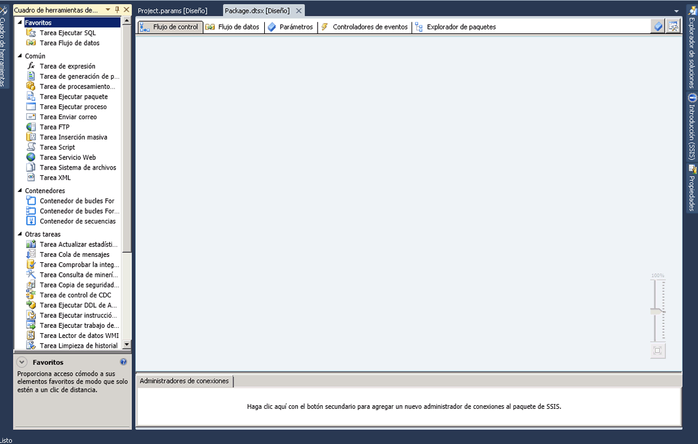

# Diseñador SSIS
  [!INCLUDE[ssIS](../includes/ssis-md.md)] es una herramienta gráfica que se puede usar para crear y mantener paquetes [!INCLUDE[ssISnoversion](../includes/ssisnoversion-md.md)] . [!INCLUDE[ssIS](../includes/ssis-md.md)] está disponible en [!INCLUDE[ssBIDevStudioFull](../includes/ssbidevstudiofull-md.md)] como parte de un proyecto de [!INCLUDE[ssISnoversion](../includes/ssisnoversion-md.md)] .  
  
 Puede usar el Diseñador [!INCLUDE[ssIS](../includes/ssis-md.md)] para realizar las tareas siguientes:  
  
-   Generar el flujo de control en un paquete.  
  
-   Generar los flujos de datos en un paquete.  
  
-   Agregar controladores de eventos al paquete y objetos de paquete.  
  
-   Ver el contenido del paquete.  
  
-   En el tiempo de ejecución, ver el progreso de ejecución del paquete.  
  
 El siguiente diagrama muestra el Diseñador [!INCLUDE[ssIS](../includes/ssis-md.md)] y la ventana del **cuadro de herramientas** .  
  
   
  
 [!INCLUDE[ssISnoversion](../includes/ssisnoversion-md.md)] incluye cuadros de diálogo y ventanas adicionales para agregar funcionalidad a los paquetes, y [!INCLUDE[ssBIDevStudioFull](../includes/ssbidevstudiofull-md.md)] proporciona ventanas y cuadros de diálogo para configurar el entorno de desarrollo y trabajar con paquetes. Para obtener más información, vea [Interfaz de usuario de Integration Services](../integration-services/integration-services-user-interface.md).  
  
 [!INCLUDE[ssIS](../includes/ssis-md.md)] no depende del servicio [!INCLUDE[ssISnoversion](../includes/ssisnoversion-md.md)] , el servicio que administra y supervisa paquetes, y no se requiere que el servicio se esté ejecutando para crear o modificar paquetes en el Diseñador [!INCLUDE[ssIS](../includes/ssis-md.md)] . Sin embargo, si detiene el servicio mientras se encuentra abierto el Diseñador [!INCLUDE[ssIS](../includes/ssis-md.md)] , ya no puede abrir los cuadros de diálogo que proporciona el Diseñador [!INCLUDE[ssIS](../includes/ssis-md.md)] y es posible que aparezca el mensaje de error "El servidor RPC no está disponible". Para restablecer el Diseñador [!INCLUDE[ssIS](../includes/ssis-md.md)] y seguir trabajando con el paquete, debe cerrar el diseñador, salir de [!INCLUDE[ssBIDevStudioFull](../includes/ssbidevstudiofull-md.md)]y, a continuación, volver a abrir [!INCLUDE[ssBIDevStudioFull](../includes/ssbidevstudiofull-md.md)], el proyecto de [!INCLUDE[ssISnoversion](../includes/ssisnoversion-md.md)] y el paquete.  
  
## Deshacer y rehacer  
 Puede deshacer y rehacer hasta 20 acciones en el Diseñador [!INCLUDE[ssIS](../includes/ssis-md.md)] . Para un paquete, la acción de deshacer o rehacer está disponible en las pestañas **Flujo de control**, **Flujo de datos**, **Controladores de eventos**y **Parámetros** , y en la ventana **Variables** . Para un proyecto, la acción de deshacer o rehacer está disponible en la ventana **Parámetros del proyecto** .  
  
 No se pueden deshacer ni rehacer los cambios en el **Cuadro de herramientas de SSIS**nuevo.  
  
 Cuando se realizan cambios en un componente mediante el editor de componentes, los cambios se deshacen y rehacen en conjunto, en lugar de deshacer y rehacer cambios individuales. El conjunto de cambios aparece como una sola acción en la lista desplegable de deshacer y rehacer.  
  
 Para deshacer una acción, haga clic en el botón Deshacer de la barra de herramientas, en el elemento de menú **Editar/Deshacer** o pulse CTRL+Z. Para rehacer una acción, haga clic en el botón Rehacer de la barra de herramientas, en el elemento de menú **Editar/Rehacer** o pulse CTRL+Y. Para deshacer o rehacer varias acciones, haga clic en la flecha situada junto al botón de la barra de herramientas, resalte varias acciones en la lista desplegable y, después, haga clic en la lista.  
  
## Partes del Diseñador SSIS  
 [!INCLUDE[ssIS](../includes/ssis-md.md)] tiene cinco pestañas permanentes: una pestaña para cada una de las funciones de generación de flujo de control, flujos de datos, parámetros y controladores de eventos de un paquete, y una pestaña para ver el contenido de un paquete. En el tiempo de ejecución aparece una sexta pestaña que muestra el progreso de la ejecución de un paquete mientras se ejecuta y los resultados de la ejecución una vez finalizada.  
  
 Además, el Diseñador [!INCLUDE[ssIS](../includes/ssis-md.md)] incluye un área de Administradores de conexión para agregar y configurar los administradores de conexión que usa un paquete para conectarse a los datos.  
  
### Pestaña Flujo de control  
 El flujo de control de un paquete se genera en la superficie de diseño de la pestaña **Flujo de control** . Arrastre elementos desde el **cuadro de herramientas** a la superficie de diseño y conéctelos con un flujo de control haciendo clic en el icono correspondiente al elemento y arrastrando la flecha desde un elemento a otro.  
  
 Para más información, consulte [Control Flow](../integration-services/control-flow/control-flow.md).  
  
### Pestaña Flujo de datos  
 Si un paquete contiene una tarea de flujo de datos, puede agregar flujos de datos al paquete. Los flujos de datos de un paquete se generan en la superficie de diseño de la pestaña **Flujo de datos** . Arrastre elementos desde el **cuadro de herramientas** a la superficie de diseño y conéctelos con un flujo de datos haciendo clic en el icono correspondiente al elemento y arrastrando la flecha desde un elemento a otro.  
  
 Para más información, consulte [Data Flow](../integration-services/data-flow/data-flow.md).  
  
### Pestaña Parámetros  
 Los parámetros de Integration Services (SSIS) permiten asignar valores a las propiedades de los paquetes en el momento de la ejecución de los mismos. Puede crear parámetros de proyecto en el nivel de proyecto y parámetros de paquete en el nivel de paquete. Los parámetros de proyecto se usan para proporcionar cualquier entrada externa que el proyecto recibe a uno o más paquetes del proyecto. Los parámetros de paquete permiten modificar la ejecución del paquete sin tener que modificarlo ni volver a implementarlo. Esta pestaña permite administrar parámetros del paquete.  
  
 Para más información sobre los parámetros, consulte [Parámetros de Integration Services (SSIS)](integration-services-ssis-package-and-project-parameters.md).  
  
> **IMPORTANTE:**  Los parámetros solo están disponibles en los proyectos desarrollados para el modelo de implementación del proyecto. Por consiguiente, verá la pestaña Parámetros solo en los paquetes que formen parte de un proyecto configurado para utilizar el modelo de implementación del proyecto.  
  
### Pestaña Controladores de eventos  
 Los eventos de un paquete se generan en la superficie de diseño de la pestaña **Controladores de eventos** . En la pestaña **Controladores de eventos** , se selecciona el paquete u objeto de paquete para el cual desea crear un controlador de eventos y después se selecciona el evento que se debe asociar con el controlador de eventos. Un controlador de eventos tiene un flujo de control y flujos de datos opcionales.  
  
 Para obtener más información, consulte [Add an Event Handler to a Package](https://msdn.microsoft.com/library/5e56885d-8658-480a-bed9-3f2f8003fd78).  
  
### Pestaña Explorador de paquetes  
 Los paquetes pueden ser complejos e incluir muchas tareas, administradores de conexión, variables y otros elementos. La vista de explorador del paquete le permite ver una lista completa de elementos de paquete.  
  
 Para obtener más información, consulte [Ver objetos de paquete](../integration-services/view-package-objects.md).  
  
### Pestaña Progreso/Resultados de la ejecución  
 Mientras se ejecuta un paquete, la pestaña **Progreso** muestra el progreso de la ejecución del paquete. Una vez que el paquete ha terminado de ejecutarse, los resultados de la ejecución permanecen disponibles en la pestaña **Resultados de la ejecución** .  
  
> **NOTA:** Para habilitar o deshabilitar la presentación de mensajes en la pestaña **Progreso** , active o desactive la opción **Informe de progreso de depuración** del menú **SSIS** .  
  
#### Área de administradores de conexión  
 Los administradores de conexión utilizados por un paquete se agregan y modifican en el área **Administradores de conexión** . [!INCLUDE[ssISnoversion](../includes/ssisnoversion-md.md)] incluye administradores de conexión para conectarse a una serie de orígenes de datos, como archivos de texto, bases de datos OLE DB y proveedores .NET.  
  
 Para más información, vea [Conexiones de Integration Services &#40;SSIS&#41;](../integration-services/connection-manager/integration-services-ssis-connections.md) y [Crear administradores de conexiones](https://msdn.microsoft.com/library/6ca317b8-0061-4d9d-b830-ee8c21268345).  
 
## Pestaña Flujo de control
Utilice la pestaña **Flujo de control** del Diseñador [!INCLUDE[ssIS](../includes/ssis-md.md)] para genera el flujo de control en un paquete de [!INCLUDE[ssISnoversion](../includes/ssisnoversion-md.md)] .  
  
 Cree el flujo de control arrastrando objetos gráficos que representan contenedores y tareas de [!INCLUDE[ssIS](../includes/ssis-md.md)] desde el **Cuadro de herramientas** a la superficie de diseño de la pestaña **Flujo de control** y, a continuación, conecte los objetos arrastrando el contenedor de un objeto a otro objeto. Cada línea de conexión representa una restricción de precedencia que especifica el orden en el que se ejecutan las tareas y los contenedores.  
  
 Además, puede utilizar el Diseñador [!INCLUDE[ssIS](../includes/ssis-md.md)] para agregar la siguiente funcionalidad desde la pestaña **Flujo de control** :  
  
-   Implementar registro  
  
-   Crear configuraciones de paquetes  
  
-   Firmar el paquete con un certificado  
  
-   Administrar variables  
  
-   Agregar anotaciones  
  
-   Configurar puntos de interrupción  
  
 Para agregar estas funciones a contenedores o tareas individuales del Diseñador [!INCLUDE[ssIS](../includes/ssis-md.md)] , haga clic con el botón secundario en la superficie de diseño y, a continuación, seleccione la opción.  
 
## Pestaña Flujo de datos
Utilice la pestaña **Flujo de datos** del Diseñador [!INCLUDE[ssIS](../includes/ssis-md.md)] para crear flujos de datos en un paquete de [!INCLUDE[ssISnoversion](../includes/ssisnoversion-md.md)] .  
  
 Cree los flujos de datos arrastrando objetos gráficos que representan orígenes, transformaciones y destino del **Cuadro de herramientas** a la superficie de diseño de la pestaña **Flujo de datos** y, a continuación, conectando los objetos para crear rutas que determinan la secuencia en la que se ejecutan las transformaciones.  
  
 Haga clic con el botón derecho en una ruta de acceso y, después, haga clic en **Visores de datos** para agregar visores de datos con los que ver los datos antes y después de cada objeto de flujo de datos.  
  
 También puede utilizar el Diseñador [!INCLUDE[ssIS](../includes/ssis-md.md)] para agregar la siguiente funcionalidad de la pestaña **Flujo de datos** :  
  
-   Administrar variables  
  
-   Agregar anotaciones  
  
 Para agregar estas funciones en el Diseñador [!INCLUDE[ssIS](../includes/ssis-md.md)] , haga clic con el botón secundario en la superficie de diseño y, a continuación, seleccione la opción que desee.  
 
## Pestaña Controladores de eventos
  Utilice la pestaña **Controladores de eventos** del Diseñador [!INCLUDE[ssIS](../includes/ssis-md.md)] para generar un flujo de control en un paquete de [!INCLUDE[ssISnoversion](../includes/ssisnoversion-md.md)] . Un controlador de eventos se ejecuta en respuesta a un evento generado por el paquete o por una tarea o un contenedor de un paquete.  
  
## Opciones  
 **Executable**  
 Seleccione el ejecutable para el cual desea generar un controlador de eventos. El ejecutable puede ser el paquete, o una tarea o contenedores del paquete.  
  
 **Controlador de eventos**  
 Seleccione un tipo de controlador de eventos. Cree el controlador de eventos arrastrando los elementos desde el **Cuadro de herramientas**.  
  
 **Eliminar**  
 Seleccione un controlador de eventos y elimínelo del paquete haciendo clic en **Eliminar**.  
  
 **Haga clic aquí para crear un \<nombre de controlador de eventos\> para el ejecutable \<nombre del archivo ejecutable\>**  
 Haga clic aquí para crear el controlador de eventos.  
  
 Cree el flujo de control arrastrando objetos gráficos que representan contenedores y tareas de [!INCLUDE[ssIS](../includes/ssis-md.md)] desde el **Cuadro de herramientas** a la superficie de diseño de la pestaña **Controladores de eventos** y, a continuación, conecte los objetos utilizando las restricciones de precedencia para definir la secuencia en que se ejecutan.  
  
 Además, para agregar anotaciones, haga clic con el botón derecho en la superficie de diseño y, después, en el menú, haga clic en **Agregar anotación**.  
 
## Pestaña Explorador de paquetes
Utilice la pestaña **Explorador de paquetes** del Diseñador [!INCLUDE[ssIS](../includes/ssis-md.md)] para ver una vista de todos los elementos de un paquete: configuraciones, conexiones, controladores de eventos, objetos ejecutables como tareas y contenedores, proveedores de registro, restricciones de precedencia y variables. Si un paquete contiene una tarea Flujo de datos, la pestaña **Explorador de paquetes** incluye un nodo que contiene una vista jerárquica de los componentes de flujo de datos.  
  
 Haga clic con el botón derecho en un elemento de paquete y luego haga clic en **Propiedades** para mostrar las propiedades del elemento en la ventana **Propiedades** o haga clic en **Eliminar** para eliminar el elemento. 
 
## Progreso (pestaña)
Utilice la pestaña **Progreso** del Diseñador [!INCLUDE[ssIS](../includes/ssis-md.md)] para ver el progreso de la ejecución de un paquete [!INCLUDE[ssISnoversion](../includes/ssisnoversion-md.md)] cuando ejecute el paquete en [!INCLUDE[ssBIDevStudioFull](../includes/ssbidevstudiofull-md.md)]. La pestaña **Progreso** muestra la hora de inicio y finalización y el tiempo transcurrido para la validación y ejecución del paquete y sus archivos ejecutables, cualquier información o advertencia relativa al paquete, notificaciones del progreso, el éxito o fracaso del paquete, y los mensajes de error que se generen durante la ejecución del paquete.  
  
 Para habilitar o deshabilitar la presentación de mensajes en la pestaña **Progreso** , active o desactive la opción **Informe de progreso de depuración** del menú **SSIS** . La deshabilitación de los informes de progreso puede ayudar a mejorar el rendimiento al ejecutar un paquete complejo en [!INCLUDE[ssBIDevStudio](../includes/ssbidevstudio-md.md)].  
  
 Una vez que el paquete deje de ejecutarse, la pestaña **Progreso** se convertirá en la pestaña **Resultados de la ejecución** .  
 
## Área de administradores de conexión
Los paquetes utilizan administradores de conexión para conectar con orígenes de datos como archivos, bases de datos relacionales y servidores.  
  
 Utilice el área **Administradores de conexión** del Diseñador [!INCLUDE[ssIS](../includes/ssis-md.md)] para agregar, eliminar, modificar, cambiar el nombre, y copiar y pegar administradores de conexión.  
  
 Haga clic con el botón secundario en esta área y luego, en el menú, haga clic en la opción de la tarea que desee realizar.
 
## Related Tasks  
  
-   [Crear paquetes en herramientas de datos de SQL Server](../integration-services/create-packages-in-sql-server-data-tools.md)  
  
## Ver también  
 [Interfaz de usuario de Integration Services](../integration-services/integration-services-user-interface.md)  
  
  
