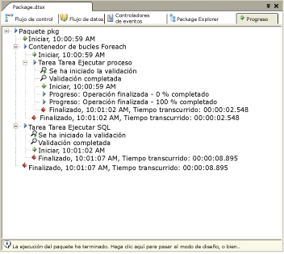

# Depurar el flujo de control
  [!INCLUDE[ssBIDevStudioFull](../../includes/ssbidevstudiofull-md.md)] y [!INCLUDE[msCoName](../../includes/msconame-md.md)] [!INCLUDE[ssISnoversion](../../includes/ssisnoversion-md.md)] incluyen características y herramientas que necesita para solucionar los problemas del flujo de control en un paquete de [!INCLUDE[ssISnoversion](../../includes/ssisnoversion-md.md)].  
  
-   [!INCLUDE[ssISnoversion](../../includes/ssisnoversion-md.md)] admite puntos de interrupción en contenedores y tareas.  
  
-   [!INCLUDE[ssIS](../../includes/ssis-md.md)] proporciona informes de progreso en tiempo de ejecución.  
  
-   [!INCLUDE[ssBIDevStudioFull](../../includes/ssbidevstudiofull-md.md)] proporciona ventanas de depuración.  
  
## Puntos de interrupción  
 [!INCLUDE[ssIS](../../includes/ssis-md.md)] proporciona el cuadro de diálogo **Establecer puntos de interrupción** , en el que puede establecer puntos de interrupción habilitando las condiciones de interrupción y especificando la cantidad de veces que se puede producir un punto de interrupción antes de que se suspenda la ejecución del paquete. Los puntos de interrupción se pueden habilitar en el nivel de paquete, o en el nivel del componente individual. Si las condiciones de interrupción se habilitan en el nivel de tarea o contenedor, aparece el icono de punto de interrupción junto a la tarea o contenedor en la superficie de diseño de la pestaña **Flujo de control** . Si las condiciones de interrupción se habilitan en el paquete, aparece el icono de punto de interrupción en la etiqueta de la pestaña **Flujo de control** .  
  
 Cuando se alcanza un punto de interrupción, el icono de punto de interrupción cambia para ayudar a identificar el origen del punto de interrupción. Se pueden agregar, eliminar y cambiar puntos de interrupción mientras se ejecuta el paquete.  
  
 [!INCLUDE[ssISnoversion](../../includes/ssisnoversion-md.md)] proporciona diez condiciones de interrupción que puede habilitar en todas las tareas y contenedores. En el cuadro de diálogo **Establecer puntos de interrupción** , puede habilitar puntos de interrupción en las siguientes condiciones:  
  
|Condición de interrupción|Description|  
|---------------------|-----------------|  
|Cuando la tarea o contenedor recibe el evento **OnPreExecute** .|Se llama cuando una tarea está a punto de ejecutarse. Este evento es provocado por una tarea o contenedor inmediatamente antes de ejecutarse.|  
|Cuando la tarea o contenedor recibe el evento **OnPostExecute** .|Se llama inmediatamente después de que finaliza la lógica de ejecución de la tarea. Este evento es provocado por una tarea o contenedor inmediatamente después de ejecutarse.|  
|Cuando la tarea o contenedor recibe el evento **OnError** .|Es llamado por una tarea o contenedor cuando se produce un error.|  
|Cuando la tarea o contenedor recibe el evento **OnWarning** .|Se llama cuando la tarea está en un estado que no justifica un error, pero sí provoca una advertencia.|  
|Cuando la tarea o contenedor recibe el evento **OnInformation** .|Se llama cuando se necesita la tarea para proporcionar información.|  
|Cuando la tarea o contenedor recibe el evento **OnTaskFailed** .|Es llamado por el host de la tarea cuando se produce un error.|  
|Cuando la tarea o contenedor recibe el evento **OnProgress** .|Se llama para actualizar el progreso de la ejecución de la tarea.|  
|Cuando la tarea o contenedor recibe el evento **OnQueryCancel** .|Se llama en cualquier momento durante el procesamiento de la tarea cuando puede cancelar la ejecución.|  
|Cuando la tarea o contenedor recibe el evento **OnVariableValueChanged** .|Llamado por la biblioteca de tiempo de ejecución de [!INCLUDE[ssISnoversion](../../includes/ssisnoversion-md.md)] cuando cambia el valor de una variable. Es necesario establecer el parámetro RaiseChangeEvent de la variable en **true** para generar este evento.   **\*\* Advertencia \*\*** La variable asociada a este punto de interrupción se tiene que definir en el ámbito del **contenedor** . Si la variable se define en el ámbito del paquete, el punto de interrupción no se llega a tocar.|  
|Cuando la tarea o contenedor recibe el evento **OnCustomEvent** .|Llamado por tareas para provocar eventos personalizados definidos por la tarea.|  
  
 Además de las condiciones de interrupción disponibles para todas las tareas y contenedores, algunas tareas y contenedores incluyen condiciones de interrupción especiales para establecer puntos de interrupción. Por ejemplo, puede habilitar una condición de interrupción en el contenedor de bucles For que establezca un punto de interrupción que suspenda la ejecución al principio de cada iteración del bucle.  
  
 Para agregar flexibilidad y potencia a un punto de interrupción, puede modificar el comportamiento de un punto de interrupción especificando las siguientes opciones:  
  
-   El número de llamadas, o la cantidad máxima de veces que se produce una condición de punto de interrupción antes de que se suspenda la ejecución.  
  
-   El tipo de número de llamadas, o la regla que especifica cuándo la condición de punto de interrupción desencadena el punto de interrupción.  
  
 Los tipos de número de llamadas, a excepción del tipo Siempre, se califican además con el número de llamadas. Por ejemplo, si el tipo es "Número de llamadas igual a" y el número de llamadas es 5, la ejecución se suspende en la sexta repetición de la condición de punto de interrupción.  
  
 La siguiente tabla describe los tipos de número de llamadas.  
  
|Tipo de número de llamadas|Description|  
|--------------------|-----------------|  
|Always|La ejecución se suspende siempre cuando se alcanza el punto de interrupción.|  
|Número de llamadas igual a|La ejecución se suspende cuando el número de veces que ha ocurrido el punto de interrupción es igual al número de llamadas.|  
|Número de llamadas mayor o igual que|La ejecución se suspende cuando el número de veces que ha ocurrido el punto de interrupción es igual a o mayor que el número de llamadas.|  
|Múltiplo del número de llamadas|La ejecución se suspende cuando se produce un múltiplo de número de llamadas. Por ejemplo, si establece esta opción en 5, la ejecución se suspende cada cinco veces.|  
  
#### Para establecer puntos de interrupción  
  
-   [Depurar un paquete estableciendo puntos de interrupción en una tarea o un contenedor](#debug)  
  
## Informes de progreso  
 [!INCLUDE[ssIS](../../includes/ssis-md.md)] En el Diseñador se incluyen dos tipos de informes de progreso: la codificación en colores de la superficie de diseño de la pestaña **Flujo de control** y los mensajes de progreso de la pestaña **Progreso** .  
  
 Cuando se ejecuta un paquete, el Diseñador [!INCLUDE[ssIS](../../includes/ssis-md.md)] muestra el progreso de la ejecución mostrando cada tarea o contenedor mediante un color que indica el estado de la ejecución. Puede saber, según el color, si el elemento está esperando para ejecutarse, si se está ejecutando actualmente, si se ha completado correctamente o si no finalizó correctamente. Una vez detenida la ejecución del paquete, desaparece el código de colores.  
  
 La siguiente tabla describe los colores utilizados para indicar el estado de la ejecución.  
  
|Color|Estado de ejecución|  
|-----------|----------------------|  
|Gris|Esperando para ejecutarse|  
|Amarillo|En ejecución|  
|Verde|Se ejecutó correctamente|  
|resaltado|Ejecución con errores|  
  
 La pestaña **Progreso** enumera las tareas y contenedores en el orden de ejecución e incluye los tiempos de inicio y finalización, advertencias y mensajes de error. Una vez que se detiene la ejecución del paquete, la información de progreso permanece disponible en la pestaña **Resultados de la ejecución** .  
  
> [!NOTE]  
>  Para habilitar o deshabilitar la presentación de mensajes en la pestaña **Progreso** , active o desactive la opción **Informe de progreso de depuración** del menú **SSIS** .  
  
 El diagrama siguiente muestra la pestaña **Progreso** .  
  
   
  
## Ventanas de depuración  
 [!INCLUDE[ssBIDevStudioFull](../../includes/ssbidevstudiofull-md.md)] incluye varias ventanas que se pueden usar para trabajar con puntos de interrupción y para depurar paquetes que contienen puntos de interrupción. Para obtener más información sobre cada ventana, abra la ventana y luego presione F1 para mostrar la Ayuda correspondiente de esa ventana.  
  
 Para abrir estas ventanas en [!INCLUDE[ssBIDevStudioFull](../../includes/ssbidevstudiofull-md.md)], haga clic en el menú **Depurar** , seleccione **Ventanas**y luego haga clic en **Puntos de interrupción**, **Salida**o **Inmediata**.  
  
 Las ventanas se describen en la siguiente tabla.  
  
|Ventana|Description|  
|------------|-----------------|  
|Puntos de interrupción|Enumera los puntos de interrupción de un paquete y proporciona opciones para habilitar y eliminar puntos de interrupción.|  
|Salida|Muestra mensajes de estado para las características en [!INCLUDE[ssBIDevStudioFull](../../includes/ssbidevstudiofull-md.md)].|  
|Inmediata|Se usa para depurar y evaluar expresiones e imprimir valores de variable.|  

##  Depurar un paquete estableciendo puntos de interrupción en una tarea o un contenedor
  Este procedimiento describe cómo establecer puntos de interrupción en un paquete, una tarea, un contenedor de bucles For o Foreach o un contenedor de secuencias.  
  
### Para establecer puntos de interrupción en un paquete, una tarea o un contenedor  
  
1.  En [!INCLUDE[ssBIDevStudioFull](../../includes/ssbidevstudiofull-md.md)], abra el proyecto de [!INCLUDE[ssISnoversion](../../includes/ssisnoversion-md.md)] que contiene el paquete que desea.  
  
2.  Haga doble clic en el paquete en el que desee establecer puntos de interrupción.  
  
3.  En el Diseñador SSIS, siga estos pasos:  
  
    -   Para establecer puntos de interrupción en el objeto de paquete, haga clic en la pestaña **Flujo de control** , coloque el cursor en cualquier lugar del fondo de la superficie de diseño, haga clic con el botón derecho y, después, haga clic en **Editar puntos de interrupción**.  
  
    -   Para establecer puntos de interrupción en un flujo de control de paquete, haga clic en la pestaña **Flujo de control** , haga clic con el botón derecho en una tarea, un contenedor de bucles For o Foreach o un contenedor de secuencias y, después, haga clic en **Editar puntos de interrupción**.  
  
    -   Para establecer puntos de interrupción en un controlador de eventos, haga clic en la pestaña **Controlador de eventos**, haga clic con el botón derecho en una tarea, un contenedor de bucles For o Foreach o un contenedor de secuencias y, después, haga clic en **Editar puntos de interrupción**.  
  
4.  En el cuadro de diálogo **Establecer puntos de interrupción \<nombre de contenedor>**, seleccione los puntos de interrupción que quiere habilitar.  
  
5.  Opcionalmente, modifique el tipo y la cantidad de número de llamadas para cada punto de interrupción.  
  
6.  Para guardar el paquete, haga clic en **Guardar los elementos seleccionados** , en el menú **Archivo** .  

## Establecer puntos de interrupción
  Utilice el cuadro de diálogo **Establecer puntos de interrupción** para especificar los eventos en los que se deben habilitar puntos de interrupción y para controlar el comportamiento del punto de interrupción.  
  
### Opciones  
 **Habilitado**  
 Seleccione esta opción para habilitar un punto de interrupción en un evento.  
  
 **Condición de interrupción**  
 Vea una lista de los eventos disponibles en los que se establecen puntos de interrupción.  
  
 **Tipo de número de llamadas**  
 Especifique el momento en el que el punto de interrupción surte efecto.  
  
|Value|Description|  
|-----------|-----------------|  
|**Always**|La ejecución se suspende siempre cuando se alcanza el punto de interrupción.|  
|**Número de llamadas igual a**|La ejecución se suspende cuando el número de veces que ha ocurrido el punto de interrupción es igual al número de llamadas.|  
|**Recuento de visitas mayor que o igual a**|La ejecución se suspende cuando el número de veces que ha ocurrido el punto de interrupción es igual a o mayor que el número de llamadas.|  
|**Múltiplo del número de llamadas**|La ejecución se suspende cuando se produce un múltiplo de número de llamadas. Por ejemplo, si establece esta opción en 5, la ejecución se suspende cada cinco veces.|  
  
 **Número de llamadas**  
 Especifique el número de visitas en el que se desencadena una interrupción. Esta opción no está disponible si la interrupción está siempre activa.  
  
## Vea también  
 [Herramientas para solucionar problemas del desarrollo de paquetes](../../integration-services/troubleshooting/troubleshooting-tools-for-package-development.md)  
 [Depurar un script mediante el establecimiento de puntos de interrupción en una tarea Script y un componente de script](../../integration-services/extending-packages-scripting/debug-a-script-by-setting-breakpoints-in-a-script-task-and-script-component.md)   
