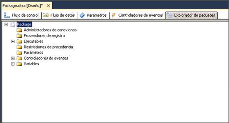

# Ver objetos de paquete
  En el Diseñador de [!INCLUDE[ssIS](../includes/ssis-md.md)] , la pestaña **Explorador de paquetes** proporciona una vista de explorador del paquete. La vista refleja la jerarquía de contenedores de la arquitectura de [!INCLUDE[ssISnoversion](../includes/ssisnoversion-md.md)] . El contenedor de paquetes se encuentra en la parte superior de la jerarquía y puede expandir el paquete para ver las conexiones, ejecutables, controladores de eventos, proveedores de registro, restricciones de precedencia y variables del paquete.  
  
 Los ejecutables, que son los contenedores y las tareas del paquete, pueden incluir controladores de eventos, restricciones de precedencia y variables. [!INCLUDE[ssISnoversion](../includes/ssisnoversion-md.md)] admite una jerarquía anidada de contenedores, y los contenedores de bucles For, bucles Foreach y secuencias pueden incluir otros ejecutables.  
  
 Si un paquete incluye un flujo de datos, el **Explorador de paquetes** incluye la tarea Flujo de datos y una carpeta **Componentes** que enumera los componentes de flujo de datos.  
  
 Desde la pestaña **Explorador de paquetes** , puede eliminar objetos en un paquete y obtener acceso a la ventana **Propiedades** para ver las propiedades del objeto.  
  
 El siguiente diagrama muestra una vista de árbol de un paquete simple.  
  
   
  
### Para ver el contenido de los paquetes  
  
-   [Ver objetos de paquete en el Explorador de paquetes](../Topic/View%20Package%20Objects%20in%20Package%20Explorer.md)  
  
## Vea también  
 [Tareas de Integration Services](../integration-services/control-flow/integration-services-tasks.md)   
 [Contenedores de Integration Services](../integration-services/control-flow/integration-services-containers.md)   
 [Restricciones de precedencia](../integration-services/control-flow/precedence-constraints.md)   
 [Variables de Integration Services &#40;SSIS&#41;](../integration-services/integration-services-ssis-variables.md)   
 [Controladores de eventos de Integration Services &#40;SSIS&#41;](../integration-services/integration-services-ssis-event-handlers.md)   
 [Registro de Integration Services &#40;SSIS&#41;](../integration-services/performance/integration-services-ssis-logging.md)  
  
  