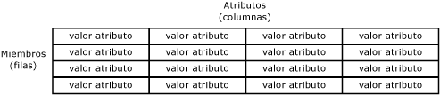

# Atributos (Master Data Services)

[!INCLUDE[appliesto-ss-xxxx-xxxx-xxx-md-winonly](../includes/appliesto-ss-xxxx-xxxx-xxx-md-winonly.md)]

  Los atributos son objetos contenidos en entidades de [!INCLUDE[ssMDSshort](../includes/ssmdsshort-md.md)] . Los valores de atributo describen los miembros de la entidad. Un atributo se puede usar para describir un miembro hoja, un miembro consolidado o una colección.  
  
## Cómo se relacionan los atributos con otros objetos del modelo  
 Puede considerar un atributo como una columna de una tabla de entidad. Un valor de atributo es el valor que se usa para describir un miembro concreto.  
  
   
  
 Cuando se crea una entidad que contiene muchos atributos, puede organizar los atributos en grupos de atributos. Para obtener más información, consulte [Grupos de atributos &#40;Master Data Services&#41;](../master-data-services/attribute-groups-master-data-services.md).  
  
## Atributos necesarios  
 Al crear una entidad, se crean automáticamente los atributos Code y Name. Code requiere un valor y es preciso que sea único en la entidad. No puede quitar los atributos Code y Name.  
  
## Tipos de atributo  
 Hay tres tipos de atributo:  
  
-   Atributos de forma libre, que permiten la entrada de forma libre de texto, números, fechas o vínculos.  
  
-   Atributos basados en dominios, que rellenan las entidades. Para obtener más información, consulte [Atributos basados en dominios &#40;Master Data Services&#41;](../master-data-services/domain-based-attributes-master-data-services.md).  
  
-   Atributos de archivo, que se usan para almacenar archivos, documentos o imágenes. Los atributos de archivo pretenden servir de ayuda para mantener la coherencia de los datos al requerir que los archivos tengan una extensión concreta. No se puede garantizar que los atributos de archivo impidan que un usuario malintencionado cargue un archivo de un tipo diferente.  
  
### Atributos numéricos de forma libre  
 Los atributos numéricos de forma libre necesitan un tratamiento especial, ya que están limitados al tipo de valor **SqlDouble** .  
  
 De forma predeterminada, un valor **SqlDouble** contiene 15 dígitos decimales de precisión, aunque internamente se conservan 17 dígitos como máximo. La precisión de un número de coma flotante tiene varias consecuencias:  
  
-   Dos números de coma flotante que parecen iguales para una precisión determinada podrían no compararse como iguales porque sus dígitos menos significativos sean diferentes.  
  
-   Una operación matemática o de comparación que use un número de coma flotante podría no producir el mismo resultado si se utilizara un número decimal porque el número de coma flotante podría no aproximarse exactamente al número decimal.  
  
-   Un valor podría no *hacer un ciclo de ida y vuelta* si contiene un número de punto flotante. Un valor coincide con el inicial si una operación convierte el número de coma flotante original en otro formato, una operación inversa transforma el formato convertido de nuevo a un número de coma flotante y el último número de coma flotante es igual que el original. Se podría producir un error en la ida y vuelta porque uno o más dígitos menos significativos se pierden o cambian en una conversión.  
  
## Ejemplos de atributo  
 En el ejemplo siguiente, la entidad tiene los atributos Name, Code, Subcategory, StandardCost, ListPrice y FilePhoto. Estos atributos describen los miembros. Cada miembro está representado por una fila única de valores de atributo.  
  
   
  
 En el ejemplo siguiente, la entidad Product contiene:  
  
-   Los atributos de forma libre Name, Code, StandardCost y ListPrice.  
  
-   El atributo basado en dominio de Subcategory.  
  
-   El atributo de archivo de FilePhoto.  
  
 Subcategory es una entidad que se usa como atributo basado en domino de Product. Category es una entidad que se usa como atributo basado en domino de Subcategory. Al igual que la entidad Product, las entidades Category y Subcategory contienen cada una los atributos predeterminados Name y Code.  
  
   
  
## Related Tasks  
  
|Descripción de la tarea|Tema|  
|----------------------|-----------|  
|Crear un nuevo atributo de texto de forma libre.|[Crear un atributo de texto &#40;Master Data Services&#41;](../master-data-services/create-a-text-attribute-master-data-services.md)|  
|Crear un nuevo atributo numérico de forma libre.|[Crear un atributo numérico &#40;Master Data Services&#41;](../master-data-services/create-a-numeric-attribute-master-data-services.md)|  
|Crear un nuevo atributo de vínculo de forma libre.|[Crear un atributo de vínculo &#40;Master Data Services&#41;](../master-data-services/create-a-link-attribute-master-data-services.md)|  
|Crear un nuevo atributo de archivo.|[Crear un atributo de archivo &#40;Master Data Services&#41;](../master-data-services/create-a-file-attribute-master-data-services.md)|  
|Crear un nuevo atributo basado en dominio.|[Crear un atributo basado en dominio &#40;Master Data Services&#41;](../master-data-services/create-a-domain-based-attribute-master-data-services.md)|  
|Cambiar el nombre de un atributo existente.|[Cambiar el nombre y el tipo de datos de un atributo &#40;Master Data Services&#41;](../master-data-services/change-an-attribute-name-and-data-type-master-data-services.md)|  
|Agregar atributos existentes a un grupo de seguimiento de cambios.|[Agregar atributos a un grupo de seguimiento de cambios &#40;Master Data Services&#41;](../master-data-services/add-attributes-to-a-change-tracking-group-master-data-services.md)|  
|Eliminar un atributo existente.|[Eliminar un atributo &#40;Master Data Services&#41;](../master-data-services/delete-an-attribute-master-data-services.md)|  
|Cambie el orden de los atributos.|[Cambiar el orden de los atributos](../master-data-services/change-the-order-of-attributes.md)|  
|Crear un atributo de fecha|[Crear un atributo de fecha &#40;Master Data Services&#41;](../master-data-services/create-a-date-attribute-master-data-services.md)|  
  
## Contenido relacionado  
  
-   [Atributos basados en dominios &#40;Master Data Services&#41;](../master-data-services/domain-based-attributes-master-data-services.md)  
  
-   [Grupos de atributos &#40;Master Data Services&#41;](../master-data-services/attribute-groups-master-data-services.md)  
  
-   [Miembros &#40;Master Data Services&#41;](../master-data-services/members-master-data-services.md)  
  
-   [Permisos de hoja &#40;Master Data Services&#41;](../master-data-services/leaf-permissions-master-data-services.md)
  
