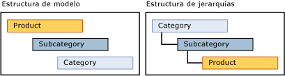

# Jerarqu&#237;as derivadas (Master Data Services)
  Una jerarquía derivada de [!INCLUDE[ssMDSshort](../includes/ssmdsshort-md.md)] se deriva de las relaciones de atributo basado en dominio que ya existen entre las entidades de un modelo.  
  
 Puede crear una jerarquía derivada para resaltar cualquiera de las relaciones de atributo basado en dominio existentes en el modelo.  
  
## Los miembros hoja agrupan a otros miembros hoja  
 En una jerarquía derivada, los miembros hoja de una entidad se utilizan agrupar a los miembros hoja de otra entidad. Una jerarquía derivada se basa en la relación entre estas entidades. Por el contrario, una jerarquía explícita se basa en los miembros de una única entidad y se estructura de cualquier forma que especifique.  
  
 Puede cambiar la estructura de una jerarquía derivada sin que se vean afectados los datos subyacentes. Siembre y cuando las relaciones sigan existiendo en el modelo, la eliminación de una jerarquía derivada no tendrá efecto alguno sobre los datos maestros.  
  
## Jerarquías explícitas frente a jerarquías derivadas  
 En la tabla siguiente se muestran algunas de las diferencias existentes entre las jerarquías explícitas y las jerarquías derivadas.  
  
> [!NOTE]  
>  Jerarquías explícitas están desusadas en esta versión de [!INCLUDE[ssMDSshort](../includes/ssmdsshort-md.md)].  
  
|Jerarquías explícitas|Jerarquías derivadas|  
|--------------------------|-------------------------|  
|La estructura la define el usuario|La estructura se deriva de las relaciones entre los atributos basados en dominio|  
|Contiene miembros de una sola entidad|Contiene miembros de varias entidades|  
|Usa miembros consolidados para agrupar a otros miembros|Usa miembros hoja de una entidad para agrupar miembros hoja de otra entidad|  
  
## Crear una jerarquía de profundidad variable  
 Hay dos maneras recomendadas de crear una jerarquía de profundidad variable:  
  
-   Si necesita que todos los niveles tengan los mismos atributos, cree una entidad única y luego cree una jerarquía recursiva en esta entidad, mediante un atributo basado en dominio que se base a su vez en la entidad.  
  
-   Si necesita un conjunto de atributos para los miembros hoja y otro conjunto de atributos en los niveles superiores, cree dos entidades para una jerarquía derivada. Para la entidad hoja, utilice un atributo basado en dominio que se base en la entidad primaria. Para la entidad primaria, utilice un atributo basado en dominio que se base en sí misma.  
  
## Ejemplo de jerarquía derivada  
 En el ejemplo siguiente, los miembros hoja de la entidad Subcategory se agrupan por los miembros hoja de la entidad Subcategory, agrupados a su vez por los miembros hoja de la entidad Category. Esta jerarquía es posible porque la entidad Product tiene un atributo basado en dominio denominado Subcategory y la entidad Subcategory tiene un atributo basado en dominio denominado Category.  
  
 Le estructura de jerarquía muestra cómo se agrupan los miembros. La entidad con el mayor número de miembros está en la parte inferior.  
  
   
  
 En una jerarquía derivada, puede resaltar la relación entre Product y Subcategory y posteriormente entre Subcategory y Category. Cuando vea los miembros en esta jerarquía, cada nivel en el árbol contendrá los miembros de la misma entidad.  
  
   
  
 Este tipo de jerarquía no le permitirá mover miembros a niveles que no sean válidos. Por ejemplo, puede mover la bicicleta Road-650 de una subcategoría, Road Bikes (bicicletas de carretera), a otra, Mountain Bikes (bicicletas de montaña). Pero no puede mover directamente Road-650 a una categoría, como 1 {Bikes} (bicicletas). Cada vez que mueve un miembro en el árbol de jerarquía, el valor del atributo basado en dominio del miembro cambia para reflejar el movimiento.  
  
## Notas  
 Todos los miembros en un árbol de jerarquía derivada se ordenan por código. No puede cambiar el criterio de ordenación.  
  
 Si el atributo basado en dominio de un miembro está vacío y el atributo se utiliza para una jerarquía derivada, el miembro no se mostrará en la jerarquía. Cree reglas de negocio para exigir que se rellenen los atributos. Para obtener más información, consulte [#40; & requieren valores de atributo Master Data Services & #41;](../master-data-services/require-attribute-values-master-data-services.md).  
  
## Tareas relacionadas  
  
|Descripción de la tarea|Tema|  
|----------------------|-----------|  
|Crear una nueva jerarquía derivada.|[Crear una jerarquía derivada & #40; Master Data Services & #41;](../master-data-services/create-a-derived-hierarchy-master-data-services.md)|  
|Ocultar o eliminar niveles en una jerarquía derivada existente.|[Ocultar o eliminar niveles en una jerarquía derivada & #40; Master Data Services & #41;](../master-data-services/hide-or-delete-levels-in-a-derived-hierarchy-master-data-services.md)|  
|Cambiar el nombre de una jerarquía derivada existente.|[Cambiar el nombre de una jerarquía derivada & #40; Master Data Services & #41;](../master-data-services/change-a-derived-hierarchy-name-master-data-services.md)|  
|Eliminar una jerarquía derivada existente.|[Eliminar una jerarquía derivada & #40; Master Data Services & #41;](../master-data-services/delete-a-derived-hierarchy-master-data-services.md)|  
  
## Contenido relacionado  
  
-   [Atributos basados en dominio & #40; Master Data Services & #41;](../master-data-services/domain-based-attributes-master-data-services.md)  
  
-   [Jerarquías explícitas & #40; Master Data Services & #41;](../master-data-services/explicit-hierarchies-master-data-services.md)  
  
-   [Jerarquías recursivas & #40; Master Data Services & #41;](../master-data-services/recursive-hierarchies-master-data-services.md)  
  
-   [Jerarquías derivadas con límites explícitos & #40; Master Data Services & #41;](../master-data-services/derived-hierarchies-with-explicit-caps-master-data-services.md)  
  
-   [Mostrar las relaciones de varios a varios en jerarquías derivadas & #40; Master Data Services & #41;](../master-data-services/show-many-to-many-relationships-in-derived-hierarchies-master-data-services.md)  
  
-   [Colecciones & #40; Master Data Services & #41;](../master-data-services/collections-master-data-services.md)  
  
  