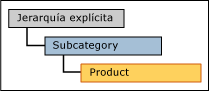
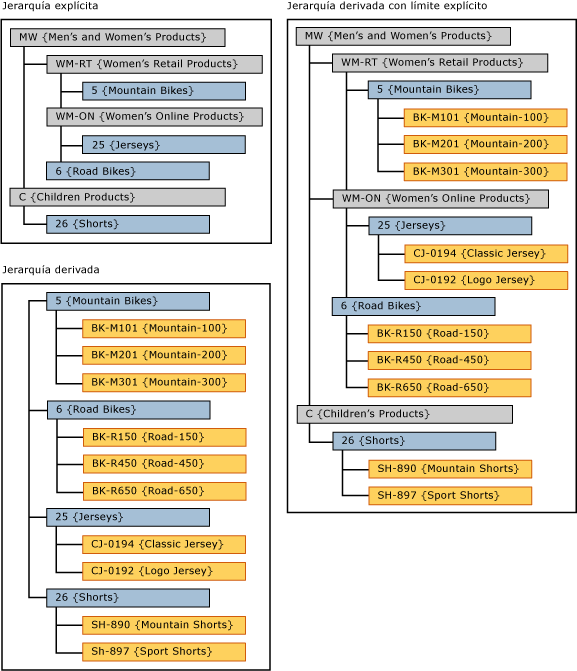

# Jerarquías derivadas con límites explícitos (Master Data Services)
  En [!INCLUDE[ssMDSshort](../includes/ssmdsshort-md.md)], el hecho de que los niveles de una jerarquía explícita se utilicen como niveles superiores de una jerarquía derivada, se denomina jerarquía derivada con límites explícitos.  
  
 La jerarquía explícita debe estar basada en la misma entidad que la entidad del nivel superior de la jerarquía derivada.  
  
 En la interfaz de usuario de [!INCLUDE[ssMDSmdm](../includes/ssmdsmdm-md.md)] , para crear este tipo de jerarquía, arrastre una jerarquía explícita hasta la parte superior de una jerarquía derivada.  
  
   
  
## Ejemplo de jerarquía derivada con límite explícito  
 En este ejemplo, los miembros de la jerarquía explícita son los de la entidad Subcategory. En la jerarquía derivada, los miembros de nivel superior también son los de la entidad Subcategory.  
  
   
  
 Al usar la jerarquía explícita en el nivel superior de una jerarquía derivada, la jerarquía derivada queda desigual.  
  
## Reglas  
  
-   No puede tener más de una jerarquía explícita en una jerarquía derivada con límites explícitos.  
  
-   Puede utilizar la misma jerarquía explícita como límite para varias jerarquías derivadas.  
  
-   No puede asignar permisos a los miembros de jerarquías derivadas con límites explícitos. Si asigna individualmente permisos a la jerarquía explícita o a la jerarquía derivada, los permisos afectan a ambas.  
  
## Tareas relacionadas  
  
|Descripción de la tarea|Tema|  
|----------------------|-----------|  
|Crear una jerarquía derivada.|[Crear una jerarquía derivada &#40;Master Data Services&#41;](../master-data-services/create-a-derived-hierarchy-master-data-services.md)|  
|Crear una jerarquía explícita.|[Crear una jerarquía explícita &#40;Master Data Services&#41;](../master-data-services/create-an-explicit-hierarchy-master-data-services.md)|  
|Eliminar una jerarquía derivada existente.|[Eliminar una jerarquía derivada &#40;Master Data Services&#41;](../master-data-services/delete-a-derived-hierarchy-master-data-services.md)|  
|||  
  
## Contenido relacionado  
  
-   [Jerarquías derivadas &#40;Master Data Services&#41;](../master-data-services/derived-hierarchies-master-data-services.md)  
  
-   [Jerarquías explícitas &#40;Master Data Services&#41;](../master-data-services/explicit-hierarchies-master-data-services.md)  
  
  

