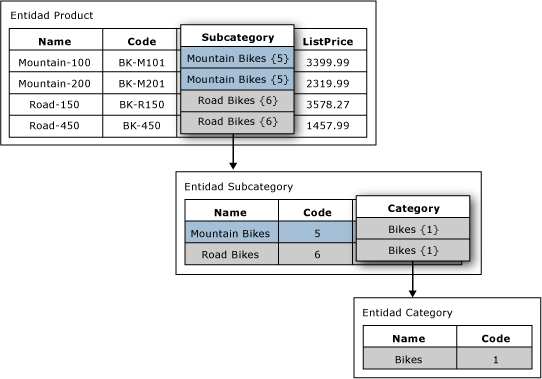

# Atributos basados en dominios (Master Data Services)

[!INCLUDE [SQL Server - Windows only ASDBMI  ](../includes/applies-to-version/sql-windows-only-asdbmi.md)]

  En [!INCLUDE[ssMDSshort](../includes/ssmdsshort-md.md)], un atributo basado en dominio es un atributo con valores rellenados por miembros de otra entidad. Se podría considerar que un atributo basado en dominio es una lista restringida; los atributos basados en dominios evitan que los usuarios puede especificar valores de atributo no válidos. Para seleccionar un valor de atributo, el usuario debe elegir en una lista.  
  
## Ejemplo de atributo basado en dominio  
 En la imagen siguiente, la entidad Product tiene un atributo basado en dominio denominado Subcategory. El atributo Subcategory se rellena con los valores de la entidad Subcategory.  
  
 La entidad Category tiene un atributo basado en domino denominado Subcategory. El atributo Category se rellena con los valores de la entidad Category.  
  
   
  
## Usar la misma entidad para varios atributos basados en dominios  
 Puede usar la misma entidad que un atributo basado en dominio de varias entidades. Por ejemplo, puede crear una entidad denominada YesNoIndicator con los miembros Yes, No y Maybe. Puede crear un atributo basado en dominio denominado InStock y usar la entidad YesNoIndicator como origen. También puede crear otro atributo basado en dominio denominado Approved y usar la entidad YesNoIndicator como origen. Siempre que desee que los usuarios elijan en una lista de los miembros de la entidad YesNoIndicator, puede usar la entidad como atributo basado en dominio.  
  
## Los atributos basados en dominio forman jerarquías derivadas  
 Las relaciones de atributo basados en dominio son la base de las jerarquías derivadas. Para obtener más información, consulte [Jerarquías derivadas &#40;Master Data Services&#41;](../master-data-services/derived-hierarchies-master-data-services.md).  
  
## Related Tasks  
  
|Descripción de la tarea|Tema|  
|----------------------|-----------|  
|Crear un nuevo atributo basado en dominio originado en una entidad existente.|[Crear un atributo basado en dominio &#40;Master Data Services&#41;](../master-data-services/create-a-domain-based-attribute-master-data-services.md)|  
|Crear una entidad nueva.|[Crear una entidad &#40;Master Data Services&#41;](../master-data-services/create-an-entity-master-data-services.md)|  
  
## Contenido relacionado  
  
-   [Jerarquías derivadas &#40;Master Data Services&#41;](../master-data-services/derived-hierarchies-master-data-services.md)  
  
-   [Atributos &#40;Master Data Services&#41;](../master-data-services/attributes-master-data-services.md)  
  
-   [Entidades &#40;Master Data Services&#41;](../master-data-services/entities-master-data-services.md)  
  
  
