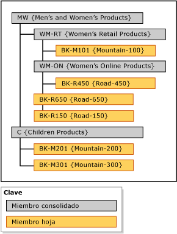

# Jerarquías explícitas (Master Data Services)
  En [!INCLUDE[ssMDSshort](../includes/ssmdsshort-md.md)], una jerarquía explícita organiza los miembros de una sola entidad de la forma que se especifique. La estructura puede ser irregular y, a diferencia de las jerarquías derivadas, las jerarquías explícitas no se basan en relaciones de atributo basadas en dominio.  
  
> [!NOTE]  
>  La jerarquía explícita está en desuso.  
  
## Los miembros consolidados agrupan a otros miembros  
 Una jerarquía explícita usa los miembros consolidados que se crean con el propósito de agrupar a otros miembros. Estos miembros consolidados pueden pertenecer a una sola jerarquía explícita cada vez. Una jerarquía explícita también incluye todos los miembros hoja de la entidad asociada.  
  
 Una jerarquía explícita puede ser desigual, lo que significa que puede terminar simultáneamente en niveles diferentes. Cada miembro consolidado puede tener un número ilimitado de miembros consolidados y miembros hoja subordinados, o bien es posible que no tenga ninguno. Los miembros hoja pueden estar subordinados a un solo miembro consolidado o a varios niveles de miembros consolidados.  
  
> [!NOTE]  
>  Antes de poder crear una jerarquía explícita, la entidad debe estar habilitar para jerarquías explícitas.  
  
## Tipos de jerarquías explícitas  
 Existen dos tipos de jerarquías explícitas: obligatoria y no obligatoria.  
  
### Jerarquías explícitas obligatorias  
 Una jerarquía explícita obligatoria es una jerarquía en la que todos los miembros hoja deben estar incluidos en el árbol de jerarquía. De forma predeterminada, todos los miembros están incluidos en la raíz del árbol. Puede reorganizar los miembros según sea necesario.  
  
### Jerarquías explícitas no obligatorias  
 Una jerarquía explícita no obligatoria es una jerarquía en la que todos los miembros hoja están en un nodo **No utilizado** creado por el sistema. Puede sacar los miembros del nodo según los vaya necesitando. El resto de los miembros puede permanecer en el nodo **No utilizado** .  
  
 Cuando utilice jerarquías explícitas no obligatorias, recuerde que cualquier informe o análisis que se realice en la jerarquía no puede coincidir con los informes o análisis realizados en las jerarquías obligatorias.  
  
## Reglas  
 Las siguientes reglas se aplican a las jerarquías explícitas (tanto las obligatorias como las no obligatorias).  
  
-   Cada miembro hoja solo puede estar incluido una vez en la jerarquía.  
  
-   Es preciso que todos los miembros consolidados estén incluidos en una jerarquía.  
  
-   Los miembros consolidados no pueden estar en más de una jerarquía explícita.  
  
-   Los miembros consolidados en el árbol de jerarquía no tienen que tener miembros hoja subordinados.  
  
-   Si elimina una jerarquía explícita, se eliminarán todos los miembros consolidados que hayan utilizado en la jerarquía.  
  
-   Si elimina un miembro consolidado que estaba en una jerarquía explícita, todos los miembros hoja que estaban agrupados por ese miembro consolidado se mueven a la raíz.  
  
## Jerarquías explícitas frente a jerarquías derivadas  
 En la tabla siguiente se muestran algunas de las diferencias existentes entre las jerarquías explícitas y las jerarquías derivadas.  
  
|Jerarquías explícitas|Jerarquías derivadas|  
|--------------------------|-------------------------|  
|La estructura la define el usuario|La estructura se deriva de las relaciones entre los atributos basados en dominio|  
|Contiene miembros de una sola entidad|Contiene miembros de varias entidades|  
|Usa miembros consolidados para agrupar a otros miembros|Usa miembros hoja de una entidad para agrupar miembros hoja de otra entidad|  
|Puede ser desigual|Siempre contiene un número coherente de niveles|  
  
## Ejemplo de jerarquía explícita  
 En el ejemplo siguiente, la entidad Product contiene estos miembros hoja: BK-M101 {Mountain-100}, BK-M201 {Mountain-200}, BK-M301 {Mountain-300}, BK-R150 {Road-150}, BK-R450 {Road-450} y BK-R650 {Road-650}.  
  
 Para resumir estos miembros hoja en puntos específicos de consolidación, puede crear miembros consolidados en la entidad Product. Inserte los miembros consolidados en los niveles del árbol de jerarquía donde desea resumir los miembros hoja. No existe limitación alguna con respecto al lugar donde insertar los miembros consolidados; sin embargo, solo puede utilizar cada miembro (hoja o consolidado) una vez.  
  
   
  
 Los miembros consolidados se pueden usar para agrupar miembros en cualquier nivel, y los miembros hoja y consolidados se ordenan según se determine.  
  
## Tareas relacionadas  
  
|Descripción de la tarea|Tema|  
|----------------------|-----------|  
|Crear una nueva jerarquía explícita.|[Crear una jerarquía explícita &#40;Master Data Services&#41;](../master-data-services/create-an-explicit-hierarchy-master-data-services.md)|  
|Cambiar el nombre de una jerarquía explícita existente.|[Crear un nombre de jerarquía explícita &#40;Master Data Services&#41;](../master-data-services/change-an-explicit-hierarchy-name-master-data-services.md)|  
|Eliminar una jerarquía explícita existente.|[Eliminar una jerarquía explícita &#40;Master Data Services&#41;](../master-data-services/delete-an-explicit-hierarchy-master-data-services.md)|  
|||  
  
## Contenido relacionado  
  
-   [Jerarquías derivadas &#40;Master Data Services&#41;](../master-data-services/derived-hierarchies-master-data-services.md)  
  
-   [Colecciones &#40;Master Data Services&#41;](../master-data-services/collections-master-data-services.md)  
  
  

