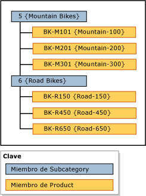

# Jerarqu&#237;as (Master Data Services)
  En [!INCLUDE[ssMDSshort](../includes/ssmdsshort-md.md)], una jerarquía es una estructura en forma de árbol que se puede usar para:  
  
-   Agrupar miembros similares con fines organizativos.  
  
-   Consolidar y resumir miembros para la elaboración de informes y análisis.  
  
## Qué contienen las jerarquías  
 Cada jerarquía contiene todos los miembros de una o más entidades. Cuando un miembro se agrega, cambia o elimina, todas las jerarquías se actualizan. Esto garantiza que los datos sean exactos en todas las jerarquías. Las jerarquías también ayudan a asegurarse de que cada miembro se cuenta solamente una vez.  
  
 Si desea crear una agrupación de un subconjunto de miembros, considere la posibilidad de usar una colección. Para obtener más información, consulte [Colecciones &#40;Master Data Services&#41;](../master-data-services/collections-master-data-services.md).  
  
## Tipos de jerarquías  
 Puede crear varias jerarquías para ver y organizar los miembros de diferentes maneras. Puede crear:  
  
-   Jerarquías irregulares a partir de una entidad única, que se denominan jerarquías explícitas. Para obtener más información, consulte [Jerarquías explícitas &#40;Master Data Services&#41;](../master-data-services/explicit-hierarchies-master-data-services.md).  
  
-   Jerarquías basadas en el nivel a partir de varias entidades, basándose en las relaciones existentes entre las entidades y sus atributos, que se denominan jerarquías derivadas. Para obtener más información, consulte [Jerarquías derivadas &#40;Master Data Services&#41;](../master-data-services/derived-hierarchies-master-data-services.md).  
  
> [!NOTE]  
>  Todos los miembros de una jerarquía deben estar dentro del mismo modelo.  
  
## Las jerarquías no son taxonomías  
 Las jerarquías son distintas a las taxonomías. Una taxonomía organiza los miembros según diversos atributos al mismo tiempo, mientras que una jerarquía organiza los miembros según un atributo cada vez. Una taxonomía puede incluir al mismo miembro varias veces, mientras que una jerarquía solo incluye un miembro una vez.  
  
 Por ejemplo, la misma bicicleta se puede incluir dos veces en una taxonomía: una vez porque sea roja y otra porque sea de la talla 38. En una jerarquía, la bicicleta solo se incluye una vez, por lo que debe decidir si mostrarla en relación con su color o su tamaño.  
  
## Ejemplo de jerarquía  
 En el ejemplo siguiente, los miembros de Product se agrupan según los miembros de la subcategoría.  
  
   
  
## Tareas relacionadas  
  
|Descripción de la tarea|Tema|  
|----------------------|-----------|  
|Crear una jerarquía explícita.|[Crear una jerarquía explícita &#40;Master Data Services&#41;](../master-data-services/create-an-explicit-hierarchy-master-data-services.md)|  
|Crear una jerarquía derivada.|[Crear una jerarquía derivada &#40;Master Data Services&#41;](../master-data-services/create-a-derived-hierarchy-master-data-services.md)|  
|Ocultar o eliminar niveles en una jerarquía derivada existente.|[Ocultar o eliminar niveles en una jerarquía derivada &#40;Master Data Services&#41;](../master-data-services/hide-or-delete-levels-in-a-derived-hierarchy-master-data-services.md)|  
  
## Contenido relacionado  
  
-   [Jerarquías explícitas &#40;Master Data Services&#41;](../master-data-services/explicit-hierarchies-master-data-services.md)  
  
-   [Jerarquías derivadas &#40;Master Data Services&#41;](../master-data-services/derived-hierarchies-master-data-services.md)  
  
-   [Jerarquías recursivas &#40;Master Data Services&#41;](../master-data-services/recursive-hierarchies-master-data-services.md)  
  
-   [Jerarquías derivadas con límites explícitos &#40;Master Data Services&#41;](../master-data-services/derived-hierarchies-with-explicit-caps-master-data-services.md)  
  
-   [Colecciones &#40;Master Data Services&#41;](../master-data-services/collections-master-data-services.md)  
  
  