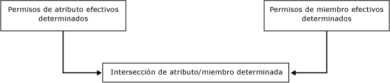
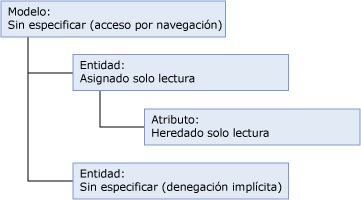
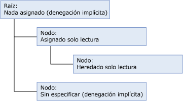
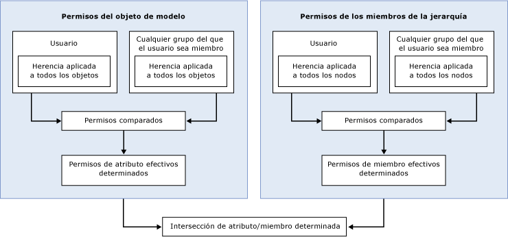

# Cómo se determinan los permisos (Master Data Services)
  En [!INCLUDE[ssMDSshort](../includes/ssmdsshort-md.md)], la manera más sencilla de configurar la seguridad es asignar permisos del objeto de modelo a un grupo al que pertenece el usuario.  
  
 La seguridad se hace más compleja cuando:  
  
-   Se asignan permisos del objeto de modelo y permisos de los miembros de una jerarquía.  
  
-   El usuario pertenece a grupos y el permiso se asigna al usuario y los grupos.  
  
-   El usuario pertenece a grupos y el permiso se asigna a varios grupos.  
  
## Permisos asignados a un solo grupo o usuario  
 Si asigna permisos a un solo grupo o usuario, los permisos se determinan en función del siguiente flujo de trabajo.  
  
   
  
### Paso 1: se determinan los permisos de atributo efectivos.  
 En la siguiente lista se describe cómo se determinan los permisos de atributo efectivos:  
  
-   Los permisos asignados a objetos de modelo determinan a qué atributos puede tener acceso un usuario.  
  
-   Todos los objetos de modelo heredan automáticamente el permiso del objeto más cercano en un nivel superior de la estructura del modelo.  
  
-   Todos los objetos del mismo nivel que la entidad se deniegan implícitamente.  
  
-   Los objetos de un nivel superior reciben lectura inferida. Para obtener más información sobre la lectura inferida, consulte [Acceso por navegación &#40;Master Data Services&#41;](../master-data-services/navigational-access-master-data-services.md).  
  
 En este ejemplo, el permiso de **lectura** se asigna a una entidad y su atributo, que está en un nivel inferior de la estructura del modelo, lo hereda. El modelo proporciona lectura inferida a esta entidad y su atributo. La otra entidad del modelo no tiene ningún permiso explícito asignado y no hereda ningún permiso, de modo que se deniega implícitamente.  
  
   
  
### Paso 2: si se asignan los permisos de los miembros de una jerarquía, se determinan los permisos de miembros efectivos.  
 En la siguiente lista se describe cómo se determinan los permisos de los miembros de una jerarquía efectivos:  
  
-   Los permisos asignados a los nodos de la jerarquía determinan a qué miembros puede tener acceso un usuario.  
  
-   Todos los nodos de una jerarquía heredan automáticamente el permiso del objeto más cercano en un nivel superior en la estructura de la jerarquía.  
  
-   Todos los nodos del mismo nivel se deniegan implícitamente.  
  
-   Todos los nodos de niveles superiores a los que no se asignan los permisos se deniegan implícitamente.  
  
 En este ejemplo, el permiso de **lectura** se asigna a un nodo de la jerarquía y un nodo de un nivel inferior de la estructura de la jerarquía lo hereda. La raíz no tiene ningún permiso asignado, de modo que se deniega implícitamente. El otro nodo de la estructura de la jerarquía no tiene ningún permiso explícito asignado y no hereda ningún permiso, de modo que se deniega implícitamente.  
  
   
  
### Paso 3: se determina la intersección los permisos de atributo y de miembro.  
 Si los permisos de atributo efectivos son diferentes que los permisos de miembro efectivos, los permisos se deben determinar para cada valor de atributo individual. Para obtener más información, consulte [Superponer permisos de modelo y de miembro &#40;Master Data Services&#41;](../master-data-services/overlapping-model-and-member-permissions-master-data-services.md).  
  
## Permisos asignados a varios grupos  
 Si un usuario pertenece a uno o más grupos y se asignan permisos al usuario y a los grupos, el flujo de trabajo se vuelve más complejo.  
  
   
  
 En este caso, los permisos de usuario y de grupo que se superpongan se deben resolver para poder comparar los permisos del objeto de modelo y del miembro de jerarquía. Para obtener más información, consulte [Superponer permisos de usuario y de grupo &#40;Master Data Services&#41;](../master-data-services/overlapping-user-and-group-permissions-master-data-services.md).  
  
## Vea también  
 [Superponer permisos de usuario y de grupo &#40;Master Data Services&#41;](../master-data-services/overlapping-user-and-group-permissions-master-data-services.md)   
 [Superponer permisos de modelo y de miembro &#40;Master Data Services&#41;](../master-data-services/overlapping-model-and-member-permissions-master-data-services.md)  
  
  

