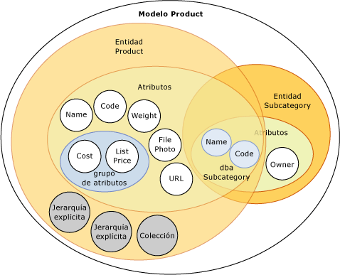
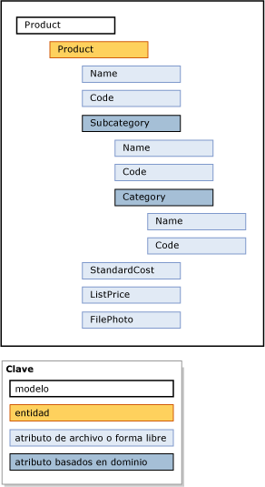

# Modelos (Master Data Services)

[!INCLUDE[appliesto-ss-xxxx-xxxx-xxx-md-winonly](../includes/appliesto-ss-xxxx-xxxx-xxx-md-winonly.md)]

  Los modelos son el nivel superior de organización de datos en [!INCLUDE[ssMDSshort](../includes/ssmdsshort-md.md)]. Un modelo define la estructura de datos de la solución de administración de datos maestros. Un modelo contiene los siguientes objetos:  
  
-   Entities  
  
-   Atributos y grupos de atributos  
  
-   Jerarquías derivadas y explícitas  
  
-   Colecciones  
  
 Los modelos organizan la estructura de los datos maestros. Su implementación de [!INCLUDE[ssMDSshort](../includes/ssmdsshort-md.md)] puede tener uno o varios modelos que agrupan tipos de datos similares. En general, los datos maestros se pueden clasificar en una de estas cuatro categorías: personas, lugares, cosas o conceptos. Por ejemplo, puede crear un modelo Producto que vaya a contener datos relacionados con productos o un modelo Cliente para que contenga datos relacionados con clientes.  
  
 Puede asignar a usuarios y grupos el permiso para ver y actualizar los objetos dentro del modelo. Si no concede permisos al modelo, no se mostrará.  
  
 En un momento determinado, podrá crear copias de los datos maestros dentro de un modelo. Estas copias se denominan versiones.  
  
 Una vez haya definido un modelo en un entorno de prueba, puede implementarlo, con o sin los datos correspondientes, desde el entorno de prueba hasta un entorno de producción. Esto elimina la necesidad de volver a crear los modelos en el entorno de producción.  
  
## Cómo se relacionan los modelos con otros objetos  
 Un modelo contiene entidades. Las entidades contienen atributos, jerarquías explícitas y colecciones. Los atributos pueden estar contenidos en grupos de atributos. Los atributos basados en dominios existen cuando se usa una entidad como atributo para otra entidad.  
  
 Esta imagen muestra las relaciones existentes entre los objetos de un modelo.  
  
   
  
> [!NOTE]  
>  Las jerarquías derivadas también son objetos de modelo, pero no se muestran en la imagen. Las jerarquías derivadas se derivan de las relaciones de atributo basadas en dominios que existen entre las entidades. Vea [Jerarquías derivadas &#40;Master Data Services&#41;](../master-data-services/derived-hierarchies-master-data-services.md) para más información.  
  
 Los datos maestros son los datos contenidos en los objetos de modelo. En [!INCLUDE[ssMDSshort](../includes/ssmdsshort-md.md)], los datos maestros se almacenan como miembros de una entidad.  
  
 Los objetos de modelo se mantienen en el área funcional de **Administración del sistema** de la interfaz de usuario de [!INCLUDE[ssMDSmdm](../includes/ssmdsmdm-md.md)] .  
  
## Ejemplo de modelo  
 En el ejemplo siguiente, los objetos del modelo Product agrupan lógicamente los datos relacionados con los productos.  
  
   
  
 Otros modelos comunes son:  
  
-   Accounts: podrían incluir entidades como cuentas de balance, cuentas de balance de resultados, estadísticas y tipos de cuenta.  
  
-   Customer: podría incluir entidades como género, educación, ocupación y estado civil.  
  
-   Geography: podría incluir entidades como códigos postales, ciudades, municipios, estados, provincias, regiones, territorios, países y continentes.  
  
## Related Tasks  
  
|Descripción de la tarea|Tema|  
|----------------------|-----------|  
|Crear un modelo para organizar los datos maestros.|[Crear un modelo &#40;Master Data Services&#41;](../master-data-services/create-a-model-master-data-services.md)|  
|Cambiar el nombre de un modelo existente.|[Editar modelo &#40;Master Data Services&#41;](../master-data-services/edit-model-master-data-services.md)|  
|Eliminar un modelo existente.|[Eliminar un modelo &#40;Master Data Services&#41;](../master-data-services/delete-a-model-master-data-services.md)|  
  
## Contenido relacionado  
  
-   [Introducción a Master Data Services &#40;MDS&#41;](../master-data-services/master-data-services-overview-mds.md)  
  
-   [Entidades &#40;Master Data Services&#41;](../master-data-services/entities-master-data-services.md)  
  
-   [Atributos &#40;Master Data Services&#41;](../master-data-services/attributes-master-data-services.md)  
  
-   [Implementar modelos &#40;Master Data Services&#41;](../master-data-services/deploying-models-master-data-services.md)  
  
-   [Permisos de objeto del modelo &#40;Master Data Services&#41;](../master-data-services/model-object-permissions-master-data-services.md)  
  
  
