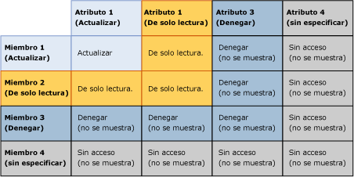
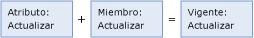
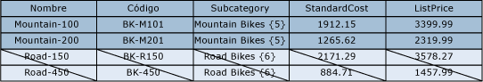
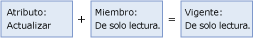
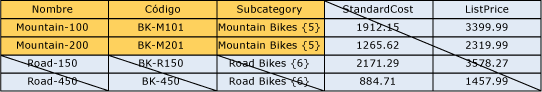
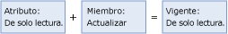

# Superponer permisos de modelo y de miembro (Master Data Services)

[!INCLUDE[appliesto-ss-xxxx-xxxx-xxx-md-winonly](../includes/appliesto-ss-xxxx-xxxx-xxx-md-winonly.md)]

  El permiso que se asigne a un miembro puede solaparse con el permiso asignado a un objeto del modelo. Cuando se producen las superposiciones, el permiso más restrictivo será el que surta efecto.  
  
 Si un miembro tiene permiso distinto al de su objeto del modelo correspondiente, se aplicarán las reglas siguientes:  
  
-   **Denegar** invalida al resto de permisos.  
  
-   El permiso de**administrador** en el nivel de modelo sobrescribe todos los demás permisos y se cambia por el permiso de acceso Todo (CRUD) en los subniveles.  
  
-   El permiso de acceso efectivo forma intersección con los permisos de los miembros y atributos.  
  
     Por ejemplo, si los permisos de miembro incluyen **Crear** y **Actualizar**, el permiso de los atributos es **Actualizar**. El permiso efectivo es **Actualizar**.  
  
 La siguiente imagen muestra qué permisos surten efecto en un valor de atributo individual cuando los permisos de atributo son diferentes que los permisos de miembro.  
  
   
  
## Ejemplo 1  
   
  
 En la pestaña **Modelos** , la entidad Product tiene asignado el permiso **Actualizar** . Todos los atributos de la entidad heredan ese permiso.  
  
 En la pestaña **Miembros de la jerarquía** , el nodo de subcategoría de bicicletas de montaña de una jerarquía derivada tiene asignado el permiso **Actualizar** .  
  
 Resultado: En **Explorador**, el usuario tiene el permiso **Actualizar** para todos los valores de atributo de todos los miembros del nodo Mountain Bikes. Se ocultan todos los demás miembros y atributos.  
  
   
  
## Ejemplo 2  
   
  
 En la pestaña **Modelos** , el atributo Subcategory tiene asignado el permiso **Actualizar** .  
  
 En la pestaña **Miembros de la jerarquía** , al nodo de subcategoría de bicicletas de montaña de una jerarquía derivada se le asigna el permiso de **Lectura** explícitamente.  
  
 Resultado: En el **Explorador**el usuario tiene el permiso de **Lectura** para los valores de atributo de subcategoría para los miembros del nodo Mountain Bikes. Se ocultan todos los demás miembros y atributos.  
  
   
  
## Ejemplo 3  
   
  
 En la pestaña **Modelos** , el atributo de subcategoría tiene asignado el permiso de **Lectura** .  
  
 En la pestaña **Miembros** , el nodo de subcategoría de bicicletas de montaña de una jerarquía derivada tiene asignado el permiso **Actualizar** explícitamente.  
  
 Resultado: En el **Explorador**, el usuario tiene el permiso de **Lectura** para los valores de atributo. Se ocultan todos los demás miembros y atributos.  
  
   
  
## Consulte también  
 [Cómo se determinan los permisos &#40;Master Data Services&#41;](../master-data-services/how-permissions-are-determined-master-data-services.md)   
 [Superponer permisos de usuario y de grupo &#40;Master Data Services&#41;](../master-data-services/overlapping-user-and-group-permissions-master-data-services.md)  
  
  
