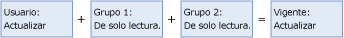

# Superponer permisos de usuario y de grupo (Master Data Services)

[!INCLUDE[appliesto-ss-xxxx-xxxx-xxx-md-winonly](../includes/appliesto-ss-xxxx-xxxx-xxx-md-winonly.md)]

  Los permisos de un usuario se basan en:  
  
-   Permisos de las pertenencias a grupos.  
  
-   Permisos asignados explícitamente al usuario.  
  
 Si un usuario es miembro de varios grupos y dichos grupos tienen acceso a [!INCLUDE[ssMDSmdm](../includes/ssmdsmdm-md.md)], se aplican las siguientes reglas:  
  
-   **Denegar** invalida al resto de permisos. Si el permiso de objeto es **Denegar** en un grupo, se deniega el permiso vigente.  
  
-   El permiso de acceso es una unión de todos los permisos vigentes de un grupo. Si el permiso de objeto es **Crear** en un grupo y **Actualizar** en otro grupo, el permiso vigente es **Crear** y **Actualizar**.  
  
 Estas reglas se aplican a las pestañas **Modelos** y **Miembros de la jerarquía** . Los permisos se resuelven para cada pestaña y, a continuación, se combinan. Para obtener más información, consulte [Cómo se determinan los permisos &#40;Master Data Services&#41;](../master-data-services/how-permissions-are-determined-master-data-services.md).  
  
> [!NOTE]  
>  Puede ver la resolución de los permisos superpuestos de usuario y de grupo en la interfaz de usuario. Las pestañas **Modelos** y **Miembros de la jerarquía** tienen una lista desplegable en la que puede elegir **Vigente** para ver los permisos vigentes.  
  
## Ejemplo 1  
   
  
 El usuario pertenece a Grupo 1 y Grupo 2.  
  
 El usuario tiene el permiso **Leer** para la entidad Product.  
  
 El Grupo 1 tiene el permiso **Actualizar** para la entidad Product.  
  
 El Grupo 2 tiene el permiso **Leer** para la entidad Product.  
  
 Resultado: el permiso vigente del usuario para la entidad Product es **Actualizar** .  
  
## Ejemplo 2  
   
  
 El usuario pertenece a Grupo 1 y Grupo 2.  
  
 El usuario tiene el permiso **Leer** para la entidad Product.  
  
 El Grupo 1 tiene el permiso **Actualizar** para la entidad Product.  
  
 El Grupo 2 tiene el permiso **Denegar** para la entidad Product.  
  
 Resultado: el permiso vigente del usuario para la entidad Product es **Denegar** .  
  
## Ejemplo 3  
   
  
 El usuario pertenece a Grupo 1 y Grupo 2.  
  
 El usuario tiene el permiso **Actualizar** para un grupo de miembros en un nodo de jerarquía.  
  
 El Grupo 1 tiene el permiso **Leer** para un grupo de miembros en un nodo de la jerarquía.  
  
 El Grupo 2 tiene el permiso **Leer** para un grupo de miembros en un nodo de la jerarquía.  
  
 Resultado: el permiso vigente del usuario para los miembros es **Actualizar** .  
  
## Ver también  
 [Cómo se determinan los permisos &#40;Master Data Services&#41;](../master-data-services/how-permissions-are-determined-master-data-services.md)   
 [Superponer permisos de modelo y de miembro &#40;Master Data Services&#41;](../master-data-services/overlapping-model-and-member-permissions-master-data-services.md)  
  
  
