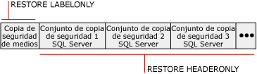

# Historial de copias de seguridad e informaci&#243;n de encabezados (SQL Server)
  En la base de datos [!INCLUDE[ssNoVersion](../../includes/ssnoversion-md.md)] msdb **se almacena un historial completo de todas las operaciones de copia de seguridad y restauración de** de una instancia de servidor. En este tema se describen las tablas del historial de copias de seguridad y restauración, así como las instrucciones de [!INCLUDE[tsql](../../includes/tsql-md.md)] que se usan para tener acceso al historial de copias de seguridad. En el tema también se explica cuándo resulta útil la lista de archivos de base de datos y de registro de transacciones, y cuándo se debe usar la información de encabezado de medios con respecto a cuándo se debe usar la información de encabezado de copia de seguridad.  
  
> [!IMPORTANT]  
>  Para administrar el riesgo de perder cambios recientes en el historial de copias de seguridad y restauración, realice copias de seguridad de **msdb** con frecuencia. Para obtener información sobre las bases de datos del sistema de las que debe hacer copias de seguridad, vea [Realizar copias de seguridad y restaurar bases de datos del sistema &#40;SQL Server&#41;](../../relational-databases/backup-restore/back-up-and-restore-of-system-databases-sql-server.md).  
  
 **En este tema:**  
  
-   [Tablas del historial de copias de seguridad y restauración](#BnRHistoryTables)  
  
-   [Instrucciones Transact-SQL para tener acceso al historial de copias de seguridad](#TsqlStatementsForBackupHistory)  
  
-   [Archivos de base de datos y de registro de transacciones](#ListDbTlogFiles)  
  
-   [Información de encabezado de medios](#MediaHeader)  
  
-   [Información de encabezado de copia de seguridad](#BackupHeader)  
  
-   [Comparación de la información del encabezado de medios y del encabezado de copia de seguridad](#CompareMediaHeaderBackupHeader)  
  
-   [Comprobación de copia de seguridad](#Verification)  
  
-   [Tareas relacionadas](#RelatedTasks)  
  
##   Tablas del historial de copias de seguridad y restauración  
 En esta sección se presentan las tablas del historial que almacenan metadatos de copias de seguridad y restauración en la base de datos del sistema **msdb** .  
  
|Tabla del historial|Descripción|  
|-------------------|-----------------|  
|[backupfile](../../relational-databases/system-tables/backupfile-transact-sql.md)|Contiene una fila por cada archivo de datos o de registro del que se hace una copia de seguridad.|  
|[backupfilegroup](../../relational-databases/system-tables/backupfilegroup-transact-sql.md)|Contiene una fila por cada grupo de archivos de un conjunto de copia de seguridad.|  
|[backupmediafamily](../../relational-databases/system-tables/backupmediafamily-transact-sql.md)|Contiene una fila por cada familia de medios. Si una familia de medios reside en un conjunto de medios reflejado, la familia tiene una fila independiente para cada reflejo del conjunto de medios.|  
|[backupmediaset](../../relational-databases/system-tables/backupmediaset-transact-sql.md)|Contiene una fila por cada conjunto de medios de copia de seguridad.|  
|[backupset](../../relational-databases/system-tables/backupset-transact-sql.md)|Contiene una fila por cada conjunto de copia de seguridad.|  
|[restorefile](../../relational-databases/system-tables/restorefile-transact-sql.md)|Contiene una fila por cada archivo restaurado. Se incluyen los archivos restaurados indirectamente por nombre de grupo de archivos.|  
|[restorefilegroup](../../relational-databases/system-tables/restorefilegroup-transact-sql.md)|Contiene una fila por cada grupo de archivos restaurado.|  
|[restorehistory](../../relational-databases/system-tables/restorehistory-transact-sql.md)|Contiene una fila por cada operación de restauración.|  
  
> [!NOTE]  
>  Cuando se realiza una restauración, se modifican las tablas del historial de copias de seguridad y las del historial de restauraciones.  
  
##   Instrucciones Transact-SQL para tener acceso al historial de copias de seguridad  
 Las instrucciones de información de la restauración corresponden a información almacenada en ciertas tablas del historial de copias de seguridad.  
  
> [!IMPORTANT]  
>  Las instrucciones Transact-SQL RESTORE FILELISTONLY, RESTORE HEADERONLY, RESTORE LABELONLY y RESTORE VERIFYONLY requieren el permiso CREATE DATABASE. Este requisito proporciona una protección más completa que en versiones anteriores de los archivos de copia de seguridad y de la información que contienen. Para obtener información sobre este permiso, vea [GRANT &#40;permisos de base de datos de Transact-SQL&#41;](../../t-sql/statements/grant-database-permissions-transact-sql.md).  
  
|Instrucción de información|Tabla del historial de copias de seguridad|Descripción|  
|---------------------------|--------------------------|-----------------|  
|[RESTORE FILELISTONLY](../Topic/RESTORE%20FILELISTONLY%20\(Transact-SQL\).md)|[backupfile](../../relational-databases/system-tables/backupfile-transact-sql.md)|Devuelve un conjunto de resultados que contiene la lista de los archivos de base de datos y de registro del conjunto de copia de seguridad especificado.   Para obtener más información, vea "Enumerar los archivos de base de datos y del registro de transacciones" más adelante en este tema.|  
|[RESTORE HEADERONLY](../Topic/RESTORE%20HEADERONLY%20\(Transact-SQL\).md)|[backupset](../../relational-databases/system-tables/backupset-transact-sql.md)|Obtiene la información del encabezado sobre todos los conjuntos de copias de seguridad de un dispositivo determinado. El resultado de la ejecución de RESTORE HEADERONLY es un conjunto de resultados.   Para obtener más información, vea "Ver la información de encabezado de copia de seguridad" más adelante en este tema.|  
|[RESTORE LABELONLY](../Topic/RESTORE%20LABELONLY%20\(Transact-SQL\).md)|[backupmediaset](../../relational-databases/system-tables/backupmediaset-transact-sql.md)|Devuelve un conjunto de resultados que contiene información acerca del medio de copia de seguridad de un dispositivo de copia de seguridad especificado.   Para obtener más información, vea "Ver la información de encabezado de medios" más adelante en este tema.|  
  
##   Archivos de base de datos y de registro de transacciones  
 La información que se muestra al enumerar los archivos de base de datos y del registro de transacciones de una copia de seguridad incluye el nombre lógico, nombre físico, tipo de archivo (base de datos o registro), pertenencia a grupos de archivos, tamaño del archivo (en bytes), máximo tamaño de archivo permitido y tamaño de crecimiento de archivos predefinido (en bytes). Esta información es útil, en las situaciones siguientes, para determinar los nombres de los archivos de una copia de seguridad de base de datos antes de restaurarla cuando:  
  
-   Ha perdido una unidad de disco que contiene uno o más archivos de una base de datos.  
  
     Puede enumerar los archivos de la copia de seguridad de la base de datos para determinar los archivos afectados y, a continuación, restaurar dichos archivos en una unidad diferente, al restaurar la base de datos completa, o restaurar solamente estos archivos y aplicar las copias del registro de transacciones creadas desde que se realizó la copia de seguridad de la base de datos.  
  
-   Va a restaurar una base de datos de un servidor en otro servidor pero la estructura de directorios y asignación de unidades no existen en el servidor.  
  
     Enumerar los archivos de la copia de seguridad le permite determinar los archivos afectados. Por ejemplo, la copia de seguridad contiene un archivo que es necesario restaurar en la unidad E, pero el servidor de destino no tiene una unidad E. Es necesario cambiar el archivo a otra ubicación, por ejemplo, la unidad Z, cuando se restaure.  
  
##   Información de encabezado de medios  
 La información de encabezado de medios muestra información acerca del propio medio y no de las copias de seguridad del medio. La información de encabezado de medios mostrada incluye el nombre del medio, la descripción, el nombre del software que lo creó y la fecha en que se escribió.  
  
> [!NOTE]  
>  Ver la información de encabezado de medios es muy rápido.  
  
 Para obtener más información, vea [Comparación de la información del encabezado de medios y del encabezado de copias de seguridad](#CompareMediaHeaderBackupHeader), más adelante en este tema.  
  
##   Información de encabezado de copia de seguridad  
 La información del encabezado de copia de seguridad muestra información acerca de todos los conjuntos de copia de seguridad de [!INCLUDE[ssNoVersion](../../includes/ssnoversion-md.md)] y no [!INCLUDE[ssNoVersion](../../includes/ssnoversion-md.md)] en el medio. La información mostrada incluye los tipos de dispositivos de copia de seguridad utilizados, los tipos de copia de seguridad (por ejemplo, base de datos, transacción, archivo o diferencial de la base de datos) así como información acerca de la fecha y hora inicial y final de la copia de seguridad. Esta información es útil cuando se necesita determinar el conjunto de copia de seguridad que se va a restaurar en la cinta o las copias de seguridad que contiene el medio.  
  
> [!NOTE]  
>  Se puede tardar mucho en ver la información de encabezado de la copia de seguridad de las cintas de alta capacidad debido a que se debe examinar el medio completo para mostrar información acerca de cada copia de seguridad del mismo.  
  
 Para obtener más información, vea [Comparación de la información del encabezado de medios y del encabezado de copias de seguridad](#CompareMediaHeaderBackupHeader), más adelante en este tema.  
  
### Qué conjunto de copia de seguridad se debe restaurar  
 Puede usar información en el encabezado de copia de seguridad para identificar qué conjunto de copia de seguridad se va a restaurar. El Motor de base de datos numera cada conjunto de copia de seguridad en los medios de copia de seguridad. Esto permite identificar el conjunto de copia de seguridad que desea restaurar mediante su posición en los medios. Por ejemplo, el siguiente medio contiene tres conjuntos de copia de seguridad.  
  
   
  
 Para restaurar un conjunto de copia de seguridad específico, especifique el número de posición de ese conjunto. Por ejemplo, para restaurar el segundo conjunto de copia de seguridad, especifique 2 como el conjunto de copia de seguridad para restaurar.  
  
##   Comparación de la información del encabezado de medios y del encabezado de copia de seguridad  
 En la siguiente ilustración se muestra un ejemplo de las diferencias entre ver la información del encabezado de la copia de seguridad y del encabezado del medio. Obtener el encabezado de medios requiere que se recupere solo la información del principio de la cinta. Obtener el encabezado de copia de seguridad requiere examinar la cinta completa para ver el encabezado de cada conjunto de copia de seguridad.  
  
   
  
> [!NOTE]  
>  Si se utilizan conjuntos de medios con varias familias de medios, el encabezado de medios y el conjunto de copia de seguridad se escriben en todas las familias de medios. Por tanto, solo es necesario proporcionar una sola familia de medios para estas operaciones de generación de informes.  
  
 Para obtener información sobre cómo ver el encabezado de medios, vea "Ver la información de encabezado de medios" ya descrito en en este tema.  
  
 Para obtener información sobre cómo ver la información del encabezado de copia de seguridad de todos los conjuntos de copia de seguridad de un dispositivo, vea "Ver la información de encabezado de copia de seguridad" anteriormente en este tema.  
  
##   Comprobación de copia de seguridad  
 Aunque no es obligatoria, la práctica de comprobar una copia de seguridad resulta útil. La comprobación de una copia de seguridad comprueba que esté intacta físicamente, para asegurar que todos los archivos de la copia de seguridad se puedan leer y restaurar, y que se pueda restaurar la copia de seguridad en caso de necesidad. Es importante entender que la comprobación de una copia de seguridad no comprueba la estructura de los datos en la copia de seguridad. Sin embargo, si la copia de seguridad se creó usando WITH CHECKSUMS, la comprobación de la copia de seguridad usando WITH CHECKSUMS puede proporcionar un buen indicativo de la confiabilidad de los datos de la copia de seguridad.  
  
##   Tareas relacionadas  
 **Para eliminar filas antiguas de las tablas del historial de copias de seguridad y restauración**  
  
-   [sp_delete_backuphistory &#40;Transact-SQL&#41;](../../relational-databases/system-stored-procedures/sp-delete-backuphistory-transact-sql.md)  
  
 **Para eliminar todas las filas de las tablas del historial de copias de seguridad y restauración de una base de datos determinada**  
  
-   [sp_delete_database_backuphistory &#40;Transact-SQL&#41;](../../relational-databases/system-stored-procedures/sp-delete-database-backuphistory-transact-sql.md)  
  
 **Para ver los archivos de datos y de registro en un conjunto de copia de seguridad**  
  
-   [RESTORE FILELISTONLY &#40;Transact-SQL&#41;](../Topic/RESTORE%20FILELISTONLY%20\(Transact-SQL\).md)  
  
-   <xref:Microsoft.SqlServer.Management.Smo.Restore.ReadFileList%2A> (SMO)  
  
 **Para ver la información de encabezado de medios**  
  
-   [RESTORE LABELONLY &#40;Transact-SQL&#41;](../Topic/RESTORE%20LABELONLY%20\(Transact-SQL\).md)  
  
-   [Ver las propiedades y el contenido de un dispositivo lógico de copia de seguridad &#40;SQL Server&#41;](../../relational-databases/backup-restore/view-the-properties-and-contents-of-a-logical-backup-device-sql-server.md)  
  
-   [Ver el contenido de una cinta o un archivo de copia de seguridad &#40;SQL Server&#41;](../../relational-databases/backup-restore/view-the-contents-of-a-backup-tape-or-file-sql-server.md)  
  
-   <xref:Microsoft.SqlServer.Management.Smo.Restore.ReadMediaHeader%2A> (SMO)  
  
 **Para ver la información de encabezado de la copia de seguridad**  
  
-   [RESTORE HEADERONLY &#40;Transact-SQL&#41;](../Topic/RESTORE%20HEADERONLY%20\(Transact-SQL\).md)  
  
-   [Ver el contenido de una cinta o un archivo de copia de seguridad &#40;SQL Server&#41;](../../relational-databases/backup-restore/view-the-contents-of-a-backup-tape-or-file-sql-server.md)  
  
-   [Ver las propiedades y el contenido de un dispositivo lógico de copia de seguridad &#40;SQL Server&#41;](../../relational-databases/backup-restore/view-the-properties-and-contents-of-a-logical-backup-device-sql-server.md)  
  
-   <xref:Microsoft.SqlServer.Management.Smo.Restore.ReadBackupHeader%2A> (SMO)  
  
 **Para eliminar filas antiguas de las tablas del historial de copias de seguridad y restauración**  
  
-   [sp_delete_backuphistory &#40;Transact-SQL&#41;](../../relational-databases/system-stored-procedures/sp-delete-backuphistory-transact-sql.md)  
  
 **Para eliminar todas las filas de las tablas del historial de copias de seguridad y restauración de una base de datos determinada**  
  
-   [sp_delete_database_backuphistory &#40;Transact-SQL&#41;](../../relational-databases/system-stored-procedures/sp-delete-database-backuphistory-transact-sql.md)  
  
 **Para ver la información de encabezado de medios**  
  
-   [RESTORE LABELONLY &#40;Transact-SQL&#41;](../Topic/RESTORE%20LABELONLY%20\(Transact-SQL\).md)  
  
-   [Ver las propiedades y el contenido de un dispositivo lógico de copia de seguridad &#40;SQL Server&#41;](../../relational-databases/backup-restore/view-the-properties-and-contents-of-a-logical-backup-device-sql-server.md)  
  
-   [Ver el contenido de una cinta o un archivo de copia de seguridad &#40;SQL Server&#41;](../../relational-databases/backup-restore/view-the-contents-of-a-backup-tape-or-file-sql-server.md)  
  
-   <xref:Microsoft.SqlServer.Management.Smo.Restore.ReadMediaHeader%2A> (SMO)  
  
 **Para ver la información de encabezado de la copia de seguridad**  
  
-   [RESTORE HEADERONLY &#40;Transact-SQL&#41;](../Topic/RESTORE%20HEADERONLY%20\(Transact-SQL\).md)  
  
-   [Ver el contenido de una cinta o un archivo de copia de seguridad &#40;SQL Server&#41;](../../relational-databases/backup-restore/view-the-contents-of-a-backup-tape-or-file-sql-server.md)  
  
-   [Ver las propiedades y el contenido de un dispositivo lógico de copia de seguridad &#40;SQL Server&#41;](../../relational-databases/backup-restore/view-the-properties-and-contents-of-a-logical-backup-device-sql-server.md)  
  
-   <xref:Microsoft.SqlServer.Management.Smo.Restore.ReadBackupHeader%2A> (SMO)  
  
 **Para ver los archivos de un conjunto de copia de seguridad**  
  
-   [Ver los archivos de datos y de registro en un conjunto de copia de seguridad &#40;SQL Server&#41;](../../relational-databases/backup-restore/view-the-data-and-log-files-in-a-backup-set-sql-server.md)  
  
-   [RESTORE HEADERONLY &#40;Transact-SQL&#41;](../Topic/RESTORE%20HEADERONLY%20\(Transact-SQL\).md)  
  
 **Para comprobar una copia de seguridad**  
  
-   [RESTORE VERIFYONLY &#40;Transact-SQL&#41;](../Topic/RESTORE%20VERIFYONLY%20\(Transact-SQL\).md)  
  
-   <xref:Microsoft.SqlServer.Management.Smo.Restore.SqlVerify%2A> (SMO)  
  
## Vea también  
 [BACKUP &#40;Transact-SQL&#41;](../../t-sql/statements/backup-transact-sql.md)   
 [Conjuntos de medios, familias de medios y conjuntos de copias de seguridad &#40;SQL Server&#41;](../../relational-databases/backup-restore/media-sets-media-families-and-backup-sets-sql-server.md)   
 [Dispositivos de copia de seguridad &#40;SQL Server&#41;](../../relational-databases/backup-restore/backup-devices-sql-server.md)   
 [Conjuntos de medios de copia de seguridad reflejados &#40;SQL Server&#41;](../../relational-databases/backup-restore/mirrored-backup-media-sets-sql-server.md)   
 [Errores posibles de medios durante copia de seguridad y restauración &#40;SQL Server&#41;](../../relational-databases/backup-restore/possible-media-errors-during-backup-and-restore-sql-server.md)  
  
  