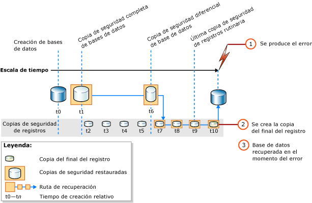

# <a name="complete-database-restores-full-recovery-model"></a>Restauraciones de base de datos completas (modelo de recuperación completa)
 [!INCLUDE [SQL Server](../../includes/applies-to-version/sqlserver.md)]

  El objetivo de una restauración completa de la base de datos es restaurar toda la base de datos. Durante el proceso de restauración, la base de datos completa se encuentra sin conexión. Antes de que ninguna parte de la base de datos esté en línea, se recuperan todos los datos a un punto coherente en el que todas las partes de la base de datos se encuentran en el mismo momento y en el que no existe ninguna transacción sin confirmar.  
  
 En el modelo de recuperación completa, después de restaurar la copia o copias de seguridad de los datos, debe restaurar todas las copias de seguridad de registros de transacciones posteriores y, a continuación, recuperar la base de datos. Puede restaurar una base de datos a un *punto de recuperación* específico en una de estas copias de seguridad de registros. El punto de recuperación puede ser una fecha y hora específicas, una transacción marcada o un número de secuencia de registro (LSN).  
  
 Al restaurar una base de datos, especialmente en el modelo de recuperación completa o el modelo de recuperación optimizado para cargas masivas de registros, debe usar una única secuencia de restauración. Una *secuencia de restauración* consta de dos o más operaciones de restauración que mueven datos en una o varias fases de restauración.  
  
### <a name="untrusted-sources"></a>Orígenes no de confianza

Se recomienda _no_ adjuntar ni restaurar bases de datos de orígenes desconocidos o que no sean de confianza. Estas bases de datos pueden contener código malintencionado que podría ejecutar código [!INCLUDE[tsql](../../includes/tsql-md.md)] inesperado o provocar errores debido a la modificación del esquema o de la estructura de la base de datos física. Antes de utilizar una base de datos de un origen desconocido o que no sea de confianza, ejecute [DBCC CHECKDB](../../t-sql/database-console-commands/dbcc-checkdb-transact-sql.md) en la base de datos en un servidor que no sea de producción. Además, examine el código escrito por el usuario en la base de datos, como los procedimientos almacenados u otro código definido por el usuario.

### <a name="backups-from-earlier-versions"></a>Copias de seguridad de versiones anteriores

Para obtener más información sobre la compatibilidad con las copias de seguridad de versiones anteriores de [!INCLUDE[ssNoVersion](../../includes/ssnoversion-md.md)], vea la sección "Soporte de compatibilidad" de [RESTORE &#40;Transact-SQL&#41;](../../t-sql/statements/restore-statements-transact-sql.md).
  
##  <a name="restoring-a-database-to-the-point-of-failure"></a><a name="PointOfFailure"></a> Restaurar una base de datos hasta el momento del error  

 En general, la recuperación de una base de datos hasta el momento del error incluye los siguientes pasos básicos:  
  
1.  Realizar una copia de seguridad del registro de transacciones activo (denominado el final del registro). De esta forma se crea una copia del final del registro. Si el registro de transacciones activo no está disponible, todas las transacciones de esa parte del registro se pierden.  
  
    > [!IMPORTANT]  
    >  En el modelo de recuperación optimizado para cargas masivas de registros, realizar la copia de seguridad de un registro que contiene operaciones de registro masivo requiere acceso a todos los archivos de datos de la base de datos. Si no se puede tener acceso a los archivos de datos, no se puede realizar una copia de seguridad del registro de transacciones. En ese caso, debe repetir manualmente todos los cambios realizados desde la copia de seguridad de registros más reciente.  
  
     Para obtener más información, vea [Copias del final del registro &#40;SQL Server&#41;](../../relational-databases/backup-restore/tail-log-backups-sql-server.md).  
  
2.  Restaurar la copia de seguridad completa más reciente sin recuperar la base de datos (RESTORE DATABASE *database_name* FROM *backup_device* WITH NORECOVERY).  
  
3.  Si existen copias de seguridad diferenciales, restaurar la más reciente sin recuperar la base de datos (RESTORE DATABASE *database_name* FROM *differential_backup_device* WITH NORECOVERY).  
  
     Al restaurar la copia de seguridad diferencial más reciente se reduce el número de copias de seguridad de registros que se deben restaurar.  
  
4.  Restaurar los registros secuencialmente con la opción NORECOVERY, comenzando por la primera copia de seguridad de registros de transacciones creada después de la copia de seguridad que se acaba de restaurar.  
  
5.  Recuperar la base de datos (RESTORE DATABASE *database_name* WITH RECOVERY). Como alternativa, este paso se puede combinar con la restauración de la última copia de seguridad de registros.  
  
 En la siguiente ilustración se muestra esta secuencia de restauración. Después de que se produzca un error (1), se crea una copia del final del registro (2). A continuación, la base de datos se restaura al punto del error. Esto implica la restauración de una copia de seguridad de la base de datos, de una copia de seguridad diferencial subsiguiente, y de cada copia de seguridad de registros realizada después de la copia de seguridad diferencial, incluida la copia del final del registro.  
  
   
  
> [!NOTE]  
>  Cuando restaura una copia de seguridad de la base de datos en una instancia de servidor distinta, vea [Copiar bases de datos con Copias de seguridad y restauración](../../relational-databases/databases/copy-databases-with-backup-and-restore.md).  
  
###  <a name="basic-transact-sql-restore-syntax"></a><a name="TsqlSyntax"></a> Sintaxis RESTORE de Transact-SQL básica  
 La sintaxis [de](../../t-sql/statements/restore-statements-transact-sql.md)[!INCLUDE[tsql](../../includes/tsql-md.md)] básica para la secuencia de restauración en la ilustración anterior es la siguiente:  
  
1.  RESTORE DATABASE *database* FROM *full database backup* WITH NORECOVERY;  
  
2.  RESTORE DATABASE *database* FROM *full_differential_backup* WITH NORECOVERY;  
  
3.  RESTORE LOG *database* FROM *log_backup* WITH NORECOVERY;  
  
     Repita este paso de restauración del registro para cada copia de seguridad de registros adicional.  
  
4.  RESTORE DATABASE *database* WITH RECOVERY;  
  
###  <a name="example-recovering-to-the-point-of-failure-transact-sql"></a><a name="ExampleToPoFTsql"></a> Ejemplo: recuperación hasta el momento del error (Transact-SQL)  
 En el siguiente ejemplo de [!INCLUDE[tsql](../../includes/tsql-md.md)] se muestran las opciones fundamentales en una secuencia de restauración que restaura la base de datos hasta el momento del error. En el ejemplo se crea una copia del final del registro de la base de datos. A continuación, en el ejemplo se restaura una copia de seguridad completa de la base de datos y una copia de seguridad de registros; a continuación; se restaura la copia del final del registro. En el ejemplo, se recupera la base de datos en un último paso independiente.  
  
> [!NOTE]  
>  En este ejemplo se usa una copia de seguridad de base de datos y una copia de seguridad de registros que se crea en la sección "Copias de seguridad de la base de datos en el modelo de recuperación completa" de [Copias de seguridad completas de bases de datos &#40;SQL Server&#41;](../../relational-databases/backup-restore/full-database-backups-sql-server.md). Antes de la copia de seguridad de la base de datos, la base de datos de ejemplo de [!INCLUDE[ssSampleDBobject](../../includes/sssampledbobject-md.md)] se ha configurado para usar el modelo de recuperación completa.  
  
```  
USE master;  
--Create tail-log backup.  
BACKUP LOG AdventureWorks2012   
TO DISK = 'Z:\SQLServerBackups\AdventureWorksFullRM.bak'    
   WITH NORECOVERY;   
GO  
--Restore the full database backup (from backup set 1).  
RESTORE DATABASE AdventureWorks2012   
  FROM DISK = 'Z:\SQLServerBackups\AdventureWorksFullRM.bak'   
  WITH FILE=1,   
    NORECOVERY;  
  
--Restore the regular log backup (from backup set 2).  
RESTORE LOG AdventureWorks2012   
  FROM DISK = 'Z:\SQLServerBackups\AdventureWorksFullRM.bak'   
  WITH FILE=2,   
    NORECOVERY;  
  
--Restore the tail-log backup (from backup set 3).  
RESTORE LOG AdventureWorks2012   
  FROM DISK = 'Z:\SQLServerBackups\AdventureWorksFullRM.bak'  
  WITH FILE=3,   
    NORECOVERY;  
GO  
--recover the database:  
RESTORE DATABASE AdventureWorks2012 WITH RECOVERY;  
GO  
```  
  
##  <a name="restoring-a-database-to-a-point-within-a-log-backup"></a><a name="PointWithinBackup"></a> Restaurar bases de datos a un punto de una copia de seguridad de registros  
 En el modelo de recuperación completa, una restauración completa de la base de datos se puede recuperar normalmente hasta un momento en el tiempo, una transacción marcada o un LSN de la copia de seguridad de registros. Sin embargo, en el modelo de recuperación optimizado para cargas masivas de registros, si la copia de seguridad de registros contiene cambios de registros de operaciones masivas, no es posible la recuperación a un momento dado.  
  
### <a name="sample-point-in-time-restore-scenarios"></a>Escenarios de ejemplo de restauración en un momento concreto  
 En este siguiente ejemplo se presupone que usa un sistema de base de datos de gran importancia para el que se crea una copia de seguridad completa diariamente cada medianoche, una copia de seguridad diferencial de la base de datos cada hora, de lunes a sábado, y copias de seguridad del registro de transacciones cada 10 minutos durante el día. Para restaurar la base de datos al estado en que estaba a las 5:19 a.m. del miércoles, debe hacer lo siguiente:  
  
1.  Restaure la copia de seguridad de la base de datos completa creada la medianoche del martes.  
  
2.  Restaure la copia de seguridad diferencial de la base de datos que se ha creado a las 5:00. del miércoles.  
  
3.  Aplique la copia de seguridad del registro de transacciones que se ha creado a las 5:10. del miércoles.  
  
4.  Aplique la copia de seguridad del registro de transacciones creada a las 5:20 a.m. del miércoles y especifique que el proceso de recuperación solo se aplique a las transacciones realizadas antes de las 5:19 a.m.  
  
 O bien, si la base de datos tiene que restaurarse a su estado de las 3:04 a.m. del jueves, pero la copia de seguridad diferencial de la base de datos que se creó el jueves a las 3:00 a.m. no está disponible, haga lo siguiente:  
  
1.  Restaure la copia de seguridad de la base de datos creada la medianoche del miércoles.  
  
2.  Restaure la copia de seguridad diferencial de la base de datos creada a las 2:00 a.m. del jueves.  
  
3.  Aplique todas las copias de seguridad del registro de transacciones creadas desde las 2:10 a.m. a las 3:00. del jueves.  
  
4.  Aplique la copia de seguridad del registro de transacciones creada a las 3:10 a.m. del jueves y detenga el proceso de recuperación a las 3:04 a.m.  
  
> [!NOTE]  
>  Para obtener un ejemplo de una restauración a un momento dado, vea [Restaurar una base de datos de SQL Server a un momento dado &#40;modelo de recuperación completa&#41;](../../relational-databases/backup-restore/restore-a-sql-server-database-to-a-point-in-time-full-recovery-model.md).  
  
##  <a name="related-tasks"></a><a name="RelatedTasks"></a> Tareas relacionadas  
 **Para restaurar una copia de seguridad completa de la base de datos**  
  
-   [Restore a Database Backup Using SSMS](../../relational-databases/backup-restore/restore-a-database-backup-using-ssms.md)  
  
-   [Restaurar una base de datos a una nueva ubicación &#40;SQL Server&#41;](../../relational-databases/backup-restore/restore-a-database-to-a-new-location-sql-server.md)  
  
 **Para restaurar una copia de seguridad diferencial de la base de datos**  
  
-   [Restaurar una copia de seguridad diferencial de la base de datos &#40;SQL Server&#41;](../../relational-databases/backup-restore/restore-a-differential-database-backup-sql-server.md)  
  
 **Para restaurar una copia de seguridad del registro de transacciones**  
  
-   [Restaurar una copia de seguridad de registros de transacciones &#40;SQL Server&#41;](../../relational-databases/backup-restore/restore-a-transaction-log-backup-sql-server.md)  
  
 **Para restaurar una copia de seguridad mediante los objetos de administración de SQL Server (SMO)**  
  
-   <xref:Microsoft.SqlServer.Management.Smo.Restore.SqlRestore%2A>  
  
 **Para restaurar bases de datos a un punto de una copia de seguridad de registros**  
  
-   [Restaurar una base de datos de SQL Server a un momento dado &#40;modelo de recuperación completa&#41;](../../relational-databases/backup-restore/restore-a-sql-server-database-to-a-point-in-time-full-recovery-model.md)  
  
-   [Recuperación de bases de datos relacionadas que contienen transacciones marcadas](../../relational-databases/backup-restore/recovery-of-related-databases-that-contain-marked-transaction.md)  
  
-   [Recuperar a un número de secuencia de registro &#40;SQL Server&#41;](../../relational-databases/backup-restore/recover-to-a-log-sequence-number-sql-server.md)  
  
## <a name="see-also"></a>Consulte también  
 [RESTORE &#40;Transact-SQL&#41;](../../t-sql/statements/restore-statements-transact-sql.md)   
 [BACKUP &#40;Transact-SQL&#41;](../../t-sql/statements/backup-transact-sql.md)   
 [Aplicar copias de seguridad del registro de transacciones &#40;SQL Server&#41;](../../relational-databases/backup-restore/apply-transaction-log-backups-sql-server.md)   
 [sp_addumpdevice &#40;Transact-SQL&#41;](../../relational-databases/system-stored-procedures/sp-addumpdevice-transact-sql.md)   
 [Copias de seguridad completas de bases de datos &#40;SQL Server&#41;](../../relational-databases/backup-restore/full-database-backups-sql-server.md)   
 [Copias de seguridad diferenciales &#40;SQL Server&#41;](../../relational-databases/backup-restore/differential-backups-sql-server.md)   
 [Información general de copia de seguridad &#40;SQL Server&#41;](../../relational-databases/backup-restore/backup-overview-sql-server.md)   
 [Información general sobre restauración y recuperación &#40;SQL Server&#41;](../../relational-databases/backup-restore/restore-and-recovery-overview-sql-server.md)  
  
  
