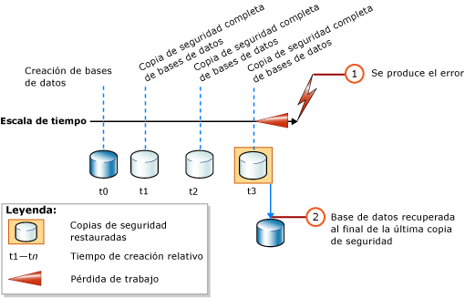
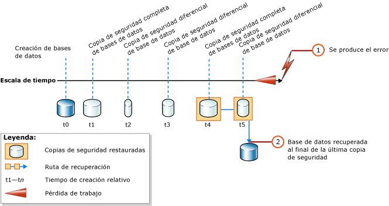

# <a name="complete-database-restores-simple-recovery-model"></a>Restauraciones de base de datos completas (modelo de recuperación simple)
[!INCLUDE[appliesto-ss-xxxx-xxxx-xxx-md](../../includes/appliesto-ss-xxxx-xxxx-xxx-md.md)]

  El objetivo de una restauración completa de la base de datos es restaurar toda la base de datos. Durante el proceso de restauración, la base de datos completa se encuentra sin conexión. Antes de que ninguna parte de la base de datos esté en línea, se recuperan todos los datos a un punto coherente en el que todas las partes de la base de datos se encuentran en el mismo momento y en el que no existe ninguna transacción sin confirmar.  
  
 En el modelo de recuperación simple, no se puede restaurar la base de datos a un momento concreto de una copia de seguridad específica.  
  
> [!IMPORTANT]  
>  Se recomienda no adjuntar ni restaurar bases de datos de orígenes desconocidos o que no sean de confianza. Estas bases de datos pueden contener código malintencionado que podría ejecutar código [!INCLUDE[tsql](../../includes/tsql-md.md)] inesperado o provocar errores debido a la modificación del esquema o de la estructura de la base de datos física. Para usar una base de datos desde un origen desconocido o que no sea de confianza, ejecute [DBCC CHECKDB](../../t-sql/database-console-commands/dbcc-checkdb-transact-sql.md) en la base de datos de un servidor que no sea de producción y examine también el código, como procedimientos almacenados u otro código definido por el usuario, en la base de datos.  
  
 **En este tema:**  
  
-   [Información general de la restauración de la base de datos en el modelo de recuperación simple](#Overview)  
  
-   [Tareas relacionadas](#RelatedTasks)  
  
> [!NOTE]  
>  Para obtener más información sobre la compatibilidad con las copias de seguridad de versiones anteriores de [!INCLUDE[ssNoVersion](../../includes/ssnoversion-md.md)], vea la sección "Soporte de compatibilidad" de [RESTORE &#40;Transact-SQL&#41;](../../t-sql/statements/restore-statements-transact-sql.md).  
  
##  <a name="Overview"></a> Información general de la restauración de la base de datos en el modelo de recuperación simple  
 Una restauración completa de base de datos con el modelo de recuperación simple implica una o dos instrucciones [RESTORE](../../t-sql/statements/restore-statements-transact-sql.md) , en función de si desea restaurar una copia de seguridad diferencial de la base de datos. Si solo usa copias de seguridad completas de la base de datos, restaure solo la copia de seguridad más reciente, como se muestra en la siguiente ilustración.  
  
   
  
 Si también usa una copia de seguridad diferencial de la base de datos, restaure la copia de seguridad completa más reciente de la base de datos sin recuperar la base de datos y, a continuación, restaure la copia de seguridad diferencial más reciente de la base de datos y recupere la base de datos. En la siguiente ilustración se muestra este proceso.  
  
   
  
> [!NOTE]  
>  Si planea restaurar una copia de seguridad de la base de datos en una instancia de servidor distinta, vea [Copiar bases de datos con Copias de seguridad y restauración](../../relational-databases/databases/copy-databases-with-backup-and-restore.md).  
  
###  <a name="TsqlSyntax"></a> Sintaxis RESTORE de Transact-SQL básica  
 La sintaxis [!INCLUDE[tsql](../../includes/tsql-md.md)][RESTORE](../../t-sql/statements/restore-statements-transact-sql.md) básica para restaurar una copia de seguridad de base de datos completa es:  
  
 RESTORE DATABASE *database_name* FROM *backup_device* [ WITH NORECOVERY ]  
  
> [!NOTE]  
>  Use WITH NORECOVERY si también desea restaurar una copia de seguridad diferencial de la base de datos.  
  
 La sintaxis [RESTORE](../../t-sql/statements/restore-statements-transact-sql.md) básica para restaurar una copia de seguridad de la base de datos es:  
  
 RESTORE DATABASE *database_name* FROM *backup_device* WITH RECOVERY  
  
###  <a name="Example"></a> Ejemplo (Transact-SQL)  
 En el siguiente ejemplo se muestra primero cómo usar la instrucción [BACKUP](../../t-sql/statements/backup-transact-sql.md) para crear una copia de seguridad completa y diferencial de la base de datos [!INCLUDE[ssSampleDBobject](../../includes/sssampledbobject-md.md)] . A continuación, se restauran estas copias de seguridad una después de la otra. La base de datos se restaura a su estado en el momento en que finalizó la copia de seguridad diferencial.  
  
 En el ejemplo se muestran las opciones críticas de una secuencia de restauración en un escenario de restauración de base de datos completa. Una *secuencia de restauración* consta de dos o más operaciones de restauración que mueven datos en una o varias fases de restauración. La sintaxis y los detalles no pertinentes para este propósito se omiten. Al recuperar una base de datos, se recomienda especificar explícitamente la opción RECOVERY por motivos de claridad, aunque es la opción predeterminada.  
  
> [!NOTE]  
>  En el ejemplo se comienza con una instrucción [ALTER DATABASE](../../t-sql/statements/alter-database-transact-sql.md) que establece el modelo de recuperación en `SIMPLE`.  
  
```  
USE master;  
--Make sure the database is using the simple recovery model.  
ALTER DATABASE AdventureWorks2012 SET RECOVERY SIMPLE;  
GO  
-- Back up the full AdventureWorks2012 database.  
BACKUP DATABASE AdventureWorks2012   
TO DISK = 'Z:\SQLServerBackups\AdventureWorks2012.bak'   
  WITH FORMAT;  
GO  
--Create a differential database backup.  
BACKUP DATABASE AdventureWorks2012   
TO DISK = 'Z:\SQLServerBackups\AdventureWorks2012.bak'  
   WITH DIFFERENTIAL;  
GO  
--Restore the full database backup (from backup set 1).  
RESTORE DATABASE AdventureWorks2012   
FROM DISK = 'Z:\SQLServerBackups\AdventureWorks2012.bak'   
   WITH FILE=1, NORECOVERY;  
--Restore the differential backup (from backup set 2).  
RESTORE DATABASE AdventureWorks2012   
FROM DISK = 'Z:\SQLServerBackups\AdventureWorks2012.bak'   
   WITH FILE=2, RECOVERY;  
GO  
```  
  
##  <a name="RelatedTasks"></a> Tareas relacionadas  
 **Para restaurar una copia de seguridad completa de la base de datos**  
  
-   [Restaurar una copia de seguridad de base de datos en el modelo de recuperación simple &#40;Transact-SQL&#41;](../../relational-databases/backup-restore/restore-a-database-backup-under-the-simple-recovery-model-transact-sql.md)  
  
-   [Restore a Database Backup Using SSMS](../../relational-databases/backup-restore/restore-a-database-backup-using-ssms.md)  
  
-   [Restaurar una base de datos a una nueva ubicación &#40;SQL Server&#41;](../../relational-databases/backup-restore/restore-a-database-to-a-new-location-sql-server.md)  
  
 **Para restaurar una copia de seguridad diferencial de la base de datos**  
  
-   [Restaurar una copia de seguridad diferencial de la base de datos &#40;SQL Server&#41;](../../relational-databases/backup-restore/restore-a-differential-database-backup-sql-server.md)  
  
 **Para restaurar una copia de seguridad mediante los objetos de administración de SQL Server (SMO)**  
  
-   <xref:Microsoft.SqlServer.Management.Smo.Restore.SqlRestore%2A>  
  
## <a name="see-also"></a>Consulte también  
 [RESTORE &#40;Transact-SQL&#41;](../../t-sql/statements/restore-statements-transact-sql.md)   
 [BACKUP &#40;Transact-SQL&#41;](../../t-sql/statements/backup-transact-sql.md)   
 [sp_addumpdevice &#40;Transact-SQL&#41;](../../relational-databases/system-stored-procedures/sp-addumpdevice-transact-sql.md)   
 [Copias de seguridad completas de bases de datos &#40;SQL Server&#41;](../../relational-databases/backup-restore/full-database-backups-sql-server.md)   
 [Copias de seguridad diferenciales &#40;SQL Server&#41;](../../relational-databases/backup-restore/differential-backups-sql-server.md)   
 [Información general de copia de seguridad &#40;SQL Server&#41;](../../relational-databases/backup-restore/backup-overview-sql-server.md)   
 [Información general sobre restauración y recuperación &#40;SQL Server&#41;](../../relational-databases/backup-restore/restore-and-recovery-overview-sql-server.md)  
  
  
