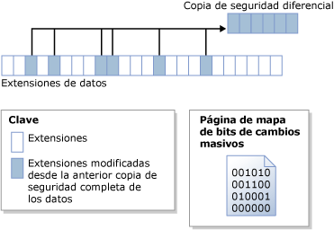

# Copias de seguridad diferenciales (SQL Server)
[!INCLUDE[appliesto-ss-xxxx-xxxx-xxx-md](../../includes/appliesto-ss-xxxx-xxxx-xxx-md.md)]
  Este tema de copias de seguridad y restauración es pertinente para todas las bases de datos de [!INCLUDE[ssNoVersion](../../includes/ssnoversion-md.md)] .  
  
 la copia de seguridad diferencial se basa en la copia de seguridad de datos completa anterior más reciente. Una copia de seguridad diferencial captura solo los datos que han cambiado después de la última copia de seguridad completa. La copia de seguridad completa en la que se basa una diferencial se denomina *base* de la diferencial. Las copias de seguridad completas, a excepción de las de solo copia, pueden servir como base para una serie de copias de seguridad diferenciales, incluidas las de base de datos, las parciales, y las de archivos. La copia de seguridad de base de una copia de seguridad diferencial de archivos puede estar contenida en una copia de seguridad completa, una copia de seguridad de archivos o una copia de seguridad parcial.  
  
  
##   Ventajas  
  
-   La creación de copias de seguridad diferencial puede ser muy rápida en comparación con la creación una copia de seguridad completa. Una copia de seguridad diferencial registra solo los datos que han cambiado desde la última copia de seguridad completa en la que se basa la diferencial. Esto facilita la realización de copias de seguridad frecuentes, lo que reduce el riesgo de pérdida de datos. No obstante, antes de restaurar una copia de seguridad diferencial, debe restaurar su base. Por lo tanto, la restauración de una copia de seguridad diferencial necesitará más pasos y tiempo que la restauración de una copia de seguridad completa porque se requieren dos archivos de copia de seguridad.  
  
-   Las copias de seguridad diferenciales de bases de datos son particularmente útiles si un subconjunto de una base de datos se modifica con más frecuencia que el resto de la base de datos. En tales casos, las copias de seguridad diferenciales de bases de datos le permiten hacer una copia de seguridad con frecuencia sin la sobrecarga que generan las copias de seguridad completas de bases de datos.  
  
-   En el modelo de recuperación completa, las copias de seguridad diferenciales pueden reducir el número de copias de seguridad de registros que se deben restaurar.  
  
##   Información general de las copias de seguridad diferenciales  
 Una copia de seguridad diferencial captura el estado de las *extensiones* (colecciones de ocho páginas físicamente contiguas) que hayan cambiado entre el momento de creación de la base diferencial y el momento de creación de la copia de seguridad diferencial. Esto significa que el tamaño de una determinada copia de seguridad diferencial depende de la cantidad de datos que han cambiado desde la base. Como regla general, cuanto más antigua sea una base, mayor será una nueva copia de seguridad diferencial. En una serie de copias de seguridad diferenciales, es probable que una extensión actualizada con frecuencia contenga datos diferentes en cada una de las copias de seguridad diferenciales.  
  
 En la siguiente ilustración se muestra cómo funciona una copia de seguridad diferencial. La ilustración muestra 24 extensiones de datos, 6 de las cuales han cambiado. La copia de seguridad diferencial solo contiene estas 6 extensiones de datos. La operación de copia de seguridad diferencial se basa en una página de mapa de bits que contiene un bit por cada extensión. Por cada extensión actualizada desde que se creó la base, el bit se establece en 1 en el mapa de bits.  
  
   
  
> [!NOTE]  
>  El mapa de bits de la copia de seguridad diferencial no se actualiza con las copias de seguridad de solo copia. Por tanto, una copia de seguridad de solo copia no afecta a las copias de seguridad diferenciales subsiguientes.  
  
 Una copia de seguridad diferencial que se realiza poco después de su base tiende a ser sustancialmente más pequeña que la base diferencial. Así, se gana espacio de copia de seguridad y tiempo. Sin embargo, a medida que la base de datos cambia, la diferencia entre la base de datos y una base diferencial concreta aumenta. Cuanto más tiempo pasa entre una copia de seguridad diferencial y su base, más probabilidades hay de que la copia de seguridad diferencial sea más grande. Esto significa que las copias de seguridad diferenciales pueden, a la larga, asemejarse en tamaño a la base diferencial. La copia de seguridad diferencial grande pierde las ventajas de una copia de seguridad más rápida y de menor tamaño.  
  
 A medida que se incrementa el tamaño de las copias de seguridad diferenciales, la restauración de una copia de seguridad diferencial puede incrementar sensiblemente el tiempo necesario para restaurar una base de datos. Por ello, recomendamos que realice una copia de seguridad completa a intervalos definidos para establecer una nueva base diferencial para los datos. Por ejemplo, cada semana podría realizar una copia de seguridad completa de toda la base de datos (es decir, una copia de seguridad completa de la base de datos) seguida de una serie de copias de seguridad diferenciales de la base de datos realizadas periódicamente durante la semana.  
  
 En el momento de la restauración, antes de restaurar una copia de seguridad diferencial, debe restaurar su base. A continuación, solo necesita restaurar la copia diferencial más reciente para poner al día la base de datos hasta el momento en que se creó la copia de seguridad diferencial. Por lo general, restaurará la copia de seguridad completa más reciente seguida de la copia de seguridad diferencial más reciente que está basada en la copia de seguridad completa.  
  
## Copias de seguridad diferenciales de bases de datos con tablas con optimización para memoria  
 Para obtener información sobre las copias de seguridad diferenciales y las bases de datos optimizadas para memoria, vea [Hacer copia de seguridad de una base de datos con tablas optimizadas para memoria](../../relational-databases/in-memory-oltp/backing-up-a-database-with-memory-optimized-tables.md).  
  
##   Copias de seguridad diferencias de bases de datos de solo lectura  
 En el caso de bases de datos de solo lectura, resulta más fácil gestionar las copias de seguridad completas por sí solas que cuando se utilizan junto copias de seguridad diferenciales. Cuando una base de datos es de solo lectura, las operaciones de copia de seguridad y de otro tipo no tienen capacidad para modificar los metadatos del archivo. Por lo tanto, los metadatos que precisan las copias de seguridad diferenciales, como el número de secuencia de registro en el que comienza la copia de seguridad diferencial (el número LSN base diferencial), se almacenan en la base de datos **maestra** . Si la base diferencial se establece cuando la base de datos es de solo lectura, el mapa de bits diferencial indicará más cambios de los que en realidad han ocurrido desde que se realizó la copia de seguridad de base. La copia de seguridad lee los datos adicionales, pero estos no se escriben en la misma, dado que el **differential_base_lsn** almacenado en la tabla del sistema [backupset](../../relational-databases/system-tables/backupset-transact-sql.md) se usa para determinar si los datos realmente han cambiado desde que se creó la base.  
  
 Cuando se vuelve a generar, restaurar o separar y adjuntar una base de datos de solo lectura, se pierde la información de base diferencial. Esto ocurre porque la base de datos **maestra** no está sincronizada con la base de datos de usuario. [!INCLUDE[ssDEnoversion](../../includes/ssdenoversion-md.md)] no puede detectar ni evitar este problema. Las copias de seguridad diferenciales que se realicen con posterioridad no se basan en la copia de seguridad completa más reciente, por lo que pueden proporcionar resultados inesperados. Para establecer una nueva base diferencial se recomienda crear una copia de seguridad completa de base de datos.  
  
### Prácticas recomendadas para utilizar copias de seguridad diferenciales con una base de datos de solo lectura  
 Después de crear una copia de seguridad completa de una base de datos de solo lectura, deberá crear una copia de seguridad de la base de datos **maestra** si luego pretende crear una copia de seguridad diferencial.  
  
 Si se pierde la base de datos **maestra** , restáurela antes de restaurar las copias de seguridad diferenciales de una base de datos de usuario.  
  
 Si separa y adjunta una base de datos de solo lectura de la que tiene previsto realizar copias de seguridad diferenciales con posterioridad, realice tan pronto como sea posible una copia de seguridad completa de su base de datos de solo lectura y de la base de datos **maestra** .  
  
##   Tareas relacionadas  
  
-   [Crear una copia de seguridad diferencial de una base de datos &#40;SQL Server&#41;](../../relational-databases/backup-restore/create-a-differential-database-backup-sql-server.md)  
  
-   [Restaurar una copia de seguridad diferencial de la base de datos &#40;SQL Server&#41;](../../relational-databases/backup-restore/restore-a-differential-database-backup-sql-server.md)  
  
  
## Consulte también  
 [Información general de copia de seguridad &#40;SQL Server&#41;](../../relational-databases/backup-restore/backup-overview-sql-server.md)   
 [Copias de seguridad completas de bases de datos &#40;SQL Server&#41;](../../relational-databases/backup-restore/full-database-backups-sql-server.md)   
 [Restauraciones de base de datos completas &#40;modelo de recuperación completa&#41;](../../relational-databases/backup-restore/complete-database-restores-full-recovery-model.md)   
 [Restauraciones de base de datos completas &#40;modelo de recuperación simple&#41;](../../relational-databases/backup-restore/complete-database-restores-simple-recovery-model.md)   
 [Copias de seguridad de registros de transacciones &#40;SQL Server&#41;](../../relational-databases/backup-restore/transaction-log-backups-sql-server.md)  
  
  
