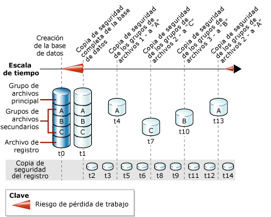

# Copias de seguridad de archivos completas (SQL Server)
[!INCLUDE[appliesto-ss-xxxx-xxxx-xxx-md](../../includes/appliesto-ss-xxxx-xxxx-xxx-md.md)] Este tema se aplica a bases de datos de [!INCLUDE[ssNoVersion](../../includes/ssnoversion-md.md)] que contienen varios archivos o grupos de archivos.  
  
 Es posible realizar una copia de seguridad y restaurar individualmente los archivos de una base de datos [!INCLUDE[ssNoVersion](../../includes/ssnoversion-md.md)] . Además, puede especificar un grupo de archivos entero en lugar de especificar cada archivo constitutivo individualmente. Tenga en cuenta que si un archivo de un grupo de archivos se encuentra sin conexión (por ejemplo, porque se está restaurando), todo el grupo de archivos estará sin conexión y no se puede realizar una copia de seguridad.  
  
 Las copias de seguridad de archivos de los grupos de archivos de solo lectura se pueden combinar con copias de seguridad parciales. Las copias de seguridad parciales incluyen todos los grupos de archivos de lectura/escritura y, opcionalmente, uno o varios grupos de archivos de solo lectura. Para obtener más información, vea [Copias de seguridad parciales &#40;SQL Server&#41;](../../relational-databases/backup-restore/partial-backups-sql-server.md).  
  
 Una copia de seguridad de archivos puede usarse como *base diferencial* para realizar copias de seguridad diferenciales de archivos. Para obtener más información, vea [Copias de seguridad diferenciales &#40;SQL Server&#41;](../../relational-databases/backup-restore/differential-backups-sql-server.md).  
  
> [!NOTE]  
>  Las copias de seguridad completas de archivos se suelen denominar simplemente *copias de seguridad de archivos*, excepto cuando se comparan explícitamente con las *copias de seguridad diferenciales de archivos*.  
  
 **En este tema:**  
  
-   [Ventajas de las copias de seguridad de archivos](#Benefits)  
  
-   [Desventajas de las copias de seguridad de archivos](#Disadvantages)  
  
-   [Información general de las copias de seguridad de archivos](#Overview)  
  
-   [Tareas relacionadas](#RelatedTasks)  
  
##   Ventajas de las copias de seguridad de archivos  
 Las copias de seguridad de archivos ofrecen las siguientes ventajas con respecto a las copias de seguridad de base de datos:  
  
-   El uso de las copias de seguridad de archivos puede aumentar la velocidad de recuperación ya que se pueden restaurar solo los archivos dañados sin tener que restaurar el resto de la base de datos.  
  
     Por ejemplo, si una base de datos está compuesta por varios archivos ubicados en diferentes discos y se producen errores en uno de ellos, solo debe restaurar el archivo situado en el disco en que se produjeron los errores. El archivo dañado se puede restaurar rápidamente, y la recuperación es más rápida que para una base de datos completa.  
  
-   Las copias de seguridad de archivos aumentan la flexibilidad en cuanto a programación y control de medios con respecto a las copias de seguridad completas de la base de datos, que para bases de datos de gran tamaño pueden resultar difíciles de administrar. Esta mayor flexibilidad de las copias de seguridad de archivos o de grupos de archivos también resulta útil en grandes bases de datos que contienen datos con características de actualización diferentes.  
  
##   Desventajas de las copias de seguridad de archivos  
  
-   El principal inconveniente de las copias de seguridad de archivos, en comparación con las copias de seguridad completas de la base de datos, es la complejidad administrativa adicional. El mantenimiento y seguimiento de un conjunto completo de estas copias de seguridad puede ser una tarea que consume mucho tiempo y que puede contrarrestar los requisitos de espacio de las copias de seguridad completas de la base de datos.  
  
-   Un error en los medios puede suponer la imposibilidad de recuperar una base de datos completa si un archivo dañado no tiene copia de seguridad. Por lo tanto, debe guardar un conjunto completo de copias de seguridad de archivos y, en los modelos de recuperación completa y recuperación optimizado para cargas masivas de registros, una o varias copias de seguridad de registros que cubran mínimamente el intervalo entre la primera copia de seguridad completa de archivos y la última.  
  
##   Información general de las copias de seguridad de archivos  
 Las copias de seguridad completas de archivos realizan una copia de seguridad de todos los datos de uno o varios archivos o grupos de archivos. De forma predeterminada, las copias de seguridad de archivos contienen suficientes entradas de registro para poner al día el archivo al final de la operación de copia de seguridad.  
  
 La realización de una copia de seguridad de un archivo o grupo de archivos de solo lectura es igual en todos los modelos de recuperación. En el modelo de recuperación completa, un conjunto de copia de seguridad completas de archivos, junto con un número suficiente de copias de seguridad de registros que abarque todas las copias de seguridad de archivos, equivale a una copia de seguridad completa de la base de datos.  
  
 Solo se puede realizar una operación de copia de seguridad de archivos al mismo tiempo. Se puede realizar la copia de seguridad de varios archivos en una sola operación, pero esto puede aumentar el tiempo de recuperación si solo necesita restaurar un archivo. La razón es que se leerá toda la copia de seguridad para buscar el archivo.  
  
> [!NOTE]  
>  Los archivos individuales se pueden restaurar a partir de una copia de seguridad de la base de datos; sin embargo, la ubicación y restauración de un archivo requiere más tiempo si se realiza a través de una copia de seguridad de la base de datos que si se realiza a través de una copia de seguridad de archivos.  
  
### Copias de seguridad de archivos y el modelo de recuperación simple  
 En el modelo de recuperación simple, se debe hacer una copia de seguridad de todos los archivos de lectura/escritura juntos. Esto garantiza que la base de datos se pueda restaurar a un punto temporal coherente. En lugar de especificar de forma individual cada grupo de archivos o cada archivo de lectura/escritura utilice la opción READ_WRITE_FILEGROUPS. Esta opción realiza una copia de seguridad de todos los grupos de archivos de lectura/escritura de la base de datos. Una copia de seguridad que se crea al especificar READ_WRITE_FILEGROUPS se conoce como copia de seguridad parcial. Para obtener más información, vea [Copias de seguridad parciales &#40;SQL Server&#41;](../../relational-databases/backup-restore/partial-backups-sql-server.md).  
  
### Copias de seguridad de archivos y el modelo de recuperación completa  
 En el modelo de recuperación completa, debe realizar una copia de seguridad del registro de transacciones, independientemente del resto de su estrategia de copia de seguridad. Un conjunto de copias de seguridad completas de archivos, junto con un número suficiente de copias de seguridad de registros que abarque todas las copias de seguridad de archivos desde el inicio de la primera copia de seguridad de archivos, equivale a una copia de seguridad completa de la base de datos.  
  
 La restauración de una base de datos usando solo copias de seguridad de archivos y de registros puede ser compleja. Por ello, si es posible, se recomienda realizar una copia de seguridad completa de la base de datos e iniciar las copias de seguridad de registros antes de la primera copia de seguridad de archivos. En la siguiente ilustración se muestra una estrategia en la que se realiza un copia de seguridad completa de la base de datos (a la hora t1) poco después de crear la base de datos (a la hora t0). Esta primera copia de seguridad de la base de datos permite que se inicien las copias de seguridad del registro de transacciones. Las copias de seguridad del registro de transacciones se programan para que se realicen a intervalos definidos. Las copias de seguridad de archivos se realizan con el intervalo que mejor se adapta a los requisitos empresariales de la base de datos. En esta ilustración se muestra cada uno de los cuatro grupos de archivos de los que se hace una copia de seguridad (de uno en uno). El orden en que se realiza una copia de seguridad de estos grupos (A, C, B, A) refleja los requisitos empresariales de la base de datos.  
  
   
  
> [!NOTE]  
>  En el modelo de recuperación completa, al restaurar una copia de seguridad de archivos de lectura/escritura, debe poner al día el registro de transacciones para mantener la coherencia con el resto de la base de datos. Para evitar poner al día muchas copias de seguridad del registro de transacciones, contemple el uso de copias de seguridad diferenciales de archivos. Para obtener más información, vea [Copias de seguridad diferenciales &#40;SQL Server&#41;](../../relational-databases/backup-restore/differential-backups-sql-server.md).  
  
##   Tareas relacionadas  
 **Crear una copia de seguridad de un archivo o de un grupo de archivos**  
  
-   [Realizar copias de seguridad de archivos y grupos de archivos &#40;SQL Server&#41;](../../relational-databases/backup-restore/back-up-files-and-filegroups-sql-server.md)  
  
-   <xref:Microsoft.SqlServer.Management.Smo.Backup.SqlBackup%2A> (SMO)  
  
> [!NOTE]  
>  Las copias de seguridad de archivos no son compatibles con el Asistente para planes de mantenimiento.  
  
## Ver también  
 [BACKUP &#40;Transact-SQL&#41;](../../t-sql/statements/backup-transact-sql.md)   
 [Información general de copia de seguridad &#40;SQL Server&#41;](../../relational-databases/backup-restore/backup-overview-sql-server.md)   
 [Copias de seguridad y restauración: interoperabilidad y coexistencia &#40;SQL Server&#41;](../../relational-databases/backup-restore/backup-and-restore-interoperability-and-coexistence-sql-server.md)   
 [Copias de seguridad diferenciales &#40;SQL Server&#41;](../../relational-databases/backup-restore/differential-backups-sql-server.md)   
 [Restauraciones de archivos &#40;modelo de recuperación simple&#41;](../../relational-databases/backup-restore/file-restores-simple-recovery-model.md)   
 [Restauraciones de archivos &#40;modelo de recuperación completa&#41;](../../relational-databases/backup-restore/file-restores-full-recovery-model.md)   
 [Restauración con conexión &#40;SQL Server&#41;](../../relational-databases/backup-restore/online-restore-sql-server.md)   
 [Restauraciones por etapas &#40;SQL Server&#41;](../../relational-databases/backup-restore/piecemeal-restores-sql-server.md)  
  
  
