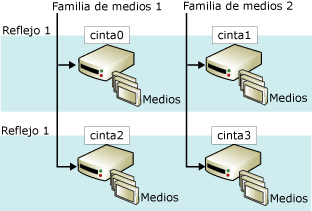

# Conjuntos de medios de copia de seguridad reflejados (SQL Server)
[!INCLUDE[appliesto-ss-xxxx-xxxx-xxx-md](../../includes/appliesto-ss-xxxx-xxxx-xxx-md.md)]
    
> [!NOTE]  
>  Los conjuntos de medios de copia de seguridad reflejados solo se admiten en la edición Enterprise de [!INCLUDE[ssNoVersion](../../includes/ssnoversion-md.md)].  
  
 El hecho de crear un reflejo de un medio de copia de seguridad aumenta la confiabilidad de las copias de seguridad al reducir el impacto de los errores de funcionamiento de los dispositivos de copia de seguridad. Los errores de funcionamiento son muy graves porque las copias de seguridad son el último recurso para evitar la pérdida de datos. A medida que crecen las bases de datos, aumentan las posibilidades de que un error de un dispositivo o medio de copia de seguridad provoque que no se pueda restaurar una copia de seguridad. El hecho de crear un reflejo de los medios de copia de seguridad aumenta la confiabilidad de las copias de seguridad al proporcionar redundancia.  
  
> [!NOTE]  
>  Para obtener información sobre los conjuntos de medios en general, vea [Conjuntos de medios, familias de medios y conjuntos de copias de seguridad &#40;SQL Server&#41;](../../relational-databases/backup-restore/media-sets-media-families-and-backup-sets-sql-server.md).  
  
 **En este tema:**  
  
-   [Información general sobre conjuntos de medios reflejados](#OverviewofMirroredMediaSets)  
  
-   [Requisitos de hardware para reflejos de copia de seguridad](#HardwareReqs)  
  
-   [Tareas relacionadas](#RelatedTasks)  
  
##   Información general sobre conjuntos de medios reflejados  
 La creación de reflejos de medios es una propiedad del conjunto de medios. Un *conjunto de medios reflejado* consta de varias copias (*reflejos*) de los conjuntos de medios. Un conjunto de medios incluye una o varias familias de medios, cada una de las cuales se corresponde con un dispositivo de copia de seguridad. Por ejemplo, si la cláusula TO de una instrucción BACKUP DATABASE incluye tres dispositivos, BACKUP reparte los datos entre las tres familias de medios, una por dispositivo. El número de familias de medios y reflejos se define al crear el conjunto de medios (mediante una instrucción BACKUP DATABASE que especifica WITH FORMAT).  
  
 Un conjunto de medios reflejado contiene entre dos y cuatro reflejos. Cada reflejo incluye todas las familias de medios del conjunto de medios. Los reflejos requieren el mismo número de dispositivos, uno por familia de medios. Cada reflejo requiere un dispositivo de copia de seguridad diferente por cada familia de medios. Por ejemplo, un conjunto de medios reflejado que consta de cuatro familias de medios con tres reflejos requiere doce dispositivos de copia de seguridad. Todos estos dispositivos deben ser equivalentes. Por ejemplo, unidades de cinta que tienen el mismo número de modelo del mismo fabricante.  
  
 En la siguiente ilustración se muestra un ejemplo de un conjunto de medios reflejado que incluye dos familias de medios con dos reflejos. Cada familia de medios incluye tres volúmenes de medios, de los cuales se realiza una copia de seguridad por reflejo cada vez.  
  
   
  
 Los volúmenes correspondientes en los reflejos tienen un contenido idéntico. De este modo, serán intercambiables en el momento de la restauración. Por ejemplo, en la ilustración anterior, el tercer volumen de tape2 es intercambiable con el tercer volumen de tape0.  
  
 [!INCLUDE[ssDEnoversion](../../includes/ssdenoversion-md.md)] garantiza que el contenido de los medios reflejados es idéntico mediante la sincronización de las escrituras en los dispositivos. Cuando se llena uno de los reflejos, se extienden todos los reflejos al mismo tiempo.  
  
> [!IMPORTANT]  
>  Un conjunto de medios reflejado no se puede dividir implícitamente eliminando un reflejo. Si una cinta o un disco resulta dañado o cambia de formato, no se podrá utilizar el reflejo para nuevas copias de seguridad. Si al menos un reflejo permanece intacto, se podrá leer el conjunto de medios. Si cada reflejo pierde una familia de medios determinada, no se podrá usar el conjunto de medios.  
  
 Las operaciones de copias de seguridad y restauración imponen distintos requisitos sobre la presencia de todos los reflejos. Para que una operación de copia de seguridad escriba (es decir, cree o extienda) un conjunto de medios reflejado, todos los reflejos deben estar presentes. Por el contrario, si se restaura una copia de seguridad desde un conjunto de medios reflejado, solo puede especificar un reflejo para cada familia de medios. Puede realizar restauraciones a partir de menos dispositivos que familias, pero cada familia de medios se procesará una sola vez. No obstante, si hay errores, el hecho de tener otros reflejos habilita la resolución de algunos problemas de restauración rápidamente. Puede sustituir un volumen de medios dañado con el volumen correspondiente de otro reflejo. Esto se debe a que RESTORE y RESTORE VERIFYONLY admiten la sustitución de medios dañados por el volumen de medios de copia de seguridad correspondiente de otro reflejo.  
  
##   Requisitos de hardware para reflejos de copia de seguridad  
 La creación de reflejos se aplica tanto a los discos como a las cintas (los discos no admiten cintas de continuación). Todos los dispositivos de copia de seguridad de una sola operación de copia de seguridad o restauración deben ser del mismo tipo, disco o cinta.  
  
 Dentro de estas clases generales, se deben utilizar dispositivos similares con las mismas propiedades. Si los dispositivos no son lo suficientemente parecidos, aparecerá el mensaje de error 3212. Para evitar problemas de disparidad, use dispositivos equivalentes, como unidades con el mismo número de modelo del mismo fabricante.  
  
##   Tareas relacionadas  
 **Para realizar copias de seguridad en dispositivos de copia de seguridad reflejados**  
  
-   [Realizar una copia de seguridad en un conjunto de medios reflejado &#40;Transact-SQL&#41;](../../relational-databases/backup-restore/back-up-to-a-mirrored-media-set-transact-sql.md)  
  
## Consulte también  
 [Errores posibles de medios durante copia de seguridad y restauración &#40;SQL Server&#41;](../../relational-databases/backup-restore/possible-media-errors-during-backup-and-restore-sql-server.md)   
 [RESTORE VERIFYONLY &#40;Transact-SQL&#41;](../../t-sql/statements/restore-statements-verifyonly-transact-sql.md)   
 [Dispositivos de copia de seguridad &#40;SQL Server&#41;](../../relational-databases/backup-restore/backup-devices-sql-server.md)   
 [Conjuntos de medios, familias de medios y conjuntos de copias de seguridad &#40;SQL Server&#41;](../../relational-databases/backup-restore/media-sets-media-families-and-backup-sets-sql-server.md)  
  
  
