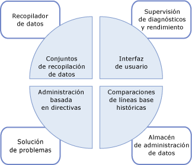
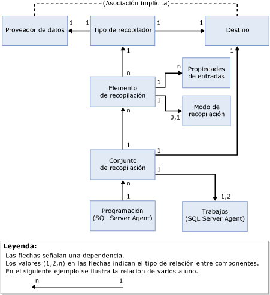

# Recopilación de datos
  El recopilador de datos es un componente de [!INCLUDE[ssCurrent](../../includes/sscurrent-md.md)] que recopila diferentes conjuntos de datos. La recopilación de datos se ejecuta de forma constante o según una programación definida por el usuario. El recopilador de datos almacena los datos recopilados en una base de datos relacional conocida como almacén de administración de datos.  
  
## ¿Qué es el recopilador de datos? 
 El recopilador de datos es un componente básico de la plataforma de recopilación de datos para [!INCLUDE[ssCurrent](../../includes/sscurrent-md.md)] y las herramientas que se proporcionan a través de [!INCLUDE[ssNoVersion](../../includes/ssnoversion-md.md)]. El recopilador de datos proporciona un punto central para la recopilación de datos de los servidores de bases de datos y aplicaciones. Este punto de recopilación puede obtener datos de una variedad de orígenes y no se limita a los datos de rendimiento, a diferencia de Seguimiento de SQL.  
  
 El recopilador de datos permite ajustar el ámbito de recopilación de datos de acuerdo con cada entorno de producción y pruebas. El recopilador de datos también usa almacenamiento de datos, que es una base de datos relacional que permite administrar los datos recopilados estableciendo diferentes períodos de retención para los mismos.  
  
 El recopilador de datos admite la optimización dinámica para la recopilación de datos y es extensible a través de su API. Para más información, consulte [Data Collector Programming](http://msdn.microsoft.com/library/53b4752b-055d-4716-b2bc-75b4cce84101).  
  
 La ilustración siguiente muestra cómo encaja el recopilador de datos en la estrategia global para la recopilación y la administración de datos de [!INCLUDE[ssCurrent](../../includes/sscurrent-md.md)].  
  
   
  
## Conceptos  
 El recopilador de datos se integra en el Agente [!INCLUDE[ssNoVersion](../../includes/ssnoversion-md.md)] e [!INCLUDE[ssISnoversion](../../includes/ssisnoversion-md.md)], y usa ambos exhaustivamente. Antes de trabajar con el recopilador de datos, debe conocer ciertos conceptos relacionados con cada uno de estos componentes de [!INCLUDE[ssNoVersion](../../includes/ssnoversion-md.md)] .  
  
 [!INCLUDE[ssNoVersion](../../includes/ssnoversion-md.md)] se usa para programar y ejecutar trabajos de recopilación. Debe conocer los conceptos siguientes:  
  
-   Trabajo  
  
-   Paso de trabajo  
  
-   Programación de trabajo  
  
-   Subsistema  
  
-   Cuentas de proxy  
  
 Para obtener más información, vea [Tareas administrativas automatizadas &#40;Agente SQL Server&#41;](http://msdn.microsoft.com/library/541ee5ac-2c9f-4b74-b4f0-13b7bd5920b0).  
  
 [!INCLUDE[ssISnoversion](../../includes/ssisnoversion-md.md)] ([!INCLUDE[ssIS](../../includes/ssis-md.md)]) se usa para ejecutar paquetes que recopilan datos de proveedores de datos individuales. Debe estar familiarizado con los siguientes conceptos y herramientas de [!INCLUDE[ssIS](../../includes/ssis-md.md)] :  
  
-   Paquete de [!INCLUDE[ssIS](../../includes/ssis-md.md)]  
  
-   configuración de paquete de [!INCLUDE[ssIS](../../includes/ssis-md.md)]  
  
 Para obtener más información, vea [Paquetes de Integration Services &#40;SSIS&#41;](../../integration-services/integration-services-ssis-packages.md).  
  
## Terminología  
 **destino**  
 Instancia de [!INCLUDE[ssDE](../../includes/ssde-md.md)] en una edición de [!INCLUDE[ssNoVersion](../../includes/ssnoversion-md.md)] que admite la recopilación de datos. Para obtener más información sobre las ediciones compatibles, vea la sección "Facilidad de uso" de [Características compatibles con las ediciones de SQL Server 2016](~/sql-server/editions-and-supported-features-for-sql-server-2016.md).  
  
 Una *raíz de destino* define un subárbol en la jerarquía de destino. Un *conjunto de destinos* es el grupo de destinos resultante de aplicar un filtro a un subárbol definido por una raíz de destino. Una raíz de destino puede ser una base de datos, una instancia de [!INCLUDE[ssNoVersion](../../includes/ssnoversion-md.md)], o una instancia del equipo.  
  
**Tipo de destino**  
 El tipo de destino, que tiene ciertas características y comportamiento. Por ejemplo, un destino de instancia de [!INCLUDE[ssNoVersion](../../includes/ssnoversion-md.md)] tiene características diferentes de un destino de base de datos de [!INCLUDE[ssNoVersion](../../includes/ssnoversion-md.md)] .  
  
 **Proveedor de datos**  
 Origen de datos conocido, específico de un tipo de destino, que proporciona datos a un tipo de recopilador.  
  
**Tipo de recopilador**  
 Un contenedor lógico alrededor de paquetes de [!INCLUDE[ssIS](../../includes/ssis-md.md)] que proporciona el mecanismo real para recopilar los datos y cargarlos en el almacén de administración de datos.  
  
 **Elemento de recopilación**  
 Una instancia de un tipo de recopilador. Un elemento de recopilación se crea con un conjunto específico de propiedades de entrada y una frecuencia de recopilación.  
  
 **Conjunto de recopilación**  
 Grupo de elementos de recopilación. Un conjunto de recopilación es una unidad de recopilación de datos con la que un usuario puede interactuar a través de la interfaz de usuario.  
  
 **Modo de recopilación**  
 La manera en la que se recopilan y se almacenan los datos. El modo de recopilación puede almacenarse en memoria caché o no. El modo con almacenamiento en memoria caché admite la recopilación continua, mientras que el modo sin almacenamiento en memoria caché se ha diseñado para la recopilación a petición o para instantáneas de recopilación.  
  
 **Almacén de administración de datos**  
 Base de datos relacional que se usa para almacenar los datos que se recopilan.  
  
 La ilustración siguiente muestra las dependencias y relaciones entre los componentes de recopilador de datos.  
  
   
  
 Como se muestra en la ilustración, el proveedor de datos es externo al recopilador de datos y por definición tiene una relación implícita con el destino. El proveedor de datos es específico de un destino determinado (por ejemplo, un servicio de [!INCLUDE[ssNoVersion](../../includes/ssnoversion-md.md)] como el motor relacional) y proporciona datos como las vistas del sistema en [!INCLUDE[ssNoVersion](../../includes/ssnoversion-md.md)], los contadores del Monitor de rendimiento y los proveedores WMI, que puede consumir el recopilador de datos.  
  
 El tipo de recopilador es específico de un tipo de destino, basado en la asociación lógica de un proveedor de datos a un tipo de destino. El tipo de recopilador define cómo se recopilan los datos de un proveedor de datos específico (usando parámetros esquematizados) y especifica el esquema del almacenamiento de datos. El esquema del proveedor de datos y el esquema del almacenamiento son necesarios para almacenar los datos que se recopilan. El tipo de recopilador también proporciona la ubicación del almacén de administración de datos, que puede residir en el equipo que ejecuta la recopilación de datos o en un equipo diferente.  
  
 Un elemento de recopilación, mostrado en la ilustración, es una instancia de un tipo de recopilador específico, parametrizado con parámetros de entrada, como el esquema XML para el tipo de recopilador. Todos los elementos de recopilación deben funcionar en la misma raíz de destino o en una raíz de destino vacía. Esto permite al recopilador de datos combinar los tipos de recopilador del sistema operativo o de una raíz de destino concreta, pero no de las raíces de destino diferentes.  
  
 Un elemento de recopilación tiene una frecuencia de recopilación definida que determina la frecuencia con la que se toman las instantáneas de valores. Aunque es un bloque de creación para un conjunto de recopilación, un elemento de recopilación no puede existir solo.  
  
 Los conjuntos de recopilación se definen e implementan en una instancia del servidor y se pueden ejecutar independientemente entre sí. Cada conjunto de recopilación se puede aplicar a un destino que coincide con los tipos de destino de todos los tipos de recopilador que forman parte de un conjunto de recopilación. Un trabajo o trabajos de agente [!INCLUDE[ssNoVersion](../../includes/ssnoversion-md.md)] ejecutan el conjunto de recopilación y los datos se cargan al almacén de administración de datos según una programación predefinida.  
  
 Todos los datos recopilados por instancias diferentes dentro del conjunto de recopilación se cargan al almacén de administración de datos en la misma programación. Esta programación se define como una programación del Agente [!INCLUDE[ssNoVersion](../../includes/ssnoversion-md.md)] compartida y la puede usar más de un conjunto de recopilación. Un conjunto de recopilación se activa o desactiva como entidad única; los elementos de recopilación no se pueden activar o desactivar individualmente.  
  
 Al crear o actualizar un conjunto de recopilación, puede configurar el modo de recopilación para recopilar los datos y cargarlos en el almacén de administración de datos. El tipo de programación se determina mediante el tipo de recopilador: con almacenamiento en caché o sin almacenamiento en caché. Si la recopilación es con almacenamiento en caché, la recopilación y la carga de datos se ejecutan en un trabajo independiente. La recopilación se ejecuta en una programación que empieza cuando el Agente [!INCLUDE[ssNoVersion](../../includes/ssnoversion-md.md)] se inicia y se ejecuta en la frecuencia especificada en el elemento de recopilación. La carga se ejecuta de acuerdo con la programación especificada por el usuario.  
  
 En el caso de la recopilación sin almacenamiento en memoria caché, la recopilación y la carga de datos se ejecutan en un único trabajo, pero en dos pasos. El paso uno es la recopilación, el paso dos es la carga. No se requiere ninguna programación para la recopilación a petición.  
  
 Una vez habilitado un conjunto de recopilación, la recopilación de datos se puede iniciar, de acuerdo con una programación o a petición. Cuando se inicia la recopilación de datos, el Agente [!INCLUDE[ssNoVersion](../../includes/ssnoversion-md.md)] genera un proceso para el recopilador de datos, que a su vez carga los paquetes de [!INCLUDE[ssISnoversion](../../includes/ssisnoversion-md.md)] para el conjunto de recopilación. Los elementos de recopilación, que representan los tipos de recopilación, recopilan los datos de los proveedores de datos adecuados en los destinos especificados. Cuando el ciclo de recopilación finaliza, estos datos se cargan en el almacén de administración de datos.  
  
## Cosas que puede hacer  
  
|Descripción|Tema|  
|----------------------|-----------|  
|Administrar distintos aspectos de la recopilación de datos, como habilitar o deshabilitar la recopilación de datos, cambiar la configuración de un conjunto de recopilación o ver los datos en el almacén de administración de datos.|[Administrar la recopilación de datos](../../relational-databases/data-collection/manage-data-collection.md)|  
|Usar los informes para obtener información con el fin de supervisar la capacidad del sistema y solucionar problemas de rendimiento del sistema.|[Informes de conjuntos de recopilación de datos del sistema](../../relational-databases/data-collection/system-data-collection-set-reports.md)|  
|Usar el almacén de administración de datos para recopilar datos de un servidor que ejecute un destino de recopilación de datos.|[Almacén de administración de datos](../../relational-databases/data-collection/management-data-warehouse.md)| 
|Aprovechar la funcionalidad de seguimiento del lado servidor de SQL Server Profiler para exportar una definición de seguimiento y emplearla después para crear un conjunto de recopilación que use el tipo de recopilador genérico de Seguimiento de SQL| [Usar SQL Server Profiler para crear un conjunto de recopilación de Seguimiento SQL (SQL Server Management Studio)](https://msdn.microsoft.com/library/cc645955(v=sql.130).aspx)
  
  

